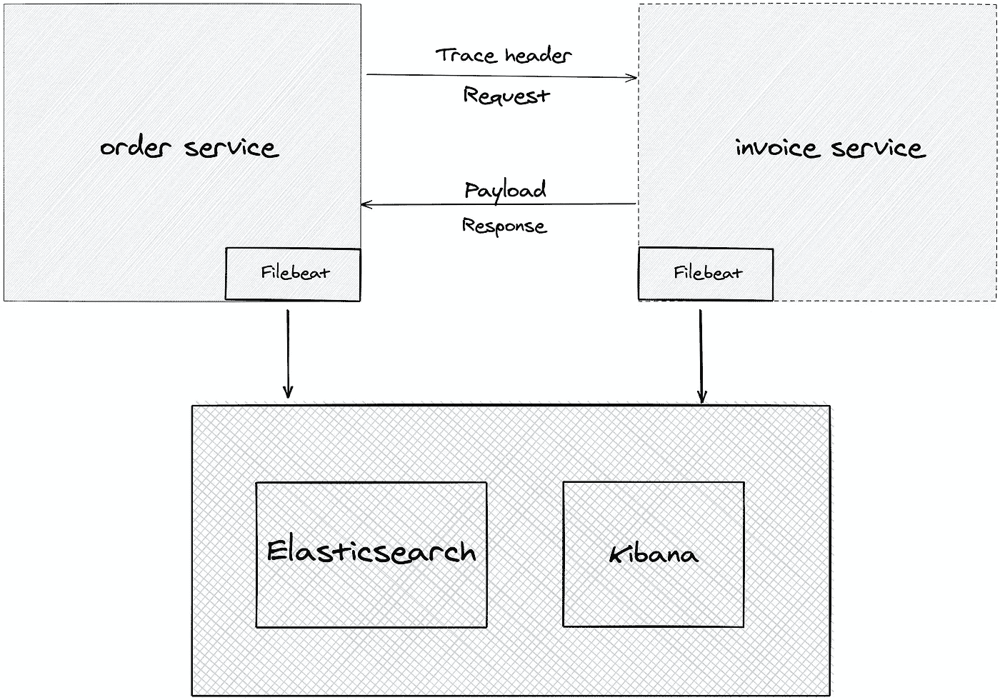
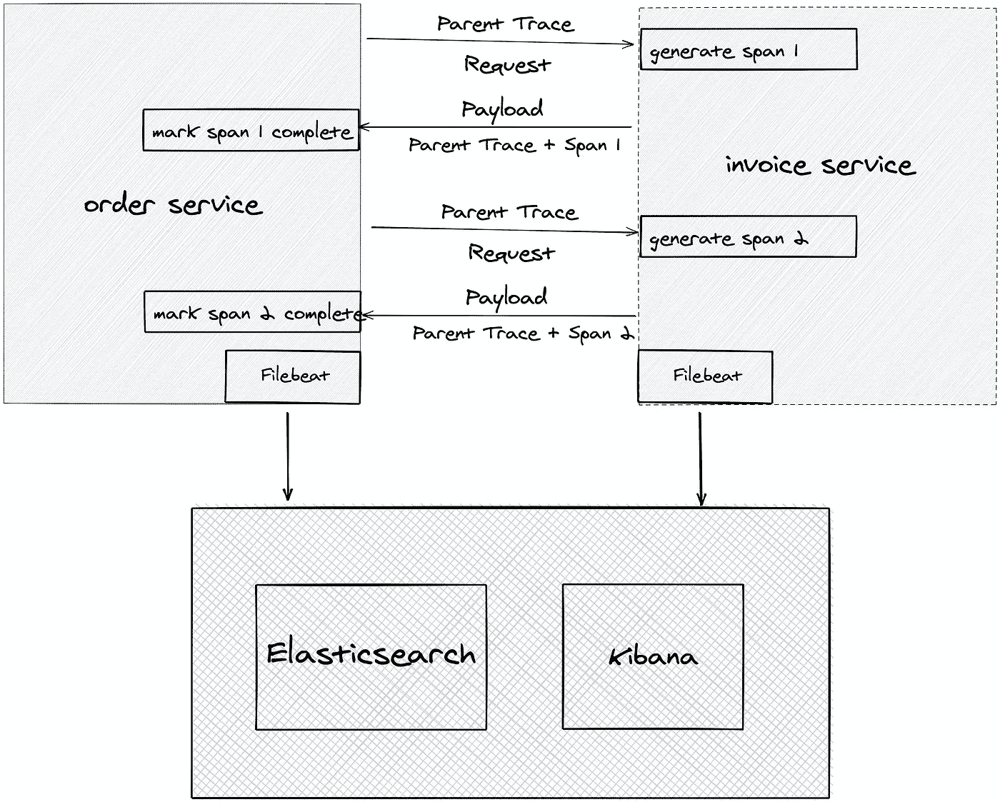

# 解释:分布式跟踪简介

> 原文：<https://medium.com/geekculture/explained-an-introduction-to-distributed-tracing-bb1ef52fbac2?source=collection_archive---------11----------------------->

Photo by [Omar Flores](https://unsplash.com/@colorflores?utm_source=medium&utm_medium=referral) on [Unsplash](https://unsplash.com?utm_source=medium&utm_medium=referral)

当我们运行一个跨越多个容器和数据中心的分布式系统时，我们需要理解用户请求如何流经这些服务。这使我们能够更好地理解请求花费大部分时间的地方，并找出哪个服务没有按预期工作。

大多数服务通过一组固定的协议相互通信，例如 HTTP(作为 REST 调用)、RPC 或基于队列的机制，其中一个服务器作为生产者，另一个作为消费者。对于解释系列的这篇文章，我们将解释当服务通过 REST 调用相互通信时，我们如何实现分布式跟踪。

假设我们有两个服务，一个提供订单的订单服务和一个生成发票的发票服务。

# 就一个简单的头球！

我们可以非常容易地实现这一点的一个方法是，在从订单服务到发票服务的每个请求中添加一个标题。让我们称之为`trace`，它可以是一个简单的 UUID，所以它是非常独特的。我们可以添加一个请求拦截器或过滤器，将跟踪添加到[日志上下文](http://logback.qos.ch/manual/mdc.html)。尽管我们记录了一个请求通过的所有服务的惟一 ID，但是我们仍然看不到两个服务之间的整个 API 调用的组合日志。我们需要一种方法来收集这两个应用程序的日志，而 Filebeat log shipper 可以帮助我们做到这一点。它被部署为一个独立的服务，从多个容器和应用程序中收集日志，并在 Elasticsearch 集群中对其进行索引，并通过 Kibana 仪表板对其进行可视化。这个设置将允许我们通过执行一个简单的查询来轻松地查询两个应用程序的日志。

虽然上述系统是一个良好的开端，但这仅仅是个开始。如果订单服务在同一个 API 调用中多次调用发票服务怎么办？我们不能仅仅依靠跟踪 ID。我们需要生成另一个 ID 来表示整个跟踪中的单个操作范围。它可以是另一个 UUID，但必须不同于跟踪 ID。让我们称之为 span ID。

通过上面的修改，订单服务现在创建一个支配性的父节点`trace`，并将其设置为它的日志上下文，对于每个对发票服务的 API 调用，订单服务通过头节点`traceparent`发送该父节点跟踪 ID。发票服务现在创建一个`span` ID，并将其设置为其日志上下文，并继续在 span ID 下执行任何必要的操作。一旦发票服务完成了它的工作，它就将响应以及 span 和父跟踪 ID 作为名为`traceresponse`的响应头返回给订单服务。订单服务审核响应并标记该跨度的结束。最后，当订单服务向客户端返回响应时，跟踪被标记为完成。

上述机制允许我们搜索特定的跟踪和 span ID 组合，并通过响应头促进 span 的独特结束。它还允许我们验证发票服务是否真正参与了跟踪。

# 不再仅仅是一个简单的标题！

到目前为止，我们只观察和解决了可能涉及服务间多个 API 调用的用例。但是非功能性用例呢？如果已经有一个系统使用不同的(非 UUID) span 或 trace 标识符，该怎么办？我们需要对我们的跟踪生成格式进行版本控制，并添加一些元信息，如跟踪头中的版本号，以说明不同的版本。它将为服务提供上下文来处理不同版本的跟踪。

其次，如果我们有第三个服务调用发票服务，但不参与分布式跟踪，那该怎么办？我们需要一种方法来了解调用者是否在采样跟踪信息。因此，我们需要一些标志位来表示跟踪过程中要考虑的各种谓词。

最后，我们可能会遇到这样的情况，我们必须传递的不仅仅是跟踪版本，而是一个完整的状态图。这意味着我们应该容纳另一个头`tracestate`来保存这样的数据。本质上，`traceparent`、`traceresponse`和`tracestate`头文件应该完善我们基本的 RESTful 分布式跟踪。

# 结论

我们只描述了同步 RESTful 系统中的可能性。异步系统提出了自己独特的挑战，因为按时间顺序，发票服务跨度的结束可能与跟踪的结束不一致。它让我们的模型可以进行一系列的修改。幸运的是，W3C 已经概述了规则，描述了解决方案，并开发了与我们上面描述的相同的标准。

已经有一些遵循 W3C 标准的开源项目，比如 Jaeger、Zipkin 和 AWS X-Ray。随着越来越多的公司采用微服务，我们可以找到专注于同一领域的云原生基础项目。在我们即将发布的解释文章中，我们将着眼于 Jaeger 和 OpenTracing，看看分布式跟踪是如何在更实际的基础上实现的。

## 阅读材料

*   [https://w3c.github.io/trace-context/](https://w3c.github.io/trace-context/)
*   https://opentracing.io/