# 用 python 解释:线性回归方程告诉你什么？

> 原文：<https://medium.com/geekculture/explained-with-python-what-does-the-linear-regression-equation-tell-you-49680b25b4f2?source=collection_archive---------12----------------------->

**第一部分:机器学习算法系列**

嘿，在这个系列中，我们将仔细研究机器学习算法，并研究每个算法的优缺点。我们将讨论算法以及算法背后的数学。

首先，让我们弄清楚机器学习中使用的一些基本术语。

*   **监督 ml 算法:**那些使用标记数据的算法称为监督 ML 算法。监督最大似然算法广泛用于两个任务:分类和回归。
*   **分类:**当任务是将样本对象归入确定的类别(目标变量)时，则称为分类。例如，对电子邮件是否是垃圾邮件进行分类。
*   **回归:**当任务是预测连续变量(目标变量)时，那么就称为回归。例如，预测房价。
*   **无监督 ml 算法:**那些使用未标记数据的算法被称为无监督 ML 算法。无监督算法用于聚类。
*   **聚类:**在给定的未标记数据中寻找组的任务被称为聚类。
*   **误差:**实际值与预测值之差
*   **梯度下降:**以产生误差函数最小值的方式更新模型参数的机制。

## **什么是机器学习中的线性回归？**

线性回归是一种受监督的机器学习算法，用于预测称为目标的连续数值变量。这是最简单的机器学习算法之一。之所以称之为“线性”，是因为该算法假设输入特征(也称为自变量)和输出变量(也称为因变量或目标变量)之间的关系是线性的。换句话说，该算法试图找到最符合数据的直线(或多个输入要素情况下的超平面)。

## **线性回归的类型:**

1.  **简单线性回归:**

当使用单个输入要素预测输出值时，线性回归称为简单线性回归。当给定单个输入特征时，我们可以在 2D 空间中的因变量和自变量之间画一条线。这里，`b0`是截距，`b1`是系数，`x1, x2,…, xn`被称为输入特征，y 是输出变量。

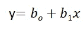

**2。多元线性回归:**

当使用多个输入要素预测输出变量时，线性回归称为多元线性回归。当只给定两个输入特征时，我们可以在 3D 空间中绘制因变量和自变量之间的平面。在更高维度中，可视化变得困难，但是直觉是找到更高维度中的超平面。这里，`b0`是截距，`b1, b2, b3, ……., bn-1, bn` 是系数，`x1, x2,…, xn`是输入特征，y 是输出变量。

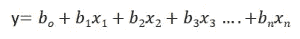

## 至此，我们已经理解了线性回归试图绘制线性边界，但它是如何做到的呢？

## 它如何找到一条完美的线来分隔给定的两个类？

如公式所示，b0 称为截距，b1，b2，…，bn 称为线性回归系数，现在的目标是找到最小化误差函数的线性边界。误差函数是目标变量的预测值和实际值之差的平方。如果我们不平方误差，那么正负点就会互相抵消。

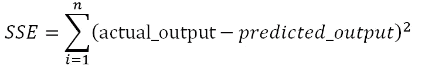

我们需要找到线性回归的系数和截距，使误差平方和(SSE)最小。梯度下降是最流行的技术之一，用于寻找 ml 和深度学习算法的最佳系数。

在下一节中，我们将在保险数据集上训练模型，在给定输入特征年龄、性别、身体质量指数、医院支出、过去咨询次数等的情况下，我们必须预测费用。

## Python 实现:

可以使用 python 中的`sklearn` 库对线性回归模型进行训练和测试。我们将使用 insurance.csv 数据集来训练线性回归模型。执行一些预处理步骤来描述数据、处理缺失值和检查线性回归的假设。

**步骤 1:使用** `**pandas**` **库加载所有必要的库和数据集。**

```
import pandas as pd
import numpy as np
import matplotlib.pyplot as plt
from sklearn.linear_model import LinearRegression
from sklearn.model_selection import train_test_split
from statsmodels.stats.outliers_influence import variance_inflation_factor as VIF
from sklearn.metrics import classification_report
insurance=pd.read_csv('new_insurance_data.csv') 
insurance.head()
```

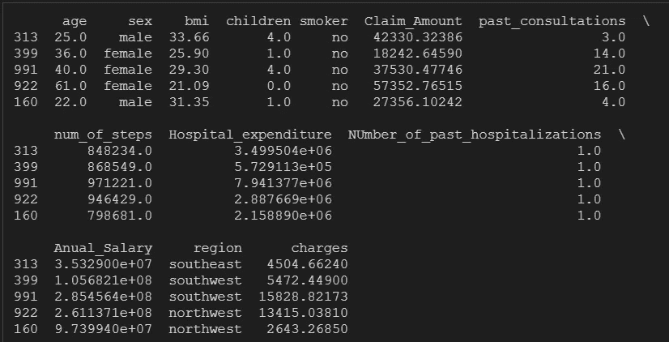

Randomly selected 5 records from the dataset

**步骤 2:检查变量的空值、形状和特征数据类型:**

```
# checks for non-null entries, size and datatype
insurance.info()
```

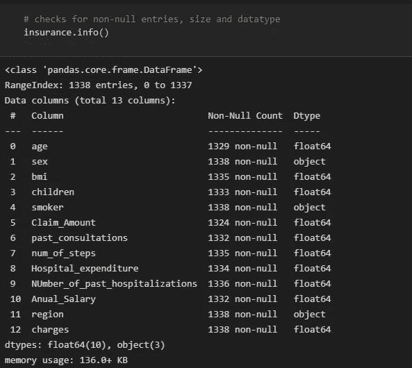

我们可以使用`df.isna().sum()` **:** 分别检查每个特征的空计数

```
insurance.isnull().sum()
# helps me to check for null values
```

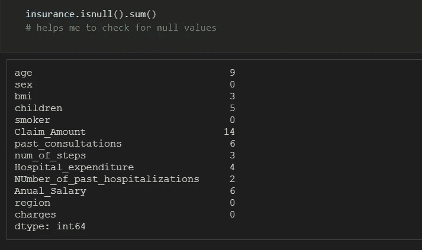

**第三步。填充缺失值:**我们可以使用模式填充对象类型特征的缺失值，使用均值或中值填充整数类型特征的缺失值。

```
# calculating mode for object data type features which will be used to fill missing values.
# We have 3 features which are of object type
print(f"mode of sex feature: {insurance['sex'].mode()[0]}")
print(f"mode of region feature: {insurance['region'].mode()[0]}")
print(f"mode of smoker feature: {insurance['smoker'].mode()[0]}")
```

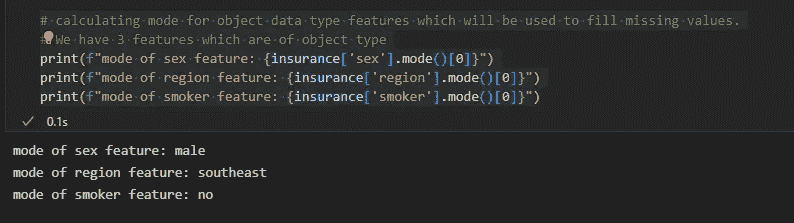

```
# describe() function will give the descriptive statistics for all numerical features
insurance.describe().transpose()
```

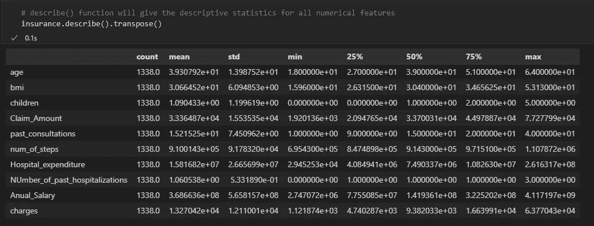

我们看到，对于数字特征，均值和中值几乎相同。因此，现在我们将把数值特征的空值替换为它们的中值，把分类变量的空值替换为它们的模式。

```
for col_name in list(insurance.columns):
    if insurance[col_name].dtypes=='object':
        # filling null values with mode for object type features
        insurance[col_name] = insurance[col_name].fillna(insurance[col_name].mode()[0])
    else:
        # filling null values with mean for numeric type features
        insurance[col_name] = insurance[col_name].fillna(insurance[col_name].median())
# Now the null count for each feature is zero
print("After filling null values:")
print(insurance.isna().sum())
```

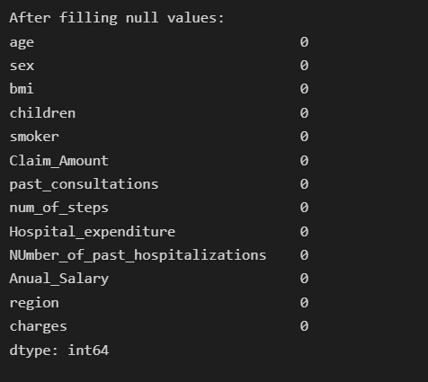

**步骤 4:异常值分析**

我们将为除目标可变电荷之外的所有数字特征绘制一个箱线图。

```
i = 1
plt.figure(figsize=(16,15))
for col_name in list(insurance.columns):
    # total 9 box plots will be plotted, therefore 3*3 grid is taken
    if((insurance[col_name].dtypes=='int64' or insurance[col_name].dtypes=='float64') and col_name != 'charges'):
        plt.subplot(3,3, i)
        plt.boxplot(insurance[col_name])
        plt.xlabel(col_name)
        plt.ylabel('count')
        plt.title(f"Box plot for {col_name}")
        i += 1
plt.show()
```

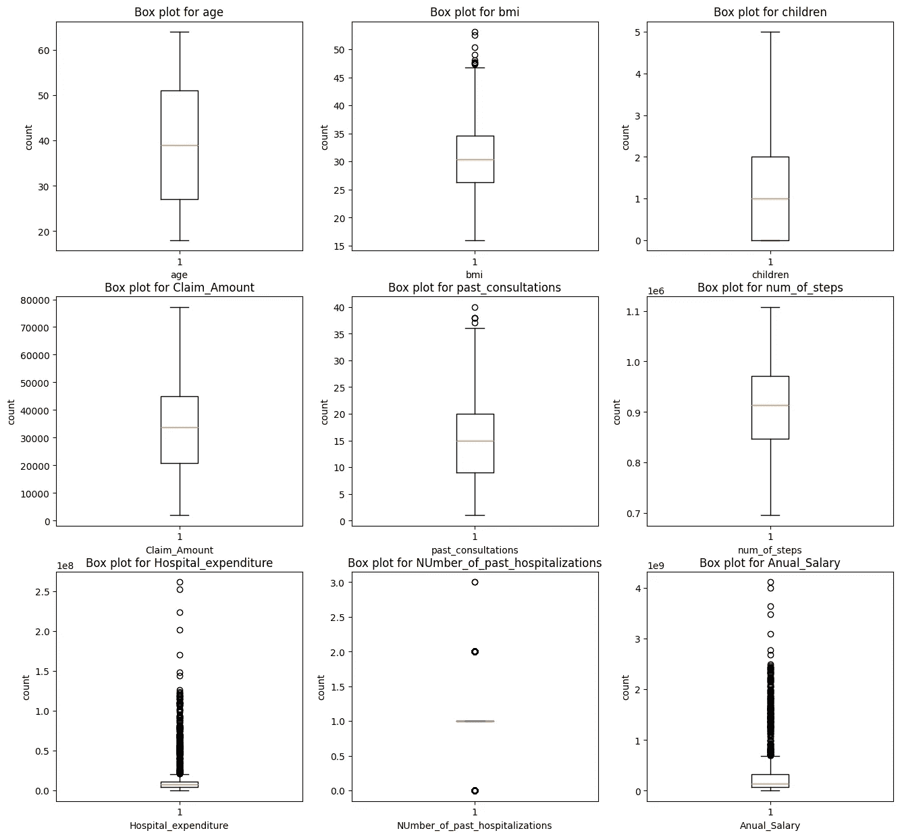

我们看到特征`‘bmi’, ‘Hospital_expenditure’`和`‘Number_of_past_hospitalizations’` 有异常值。我们将移除这些异常值:

```
outliers_features = ['bmi', 'Hospital_expenditure', 'Anual_Salary', 'past_consultations']
for col_name in outliers_features:
    Q3 = insurance[col_name].quantile(0.75)
    Q1 = insurance[col_name].quantile(0.25)
    IQR = Q3 - Q1
    upper_limit = Q3 + 1.5*IQR
    lower_limit = Q1 - 1.5*IQR
    prev_size = len(insurance)
    insurance = insurance[(insurance[col_name] >= lower_limit) & (insurance[col_name] <= upper_limit)]
    cur_size = len(insurance)
    print(f"dropped {prev_size - cur_size} rows for {col_name}  due to presence of outliers")
```

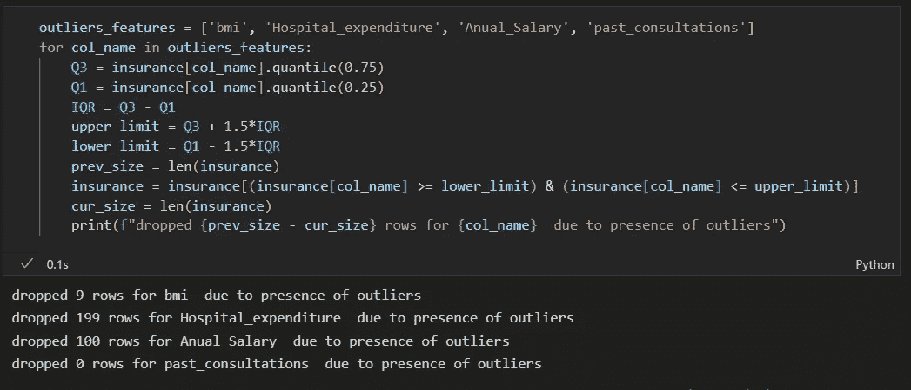

**第五步:** **检查相关性:**

年龄与收费、年龄与年薪等之间存在相关性。因为它们的相关性大于 0.5。

```
import seaborn as sns
sns.heatmap(insurance.corr(),cmap='gist_rainbow',annot=True)
plt.show()
```

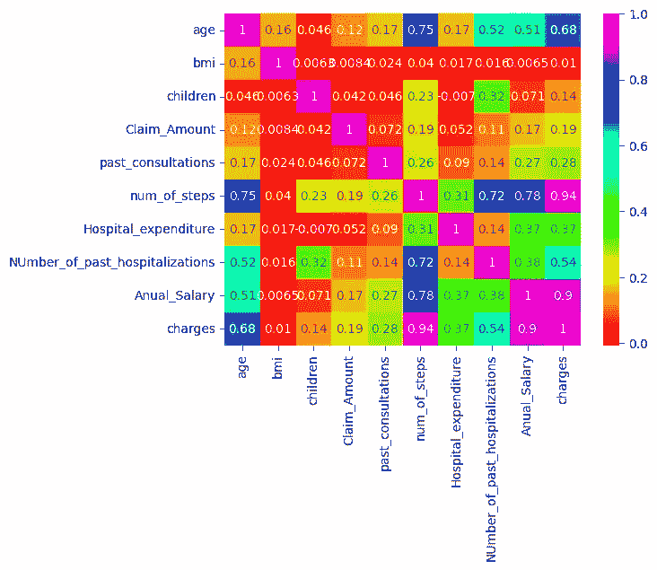

**我们将检查特征之间的多重共线性:**

```
from statsmodels.stats.outliers_influence import variance_inflation_factor 
col_list = []
for col in insurance.columns:
    if ((insurance[col].dtype != 'object') & (col != 'charges') ):#only num cols except for the charges column
        col_list.append(col)

X = insurance[col_list]
vif_data = pd.DataFrame() 
vif_data["feature"] = X.columns 
vif_data["VIF"] = [variance_inflation_factor(X.values, i) for i in range(len(X.columns))] 
print(vif_data)
```

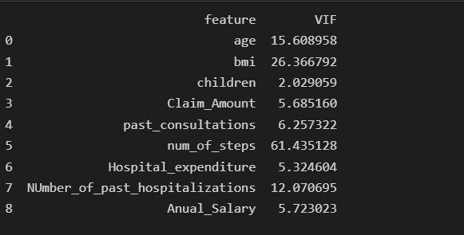

我们看到步骤数要素具有最高的共线性，等于 61.43，因此我们将删除步骤数要素，并再次检查 VIF 评分。

```
# deleting num_of_steps feature
insurance.drop('num_of_steps', axis = 1, inplace= True)
from statsmodels.stats.outliers_influence import variance_inflation_factor 
col_list = []
for col in insurance.columns:
    if ((insurance[col].dtype != 'object') & (col != 'charges') ):#only num cols except for the charges column
        col_list.append(col)
X = insurance[col_list]

X = insurance[col_list]
vif_data = pd.DataFrame() 
vif_data["feature"] = X.columns 
vif_data["VIF"] = [variance_inflation_factor(X.values, i) for i in range(len(X.columns))] 
print(vif_data)
```

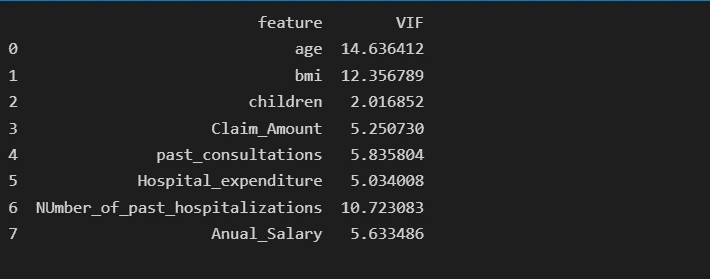

删除步骤数要素后，年龄具有等于 14.63 的最高共线性，因此我们将删除年龄要素并再次检查 VIF 评分。

```
# deleting age feature
insurance.drop('age', axis = 1, inplace= True)
from statsmodels.stats.outliers_influence import variance_inflation_factor 
col_list = []
for col in insurance.columns:
    if ((insurance[col].dtype != 'object') & (col != 'charges') ):#only num cols except for the charges column
        col_list.append(col)
X = insurance[col_list]

X = insurance[col_list]
vif_data = pd.DataFrame() 
vif_data["feature"] = X.columns 
vif_data["VIF"] = [variance_inflation_factor(X.values, i) for i in range(len(X.columns))] 
print(vif_data)
```

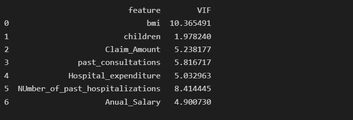

删除年龄要素后，身体质量指数的最高共线性等于 10.36，因此我们将删除身体质量指数要素并再次检查 VIF 得分。

```
# deleting bmi feature
insurance.drop('bmi', axis = 1, inplace= True)
from statsmodels.stats.outliers_influence import variance_inflation_factor 
col_list = []
for col in insurance.columns:
    if ((insurance[col].dtype != 'object') & (col != 'charges') ):#only num cols except for the charges column
        col_list.append(col)
X = insurance[col_list]

X = insurance[col_list]
vif_data = pd.DataFrame() 
vif_data["feature"] = X.columns 
vif_data["VIF"] = [variance_inflation_factor(X.values, i) for i in range(len(X.columns))] 
print(vif_data)
```

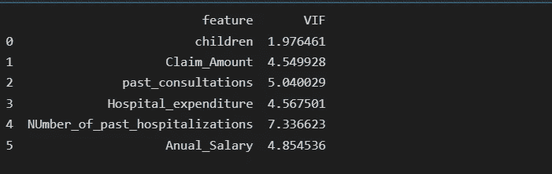

**第五步:分离出输入特征和目标变量:**

```
x=insurance.loc[:,['children','Claim_Amount','past_consultations','Hospital_expenditure','NUmber_of_past_hospitalizations','Anual_Salary']]
y=insurance.loc[:,'charges']
x_train, x_test, y_train, y_test=train_test_split(x,y,train_size=0.8, random_state=0)
print("length of train dataset: ",len(x_train) )
print("length of test dataset: ",len(x_test) )
```

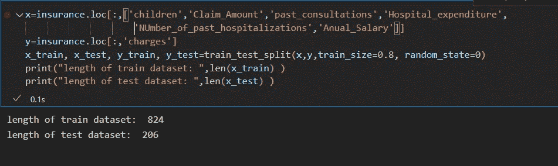

**步骤 6:在训练集上训练线性回归模型，并在测试数据集上对其进行评估:**

```
from sklearn.linear_model import LinearRegression
from sklearn.metrics import classification_report, recall_score, r2_score, f1_score, accuracy_score

model = LinearRegression()
# train the model
model.fit(x_train, y_train)
print("trained model coefficients:", model.coef_, " and intercept is: ", model.intercept_)
# model.intercept_ is b0 term in linear boundary equation, and model.coef_ is
#  the array of weights assigned to ['children','Claim_Amount','past_consultations','Hospital_expenditure',
#                    'NUmber_of_past_hospitalizations','Anual_Salary'] respectively
```

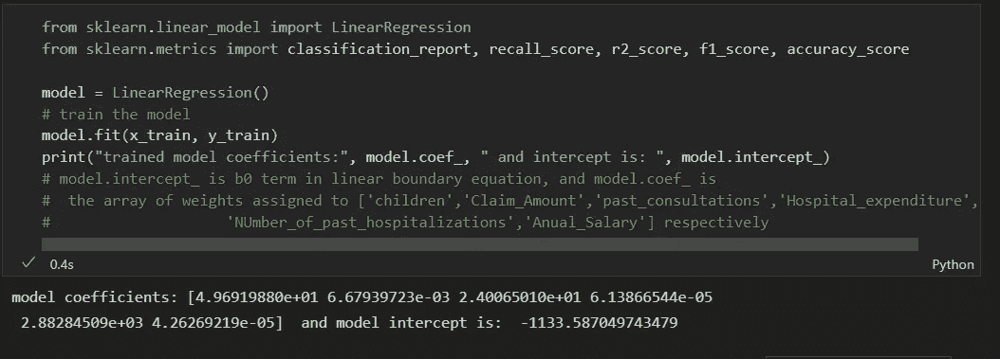

```
y_pred = model.predict(x_test)
error_pred=pd.DataFrame(columns={'Actual_data','Prediction_data'})
error_pred['Prediction_data'] = y_pred
error_pred['Actual_data'] = y_test
error_pred["error"] = y_test - y_pred
sns.distplot(error_pred['error'])
plt.show()
```

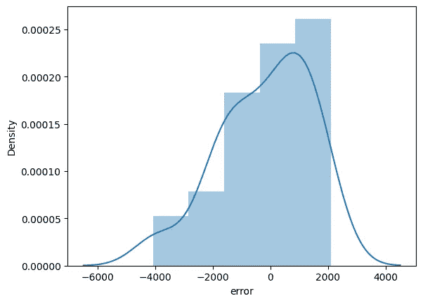

我们可以绘制实际目标和残差或误差之间的残差图:

```
sns.scatterplot(x = y_test,y =  (y_test - y_pred), c = 'g', s = 40)
plt.hlines(y = 0, xmin = 0, xmax=20000)
plt.title("residual plot")
plt.xlabel("actural target")
plt.ylabel("residula error")
```

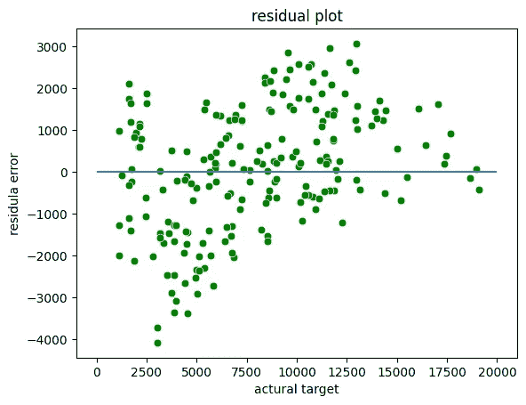

**R 平方得分:**

r 的平方被称为**决定系数。** R 平方是一种统计度量，表示回归中自变量所解释的因变量中方差的比例。该值范围从 0 到 1。值“1”表示预测器完美地解释了 y 中的所有变化。值“0”表示预测器“x”没有解释“y”中的任何变化。r 平方值包含三项 SSE、SSR 和 SST。

**SSE** 是误差平方和。它也被称为残差平方和(RSS)

SSR 是回归平方和。

**平方和(SST)** 是观察到的因变量与其均值之差的平方。

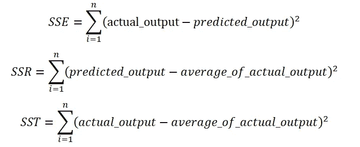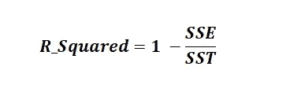

```
# check for model performance
print(f'r2 score of trained model: {r2_score(y_pred=y_pred, y_true= y_test)}')
```

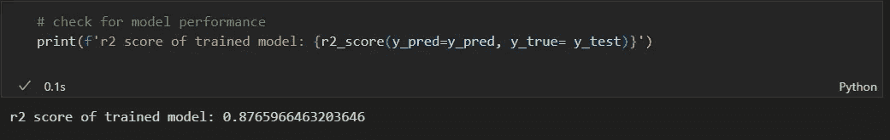

**线性回归的假设:**

1.  **线性关系:**线性回归假设预测变量与自变量之间的线性关系。您可以使用散点图来显示 2D 空间中自变量和因变量之间的关系。
2.  **特征之间的多重共线性很小或没有:**线性回归假设特征应该是相互独立的，即特征之间没有相关性。您可以使用 VIF 函数来查找要素的多重共线性值。一般假设是，如果 VIF 特征值大于 5，那么这些特征高度相关。
3.  **同质性:**线性回归假设误差项具有恒定的方差，即误差项的扩散应该是恒定的。这个假设可以通过绘制残差图来检验。如果这个假设被违反，那么这些点将形成一个漏斗形状，否则它们将保持不变。
4.  **正态:**线性回归假设给定数据集的每个要素都遵循正态分布。您可以为每个要素绘制直方图和 KDE 图，以检查它们是否呈正态分布。
5.  **误差:**线性回归假设误差项也应该是正态分布。您可以绘制误差项的直方图和 KDE 图，以检查它们是否呈正态分布。

这里是代码和数据集的 GitHub l [墨水。](https://github.com/grgupta13/machine-learning/tree/main/ML)

希望你喜欢这篇文章，非常感谢你的宝贵时间。如果你喜欢这篇文章，那么别忘了鼓掌、评论和关注。敬请关注更多文章。