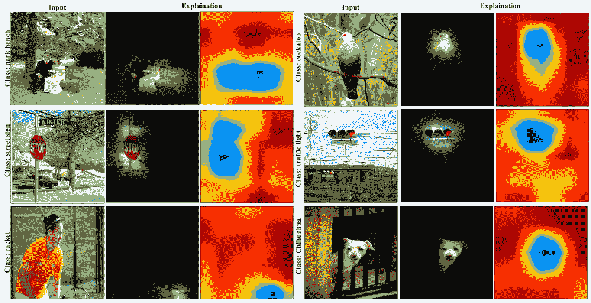
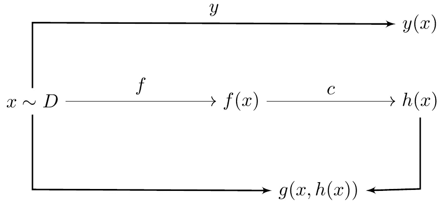

# 解释经过训练的模型

> 原文：<https://medium.com/geekculture/explaining-a-trained-model-d750c70b60a8?source=collection_archive---------26----------------------->

Photo by [**Carlos Machado**](https://www.pexels.com/@cgoulao?utm_content=attributionCopyText&utm_medium=referral&utm_source=pexels) from [**Pexels**](https://www.pexels.com/photo/assorted-beans-in-white-sacks-1024005/?utm_content=attributionCopyText&utm_medium=referral&utm_source=pexels)

如果你不能简单地解释它，你就理解得不够好——阿尔伯特·爱因斯坦

当你手上有一个经过训练的模型时，你不能打开它来看它的内部运作。为此，你需要一个解释过程。对训练好的模型的解释试图通过组合输入和输出来产生人类用户可以理解的东西。为此，你有一个解释过程，有三个组成部分，即。输入、该输入的模型输出以及模型的内部状态。这是通过一个**解释函数**(以下简称为 **EF** )基于两个输入生成这些解释来实现的，并且是特定于它要解释的模型的。

是时候看看上面定义的简洁方程式了:

如果你学习的模型 *h* 是基于函数 *h: X- > y* 其中 *X* 是输入域 *y* 是输出域。然后，解释过程将尝试为输入*xєx*解释 *h(x)*

因此， *h* 的 EF 可以写成 *g : X × Y → G* ，即映射 x ∈ X 和 y ∈ Y 到 *g(x，y)* 的函数，因此对于 *(x，y)* 的解释在混合域 *G* 中。因此，人类有望理解 G 的元素。

如果我们考虑一个将图像( *X* )映射到标签( *y* )的模型，它的解释可以是突出预测对象的视觉形式，并强调与标签相关的特征。一个例子是从黑盒模型的内部表示生成的混合图像。大概是这样的:

Explaining the decisions made by the VGG-16 (park bench, street sign, racket, cockatoo, traffic light, and chihuahua), the researchers’ approach highlighted the most discriminative region in the image. Source: Explainable AI: the new 42?

解释也可以通过描述与所识别的类别相关的特征来采取文本形式。例如，*【这是西兰花的图像，因为】它是绿色的，有开花的头，有小叶子的粗茎"*，其中括号中的部分是标签，而不是解释。

这种解释是以下两方面的作用:

*   描述可以看到的内容、位置和的输入图像
*   含有西兰花已知特性的标签。

为了进一步探索人工智能模型的可解释性，让我们首先理解下面给出的图像

Source: A Formal Approach to Explainability. Please follow the link at the end of the article.

虽然我们已经介绍了 *h(x)* 和 EF *g* ，这里我们也假设 *f* 对于所有的 *x1，x2єx*都是可解释的 wrt *g* 。而 EF *g* 是输入 *x* 和模型标签 *h(x)* 的函数，它近似于目标函数 *y* 。 *h* 是某表示法 *f* 和量词 *c* 的组合。EF *g* 应该为特定的 *h* 生成解释，而不是通用的。

解释的预期属性可以概括为三个因素。

**保真度**

*x* 的解释的保真度应呈现通过其与标签的相关性(*有效解释*)以及通过完整性属性(*完整解释*)捕获的相关信息

如果存在函数 *t* ，那么 EF *g* 将被称为有效解释，这样模型的标签可以从解释 *t(g(x，h(x))) ≈ h(x)* 中预测。

并且我们可以说一个 EF *g* 是一个模型 *h* 上下文中的完整解释，如果输入 *x* 中没有留下与 *h* 相关的信息，这与 *g(x，h(x)】*中的信息无关

**多样性**

解释的属性要提取完整，不能太多

**接地**

解释的属性应该是人类可以立即理解的。

既然我们知道了解释函数，某些问题必然会出现。

*   生成的解释与模型的内部状态有联系吗？

答:模型的内部状态是神经网络的中间激活，模型的表示将是输入空间和输出之间的映射。

现在，解释函数是从模型输入及其预测的混合中获得的结果。所以**一个完整有效的解释可以说相当于一个模型**的表示。

而下游各层呢？好吧，如果一个给定层的激活符合一个解释，那么所有其他后续层也是如此。

*   现有解释的交集和并集可以用来创建新的解释吗？

答:已经证明了两个随机变量 *f1(x)* 和 *f2(x)* 的交和并在可逆变换下是唯一的。因此，两个 EF 的交集，其中一个有效，另一个完整，是有效的 EF。这个性质叫做解释函数的**交等价。**

来源:

一种解释能力的正式方法