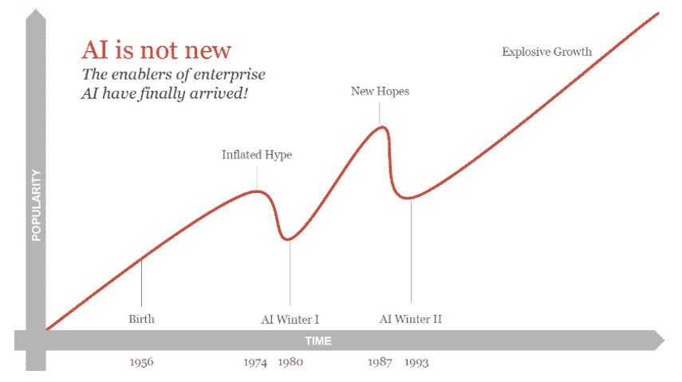

# 向喜剧演员解释人工智能？

> 原文：<https://medium.com/geekculture/explaining-ai-to-comedians-ca69cfa3d392?source=collection_archive---------19----------------------->

This post is the summary of my appearance as an AI expert on comedian Jim Jeffries’ podcast, “I Don’t Know About That.”

人工智能:这是一个被炒作、希望、悲观和适度困惑包围的话题。许多人有许多问题，这是我通过在我自己的个人圈子中的讨论了解到的。这就是为什么我很高兴被邀请到我最喜欢的播客之一，与非专家一起回答关于人工智能的问题:不是任何非专家，而是一群喜剧演员。

正如你可能想象的那样，在一个满是笑话的房间里，这些插曲经常会变成一个忙乱的、令人捧腹的对当天专家话题的探讨。对我来说当然是这样，而且非常有趣。然而，对于那些不熟悉人工智能并对我可能给出的完整答案感到好奇的听众——以及一些我们没有来得及问的问题——这篇文章是给你的。同样，如果你偶然发现了这篇文章，也许最终谷歌到了一个你总是害怕问的关于人工智能的问题，那么这篇文章应该会给你一个关于这个迷人话题的强有力的，高水平的介绍。你也可以在 [YouTube](https://www.youtube.com/watch?v=IyOZgu8XlmQ) 上查看播客本身，或者在你最喜欢的播客平台上搜索@IDKATPODCAST。

**什么是人工智能？**

老实说，人工智能通常很难定义:大量关于它的文章都是由该技术的非从业者，甚至非用户撰写的，甚至那些在该领域工作的人也经常彼此不同意。其中一个原因是人工智能有一个变化的定义:过去被认为是“人工智能”的东西可能不再是了。例如，早期的定义听起来像是“人工智能是将通常需要人类思考的任务自动化的过程。”因此，在早期的“符号人工智能”时代，研究人员编写了简单的基于规则的系统，其中包含类似“如果 X 发生，那么结果可能是 Y”的逻辑，这些系统被认为是人工智能的“专家系统”。但自那以后，该领域已经取得了如此大的进步，以至于人们很难说服任何人这样的系统是人工智能。

如今，特别是考虑到人工神经网络(当前人工智能工作的基石，我们稍后将谈到)和动物大脑之间的相似之处，我们更有可能将人工智能描述为“在机器内，特别是在计算机程序内模拟或模仿自然智能(例如来自动物或人类)。”

我个人的定义在某种程度上是两者的混合:“赋予机器，尤其是计算机程序学习和完成通常需要某种思考的任务的能力。”

**你每天接触的人工智能有哪些类型？**

这只是我想象好莱坞喜剧演员的生活时头脑风暴出来的清单；如果您的用例不同，请随时留下评论，我很乐意听到它！

*   向您的智能手机或家庭扬声器发出请求
*   搜索互联网(浏览器会在您键入时提供查询建议，并使用知识图表等工具向您提供结果)
*   消费媒体(像网飞和 YouTube 这样的平台向你推荐内容，同时自动检测和阻止裸体、仇恨言论等等)
*   网上购物(当你获得产品推荐时，网上商店也可能收集数据来预测你的客户终身价值)
*   驾驶自动驾驶汽车
*   撰写消息或电子邮件(Swype 文本、下一个单词预测和拼写检查)
*   检查您的电子邮件(垃圾邮件过滤和自动分类)
*   解锁手机(面部识别)并拍照(物体检测用于了解聚焦位置)
*   银行业务(欺诈检测为您把风)

**什么是算法？**

算法是用代码编写的过程，告诉计算机如何完成任务。例如，在机器学习中，我们不能告诉机器如何学习。然而，算法告诉计算机如何处理数据，以便它自己学习如何产生期望的输出。

**机器如何学习？**

最简单的机器学习方法是基于统计学的。例如，在垃圾邮件检测中，您只需计算有多少封电子邮件包含“中奖”、“信用卡”、“信用卡”和“赶快”等词语，以及其中有多少封是垃圾邮件。然后对训练集中的每封邮件中的每个单词都这样做，你可以使用这些概率对新邮件进行分类。

最近的技术基本上是基于试错和看到答案。都是关于模式识别的。你从一个参数都是随机的模型开始。它本质上是一个猜测机器。你给模型一堆数据点，它试图产生一个期望的输出。然后你给它看答案，看它错得有多离谱。基于这个错误的大小和方向(例如，如果任务是输出一个数字，模型的输出是太高还是太低？)，模型改变其所有参数并再次尝试。它一直这样做，直到它开始在数据中发现我们人类可能没有观察到的模式，因为它太多太复杂了，我们无法在大脑中一次性处理。

一旦这个过程完成，那么当你给你的模型一个新的数据点，但没有提供答案，它将有一个很好的机会提供正确的输出。当然，新的数据点应该在某种程度上类似于模型之前看到的其他点；你不能训练一个模型来区分比萨饼和意大利面条的照片，然后期望它在沙拉的照片上做得很好。

**什么是神经网络，它们是什么时候发明的？**

考虑一个生物大脑，比如我们的大脑:通常当我们遇到刺激时，我们的神经元会或多或少地兴奋，并将电信号传递给其他神经元。

一个人工神经网络是由这个过程松散地激发出来的。这是一个由相互连接的节点组成的网络，叫做“人工神经元”如果你想用一种非常简单的方式来形象化它，只要想象一系列的圆圈。想象一下，第一堆中的所有圆都有一条线将它们与第二堆中的所有圆连接起来。并且第二叠以相同的方式连接到下一叠，依此类推，对于每一叠圆圈。每个堆栈称为一个“层”。举个例子，如果你想象三堆圆，这将是一个三层的神经网络。下图演示了这一点。

An example neural network (this has been rotated 90 degrees from my example). Taken from “[Convolutional Neural Network (CNN) and its Applications- All you need to know](/analytics-vidhya/convolutional-neural-network-cnn-and-its-application-all-u-need-to-know-f29c1d51b3e5)”, an excellent resource, should you wish to read about neural networks in more detail.

第一层人工神经元接收数字形式的输入信号。这些数字可以代表任何东西，甚至是音乐或图像:只是对其进行编码的问题。神经元处理输入信息，并通过连接将其传递给下一层(如果有很多层，则传递给下一层，依此类推)。最后一层产生输出。然后我们测量输出的错误程度，并利用这些信息来更新神经元之间的连接强度。基本上，我们正在改变整个网络处理输入信号的方式。然后我们再试一次。一次又一次。一旦这样做了足够多的次数，我们就会得到一个模型，它能很好地为给定的输入产生我们想要的输出。

由于神经网络听起来如此复杂，而且由于它们是近年来人工智能世界惊人发展的原因，你认为它们是一个非常新的想法是可以原谅的。事实上，它们早在 20 世纪 40 年代就已经存在了(至少在概念上)。例如，感知器是 1958 年提出的早期模式识别机器。最近的热门话题背后的原因是，只有在过去的几十年里，我们才获得足够的数据和计算能力，才能真正让神经网络发光。

**什么是深度学习？**

如果你跳过了这个问题，请先阅读上面的神经网络的定义，然后再继续阅读。

简单来说，深度学习就是将多个神经网络层层叠加。深度神经网络能够学习比其他模型更复杂的输入和输出函数。考虑人脸检测模型(一种图像识别任务)的情况，它通常由一种称为“卷积神经网络”的深度神经网络来执行。网络的下层将学会识别输入的简单事物，比如线条。这是很重要的，因为例如，线可以指示感兴趣的特征，例如鼻子的侧面。然后中间层将学习把线条组合成简单的形状，比如鼻子的两侧。更高的层次将学会将它们组合成更复杂的形状，如鼻孔区域或眉毛。最终，更高级别的、被识别的形状将有助于网络检测整张脸。但是输入和输出之间的这个函数是复杂的和非线性的，并且正是对于学习这样的问题，(深度)神经网络是特别有用的。

**什么是图灵测试？你认为你能通过吗？**

艾伦·图灵(1912-1954)是英国著名的数学家、密码破译者和计算机科学家。1950 年，他提出了一种定义机器是否智能的方法(后来被称为“图灵测试”)。这个想法是这样的:你有一个询问者在询问一个人和一台电脑，但是询问者看不到它们。审讯者只知道这些“实体”中的一个叫“X”，另一个叫“Y”，可以问一些诸如“请问 Y 会下棋吗？”机器的目标是让审讯者相信 *it* 是人类，而*人类*就是机器。如果到最后，询问者分不清哪个是哪个，那么我们会说机器会思考。

既然我已经澄清了这一点，我真的希望你认为你可以自己通过图灵测试！

**什么是中文房间实验？**

中文房间论证是哲学家约翰·塞尔在 1980 年提出的一个思想实验。这个想法是:你让一个人单独呆在一个房间里，喂他们写在纸上的汉字，然后从门缝里溜出来。房间里的人不懂中文，但他们可以咨询计算机程序，该程序告诉他们如何处理输入并产生所需的输出。所以他们这样做，并把这些输出送回门下。外面的人因此相信他们正在和房间里真正的说汉语的人进行书面对话。但当然，他们不是。

这个思想实验的目的是为了表明图灵测试并不是一个充分的智力测试，因为我们可以对看起来有理解能力的东西进行编程，但它们实际上没有。一些人从实验中得出的另一个结论是，它表明了思维是生物过程的结果，而不是计算的结果，因此我们所能做的最好的事情就是模拟智力；我们将无法创造它。

什么是人工智能冬天，我们是否面临另一个冬天的危险？

过去的人工智能冬天是该领域幻灭的时期，那时资金枯竭，研究大幅放缓。它们通常是由对人工智能可以做什么的过度宣传和膨胀的期望造成的，事实上，这种结果很差，并且缺乏人工智能技术的通用性和可扩展性——换句话说，适用性。

我们面临另一个人工智能冬天的危险吗？在这个问题上，我听到了来自世界专家的令人信服的论点。当然有很多炒作，当然在一些领域我们正在投资巨大的计算能力(这是有代价的)，但只实现了越来越小的改进，所以这似乎是有风险的，但至于另一个冬天是否即将到来，我相信没有人敢肯定。

Timeline of AI winters. Source: PWC reproduced in the [CSSF White Paper on AI, 2018](https://www.cssf.lu/wp-content/uploads/files/Publications/Rapports_ponctuels/CSSF_White_Paper_Artificial_Intelligence_201218.pdf)

**AI 的‘弱’和‘强’有什么区别？**

弱 AI 是狭隘的:它只能做一件事。计算机擅长弱 AI。例如，我们可以训练一个机器学习模型来执行一项特定的任务，例如在人类或接近人类的水平上区分猫和狗的图片。

强 AI 更宽泛，更一般。人类在这方面非常出色:我们可能永远无法像神经网络那样处理庞大的数据集，并找出解决特定问题的特定模式，但我们可以做很多事情:移动、说话、用我们所有的感官理解我们周围的世界，等等。许多人工智能研究正在投入到改善这一点上，例如通过在一项任务上预先训练模型，并在其他任务上对它们进行微调，或者通过执行“少量/一次/零次学习”，即让模型从有限的例子中学习一项新任务。但是人类仍然是这方面的大师。

**什么是‘奇点’？**

“奇点”指的是“智能爆炸”，其中人工智能将不断迭代地改进自己，直到我们最终拥有远远超过我们自己的超级智能。

一些人担心，当我们试图建立人工通用智能(AGI)时，我们可能会达到奇点:一个非常强大的人工智能，能够像我们一样理解或学习任何人类智力任务。然而这种可能性引起了激烈的争论，一些人认为这是不可避免的，而另一些人认为这是不可能的。

**玩《地板是熔岩》如何帮助推进机器学习研究？**

这是另一种学习的例子，叫做强化学习。它的工作方式是:人工智能有一些奖励功能，它被编程为试图最大化，如得分。你不告诉它如何得分，你只是把它放在一个环境中，给它一些动作得分，给其他动作扣分。所以它从经验中学习。

模拟地板是熔岩就是用于这种学习的一个例子:你不会明确地告诉 AI 地板不好，不应该被踩，相反，如果它踩在地板上，你会简单地扣分。哦，顺便说一下，当我谈论一个人工智能踩东西时，我不是指像机器人这样的物理实体。我的意思是某种模拟。一个很好的例子是捉迷藏游戏，可以在 YouTube 上找到[。](https://www.youtube.com/watch?v=kopoLzvh5jY)

See an excellent, two-minute summary of this fascinating hide-and-seek experiment using reinforcement learning, [here](https://www.youtube.com/watch?v=kopoLzvh5jY).

虽然这听起来像是纯粹的娱乐和游戏，但强化学习有许多实际用途。例如，零售商和媒体平台都可以用它来训练他们的推荐系统，向你推荐产品或内容。股票交易是另一个活跃的研究领域，商业环境中的动态定价也是如此。此外，强化学习可以帮助我们理解——从而尝试构建——智能。这是因为它与进化有许多相似之处，而进化最终导致了我们人类的智慧。

**亚马逊的 Alexa 和其他智能设备如何理解你想要什么？**

实际上，我在另一篇文章中就这个话题写了很多，“T4，你的数字个人助理如何理解你想要的(并完成它)，T5”。所以你可以在“自然语言理解是如何工作的”一节中找到答案。我还讨论了为什么语言是如此棘手的工作，什么是数字个人助理，什么是自然语言处理，理解和生成。

顺便说一下，如果你对自然语言处理感兴趣，但你不是从业者，而且你会说德语，那么你可能有兴趣参加我的 LinkedIn 学习课程" [NLP Werkzeuge und Methoden](https://de.linkedin.com/learning/natural-language-processing-nlp-werkzeuge-und-methoden/ein-praxisnaher-einstieg-in-die-werkzeuge-und-methoden-des-natural-language-processing?autoplay=true&trk=course_preview&upsellOrderOrigin=default_guest_learning) "

**什么是拉杆箱问题？**

这是另一个著名的思维实验:想象有一辆失控的电车(即电车车厢)沿着火车轨道向五名工人驶来，他们都会被它撞死。你是一个旁观者，可以选择轻触开关，将电车转移到另一条轨道上，那里只有一个人在工作。因此，你可以拯救五条生命，但却主动夺取一条。你会做吗？

这个问题现在非常相关，在人工智能伦理中，尤其是在自动驾驶汽车领域。如果自动驾驶汽车面临这种情况，会发生什么呢？如果有人受伤或死亡，谁将承担责任？制造商？软件开发商？其他人？

一个典型的问题可能是这样的:如果两个孩子跑到一辆自动驾驶汽车前面，汽车必须在杀死他们或转弯杀死司机之间做出选择，会怎么样？大多数人会选择功利主义的观点，即采取牺牲最少生命的行动。但大多数人也认为，如果他们是司机，汽车应该不惜一切代价保护他们。这是关于这个话题的讨论如此棘手的原因之一。

**什么是算法偏差，为什么它是危险的？**

当一个算法的输出系统地、不公平地对某个群体造成伤害时，比如基于性别或种族的歧视，就会出现算法偏差。这通常是无意的，但往往是由于模型开发中的错误选择造成的，尤其是在输入数据的收集和准备方面。也就是说，如果输入数据有偏差，或者只是不代表某些群体，那么模型的输出将是歧视性的。

近年来，由于举报人和算法正义联盟(Algorithmic Justice League)和算法观察(Algorithm Watch)等组织的努力，许多人工智能偏见的例子受到了公众的极大关注。例如:

*   [亚马逊的“性别歧视”简历筛选工具](https://www.bbc.com/news/technology-45809919)
*   [臭名昭著的预测罪犯是否会再次犯罪的 COMPAs 工具，这是基于种族原因的歧视](https://massivesci.com/articles/machine-learning-compas-racism-policing-fairness/)
*   [面部识别技术中的种族歧视](https://sitn.hms.harvard.edu/flash/2020/racial-discrimination-in-face-recognition-technology/)
*   [奥地利的 AMS 就业价值预测算法，建立该算法是为了确定向不同类型的求职者提供了多少福利援助。](https://algorithmwatch.org/en/austrias-employment-agency-ams-rolls-out-discriminatory-algorithm/)该算法被发现歧视女性、移民和残疾人。
*   不幸的是，还有更多。

**AI 会抢你的饭碗吗？**

就像我在这里提出的许多问题一样，这个问题有着复杂的答案。如果你有一份艰苦的、重复的、也许是体力的工作，不需要太多的人类思考，那么也许你的工作会自动化。卡车驾驶是一个很好的众所周知的例子。但是对于许多工作来说，任何接管都可能需要很多年，而且实际上会使你能够执行其他任务，只是避免那些可怕的任务。例如，如果大多数银行查询是由聊天机器人处理的，那么更复杂、更有趣的查询将被发送给一个人:你。

如果你的工作需要人类思维、创造力、同情心、情感等等，那么不，人工智能离取代你的工作还有很长的路要走。另外，人工智能将创造许多新的工作岗位，其中许多我们甚至还无法想象。

**AI 会毁灭世界，还是拯救世界？**

在我的采访中，我们没有机会回答这个问题，这很遗憾，因为这是一个如此重要和有趣的问题。同样，它有许多不同的答案。

围绕奇点(见上文)和潜在失业的话题，制造了很多恐慌。经常有关于人工智能的可怕故事，比如脸书在它的人工智能“发明”了他们自己的语言后停止了一项实验。但这种点击诱饵标题背后的现实往往更加平凡，正如[罗曼·库塞拉](https://medium.com/u/68a794fa3f11?source=post_page-----ca69cfa3d392--------------------------------)对那个臭名昭著的案件中真实发生的事情所做的精彩解释所展示的那样:[脸书·人工智能发明一种新语言背后的真相](https://towardsdatascience.com/the-truth-behind-facebook-ai-inventing-a-new-language-37c5d680e5a7)。我会承认有风险和未知。当像斯蒂芬·霍金这样的人警告我们人工智能的危险时，我们必须注意。但是正如我所强调的，我们根本不知道；即使是世界上最好的研究人员也在激烈地讨论这个话题。

与此同时，人工智能有着巨大的潜力。许多人认为人工智能将帮助我们找到解决我们最大问题和下一代问题的方法。例如，它可以用于医学，以做出更准确的诊断，甚至发现潜在的新药(例如，在 COVID 疫情期间大量使用)。它在环境保护领域有多种多样的应用。它可以帮助我们设计更好的城市，有更好的公共交通、物流等等。我们本质上只受到我们想象力的限制。幸运的是，人类智力的这一独特方面是我们丰富的。

# 感谢阅读！

如果这篇文章对你有帮助，请给它一点掌声，这样我就知道要生产更多类似的内容。你也可以在 Medium 上关注我，或者在 [Twitter](https://twitter.com/KatherineAMunro) (我在这里发布大量关于人工智能、技术、道德等方面的有趣内容)，或者在 [LinkedIn](https://www.linkedin.com/in/katherine-munro/) (我在这里总结了我的 Medium 和 Twitter 订阅的最佳内容)。如果您想让我在您的活动上发言，请通过我的社交网站或此处的联系表[联系我](https://speakerhub.com/speaker/katherine-munro?b=s)。