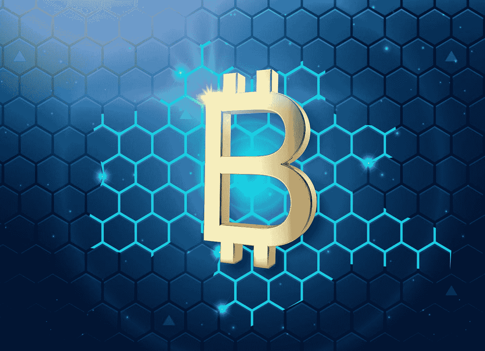

# 解释元宇宙令牌:它是什么，为什么要使用它

> 原文：<https://medium.com/geekculture/explaining-metaverse-token-what-is-it-and-why-to-use-it-c0692352c573?source=collection_archive---------13----------------------->

让我们来谈谈元宇宙代币

Photo by [Joshua Woroniecki](https://unsplash.com/@joshua_j_woroniecki?utm_source=medium&utm_medium=referral) on [Unsplash](https://unsplash.com?utm_source=medium&utm_medium=referral)

所以元宇宙不是一个新话题，这些天每个人都在谈论元宇宙和元宇宙的秘密。

所以今天我们要学习什么是元宇宙加密和元宇宙令牌，我还会告诉你前 5 名的元宇宙加密和如何购买它们。

所以让我们开始吧。

# 什么是元宇宙加密:

所以从什么是元宇宙密码这个问题开始。

因此，元宇宙是建立在区块链技术之上的，每个元宇宙的区块链技术都需要自己的加密货币，以便在元宇宙进行某种交流或交易。

所以每个元宇宙都有一种独特的代币，比如美国人用美元，印度人用卢比。

就这样，任何在元宇宙中使用的加密硬币被称为元宇宙密码，或者更具体地说，它被称为*元宇宙令牌*。

想了解更多，去看看我的博客:【https://nerdsculture.com/metaverse-crypto-top-7/ 

我在那里详细讲述了原因，还讲述了 7 个最值得投资的元宇宙代币。**从头到尾一个字一个字地阅读，了解每个项目**，如果你愿意，我会张贴一个完整的教程，介绍购买代币和出售代币的步骤。

# 为什么购买或使用元宇宙加密(令牌):

就像如果我问你为什么你需要一美元或一卢比？你会怎么回答？

我猜你会说这是个多么愚蠢的问题。所以就像在现实世界中一样，我们必须用我们的钱来买东西。同样，在元宇宙，你需要使用元宇宙密码(令牌)来购买或交易元宇宙的东西。

现在，我很肯定你肯定听到许多人谈论购买这些代币来获利，就像人们使用加密货币一样。

那么从投资的角度来看，你如何从元宇宙代币中获益呢？

所以我们来理解一下，第一，你需要真金白银来购买这些代币。然后你可以用这些代币在元宇宙兑换一些数字资产，但是如果你不打算去元宇宙或者在那里买任何东西，那么你可以留着它，因为这些元宇宙代币也有现实世界的价值。

就像加密货币一样，元宇宙代币的价值也会增加和减少。比如比特币或者以太坊。

因此，简而言之，你可以使用这些代币在元宇宙购买数字资产，或者将它们用作投资，就像密码或股票一样。

# 如何跟踪代币？

假设你买了一些代币，然后你想知道它的价格，一个代币多少钱，

为此，请前往[https://crypto.com/price/categories/metaverse](https://crypto.com/price/categories/metaverse)查看您购买的代币的实时数据。

这是我在网上找到的跟踪我的元宇宙代币价格的最好工具。

## 查看我的网站，了解更多关于 https://nerdsculture.com/的元宇宙，加密，NFTs:

感谢您的阅读，并在下方留下评论！