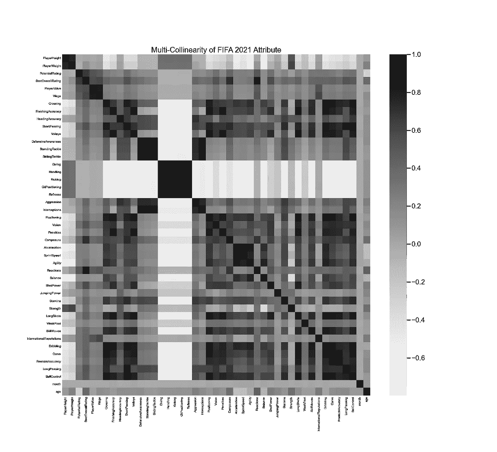
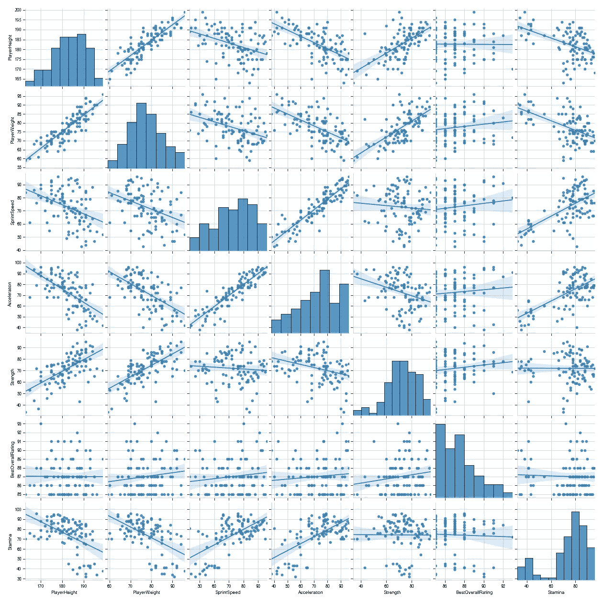
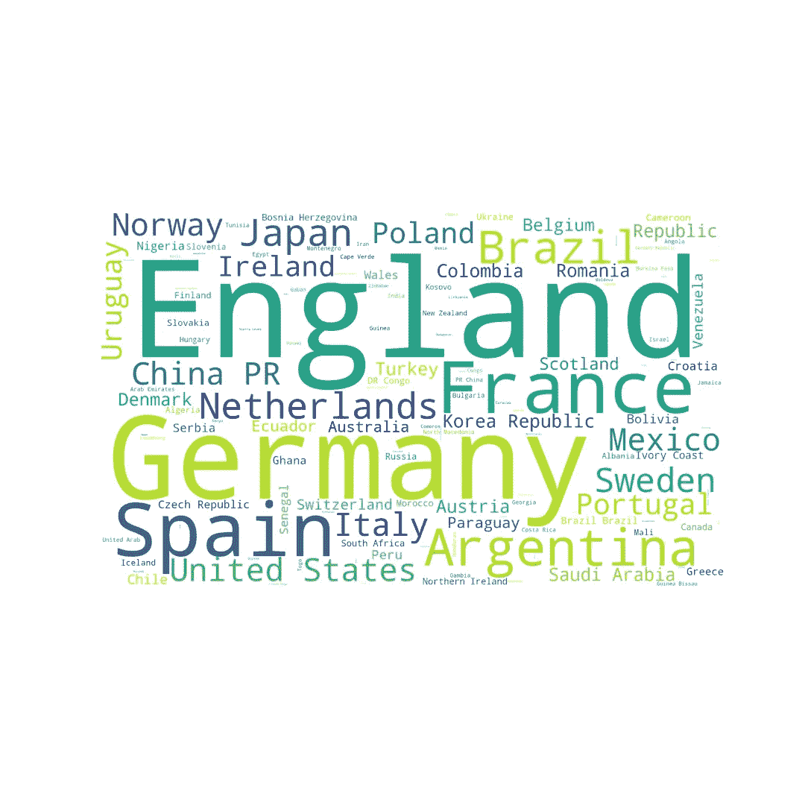
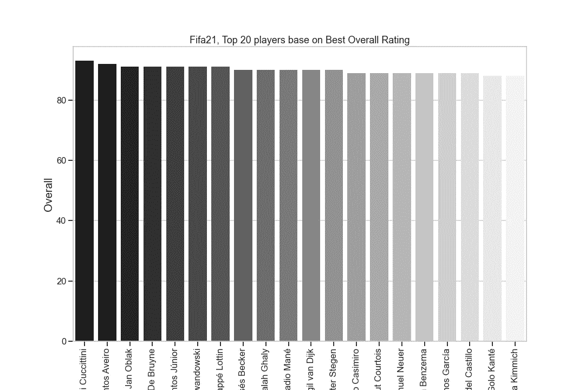
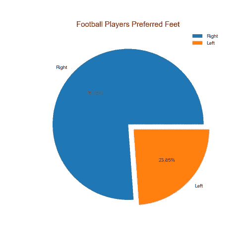
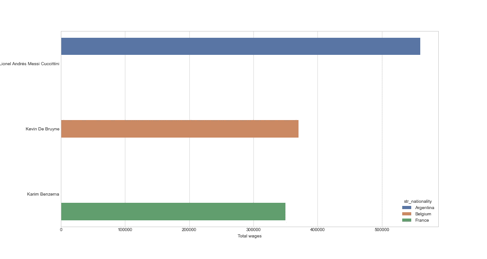
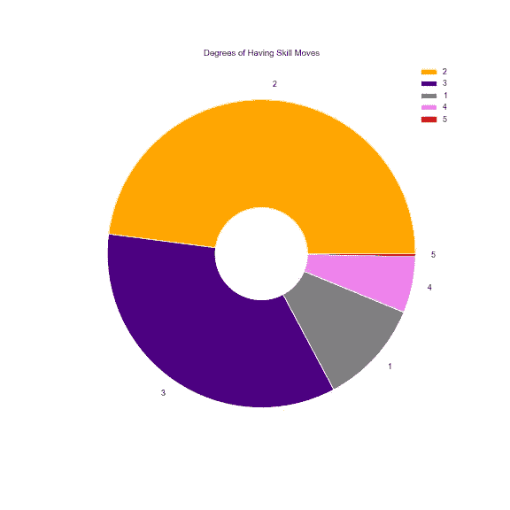
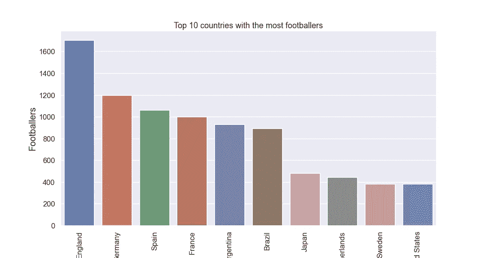
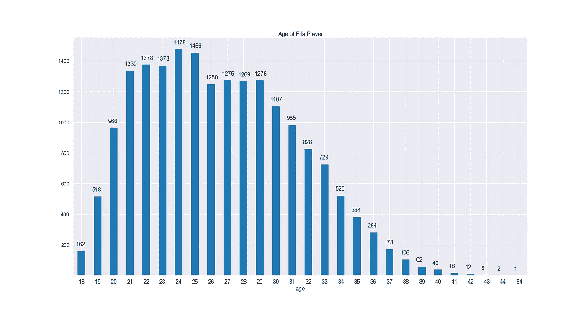
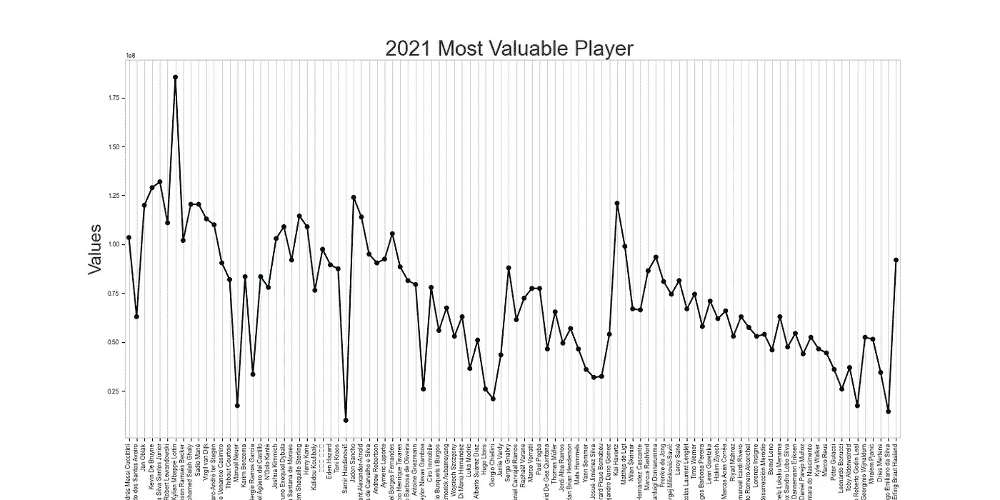

# 探索性数据分析用 FIFA 21 解密(第 2 部分)。

> 原文：<https://medium.com/geekculture/exploratory-data-analysis-demystified-with-fifa-21-part-2-76209caa24d2?source=collection_archive---------6----------------------->

了解如何通过 Python 使用数据可视化讲述一个有趣的故事并获得 FIFA 21 中的见解。


Image from [gettyimages.com](https://www.gettyimages.com/)

欢迎回到本教程关于探索性数据分析的第二部分。在教程的[第一部分](https://pub.towardsai.net/exploratory-data-analysis-expounded-with-fifa-2021-part-1-f20c465d483e)中，我们学习了如何通过统计分析来探索我们的数据，澄清了一些关于 FIFA 21 的问题，并产生了见解。这是惊人的，有见地的，解释得很好，详细。

进行探索性数据分析的唯一目的是为我们的业务得出清晰易懂的见解。写完第一篇文章后，我想了想，并不是每个人都懂统计学，或者从统计表中一眼就能看出一些东西。这可能会令人困惑，并可能导致原告对分析的含糊不清。因此，我们应该优化解决这个问题的最佳方法。

我突然想到了这个问题—


Photo by [Magnet.me](https://unsplash.com/@magnetme?utm_source=medium&utm_medium=referral) on [Unsplash](https://unsplash.com?utm_source=medium&utm_medium=referral)

*   我们如何优化解决这些问题的最佳方式？
*   怎样才能让大家清楚易懂的理解我们的分析？
*   怎样才能把我们的分析传达给大家，让它更有意义，更有趣？

这就引出了本教程关于探索性数据分析的第二部分，重点是数据可视化。

没有数据可视化，探索性的数据分析实际上是没有骨气的。

> 当向非技术人员传达结果时，没有什么比清晰的视觉效果更能表达你的观点了——约翰·土耳其

在现实世界中，让我们以我们的各种事务所/公司作为案例研究，并不是每个人都是数据科学家。你不能一直给非数据科学家看模糊的表格，他们认为你无能。人们应该找到一种更清晰的方式来交流见解，让它们看起来有意义和有趣。

创建视觉效果的唯一目的是让每个人都理解，而不仅仅是让数据从业者理解。事实上，数据科学团队只是现实世界中大多数公司的一个小团队。

很明显，数据可视化比数字更容易理解。数据可视化甚至可以让一个孩子轻松理解复杂的数据，换句话说，它可以加速数据理解。

> 如果你不能简单地解释它，你就理解得不够好——阿尔伯特·爱因斯坦

> Gift 在心中问了一个问题:**我们如何用一种简化的方式解释这个分析？**
> 
> Gift 独白回答:**我认为解释数据分析最合适的方式就是简单地通过数据可视化。**

如果你还没有读第一部分，试着在继续之前浏览一下，因为我们将在这一部分的基础上继续。

仍然带着好奇的心态，在这一部分，我们会提出更多的问题，更专注于用数据可视化解决问题，用数据可视化回答很多问题，获得更多的见解，创建简洁的演示文稿。

我们将回答以下关于数据可视化的问题。

*   FIFA 21 排名前 15 的球员是谁？
*   FIFA 21 排名前 5 的门将是谁？
*   谁是前 2 名防守队员？
*   谁是最好的中后卫中场？
*   谁是整体玩家？
*   谁是 goa t？
*   谁是整体中场？
*   谁是前 2 名前锋？
*   FIFA 21 最有价值球员有哪些？
*   谁是工资最高的顶级足球运动员以及他们各自的国家？
*   FIFA21 中人口最多的年龄组。
*   FIFA21 中足球运动员最喜欢哪只脚？
*   哪一组国家拥有最多的足球运动员？
*   足球运动员的技术动作分布。

**注**:本教程结束，你会对这些问题有明确的答案。

# 您将从本文中学到什么:

*   什么是数据可视化？
*   为什么要数据可视化？
*   与数字相比，人脑是如何处理视觉信息的？
*   用热图和配对图解释皮尔逊相关性。
*   相关性不是因果关系。
*   如何在 python 中创建不同类型的可视化？
*   视觉解读与交流。
*   视觉传达元素在工作场所的应用及实例。

链接到 [Jupyter 笔记本](https://nbviewer.jupyter.org/github/Gift-Ojeabulu/FIFA2021ANALYSIS/blob/main/MainFIFA2021ANALYSIS.ipynb)

# **什么是数据可视化？**

**数据可视化**通常缩写为*数据即*是一个跨学科领域，处理[数据](https://en.wikipedia.org/wiki/Graphics)的图形[表示](https://en.wikipedia.org/wiki/Representation_(arts))。当数据量很大(即大数据)时，这是一种特别有效的通信方式。*(来源:* [*维基百科*](https://en.wikipedia.org/wiki/Exploratory_data_analysis) *)*

# 为什么要数据可视化？

数据可视化将数据带入生活，让您成为隐藏在数字中的洞察力的故事大师。通过实时仪表板、交互式报告、图表、图形和其他可视化表示，数据可视化可以帮助用户快速有效地开发强大的业务洞察力。(来源:[微软 PowerBI](https://powerbi.microsoft.com/en-us/data-visualization/) )

数据可视化使人类思维能够轻松理解数据，在大型数据集中的趋势、模式和异常值可以轻松识别。它通过地图、图表或任何其他形式的图形表示，为信息提供可视化的上下文，从而给出信息含义的简明摘要。

> 可视化数据的能力是数据探索和使用难题的一个重要组成部分…数据提供者担心他们的数据被平凡化、误解或歪曲，这种担心也适用于进行可视化的过程，即使是简单的可视化…可视化数据改变了人们对数据的理解方式，并普遍提高了人们对数据的兴趣，这将鼓励开发更多更好的数据。罗伯特·科萨拉

数据可视化使用可视化数据来传达通用、快速和成功的信息。这项工作可以让公司看到有弱点的地方，需要改进的地方，影响客户满意和不满意的因素。

当复杂的数据在组织中可视化时，它使利益相关者、企业家和决策者能够利用数据、预测销售并看到可能的结果，这些结果可以促进组织内的未来增长。

# 人类大脑如何处理视觉

人类大脑的编程方式使得以图表或图形的形式可视化复杂状态下的大数据比用数字表示的电子表格更容易。数据可视化很可能是传达信息的最简单、最快的方式之一。

数据可视化比数字或文本更有效，因为它控制着我们潜意识的力量。最深处的大脑是所有事物的目录，因为它储存着记忆、技能、想法甚至视觉。

作为人类，我们天生是视觉的，因此我们可以通过视觉来增强数据处理。数据可视化比数字更有效，因为我们比任何其他形式更好、更快地理解和处理可视化数据。视觉效果总是有助于数据叙事。

根据明尼苏达大学的研究，人类大脑处理视觉信息的速度比处理文本快 60，000 倍。

**注意**:说到数据可视化，创造视觉效果的主要目的不是做出令人惊叹的设计，而是给出驱动洞察力的问题的答案。

**皮尔逊相关分析**

皮尔逊相关评估两个连续变量之间的统计关系。它提供了关于两个变量之间关系方向的信息。

它用于找出两个变量之间的线性关系。

还有其他类型的相关性，但我们将采用 Pearson 相关性，因为它适用于原始数据值，我们将在数据集中处理原始数据值。

**斯皮尔曼**处理排序变量。

解释这种相关性的两个完美图表是本教程将使用的**热图**和**对图**。

## 什么是热图？

热图是一种数据可视化技术，通过强度从最相关的特征到最不相关的特征显示颜色变化，其中事件或现象在空间上发生变化。



*   `fig, ax = plt.subplots(figsize` 用于设置我们的视觉效果的高度和宽度。`set_context` 用于设置标签的大小。
*   在创建热图之前，我们需要设置视觉效果的宽度和高度，我们将使用我们的数据可视化库/工具: `seaborn`和`matplotlib`。我们使用`plt.subplot.`将`Width`和`Height`分别设置为 `22cm`。然后我们使用`set_context`来设置`labels(names)`，我们选择海报是因为它清晰易读。
*   `Corr = data.fifa`用于为我们的 FIFA 数据的相关程度创建变量。相关程度在从 `+1` 到`-1`的范围之间，这是内部完成的。
*   `sns.Heatmap()`将设置我们的数据可视化，我们与 seaborn 的热图，其中热图中的属性被分配为视觉效果。
*   `Xtickslabels`用于指定 x 轴列中相关的名称，而`yticklabels`用于指定 y 轴列中相关的名称。
*   `Cmap ‘Greys’`是我们在`matplotlib` 调色板中使用的颜色类型。
*   `Ax.set-title`用来设置我们的地块名称的标题。
*   `Plt.show`用于显示出可视化的热图。

# 为什么相关性不是因果关系

相关性不是因果关系这个词是一个非常有趣的讨论话题，在学习统计学和数据科学时也很常见，但是这个短语到底是什么呢？

这个短语中有两个从属术语:**相关**和**因果关系。我们将会清楚地理解这个短语的意思。相关性不是因果关系简单地说，因为两个变量相互对应，并不意味着一个导致另一个。**

例如，在我们的数据集中，我们注意到高个子足球运动员往往比矮个子足球运动员体重更重，但这并不意味着所有高个子足球运动员体重更重，矮个子足球运动员体重更轻，我们一定都见过或听过高个子体重更轻而矮个子体重更重的例子。

*   所有高个子足球运动员不一定更重。
*   所有矮个子足球运动员不一定体重更轻。

不过，身高和体重是正相关的。因此，相关性不是因果关系。

> **注**:相关性简单来说就是强变量可以一起变化并且彼此相关。因果关系仅仅意味着一个变量的值的变化会导致另一个变量的量的不同。在这种情况下，一个变量使另一个变量的出现成为可能。这种情况被称为因果关系。

相关性是一种统计方法，可用于检查功能之间的关系。了解这些要素之间的关系有助于我们从数据集中的几个要素中确定最重要的要素。一旦我们理解了什么是相关性，我们就能做出更好的预测。特征之间的关系越强，你的机器学习模型预测就越准确。

**配对图**

配对图用于绘制数据集中多对二元分布，为此我们可以使用`pairplot()`



*   `datalm = data FIFA` 用于将我们的散点图设置为 100，以使其更加清晰。
*   `Vars`只是我们在国际足联数据中设置的变量，因为我们的数据集看起来很大，这可能很复杂，难以设置为可视化。我们选择几个栏目，如身高，体重，速度和其他一些。
*   `Kind = reg`简单地说，就是我们希望我们的配对图采用线性回归图的形式，这样我们就可以清楚地看到我们的数据集是如何关联的。
*   是完全正相关、弱相关还是完全负相关？您还可以检查数据集中的其他变量，以查看它们的二元关系。
*   配对图中的直方图显示了我们的变量有多偏斜，是正偏斜(即左偏斜)还是负偏斜(即右偏斜)。在我们的数据集中拥有所有这些知识可以让我们知道如何在现实生活中处理我们的数据集。例如，在统计学上，我们试图使我们的数据分布呈正态分布，因为这也会影响我们数据集中的洞察力。

# 国籍问题

词云根据生成的每个词的大小-频率来可视化我们的文本数据。



*   这很简单，我们也创建了宽度为`15cm`和`height`，然后我们创建了一个白色背景的 `word cloud` ，在绘图区域有`width 200`和`height 1200`，然后我们用 `joind_frame`从我们的 FIFA 数据中生成我们国籍的`wordcloud` 。
*   `Plt.axis`禁用为不显示`x` & `y axis.`
*   “云”一词用于表示不同规模的国家，从数据集中提到最多的词到提到最少的词。

# 前 20 名足球运动员



*   `**Lionel Messi**`是 FIFA 21 的最佳球员，而`**Cristiano Ronaldo**`紧随其后。我不想开始质疑谁是山羊，否则我们不会完成这篇文章，lol，但根据我们对 FIFA 21 的分析。

> 梅西就是 goa t

> 没有数据，你只是另一个有观点的人

*   我们更应该关心的是`**Messi**`和`**Ronaldo**`在 FIFA 21 之外，十年来一直是非常优秀的球员，实际上，这也是事实。这两个家伙都以自己的方式表现出色，我认为没有必要进行比较，只要看他们两个踢球并享受足球就行了。
*   其他顶尖选手有:`**De bruyne, Neymar, Lewandoski, Mbappe, Salah, Mane, Van dijk, Benzema, Kante**`。

从这些信息中，我们很容易推断或预测 FIFA 2021 Balon d' or 的提名人。

> 这是我们作为数据从业者应该深入了解数据的主要原因，从我们的上一篇文章中，我们发现**扬·奥布拉克、艾莉森·拉姆森·拉姆齐斯、马克·斯特根、蒂博·库尔图瓦、曼努埃尔·诺伊尔**是守门员而不是球员，这也是我将其称为前 20 名足球运动员而不是球员的主要原因。

**洞察力**

最佳守门员基地的综合评分是:

*   ***扁圆形***
*   ***佳佳***
*   ***Stegen***
*   ***库尔图瓦***
*   ***诺伊尔***

这是 2021 年国际足联排名前 5 的门将。

**最佳球员**

*   最佳整体球员— **莱昂内尔·梅西**
*   最佳前锋——克里斯蒂亚诺·罗纳尔多和罗伯特·莱万多斯基
*   最佳维冈— **小内马尔**
*   最佳中场球员— **凯文·德·布鲁恩**
*   最佳中卫——**恩戈洛·坎特**
*   最佳整体防守球员——维吉尔·范迪克和 T21·塞尔吉奥·拉莫斯。

# 足球运动员用哪只脚最多？



这是非常直接和真实的，我们的饼图显示:

*   76%的球员喜欢使用右脚。
*   **24%** 更喜欢用左脚。

足球由右脚运动员主宰。我用了“首选”这个词，因为有些球员像罗纳尔多、登贝勒、格林伍德和其他少数人是双脚球员。

# 工资最高的运动员及其国籍



*   在上一篇文章中，我们使用`nlargest`来获得最高工资的球员，但我们通过可视化来获得最高工资和国籍，因为可视化比表格或数字更能说明问题。

**洞察力**

以下是 FIFA 2021 中收入最高的三名球员及其国籍:

*   **阿根廷的莱昂内尔·梅西**。
*   **凯文·德布劳内**来自比利时。
*   **本泽马**来自法国。

> 注:在下面的甜甜圈&多色条形图中，由于代码行较长，为了便于理解，我尽量用`*#*` 通过代码注释解释清楚每一行代码。

# 技能移动的分布



**洞察力**

*   这很简单，甜甜圈图显示许多足球运动员属于`2`和`3`，这仅仅意味着 FIFA 21 中的许多足球运动员技术不太好。我们有技术不太好的选手。

# 拥有最多足球运动员的十大国家



*   根据列表，`**England, Germany, Spain, France, Argentina, Brazil, Japan,Netherlands,Sweden & US**`是 FIFA 21 **中拥有最多足球运动员的前 10 个国家**。

在笔记本中，我用基本的熊猫运算来计算它们的百分比:

```
**England          17.05%** of **footballers** in **FIFA 21.****Germany          11.99%** of **footballers** in **FIFA 21.****Spain            10.6%** of **footballers** in **FIFA 21.****France           10.02%** of **footballers** in **FIFA 21.****Argentina         9.32%** of **footballers** in **FIFA 21.****Brazil            8.94%** of **footballers** in **FIFA 21.****Others countries  16%** of **footballers** in **FIFA 21**.
```

# 年龄分布



*   `sns.set_style(‘darkgrid’)` 将使用 seaborn 将绘图背景的样式设置为带有线条的较暗背景，称为`darkgrid`
*   `sns.set_context(‘talk’)`是条形图的书写格式样式。
*   `plt.figure(figsize=(26,14))`将使用 Matplotlib 来设置图形的宽度和高度。
*   简单来说，就是创建一个条形图，将国际足联 21 名球员的数据按年龄分组，从最小年龄(21 岁)到最大年龄(54 岁)。这是一个简单的泊松分布，在理想情况下，我们将使它成为正态分布。

**我怎么知道这是泊松分布？**

在[概率论](https://en.wikipedia.org/wiki/Probability_theory)和[统计学](https://en.wikipedia.org/wiki/Statistics)中，**泊松分布**是一种[离散概率分布](https://en.wikipedia.org/wiki/Discrete_probability_distribution)，它表示在固定的时间或空间间隔内发生的给定数量事件的概率，如果这些事件以已知的恒定平均速率发生并且独立于自上次事件以来的时间。([维基百科](https://en.wikipedia.org/wiki/Poisson_distribution))

*   `Plt.title` 将显示标题为国际足联球员的年龄
*   `plt.xticks(fontsize = 18,rotation=0)`只是简单地将条形图中的字体大小设置为 18，这样就可以很容易地阅读，否则人们会感到困惑，这就是为什么字体大小只有 18，然后我们确保我们没有旋转条形图。
*   `**for** p **in** ax.patches: Annotate` 表示使用 for 循环迭代每个年龄，并使用 annotate 向文本添加注释，给出解释或评论。
*   下面这些年轻球员的总结 `age 31`看起来足球人口很多，这是真的，因为足球需要能量，而老一代人因为变老而不再真正拥有这些能量。年龄对任何运动都有很大的影响，不仅仅是足球。
*   `21–25`拥有最高的足球运动员。
*   `43- 54`都是离群值，什么是离群值？

在统计学中，异常值是指在总体的随机样本中，与其他值有异常距离的观察值。小于或大于一组数据中大多数其他值的值。例如，在我们的可视化中`41–54` 是离群值，因为几乎不可能看到在那个年龄仍然踢足球的足球运动员。

这很正常，因为现实生活中的数据集并不总是 100%准确。在提高数据质量的理想情况下，可以决定用年龄范围`21–25`填充来自`38–54`的值，因为年龄`21–25`拥有最多的足球运动员，但我们不会这样做，因为这不在本文的范围内。

# 最有价值球员



这是由于你作为一名球员或守门员在一个球队中的价值，使你具有市场潜力，因此，当转会窗口打开时，球员的价值与价格成正比。

特定年份最具市场价值的球员取决于两个关键因素:

*   球员目前的状态/表现。
*   年龄。

其他包括对你的团队的影响，比如在你的团队最需要的时候进球等等。

**洞察力(市场价值)**

*   **非常高** —凯莉安·姆巴佩
*   **高** —米伦·桑丘&凯·哈韦茨
*   **有点高**——其他一些玩家喜欢`**De Bruyne, Arnold, Sterling, Ronaldo, Messi, Bruno Fernandes, Haaland, Kane.**`

> 注:年龄和目前的状态/表现在决定一名球员的市场价值时起着很大的作用。

# 视觉解读与交流

**视觉传达**是利用视觉元素传达思想和信息，包括但不限于[标志](https://en.wikipedia.org/wiki/Signage)、[排版](https://en.wikipedia.org/wiki/Typography)、[制图](https://en.wikipedia.org/wiki/Drawing)、[平面设计](https://en.wikipedia.org/wiki/Graphic_design)、[插画](https://en.wikipedia.org/wiki/Illustration)、[工业设计](https://en.wikipedia.org/wiki/Industrial_design)、[广告](https://en.wikipedia.org/wiki/Advertising)、[动画](https://en.wikipedia.org/wiki/Animation)以及电子资源。([维基百科](https://en.wikipedia.org/wiki/Visual_communication))

包括语言、非语言和视觉交流在内的沟通技能是任何数据从业者最需要和最重要的软技能之一。能够创建可理解且不太复杂的具有洞察力的视觉效果，并能够以一种良好的、结构化的和简化的方式交流和解释您的数据可视化，这是至关重要的，这将使您成为利益相关方、公司和招聘人员如此重视的商业智能分析师、数据分析师、数据科学家或数据可视化专家。公司雇佣你是为了通过从可视化中获得的洞察力产生商业影响，所以沟通应该是重中之重。

作为工作场所的数据从业者，您可以使用一些常见类型的可视通信，包括:

*   信息图表。
*   路线图。
*   图表和图形。
*   视觉报告。
*   演示文稿。
*   思维导图。

> 在本教程中，我将使用一个简单的**演示幻灯片**作为示例性的视觉交流工具，这是数据从业者在工作场所交流见解时最常用的方式之一

A Simple presentation Slide FOR FIFA 21 by Gift Ojeabulu

*   [链接到演示幻灯片](https://docs.google.com/presentation/d/1cV65GetcKxiGdTsos_XUerDOTlJSqSClRPjT9-Xy8FI/edit?usp=sharing)
*   [链接到 Github 回购](https://github.com/Gift-Ojeabulu/FIFA2021ANALYSIS)

**注意**:为了建立你的视觉沟通技巧，你需要使用几个数据集，建立视觉效果并进行交流。通过实践、犯错和从错误中学习，你可以学到更多东西，而不是看教程视频而不做，或者只是阅读有关提高数据可视化技能的内容而不应用它们。

# 我们在这里得出结论…

我们不能过分强调数据可视化在探索性数据分析中的重要性，了解如何创建数据可视化并使用它来回答值得注意的问题将磨练您作为数据从业者在探索性数据分析方面的技能。

通过数据可视化，我们回答了许多我们从未想到会在 FIFA 21 中出现的问题，我们也消除了对 FIFA 21 中我们不确定的问题的疑虑。

您刚刚学习了数据可视化在探索性数据分析中的重要性，人脑如何处理与数字/文本相比较的视觉效果，如何通过视觉效果轻松理解信息，皮尔逊相关性分析，相关性和因果关系之间的差异和关系，如何在 python 中创建不同的可视化，视觉解释和交流。

这是关于数据可视化的一个很长的解释，我希望你在你的工作场所使用你的未来项目中使用的技术。

恭喜你！你现在已经通过数据可视化对 FIFA 2021 有了详细的了解。

我迫不及待地想看到您将通过数据可视化获得的惊人见解，以及您将通过探索性数据分析解决的业务问题。

在 [Linkedin](https://www.linkedin.com/in/gift-ojabu/) 上联系我

在[推特](https://twitter.com/GiftOjeabulu_)上与我联系