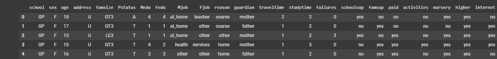
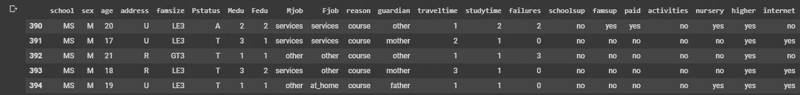
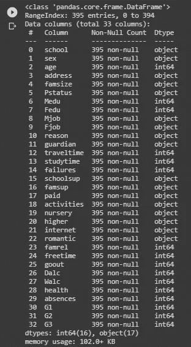
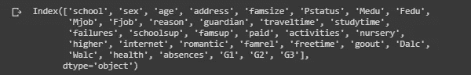
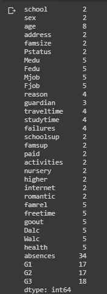
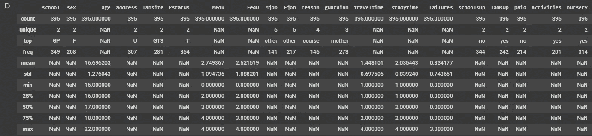
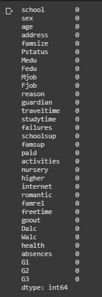

# 探索性数据分析

> 原文：<https://medium.com/geekculture/exploratory-data-analysis-eda-44912e492879?source=collection_archive---------19----------------------->

这个题目的名字本身就暗示了很多。探索性数据分析是通过理解数据集的各个方面并将其可视化来分析和探索给定的数据集。

现在你会想到一个问题，为什么我要在清理机器学习和深度学习中的数据和训练模型之前进行探索性数据分析(EDA)？有什么必要呢？答案很简单，在清理数据之前，你应该知道给定的数据到底是关于什么的，给定了什么属性。考虑到这一点，我们尝试理解数据，然后尝试相应地清理数据。


我将分两部分讨论 EDA 这个话题，这是第一部分。

在这一点上，我们明白你应该用什么方法来理解任何数据集。我将使用 Python 的各种库来做这件事。在任何上进行 EDA 之前，您必须导入一些重要的库:

```
import numpy as np
import pandas as pd
```

之后，让我们读取数据。逗号分隔值（csv）文件格式

```
data = pd.read_csv('csv-file-name')
```

现在，从给定的以下代码开始，EDA 启动，我正在一个原始数据集上进行 EDA，您可以从[这里](https://drive.google.com/file/d/11S2fB1JlSDmqRPFi5wh7Hc15Ug02lpQi/view?usp=sharing)下载该数据集，这样您就可以清楚地了解数据科学家环境中的工作。导入数据集后的第一步应该是查看它。这可以通过使用

```
data.head(5) # to see top 5 records of dataset
data.tail(5) # to see last 5 records of dataset
```



**Output:** data.head(5)



**Output:** data.tail(5)

之后，使用查看所有列的信息

```
data.info()
```



现在让我们看看数据集中的列

```
data.columns
```



之后，使用检查数据集中每一列的唯一值的数量

```
data.nunique()
data['column-name'].unique() 
#**Optional: If you want to see what are unique values you have in particular column**
```



现在，让我们来看一下对数据集执行统计操作，通过使用，您将了解数据集每一列的最大值、最小值、平均值、标准差、频率、计数和唯一值的数量

```
data.describe(include='all')
```



检查数据集中每一列的 **NULL** 值的数量

```
data.isnull().sum()
```



这么多代码足以理解给你的数据集，之后，你可以看到 EDA 的[第 2 部分](https://prasantdixit.medium.com/exploratory-data-analysis-part-2-2e68180be41e)可视化数据集，以轻松理解数据集。