# 探索性数据分析(EDA)——第一部分

> 原文：<https://medium.com/geekculture/exploratory-data-analysis-eda-part-1-7eab49cdbd66?source=collection_archive---------12----------------------->

我们生活在一个被数据主宰的世界。数据无处不在，比以往任何时候都更有价值。我们有数年的数据等待分析和使用。了解我们正在处理的数据的性质非常重要。探索性数据分析或简称 EDA 是帮助我们理解和分析数据内在本质的过程。

# 探索性数据分析

> “数据科学家使用探索性数据分析(EDA)来分析和调查数据集并总结其主要特征，通常采用数据可视化方法。它有助于确定如何最好地操纵数据源以获得您需要的答案，使数据科学家更容易发现模式、发现异常、测试假设或检查假设。”— IBM

简而言之，EDA 只不过是一种数据探索技术，用来理解数据的各个方面。EDA 是机器学习中非常重要的一步，因为它有助于提高模型的准确性。

# EDA 的目标

1.  帮助理解数据集的底层结构。
2.  帮助理解数据集中的内在本质和模式。
3.  有助于发现和清理数据集的冗余和离群值。
4.  有助于理解数据集中变量之间的关系。

# EDA 中的步骤

探索性数据分析过程中涉及到各种步骤，为了加深理解，我们将举一个数据集的例子。该数据集来自 Kaggle 的泰坦尼克号机器从灾难初学者比赛的数据集 train.csv，根据该数据集，我们必须找到乘客是否幸存。

 [## 泰坦尼克号-机器从灾难中学习

### 从这里开始！预测泰坦尼克号上的生存并熟悉 ML 基础知识

www.kaggle.com](https://www.kaggle.com/c/titanic) 

## 识别变量

这是 EDA 的第一步，我们需要了解数据集中的变量，比如什么是**输入变量**，什么是**输出变量**？然后我们需要了解数据集中变量的类型，比如它是整数吗？一个浮点值？还是字符串值？最后，我们需要分析变量是连续的还是分类的。性别是分类变量的一个例子，而身高是连续变量的一个例子。

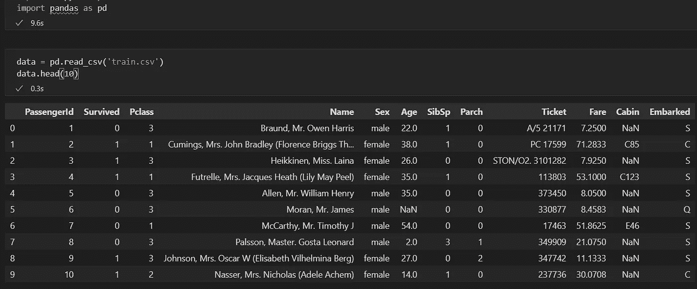

我们可以从数据集中看到，有 12 列，

***PassengerId****——乘客的 Id。*

****幸存*** —乘客是否幸存*

****Pclass*** —代表社会经济地位，其中 1 代表上层阶级，2 代表中产阶级，3 代表下层阶级。*

****姓名*** —乘客姓名*

****性别*** —乘客的性别*

****年龄***-乘客的年龄，是小数。*

****SibSp*** —乘客是否有兄弟姐妹或配偶随行。*

**——乘客是否有父母或子女陪同**

*****车票***-车票编号**

*****票价****——他们为了进入泰坦尼克号而必须支付的票价***

******船舱*** —船舱编号***

*****登船***——泰坦尼克号上人们登船的三个可能区域，S、C、q。**

**我们现在将分析数据集的结构。**

**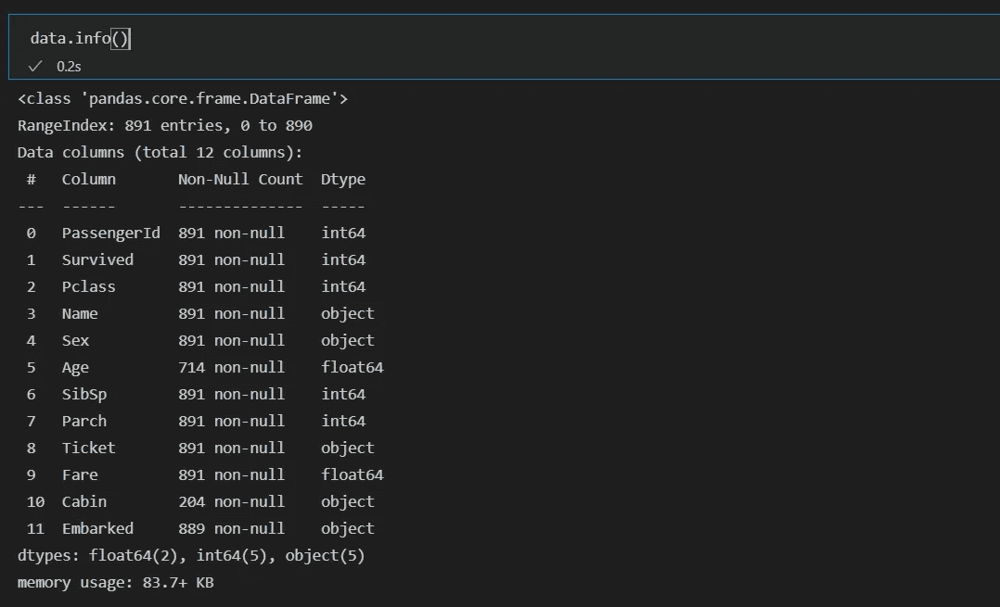**

**从分析中我们发现总共有 891 行和 12 列。集合中有 3 种数据类型，float、int 和 object。**

**我们看到我们的输出变量是“幸存的”,其余的可以作为我们的输入变量。**

**我们还观察到客舱数据中只有 204 行值，这意味着总数据的 70%丢失，因此我们可以从数据集中删除客舱列。我们在“年龄”和“上船”列中也缺少值。**

## **单变量分析**

**在这一步，我们一个接一个地分析变量。执行这种分析的方法取决于变量是连续的还是分类的。**

**我们将在示例数据集中查看每个变量。**

> **幸存**

**首先，我们取我们的输出变量“存活”,并在我们的训练数据集中绘制存活和未存活的总人数。**

**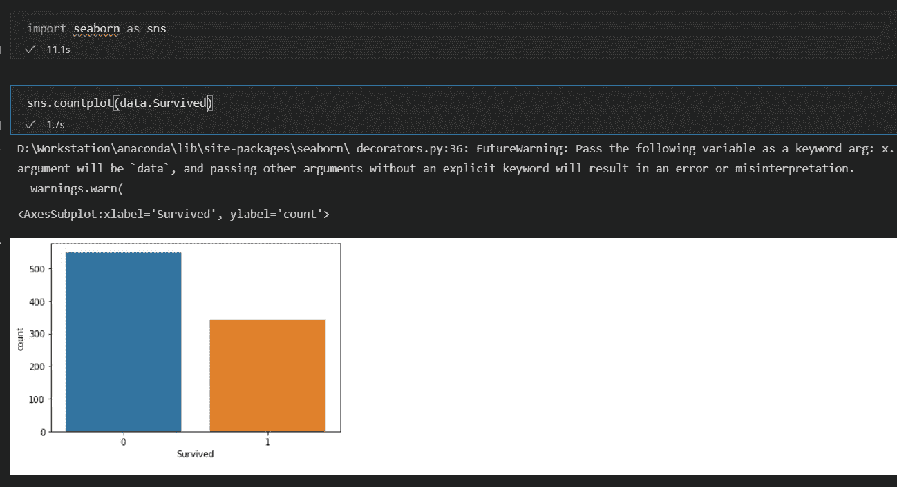**

**我们发现幸存的总人数约为 340 人。因此，总的生存概率约为 38%。**

> **Pclass**

**Pclass 是该数据集中的预测值或输入变量。当我们使用 seaborn 对 countplot() Pclass 进行计数时，我们看到下层阶级在数量上要高得多，其次是上层阶级，然后是中产阶级。**

**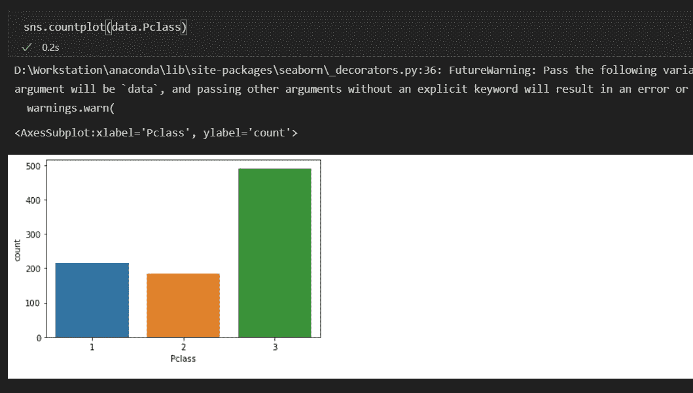**

**如果我们将 Pclass 与 survived 进行对比，我们会发现下层阶级不太可能幸存，而上层阶级更有可能幸存。**

**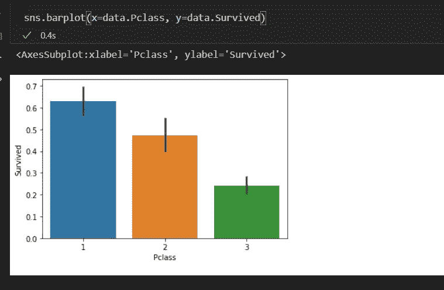**

> **性**

**当我们计算泰坦尼克号上男女的总数时，我们发现船上的女性比男性少。**

**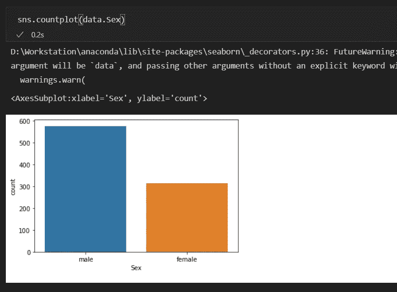**

**当我们用性来对抗幸存者时，我们看到女性比男性有更高的生存几率。女性有超过 70%的生存机会。**

**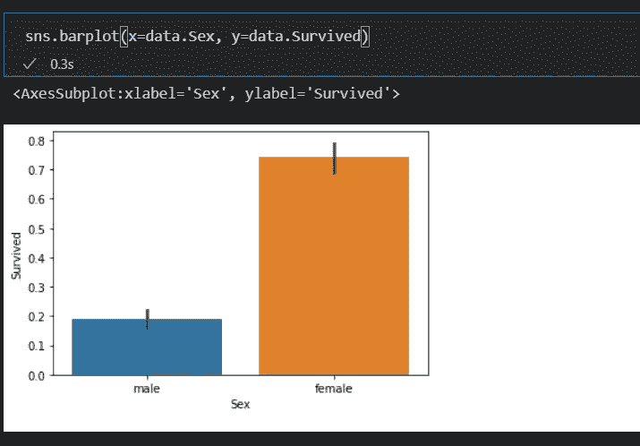**

> **年龄**

**我们之前处理的变量是分类变量，但年龄是一个连续变量。在连续变量中，我们需要理解变量的集中趋势和扩散。从直方图中，我们可以观察到大多数乘客的年龄在 20 到 40 岁之间。**

****

**从箱线图()中，年龄相对于存活者，我们观察到较年轻的乘客往往具有更大的存活概率。**

**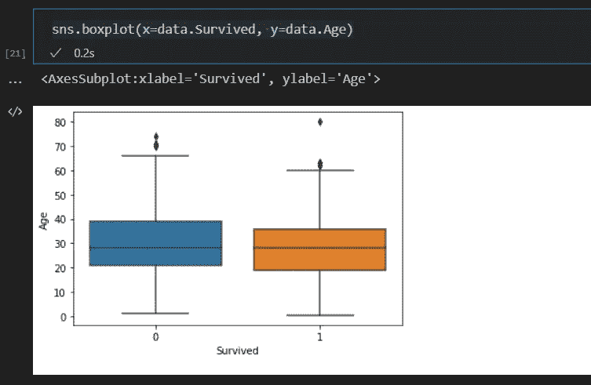**

> **SibSp**

**我们观察到有兄弟姐妹/配偶的乘客，有一个兄弟姐妹/配偶的乘客数量更多**

**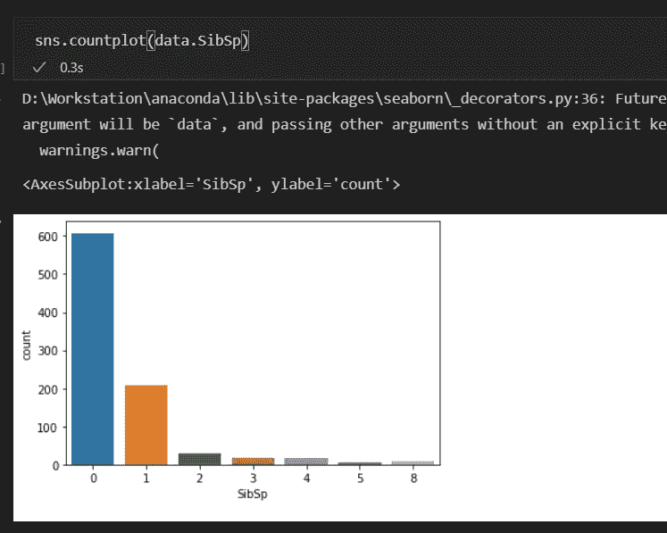**

**我们现在绘制 SibSp 与幸存的对比图，并从图表中观察到，与没有兄弟姐妹/配偶的乘客相比，有 1 个兄弟姐妹/配偶的乘客更有可能幸存。**

**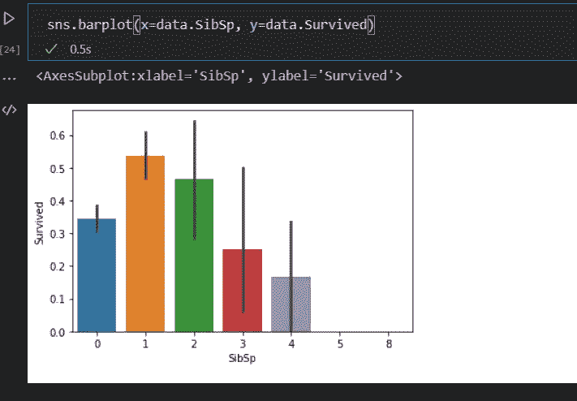**

> **烤**

**从图表中我们可以观察到，几乎 70%的乘客没有和父母/孩子一起旅行。**

**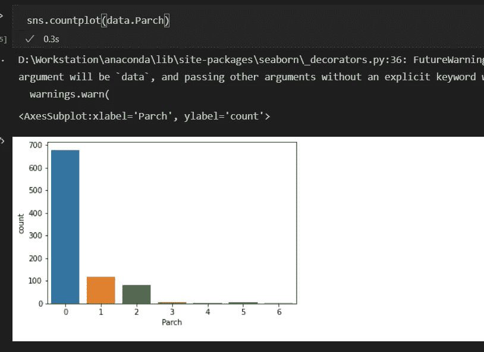**

**我们还观察到，与父母/孩子一起旅行的乘客更有可能幸存。**

**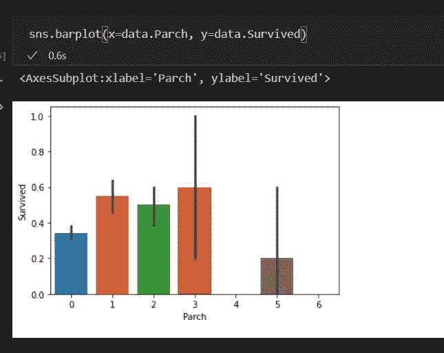**

> **票价**

**这是我们数据集中的另一个连续变量。当我们绘制票价分布图时，我们看到分布是右偏的。**

**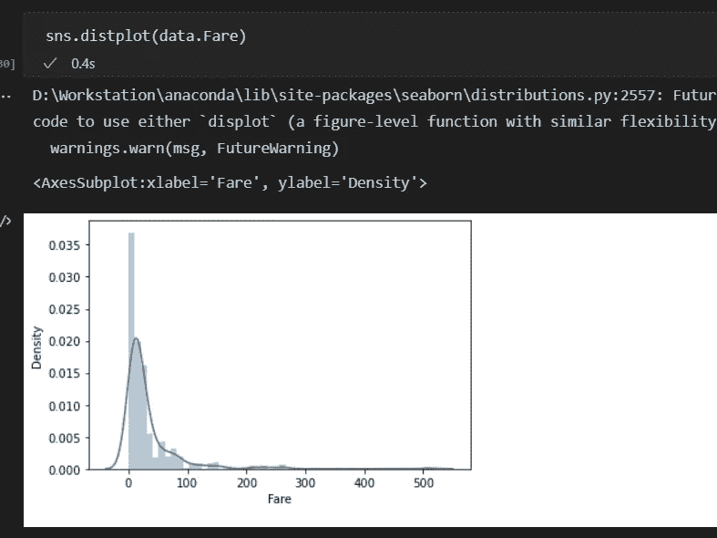**

**我们还观察到幸存下来的人比没有幸存下来的人支付了相对更高的费用。**

**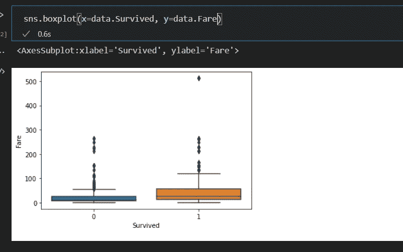**

> **从事**

**我们观察到登上泰坦尼克号的大多数乘客来自 c 港。**

**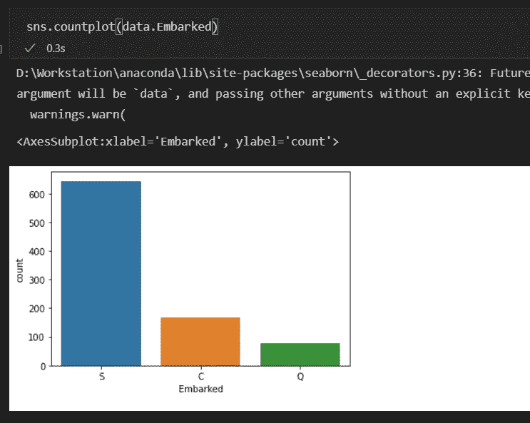**

**我们观察到在 C 港上船的乘客更有可能生还。**

**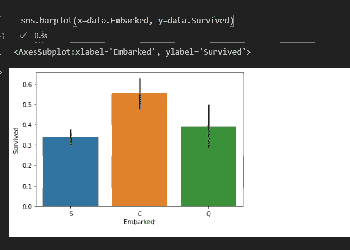**

**我们将在下一部分学习更多关于 EDA 的知识，我们将讨论双变量分析、缺失值处理、异常值处理、变量转换、变量创建等。**

**在这里读第二部分，**

** [## 探索性数据分析(EDA)——第二部分

### 在上一部分中，我们讨论了探索性数据分析过程中的前几个步骤，如…

medium.com](/@1runx3na/exploratory-data-analysis-eda-part-2-6d55a266a31c)** 

**参考，**

** [## 详细教授数据探索的完整教程

### 关于数据探索(EDA)的完整教程，我们涵盖了数据探索的几个方面，包括缺失值…

www.analyticsvidhya.com](https://www.analyticsvidhya.com/blog/2016/01/guide-data-exploration/)**