# 探索性数据分析(EDA)——第二部分

> 原文：<https://medium.com/geekculture/exploratory-data-analysis-eda-part-2-6d55a266a31c?source=collection_archive---------7----------------------->

在前一部分，我们讨论了探索性数据分析过程中的前几个步骤，如确定变量、单变量分析等。现在我们将看到更多关于双变量分析和 EDA 中的其他步骤。

# 双变量分析

在双变量分析中，我们找出两个变量之间的关系。变量可以是连续变量或分类变量的任意组合。不同的方法用于不同的变量组合。

## 连续不断

散点图最适合两个连续变量。散点图的模式表明了变量之间的关系。散点图可以显示变量之间的关系，但不能显示关系的强度，因为我们使用在-1 和+1 之间变化的相关性，其中-1 表示变量之间完全负线性相关，0 表示不相关，+1 表示变量之间完全正线性相关。

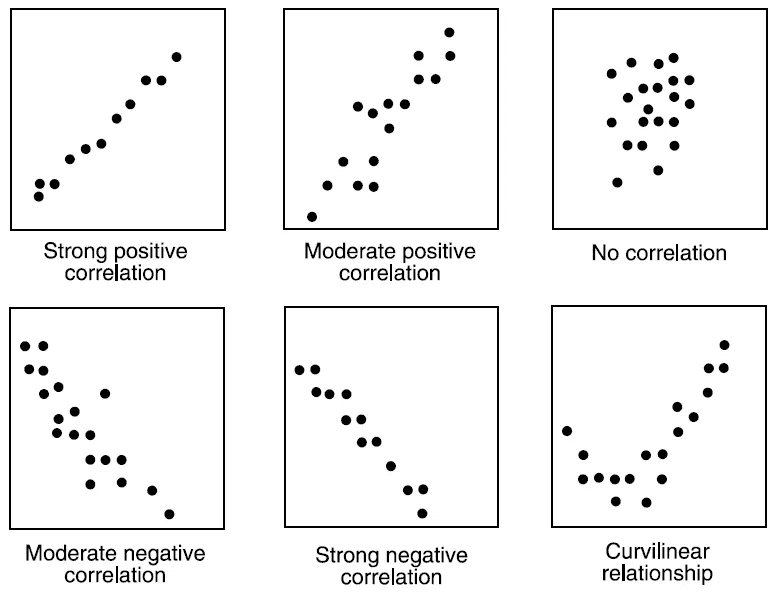

从我们的示例数据集中，我们可以看到“年龄”和“费用”之间几乎没有相关性，因为两者都是连续变量。

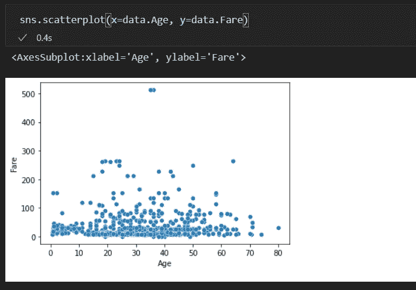

我们可以看到年龄和票价之间的相关性是 0.096067，这是一个非常弱的相关性。

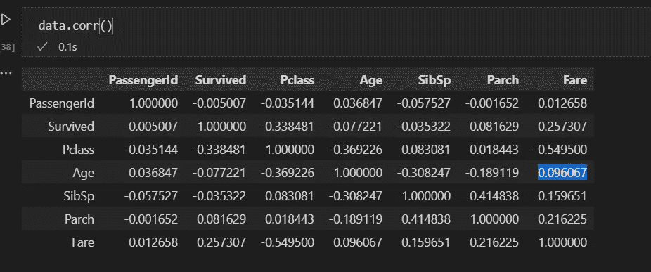

## 绝对和绝对

有各种技术可以用来找出两个分类变量之间的关系。

> 双向表

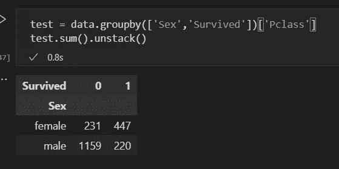

在双向表法中，我们通过创建计数或计数%的双向表来开始分析关系，其中行代表一个变量的类别，列代表另一个变量的类别。

> 堆积柱形图

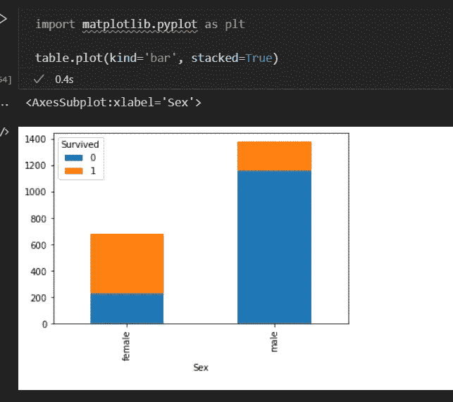

双向表不是一种可视化的方法，为了得到双向表的可视化形式，我们使用了堆积柱形图。

> 卡方检验

该检验用于确定在双向表的一个或多个类别中，预期频率和观察频率之间是否存在统计上的显著差异。它主要用于推导变量之间关系的统计显著性。它返回计算的带有自由度的卡方分布的概率。

*   如果概率为 0，那么变量是相关的。
*   如果概率为 1，那么变量是独立的。
*   如果概率< 0.05，那么变量之间的关系在 95%的置信度下是显著的。

我们将使用 SciPy 库进行卡方检验，

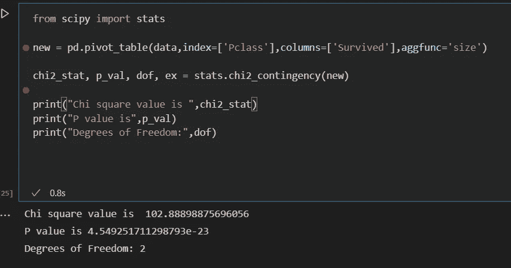

正如我们所看到的，p 值非常小，我们可以拒绝零假设，因此我们可以得出结论，乘客的生存取决于他们的 Pclass。这里我们建立了“Pclass”和“Survived”之间的关系，两者都是分类变量。

## 分类和连续

箱线图在探索分类变量和连续变量之间的关系时非常有效。为了获得统计显著性，我们可以执行两种类型的测试，

> z 检验/T 检验

这两个测试评估两组的平均值是否在统计上彼此不同。T-检验与 Z-检验的不同之处在于，当两个类别的观察数都小于 30 时，使用 T-检验。

> 方差分析

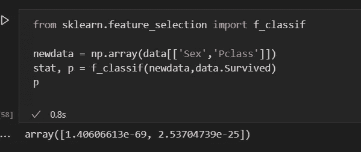

该测试评估两个以上组的平均值在统计上是否不同。我们使用 Scikit learn 的库从实现 Anova 测试的 feature_selection 导入 f_classif。

在经历了理解变量和发现变量之间的关系的各个步骤之后，我们需要找到一种方法来处理变量的缺失值(如果有的话)。数据集中的缺失数据会降低机器学习模型的准确性，并会导致模型有偏差。

在我们的示例数据集中，我们发现“Cabin”列几乎丢失了 70%的数据，因此我们从数据集中删除了该列。现在，我们将看到处理数据集中缺失值的各种其他方法。

# 价值观缺失怎么处理？

通常，数据集中的缺失值发生在两个阶段，**数据提取**和**数据收集**。数据提取阶段的错误通常很容易发现，也很容易纠正，但在数据收集期间出现的错误就很难纠正。数据收集期间的错误有四类，

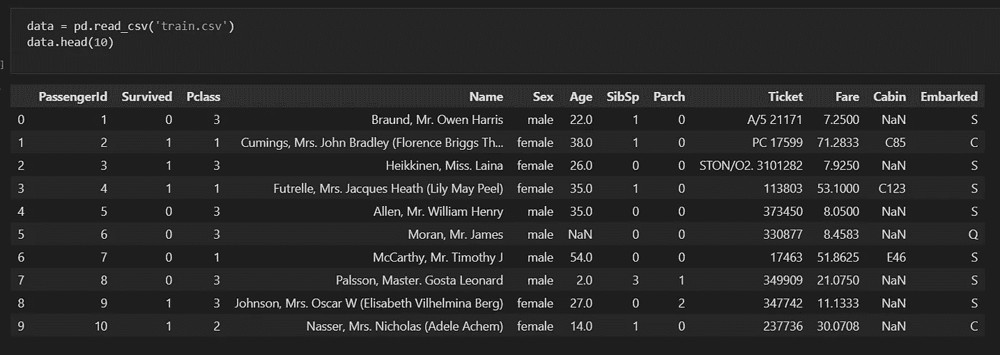

> ***完全随意缺失***
> 
> 在这一类别中，所有观测值缺失值的概率是相同的。
> 
> ***随意缺失***
> 
> 在这一类别中，缺失值的比率因其他输入变量的不同值或水平而不同。
> 
> ***依赖于未观测预测值的缺失***
> 
> 在这一类别中，这种缺失值不是随机的，而是与未观察到的输入变量有关。
> 
> ***缺失，这取决于缺失值本身***
> 
> 在这一类别中，丢失值的概率与丢失值本身直接相关。

处理缺失值的方法有很多种。有些是，

## 删除

处理缺失值的一种方法是从数据集中删除它们。有两种类型的删除。

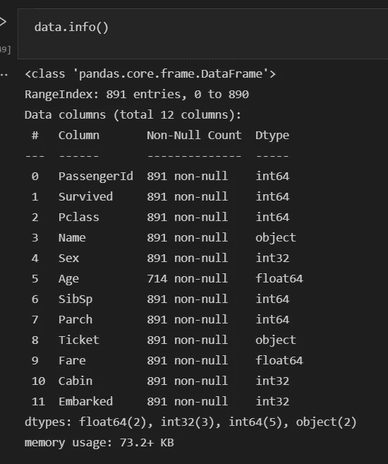

> 列表式删除

在列表删除中，我们删除任何变量缺失的观察值。但它降低了机器学习模型的能力，因为它减少了样本量。因此，如果我们在数据集中应用列表式删除，我们将不得不删除几乎 70%的数据集。

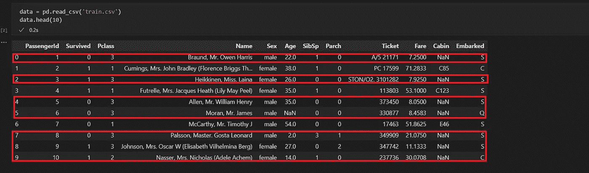

为了避免这种情况，我们完全删除了“小屋”一栏。因此，其余的观察和样本的大小仍然相当大。

> 成对删除

在成对删除中，我们对存在感兴趣的变量的所有情况进行分析。成对删除的缺点是它对不同的变量使用不同的样本量。

请注意，当缺失数据的性质是“完全随机缺失”时，通常使用删除方法，否则没有随机缺失值会影响模型输出。

## 均值/众数/中位数插补

在这种方法中，我们输入带有估计值的缺失值，这些估计值具有类似平均值、中值或众数的关系。对于定量属性，我们采用平均值或中值，而对于定性属性，我们采用众数。

我们将使用我们的示例，并处理“年龄”变量中缺失的值。正如我们看到的,“年龄”一栏中几乎有 177 个值缺失。

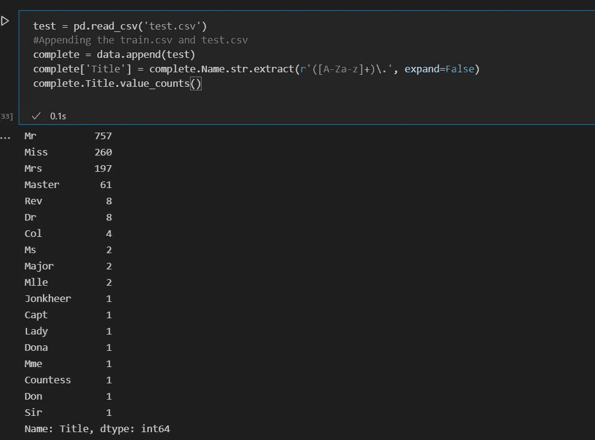

如果我们查看数据集中乘客的姓名，我们可以观察到这些姓名有诸如先生、夫人、主人等头衔。我们将从乘客的名字中提取这些头衔(先生/夫人/小姐/主人)。我们将对这些标题进行分组。

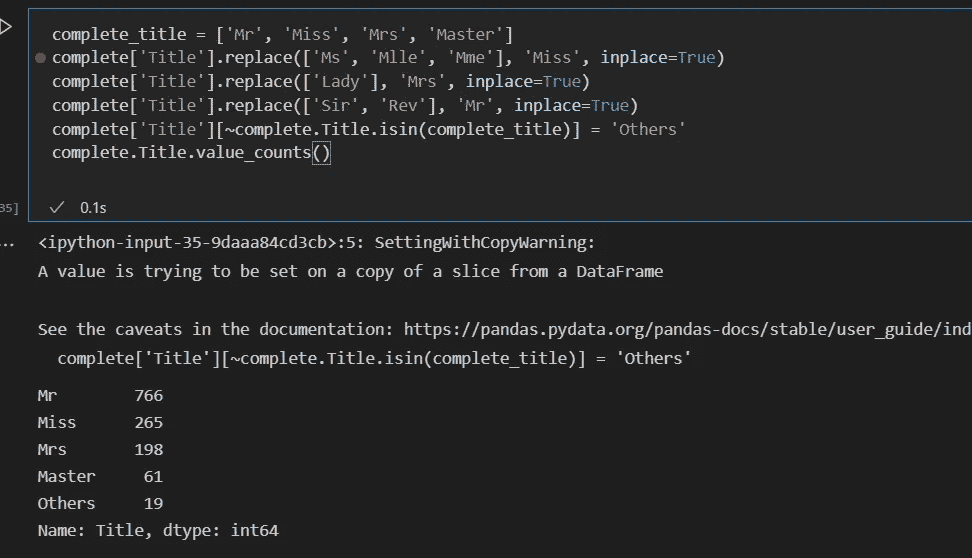

现在我们用 boxplot 来分解一下头衔和年龄的关系。

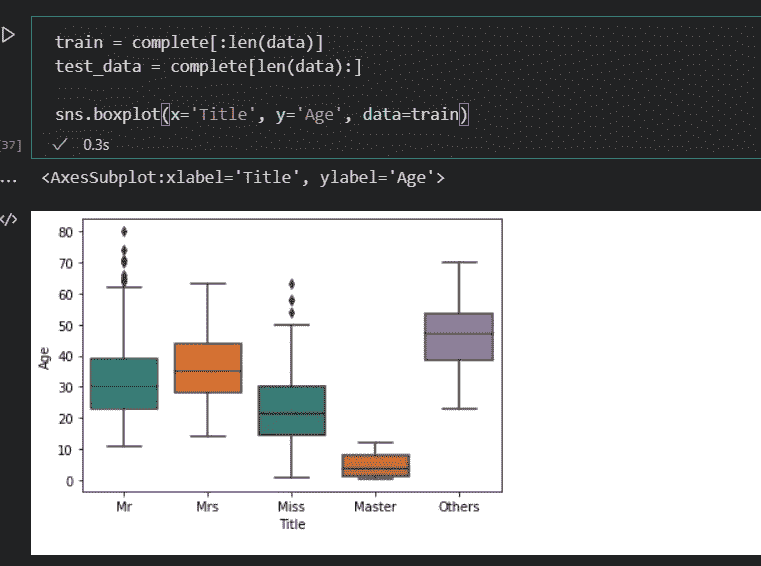

现在，我们通过查找每个标题中的年龄中位数来输入缺失的年龄值。

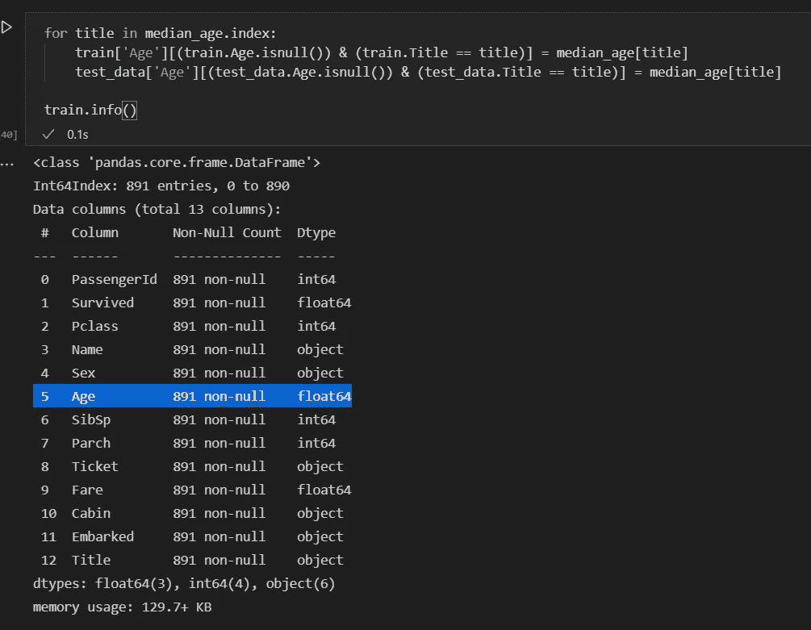

现在我们对变量“已装船”和“票价”做同样的处理，但我们只需使用 fillna()并分别估算众数和中位数，因为只有 1-2 个缺失值。

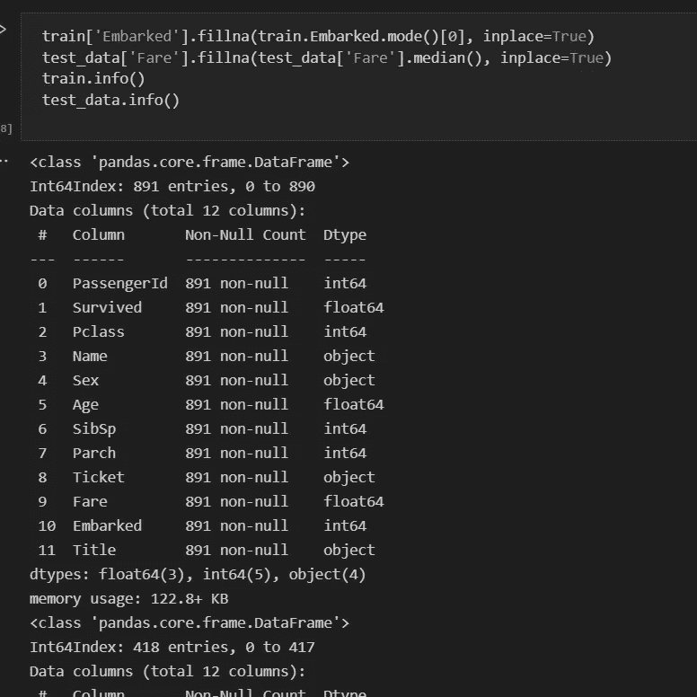

## 预测模型

在此方法中，我们将创建一个预测模型，该模型预测将替换缺失值的值。为此，我们需要将数据集分成两部分，一部分没有缺失值，另一部分有缺失值。那么第一数据集将成为训练数据集，第二数据集将成为测试数据集。

## KNN 插补

在 K 最近邻法中，使用给定数量的与缺失值的属性最相似的属性来估算属性的缺失值。使用距离函数确定两个属性的相似性。

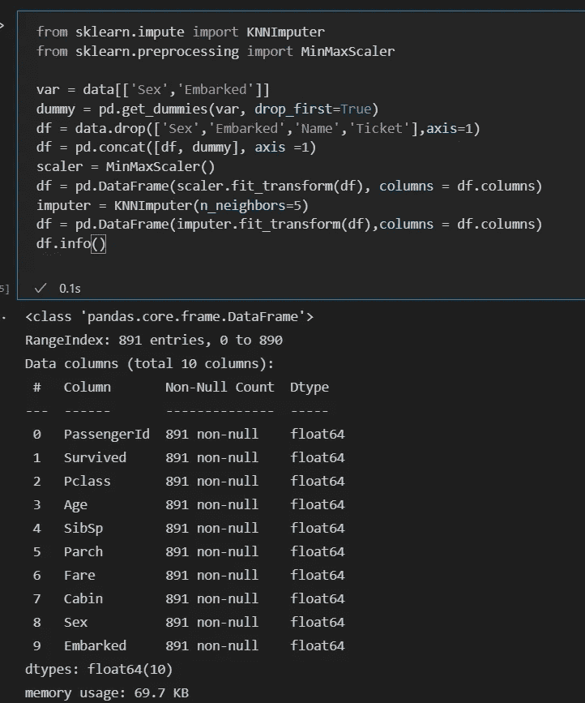

我们使用 Sklearn 的 KNNImputer 来填充缺失的值。

我们看到了探索性数据分析中的各个步骤，以及如何使用该分析来处理数据集中的缺失值，以改进我们的机器学习模型。在下一部分中，我们将学习更多关于 EDA 和异常值检测和处理的知识。

参考，

 [## 详细教授数据探索的完整教程

### 关于数据探索(EDA)的完整教程，我们涵盖了数据探索的几个方面，包括缺失值…

www.analyticsvidhya.com](https://www.analyticsvidhya.com/blog/2016/01/guide-data-exploration/)