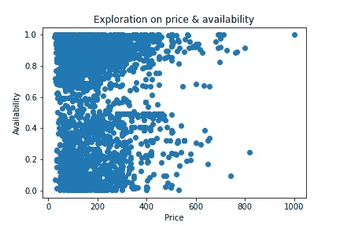
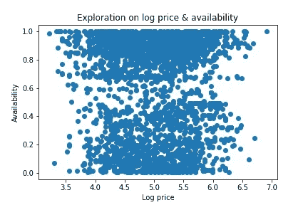
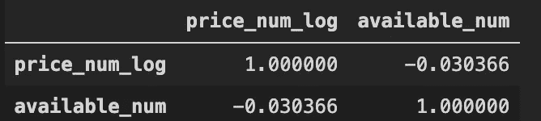
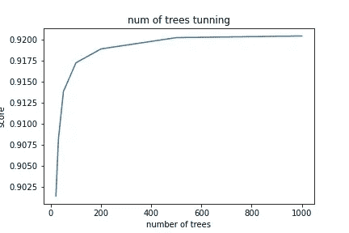
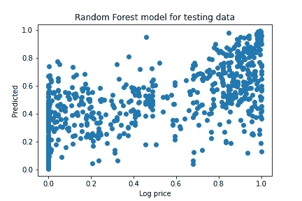
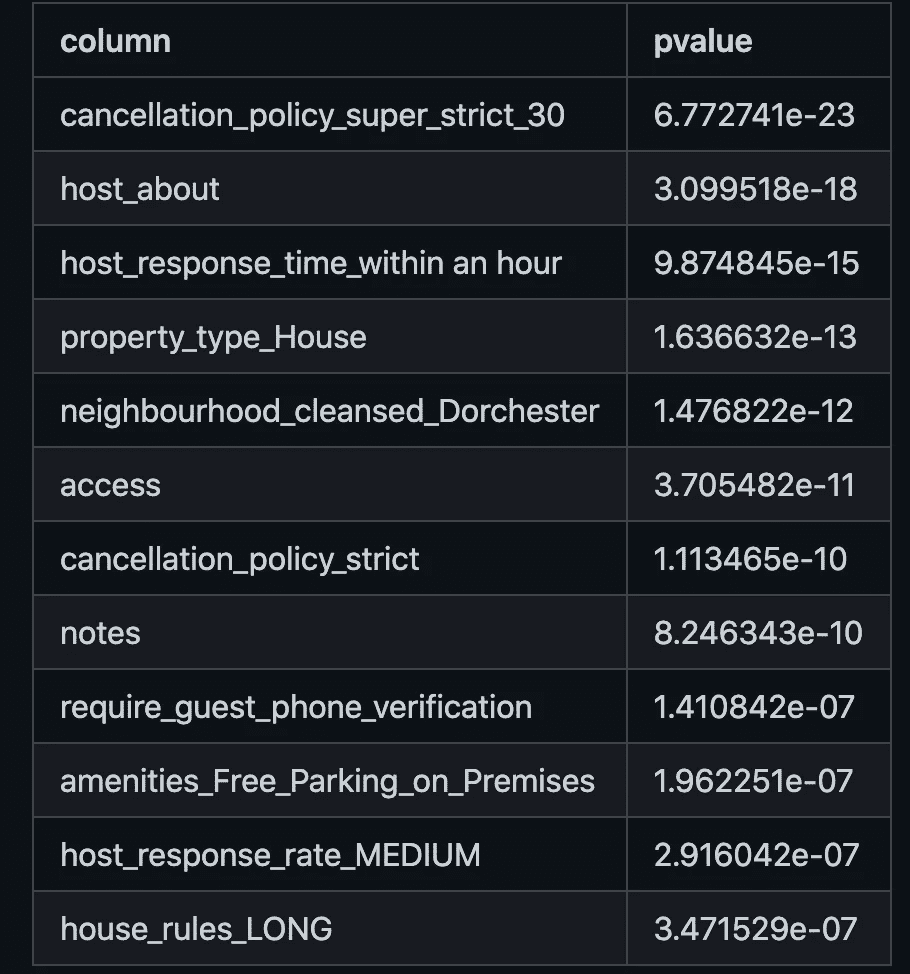
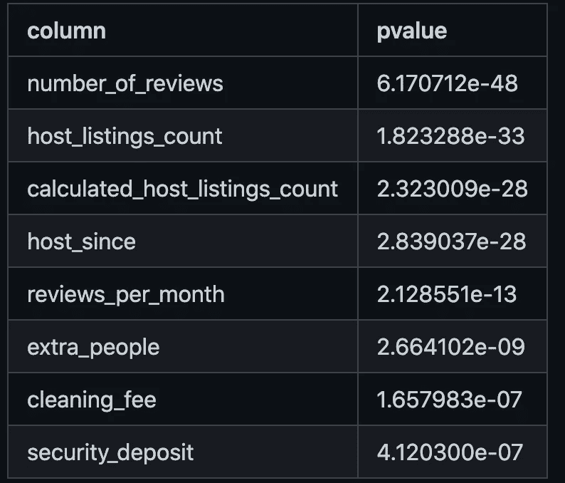
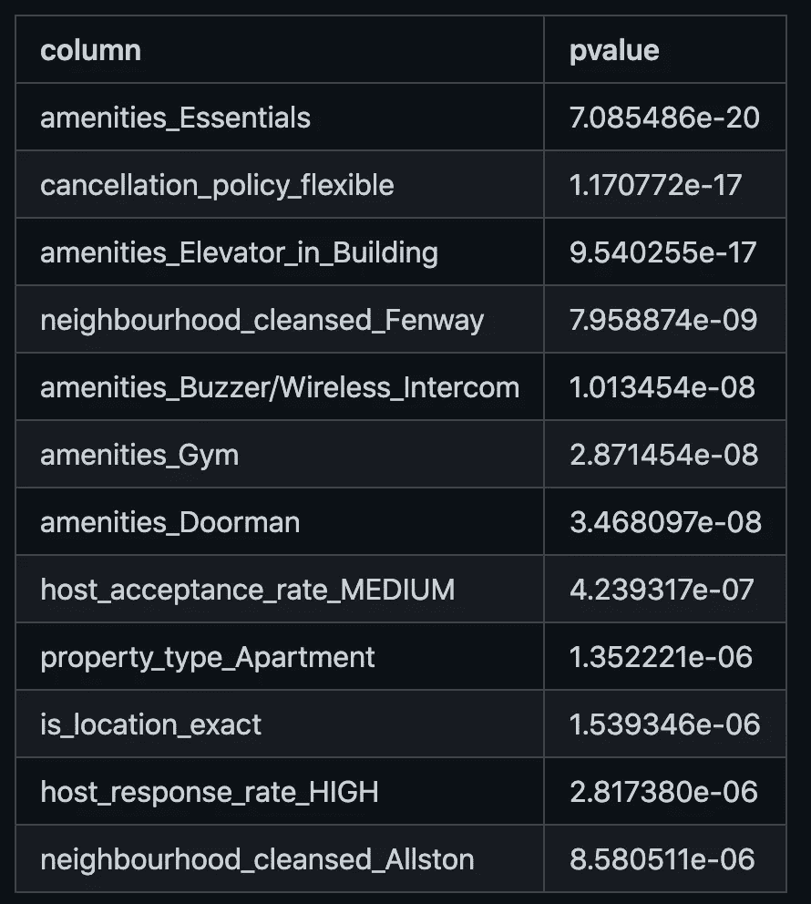
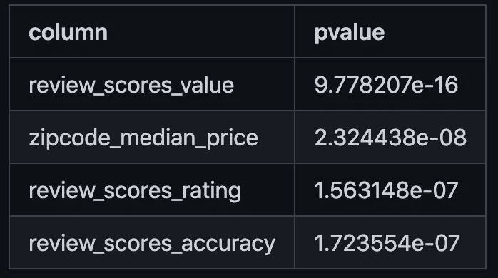

# 波士顿 Airbnb 可用性的探索性数据分析

> 原文：<https://medium.com/geekculture/exploratory-data-analysis-on-airbnb-availability-in-boston-500fb4b401c5?source=collection_archive---------37----------------------->

最近我在研究经济，发现书中有一句名言:“教一只鹦鹉‘供给和需求’，你就有了一个经济学家。”在经济中，一切都与供给和需求有关。所以当我拿到波士顿 Airbnb 的数据集的时候，我很好奇我能不能根据数据集画一条供需曲线。

**本文旨在探讨和回答以下问题:**

*   Airbnb 房价和房源有关系吗？
*   有没有可能使用 Airbnb 数据集中的信息建立一个模型来预测可用性？
*   空置房和热门房最大的区别是什么？

**数据集:**

[从 Kaggle 下载的 Airbnb 的日历和房源数据集](https://www.kaggle.com/airbnb/boston?select=listings.csv)。

**清理数据:**

listing.csv 数据集只有四列，数据是干净的。listing.csv 数据集有 95 列，具有大量冗余特征和缺失值，*即* scrape_id、host_id、country_code、host_url 等。那些不必要的列被直接删除，这样我就可以只关注与可用性相关的信息。

此外，有些值的格式不正确，比如货币就像一个字符串$XX，所以需要进行转换。

最后但同样重要的是，我使用 zipcode 来表示物业的位置，并计算每个 zipcode(区域)的中值价格(因为价格有离群值),并尝试归一化每个物业的价格，以消除位置因素。

**探索:**

首先，绘制日历数据集的价格和可用性表明，价格和可用性之间的关系不是线性的，我们不能说一个属性越贵，预订它的人就越少。相反，我们仍然看到一些价格超过 600 美元/晚的酒店只有不到 30%的空房。

如果使用价格的对数 x 轴，我们可以看得更清楚。此外，这些点沿 y 轴明显分为两组，很少点位于 0.5 可用性附近。

相关表还显示，价格和可获得性不是强线性相关的。

**型号:**

随机森林回归是对大量分类列进行预测的常用方法。使用合适的 n _ 估计量 500，训练了随机森林模型，并且我们在测试数据集上得到 0.42 的分数。

**假设检验:**

由于数据集的价格被分成两个组，因此可以在每列上的那些空置物业和热门物业之间进行假设检验，以查看哪一个更有把握说它们在两组中是不同的。

这表明**严格的取消政策，对客人电话验证的要求，长屋规则**在空置物业中明显较高。而那些相对**老**(高 host_since)、由 **superhost** (高 host_listing_count)、以及**高额外费用**(高额外 _ 人、高清洁 _ 费、高安全 _ 押金)的物业就不那么受欢迎了。

categorical columns appears more frequently in high-availability properties

numeric columns appears more frequently in high-availability properties

相反，**灵活的取消政策，邻近芬威/奥尔斯顿**可能对受欢迎的酒店至关重要，它们在价值、评级和准确性审核方面的得分也明显较高。此外，**该区域**的平均价格也高于热门房产(就像**芬威/奥尔斯顿/米申山/唐人街**)，这可能表明即使在城市地区租赁房产的价格较高，那里的可用性仍然高于农村地区。

categorical columns appears more frequently in low-availability properties

numeric columns appears more frequently in low-availability properties

**概要:**

*   在这个数据集中，价格与可用性几乎没有正相关关系。对于包括芬威/奥斯顿/米申山/唐人街在内的一些地区，即使那里的租金很高，也比其他地区更难找到可用的房产。
*   我们得到了**一个使用随机森林回归预测 Airbnb 可用性的模型**，得分为 0.42。
*   使用假设检验方法，一些因素在高可用性组和低可用性组之间存在显著差异，如**房屋规则的文本长度、取消政策和额外费用**。

**限制:**

*   可用性可能会受到季节因素的影响，为了模型的简单性，没有将其考虑在内。
*   应该有许多彼此密切相关的列，为了更好地了解租赁物业的供应和需求，我们可能需要找到一种方法来标准化同一物业的价格或价格变化，并深入研究其与可用性的关系。

**使用的代码可以在这里找到:**[https://github.com/cenkai88/data-exploration-Airbnb-Boston](https://github.com/cenkai88/data-exploration-Airbnb-Boston)