# 基于 Python 的气象数据探索性分析

> 原文：<https://medium.com/geekculture/exploratory-data-analysis-on-meteorological-data-using-python-e56dbeb67e23?source=collection_archive---------3----------------------->

探索性数据分析是一种分析数据、总结数据主要特征和更好地理解数据集的方法。它还允许我们快速解释数据，并调整不同的变量以查看它们的效果。获得一个完美的 EDA 的三个主要步骤是从一个授权的源提取数据、清洗和处理数据、以及对清洗后的数据集执行数据可视化。

一种更容易在网上找到的数据是天气数据。许多站点提供许多气象参数的历史数据，如压力、温度、湿度、风速、能见度等。

我们将分析天气数据集。你可以从提到的链接([https://www.kaggle.com/muthuj7/weather-dataset](https://www.kaggle.com/muthuj7/weather-dataset))中找到数据集。我们的主要目标是执行数据清理、数据标准化、测试假设，并得出适当的见解。让我们开始吧！

**1。导入必要的库**

Libraries imported — Pandas, NumPy, Matplotlib, Seaborn

**2。读取数据集**

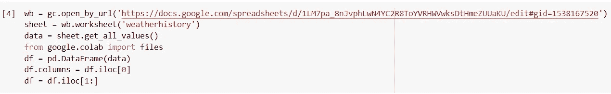

Reading the dataset

这里我显示了数据集的前五行:

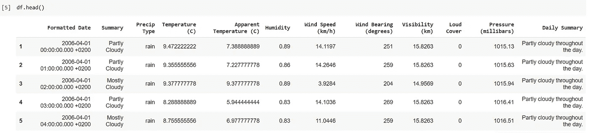

**3。清理和处理数据集**

我们首先将所有数值数据从 object 数据类型转换为 float/int 数据类型:

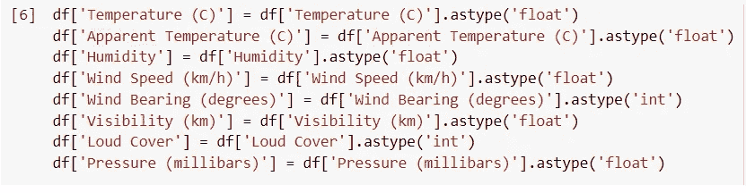

然后我们，删除所有的空值:

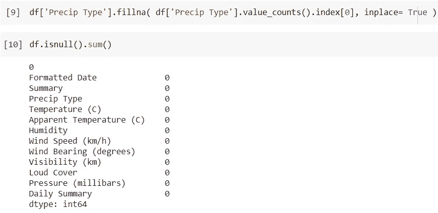

以下是代表相同情况的热图:

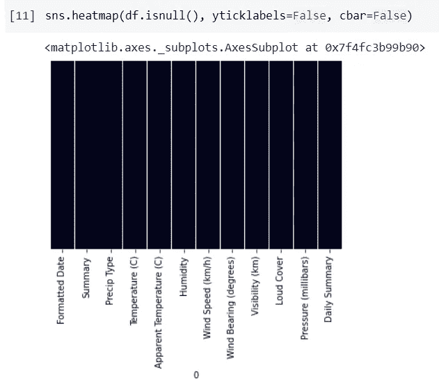

我们还将日期转换成标准的日期时间格式:

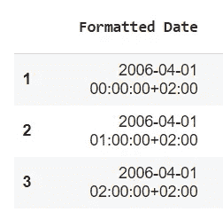

in Datetime format

**4。执行探索性数据分析**

a.从“摘要”栏中分析最频繁的天气

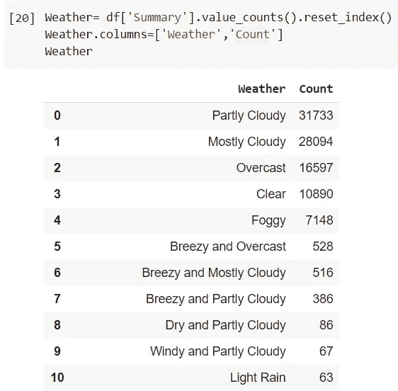

Most Frequent Weather Type

代表上述频率的线图如下所示。我们可以观察到最常见的天气是“部分多云”

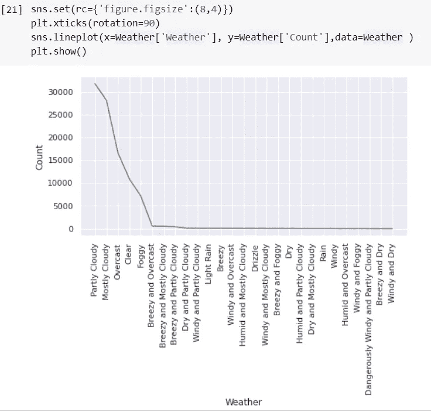

b.天气温度；天气湿度；天气 v/s 压力

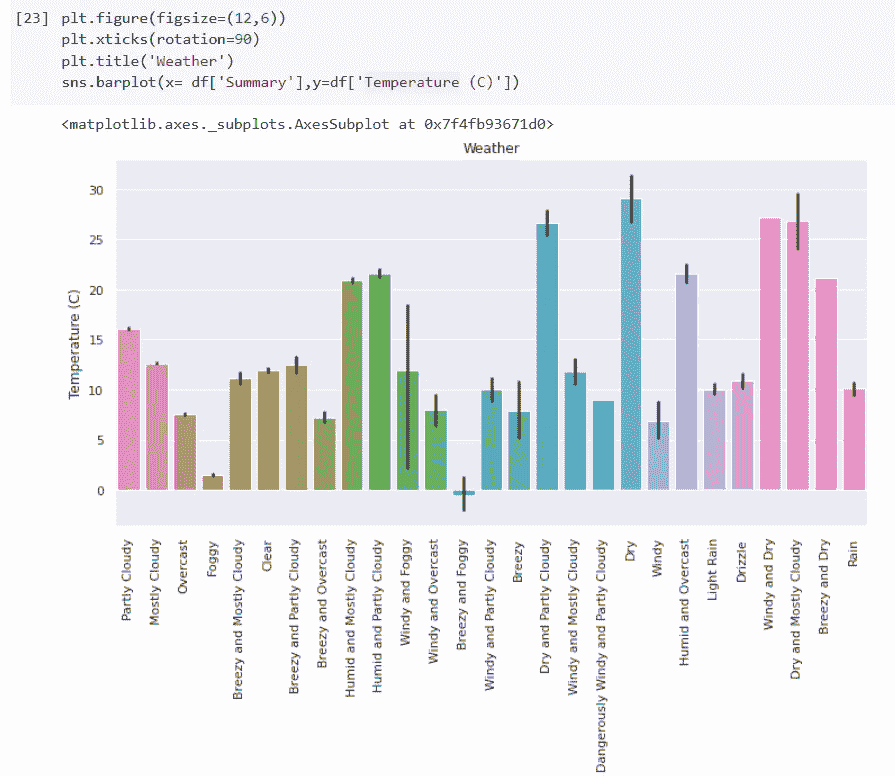

Weather V/S Temperature

从上图中我们可以看出，最高温度出现在天气“干燥”的时候。

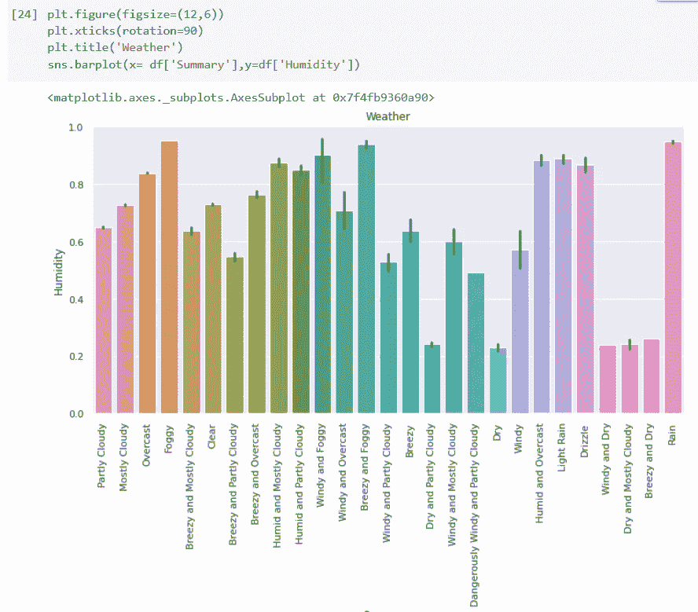

Weather V/S Humidity

上图说明了最大湿度适用于各种天气类型— *多雾、* *微风、多雾和下雨。*

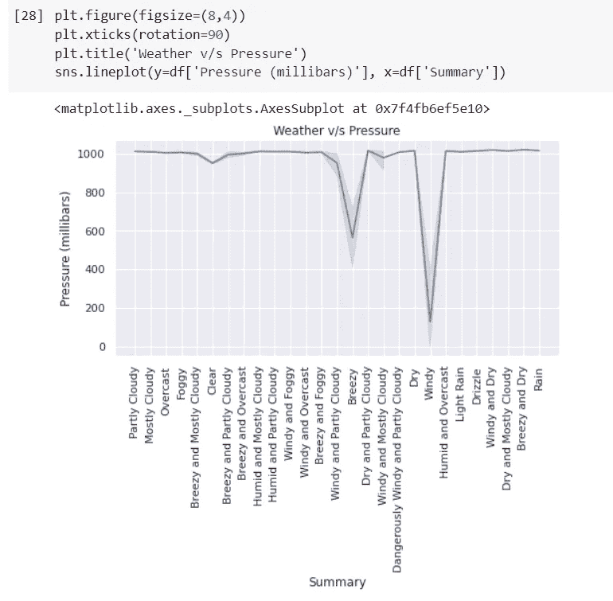

Weather V/S Pressure

**5。仪表板**

仪表板是一种图形用户界面，通常提供与特定目标或业务流程相关的关键绩效指标的概览视图。在其他用法中，“仪表板”是“进度报告”或“报表”的另一个名称，被认为是数据可视化的一种形式。

a.安装必要的软件包

Installing Pywedge Package

b.导入包

c.创建仪表板

d.散点图和饼图

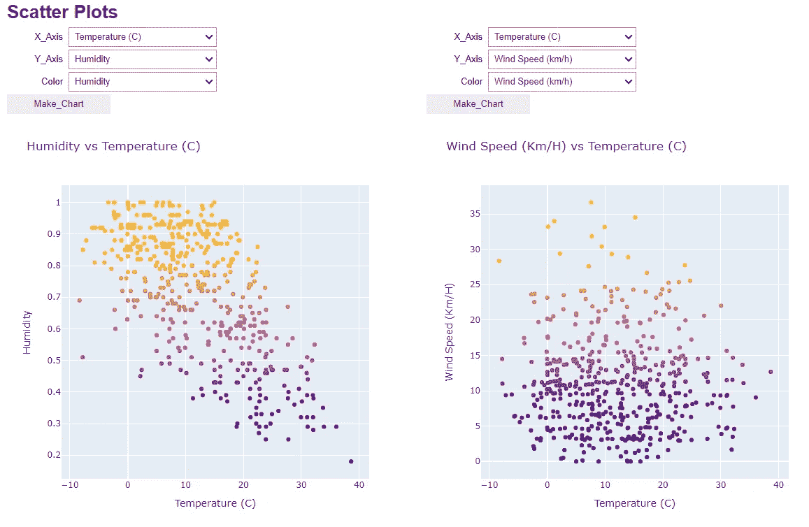

Scatter Plot Dashboard

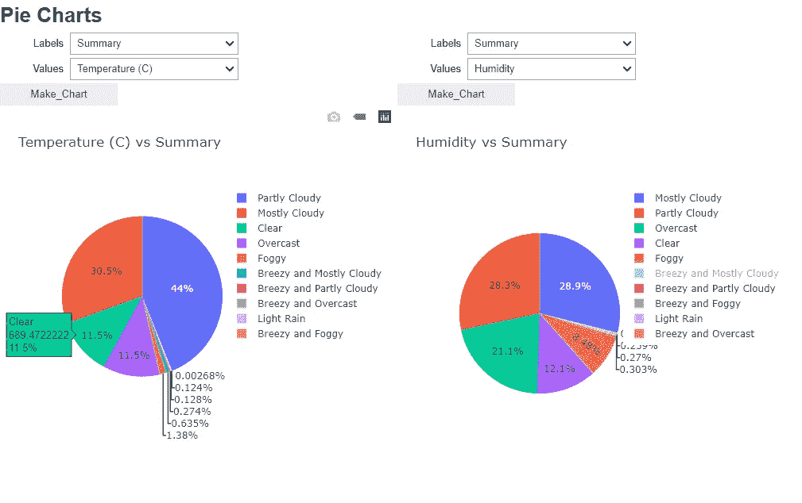

Pie Chart Dashboard

e.条形图

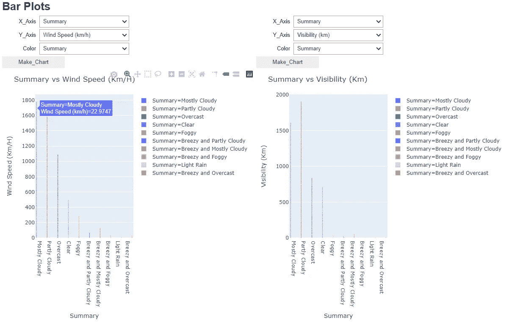

Bar Plot Dashboard

f.相关图

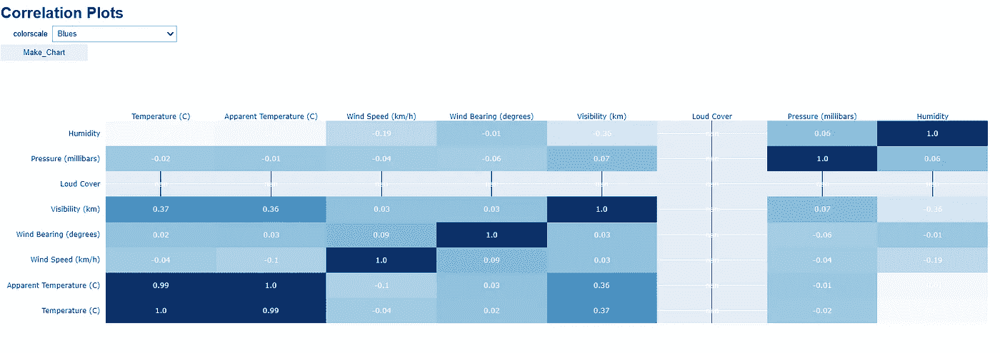

Correlation Plot

使用仪表板可以创建许多其他图，如*小提琴图、箱线图、分布图和直方图。*

**6。结论**

全球变暖增加了某些极端天气的频率和强度。通过分析，我们收集了过去 10 年的有用见解。例如，变暖导致暴雨中的降雨量增加。两次降雨之间的干旱期也更长。这一点，加上更高的温度导致更多的蒸发。潮湿的地方通常变得更加潮湿，而干燥的地方变得更加干燥。