# 使用 Pandas 进行探索性数据分析

> 原文：<https://medium.com/geekculture/exploratory-data-analysis-using-pandas-6e7162d662f1?source=collection_archive---------8----------------------->

# 熊猫概述

Pandas 是使用最多的库之一，它为数据分析提供了各种选项。数据科学家主要处理表格格式的数据，或者我们可以称之为 2D 格式。大多数常见的数据源格式都是。csv，。xlsx、SQL 表等。Pandas 非常有助于加载这些格式的数据，并对它们进行分析和处理。类 SQL 查询可以用来分析和处理数据，因此它是数据科学家中的一个著名的库。Pandas 还与 matplotlib 和 seaborn 等库一起用于数据可视化。

Pandas 中使用的主要数据结构是数据帧。还有一种数据结构叫做 Series。这两者的主要区别在于，series 是一种类似 1D 数组的数据结构，而 Data frame 表示 2D 表格数据，这与包含列和行的 SQL 表相同。数据帧常用于表示来自各种来源的数据。

# 导入所需的库

```
import pandas as pd
import numpy as np import matplotlib.pyplot as plt
*# pip install seaborn* 
import seaborn as sns

%config InlineBackend.figure_format = 'retina'
```

# 语法-从 CSV 加载数据

```
df = pd.read_csv(‘weather.csv’)
df.head()
```

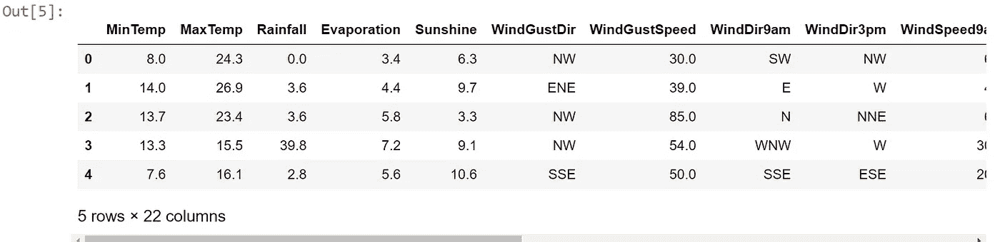

Fig: Output of the code

**得到数据的形状**

```
print(df.shape)
```

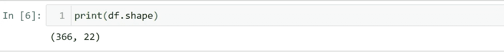

Fig: Shape of data

从上面的输出中，我们可以看到数据集包含 366 行和 22 列

**获取栏目列表**

```
print(df.columns)
```

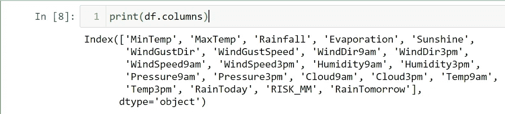

Fig: Get all columns in the dataset

我们可以从上面的代码中得到列表中的所有列名。

**获取关于数据集的信息**

```
print(df.info())
```

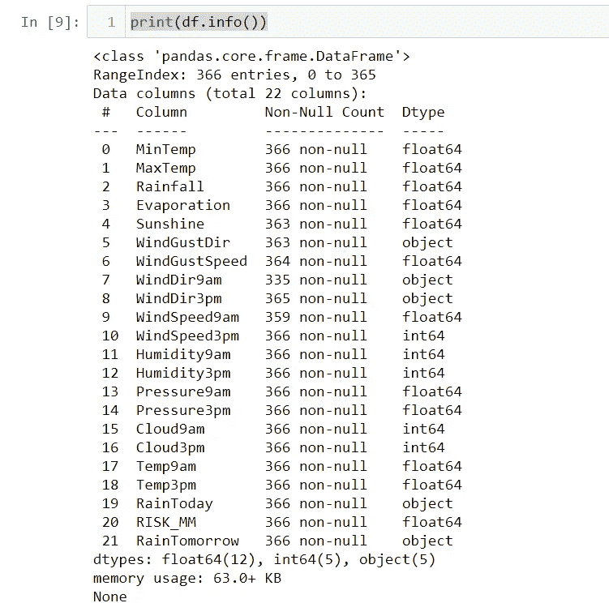

Fig: Info of a dataset

我们可以看到数据集的基本信息，如数据类型、每列的非空值计数、内存使用情况等。我们还可以看到 12 列是浮点类型，5 列是整数类型，另外 5 列是对象类型。我们还可以看到列中缺少的值。总行数是 366，但是对于列 Sunshine，363 个值不为空，这意味着 3 个值为空。

**更改列的数据类型**

```
df['MinTemp'] = df['MinTemp'].astype('int64')
```

我们将 MinTemp 列中的所有值转换为整数值。

**基本统计**

```
df.describe()
```

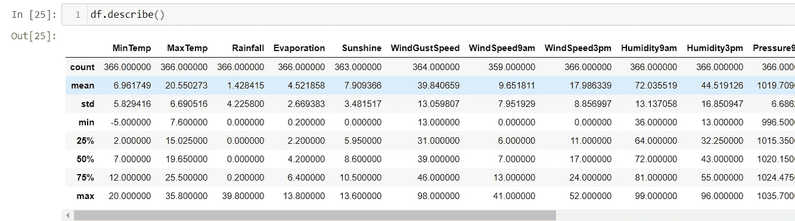

Fig: Basic Statistics using describe

我们可以用描述的方法得到每个数值列的基本统计特征。默认情况下，只有像 integer 和 float 这样的数字列可以进行统计分析。如果我们想分析非数字列，那么我们必须手动指定如下所示。使用所述方法可以容易地计算平均值、中值、标准偏差、范围、百分位数。

**手动描述方法**

```
df.describe(include=['object', 'object'])
```

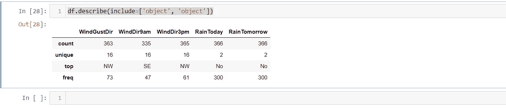

Fig: Describe method Manual

**查找列中不同值的计数**

```
df['WindDir9am'].value_counts()
```

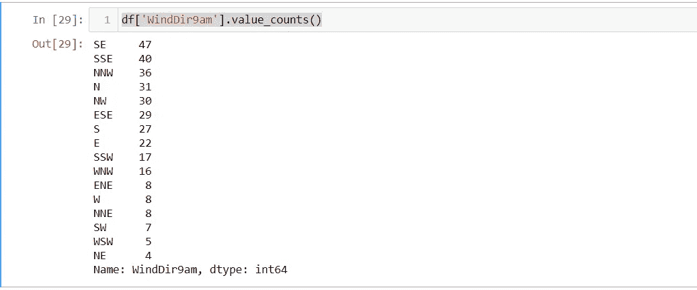

我们可以在 WindDir9am 列中看到每个不同值的计数。此外，还会显示列名和数据类型。

**查找列中不同值的百分比**

```
df['WindDir9am'].value_counts(normalize=True)
```

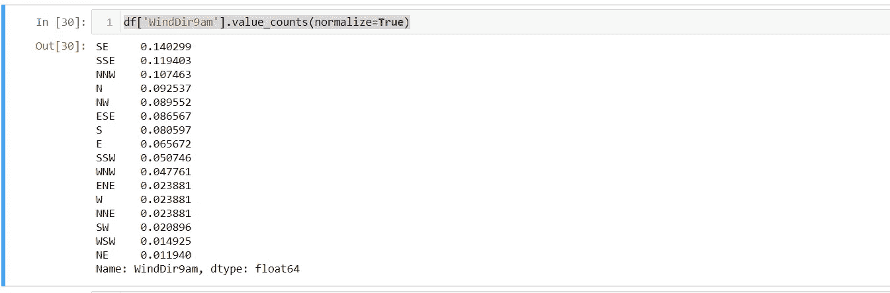

value_counts 方法中的 normalize= True 选项计算每个值占总数据的百分比。

**按单列排序**

```
df.sort_values(by='**Rainfall**', ascending=False).head()
```

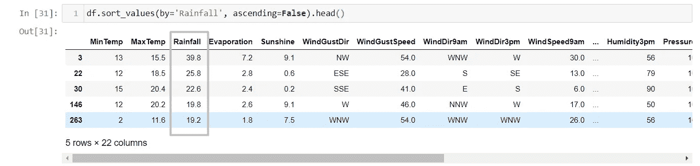

Fig: Sorting by RainFall descending

我们可以看到数据帧是按降雨量降序排列的，因为升序提供了错误值。默认情况下，排序是升序的。

**按多列排序**

```
df.sort_values(by=['Rainfall','Sunshine'], ascending=[False,True]).head()
```

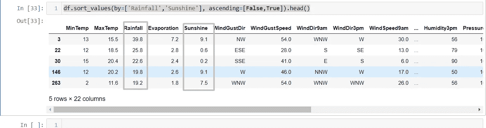

Fig: Sorting by multiple columns

我们可以看到数据框已经按两列排序，降雨量下降，日照上升。

**用于数据检索的数据帧索引**

数据框索引可以通过多种方式完成:

1.  **数据帧['列名']**

找出日照数据在数据集中的比例

```
df['Sunshine'].mean()
```

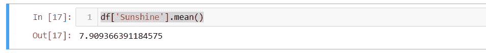

Fig: Mean of one column data

此外，我们可以在索引数据框时使用该条件，如下所示:

```
df[df['Sunshine'] > 5].mean()
```

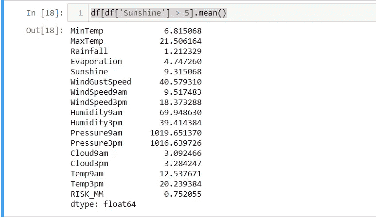

Fig: Average of all numerical feature based on the condition supplied

在上面的截图中，我们可以看到所有特征的平均值是计算出来的，其对应的日照值大于 5。

我们还可以找到如下各自的特征:

```
df[df['Sunshine'] > 5]['Humidity9am'].mean()
```

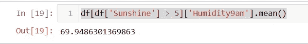

Fig: Single Column mean

这表示上午 9 点日照大于 5 时湿度的平均值。

我们也可以用同样的方法计算许多聚合函数，如 max、min、count、sum 等。

**2。DataFrame.loc 或 Dataframe.iloc**

第一种情况:获取从 0 到 3 索引的行的值(4 行),以及从 MinTemp 到 Evaporation 的列的值(这也是包含的)

```
df.loc[0:3, 'MinTemp':'Evaporation']
```

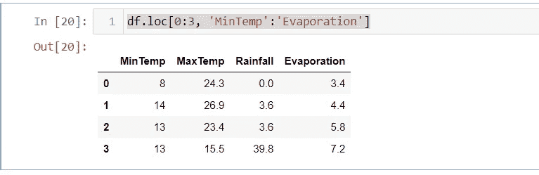

Fig: DataFrame Indexing using loc

第二种情况:获取前四列中前四行的值。在这种情况下，最大值不包含类似于 python 中使用的切片。

```
df.iloc[0:4, 0:4]
```

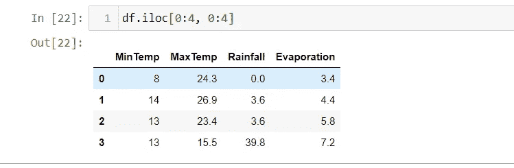

注意:只有列的最后一个索引是排他的，而行的最后一个索引是包含的。

如果我们想获得数据集中的第一行或最后一行，我们可以简单地在代码行下面使用:

```
df[:1]
df[-1:]
```

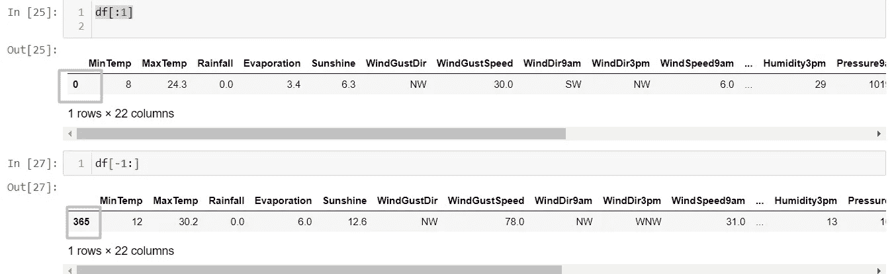

Fig: Get first and the last row in a dataset

**应用功能**

apply function 可用于将函数应用于单元格、列或行。

为了计算 4 个数值列的最大值，我们首先过滤数据集，然后使用如下应用:

```
filtered_df=df.iloc[0:365, 0:4]
filtered_df.apply(np.max)
```

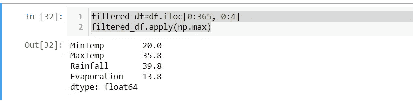

Fig: Max value in 4 columns

**应用函数过滤行**

```
df[df['WindGustDir'].apply(lambda windgustdir: windgustdir == 'NW',1)].head()
```

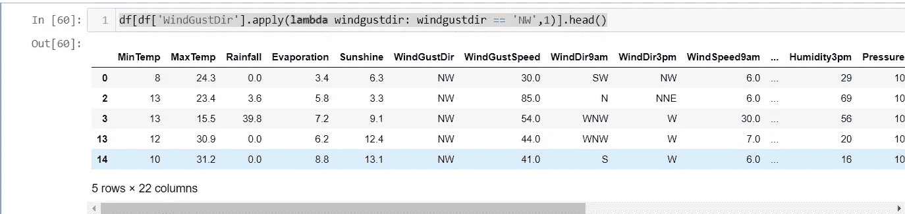

Fig: Filter Dataset using apply

我们使用了 apply 函数和 lambda 函数来过滤整个数据集，以获得在 WindGustDir 中具有 NW 值的数据

**替换列中的值**

要替换数据集中任何列的值，我们可以从 python 中的 map 函数获得帮助，如下所示:

```
d = {'No' : False, 'Yes' : True}
df['RainToday'] = df['RainToday'].map(d)
df.head()
```

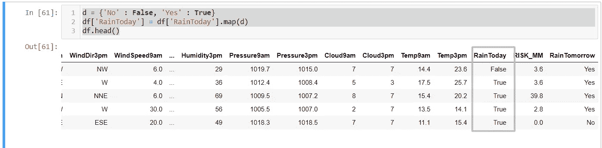

Fig: Replace the value in a column

在上面的转换中，我们将“今天下雨”列中的值从“是/否”替换为“真/假”。

替换该值的另一种方法是使用 replace 函数

```
d = {'No' : False, 'Yes' : True}
df = df.replace({'RainTomorrow': d})
df.head()
```


我们已经将 RainTomorrow 列中的值从是/否替换为真/假。

**分组**

一般表示=**df . group by(by = grouping _ columns)[columns _ to _ show]。函数()**

```
columns_to_show=df.iloc[:,0:6].columns
df.groupby(['WindGustDir'])[columns_to_show].describe(percentiles=[])
```

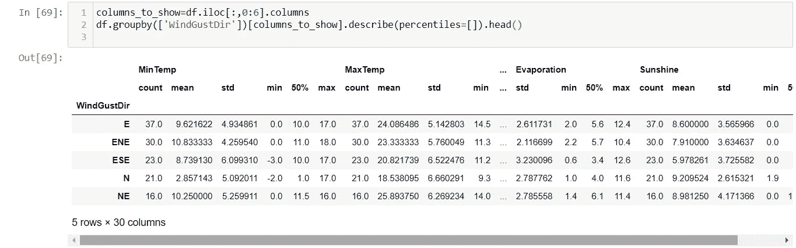

Fig: Group By WindGustDir and Percentiles calculations

在上面的输出中，我们得到了按 WindGustDir 列分组后的所有基本聚合函数。我们可以看到 WindGustDir 列中每个不同值的平均值、计数、标准偏差等。

**汇总数据的列联表**

```
pd.crosstab(df['RainToday'], df['RainTomorrow'])
```

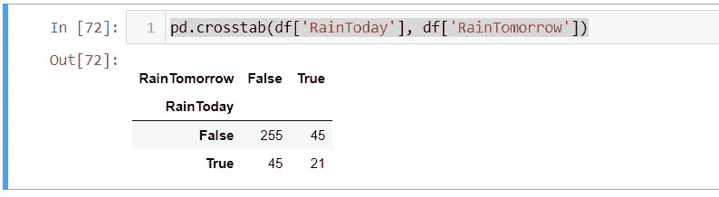

Fig: Contingency Table on two columns

使用 crosstab，我们可以看到两列数据的漂亮呈现。在堆叠的标题中，我们可以看到 RainTomorrow 和 RainToday 都为 False 的行数是 255。

我们还可以在下面的同一个函数中使用 normalize=True 来查看发生率:

```
pd.crosstab(df['RainToday'], df['RainTomorrow'],normalize=True)
```

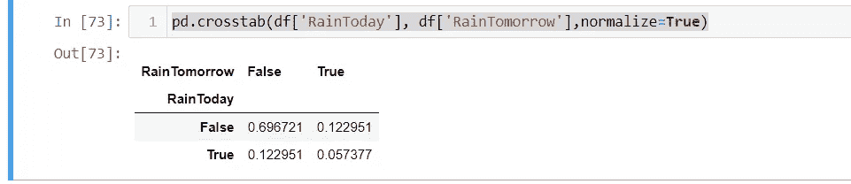

Fig: Contingency Table with Normalize True

**透视表**

```
df.pivot_table(['MinTemp', 'MaxTemp', 'Rainfall', 'Evaporation', 'Sunshine'],
               ['WindGustDir'], aggfunc='mean')
```

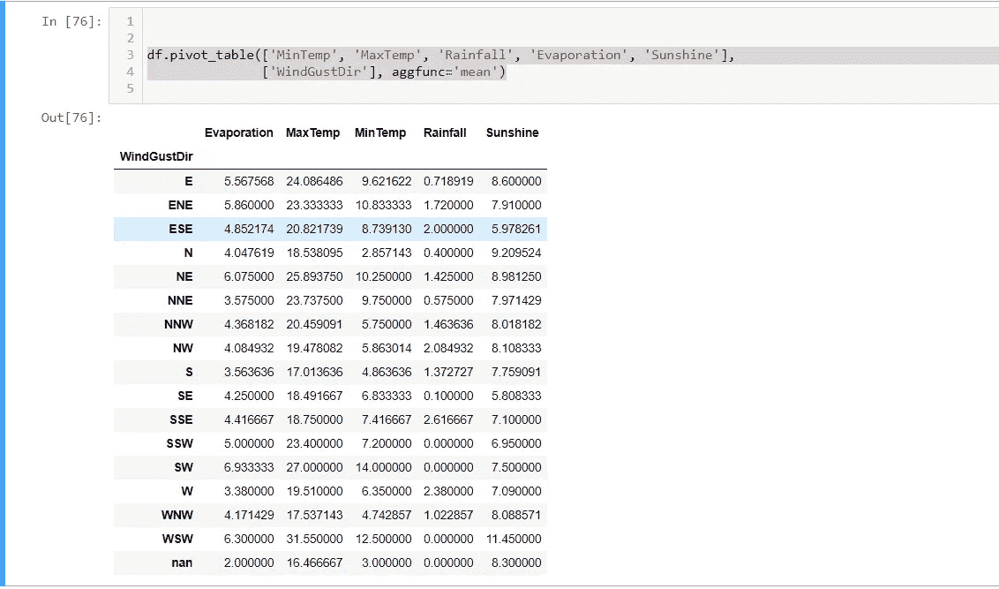

Fig: Pivot Tables with Mean

**数据帧转换**

基于两列计算新值，最后将该值添加到新列中

```
total_pressure = df['Pressure9am'] + df['Pressure3pm']
df.insert(loc=len(df.columns), column='Total Pressure', value=total_pressure)df.head()
```

使用上面的代码，我们在数据集的最后添加了一个新的计算列。

loc 参数是要在其后插入新列的列数，因此我们将该值指定为列的长度，以便在最后一列中添加一个新列。

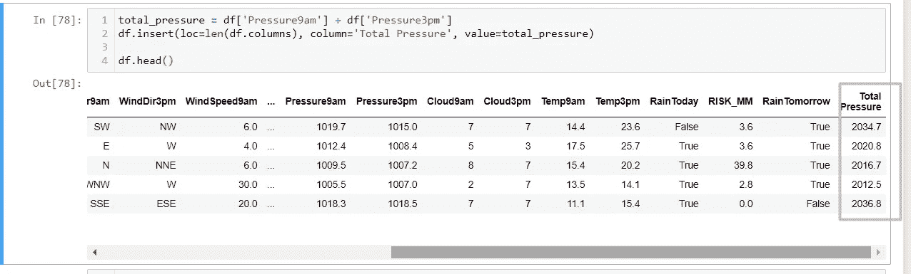

Fig: Adding new column after transformation

简单的方法:

```
df['Total Pressure']=df['Pressure9am'] + df['Pressure3pm']
```

**降柱**

```
df.drop(['Total Pressure'], axis=1, inplace=True)
```

当 inplace 为 True 时，原始数据集发生变化，axis=1 表示我们正在删除该列。

样本数据可视化:

```
sns.countplot(x='RainToday', hue='RainTomorrow', data=df);
```

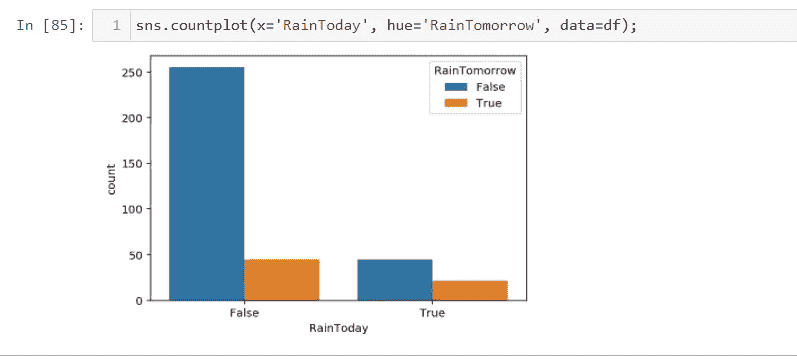

Fig: CountPlot of Two columns

这是我们前面讨论的列联表的可视化表示。

我们可以很容易地观察到，如果今天下雨是假的，那么明天下雨的次数就会很高。

由于 pandas 是数据工程方面的一个丰富的库，所以有很多东西可以探索，但是 Pandas 上面讨论的部分使用频率很高。

在接下来的文章中，将尝试包含基于项目的演示。

完整的 Jupyter 笔记本和数据可以在下面的链接中找到:

【https://github.com/prbndulal/Learning 