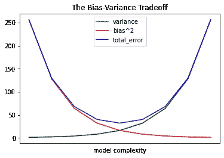
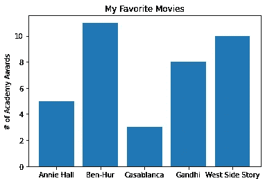
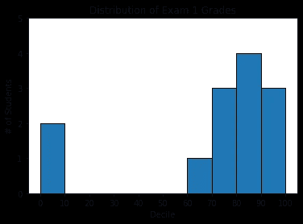
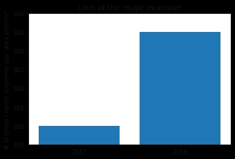
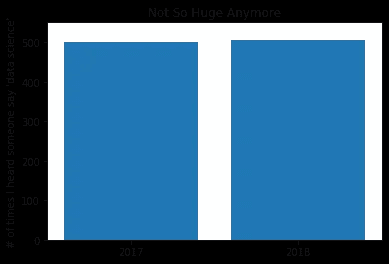
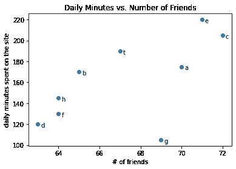
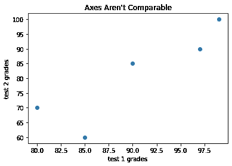
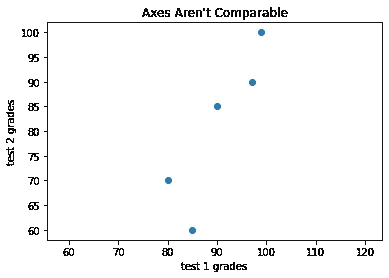

# 使用 Matplotlib 的探索性数据可视化

> 原文：<https://medium.com/geekculture/exploratory-data-visualization-using-matplotlib-ca9f4da4a0c1?source=collection_archive---------7----------------------->

## 数据可视化是嵌入式数据科学家工具箱的重要组成部分。尽管创建一个可视化非常容易，但是产生一个好的可视化却要困难得多。


# 期待什么

本文着重于开发开始探索我们自己的数据和创建有效的可视化所需的技能。数据可视化可以通过各种工具完成，比如 Tableau、Power BI 和 Python。正如我在[上一篇文章](/geekculture/introduction-to-data-analysis-f35c576c75e3)中提到的，数据分析允许分析数据集，以便对信息做出决策，并通过预测所需的结论来帮助增强业务。

在本文中，您将学习如何在 matplotlib 库的帮助下可视化数据，以进一步确定哪些产品需要额外关注，从而提高组织的整体销售额。


D ata 随处可见。您每天都在使用和创建数据，但并非所有数据都是正确的。每当你使用手机、上网查询、用信用卡购物或听音乐时，你都会产生数据。您依靠数据来确定某件事是真是假，但您很少看到原始状态的数据。您可以看到解释数字的行和列是多么困难。因此，您通常使用一种称为数据可视化的方法来更容易地说明数据中的模式和趋势。

# **数据可视化有什么重要的，为什么重要？**

数据可视化是将数据转换成图表等图形表示，以传达数据的意义。然而，虽然这种方法简化了理解数据的过程，但它也可能被用来歪曲事实和歪曲信息。

# Matplotlib

Matploptib 是用于数据可视化的 Python 底层包。如果您想为 web 创建复杂的交互式可视化，这可能不是最好的选择，但对于条形图、折线图和散点图来说，这是很简单的。这个库建立在 NumPy 数组的基础上，包括许多图表，如折线图、条形图、直方图等等。它以编写更多代码为代价提供了很大的灵活性。

让我们开始吧。首先，您将使用 pip 命令来安装这个模块。如果您没有安装 pip，请参考此[https://pip.pypa.io/en/stable/installation/](https://pip.pypa.io/en/stable/installation/)。我将使用 Jupyter 笔记本来使用 matplotlib。

要安装 Matplotlib，请在终端中键入以下命令。

```
pip install matplotlib
```

安装完成后。先从 Matplotlib 和 Jupyter 笔记本开始吧。使用 Matplotlib，您将在 Jupyter Notebook 中创建几个图形。

```
#importing pyplot from matplotlib 
from matplotlib import pyplot as plt
```

这里不需要输入 import pyplot 来导入这个模块，您可以导入它并给它一个昵称，比如 plt，它更短。然后，在下面的代码中，您不会用模块的全名 pyplot 来引用它。相反，使用较短的名称 plt，如下面的代码所示。

Pyplot 是一个带有 MATLAB 风格界面的 Matplotlib 包。Matplotlib 旨在像 MATLAB 一样对用户友好，但具有免费和开源的额外好处。每个 pyplot 函数都以某种方式改变图形，例如创建图形、在图形中绘制区域、在绘制区域中绘制某些线、用标签装饰图形等等。Pyplot 支持以下绘图类型:线形图、直方图、散点图、三维图、图像、等高线和极坐标。

在简单了解了 Matplotlib 和 pyplot 之后，我们来看看如何创建一个简单的情节。

```
# initializing the data with the list of data items, separated by commas, inside the square brackets.# x-axis value
years = [1950, 1960,  1970,  1980, 1990, 2000, 2010]# y-axis value
gdp = [300.2, 543.3, 1075.9, 2862.5, 5979.6, 10289.7, 14958.3]#create a line chart, years on x-axis, gdp on y-axis  plt.plot(years, gdp, color = "green", marker = "o", linestyle = "solid")# add a title 
plt.title("Nominal GDP")# add a label to the y-axis
plt.ylabel("Billions of $")#function to show the plot
plt.show()
```


A simple line chart

## 折线图

正如您已经看到的，您可以使用 plt.plot 制作折线图。这些是显示趋势的好选择，如下图所示。

```
variance = [1,2,4,8,16,32,64,128,256]
bias_squared = [256,128,64,32,16,8,4,2,1]
total_error = [x+y for x, y in zip(variance, bias_squared)]
xs = [i for i, _ in enumerate(variance)]#You can make multiple calls to plt.plot to show multiple series on the same chart
plt.plot(xs, variance, 'g-', label='variance')  #green solid line
plt.plot(xs, bias_squared, 'r-', label='bias^2') #red dot-dashed line
plt.plot(xs, total_error, 'b-', label='total_error')  #blue dotted line#Because you have assigned labels to each series you can get a legend for free (loc =9 means "top center")
plt.legend(loc=9)
plt.xlabel("model complexity")
plt.xticks([])
plt.title("The Bias-Variance Tradeoff")
plt.show()
```



Several line charts with a legend

当存在小的变化时，折线图是更可取的。它用于比较同一时间段内多个组的变化。使用折线图的缺点是，如上图所示，当数据点过多时，它们往往会失去清晰度。

条形图
当你想知道一些数量在一些离散的项目集中如何变化时，条形图是个不错的选择。例如，下图显示了各种电影获得的学术奖项数量:

```
movies = ["Annie Hall", "Ben-Hur", "Casablanca", "Gandhi", "West Side Story"]
num_oscars = [5,11,3,8,10]#plot bars with left x-coordinates [0,1,2,3,4], heights[num_oscars]
plt.bar(range(len(movies)), num_oscars)# add a title
plt.title("My Favorite Movies")#label the y-axis
plt.ylabel("# of Academy Awards")#label x-axis with movie names at bar centers
plt.xticks(range(len(movies)),movies)plt.show()
```



A simple bar chart

条形图也是绘制分时段数值直方图的好选择，如下所示:

```
from collections import Counter
grades = [83, 95,91, 87, 70, 0, 85, 82, 100, 67, 73,77,0]#Bucket grade by decile, but put 100 in with the 90s
histogram = Counter(min(grade//10*10,90) for grade in grades)
plt.bar([x+5 for x in histogram.keys()],
       histogram.values(),
       10,
       edgecolor=(0,0,0))
plt.axis([-5, 105, 0 ,5])
plt.xticks([10*i for i in range(11)])
plt.xlabel("Decile")
plt.ylabel("# of Students")
plt.title("Distribution of Exam 1 Grades")
plt.show()
```



Using a bar chart for a histogram

plt.bar 的第三个参数指定条形宽度。这里我们选择宽度为 10，以填充整个十分位数。我们还将条形向右移动了 5，例如，“10”条形(对应于十分位数 10–20)的中心在 15，因此占据了正确的范围。我们还为每个条添加了黑色边框，使它们在视觉上与众不同。对 plt.axis 的调用表明我们希望 x 轴的范围从–5 到 105(只是为了在左右留出一点空间)，y 轴的范围应该从 0 到 5。而对 plt.xticks 的调用将 x 轴标签放在 0，10，20，…，100。

使用 plt.axis 时要明智。创建条形图时，y 轴不从 0 开始被认为是不好的形式，因为这很容易误导人们。

```
mentions = [500, 505]
years = [2017, 2018]
plt.bar(years, mentions, 0.8)
plt.xticks(years)
plt.ylabel("# of times I heard someone say 'data science'")# if you dont do this, matplotlib will label the x-axis 0.1 and then add a +2.013e3 off in the corner (bad matplotlib)
plt.ticklabel_format(useOffset= False)# misleading y-axis only shows the part above 500
plt.axis([2016.5, 2018.5, 499, 506])
plt.title("Look at the 'Huge' Increase!")
plt.show()
```



A chart with a misleading y-axis

在下图中，你使用了更合理的轴，它看起来不那么令人印象深刻:

```
# Below chart you can see you have used more sensible axes, and its looks far less impressive:mentions = [500, 505]
years = [2017, 2018]
plt.bar(years, mentions, 0.8)
plt.xticks(years)
plt.ylabel("# of times I heard someone say 'data science'")# if you dont do this, matplotlib will label the x-axis 0.1 and then add a +2.013e3 off in the corner (bad matplotlib)
plt.ticklabel_format(useOffset= False)#######
plt.axis([2016.5, 2018.5, 0, 550])
plt.title("Not So Huge Anymore")
plt.show()
```



The same chart with a non-misleading y-axis

使用条形图的缺点是，它通常需要额外的书面或视觉形式的解释，很容易被操纵，给人错误的印象。

## 散点图

当您希望可视化两个成对数据集之间的关系时，散点图是一个不错的选择。

下面的例子说明了用户的朋友数量和他们每天在网站上花费的时间之间的关系:

```
friends = [70, 65, 72, 63, 71, 64, 69, 64, 67]
minutes = [175, 170, 205, 120, 220, 130, 105, 145, 190]
labels = ['a','b','c','d','e','f','g','h','t']plt.scatter(friends, minutes)#label each point
for label, friend_count, minute_count in zip(labels, friends, minutes):
    plt.annotate(label,
                 xy=(friend_count, minute_count),
                 xytext=(5, -5),
                 textcoords='offset points')
plt.title("Daily Minutes vs. Number of Friends")
plt.xlabel("# of friends")
plt.ylabel("daily minutes spent on the site")
plt.show()
```



A scatterplot of friends and time on the site

注意:如果您正在分散可比较的变量，如果您让 matplotlib 选择如下所示的比例，您可能会得到一个误导的图片:

```
test_1_grades = [99, 90, 85, 97, 80]
test_2_grades = [100, 85, 60, 90, 70]plt.scatter(test_1_grades, test_2_grades)
plt.title("Axes Aren't Comparable")
plt.xlabel("test 1 grades")
plt.ylabel("test 2 grades")
plt.show()
```



A scatterplot with uncomparable axes

下面的图显示了当你在代码中加入新的一行时更精确的变化。

```
test_1_grades = [99, 90, 85, 97, 80]
test_2_grades = [100, 85, 60, 90, 70]plt.scatter(test_1_grades, test_2_grades)
plt.title("Axes Aren't Comparable")
plt.xlabel("test 1 grades")
plt.ylabel("test 2 grades")# if you include a call to plt.axis("equal") it will provide more accurate shows that most of the variation occurs on test 2.plt.axis("equal")
```



The same scatterplot with equal axes

使用散点图的缺点是它不能给你确切的相关程度。此外，它没有显示两个变量之间关系的定量测量。

如果你们对阅读机器学习应用如何变革医疗保健行业感兴趣，[点击这里](/geekculture/machine-learning-applications-in-biomedical-science-1458ca6e7e38)。

谢谢你读了这个故事，再见。如果您对此有任何想法、反馈或建议，请随时发表评论！

# 参考

[](https://www.oreilly.com/library/view/data-science-from/9781492041122/) [## 从头开始的数据科学，第二版

### 数据科学库、框架、模块和工具包非常适合做数据科学，但它们也是一种很好的方式…

www.oreilly.com](https://www.oreilly.com/library/view/data-science-from/9781492041122/) [](https://matplotlib.org/stable/gallery/index.html) [## 示例- Matplotlib 3.5.2 文档

### 本页包含示例图。点击任何图像查看完整的图像和源代码。有关更长的教程，请参阅…

matplotlib.org](https://matplotlib.org/stable/gallery/index.html) [](http://seaborn.pydata.org/) [## Seaborn:统计数据可视化——seaborn 0 . 11 . 2 文档

### Seaborn 是一个基于 matplotlib 的 Python 数据可视化库。它为绘图提供了一个高级接口…

seaborn.pydata.org](http://seaborn.pydata.org/) [](https://altair-viz.github.io/) [## Altair:Python-Altair 4 . 2 . 0 文档中的声明性可视化

### 有了 Altair，你可以花更多的时间去理解你的数据及其意义。Altair 的 API 简单、友好，并且…

牛郎星-即 github.io](https://altair-viz.github.io/) [](https://docs.bokeh.org/en/latest/) [## 散景文档

### Bokeh 是一个 Python 库，用于为现代 web 浏览器创建交互式可视化。它帮助你建立美丽的…

docs.bokeh.org](https://docs.bokeh.org/en/latest/)