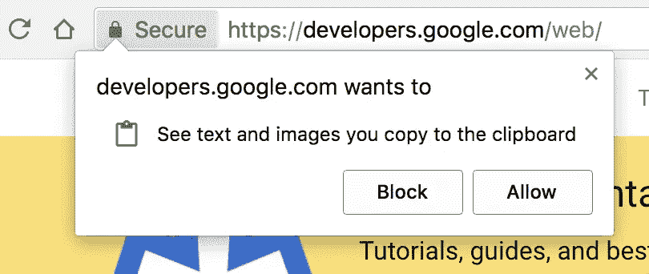

# 探索 JavaScript 中的剪贴板操作

> 原文：<https://medium.com/geekculture/explore-clipboard-operation-in-javascript-c6399619c0ac?source=collection_archive---------4----------------------->

## 在 JavaScript 中剪切、复制和粘贴


Photo by [Alex Green](https://www.pexels.com/@alex-green?utm_content=attributionCopyText&utm_medium=referral&utm_source=pexels) from [Pexels](https://www.pexels.com/photo/crop-interviewer-writing-in-notepad-and-talking-to-job-seeker-5699480/?utm_content=attributionCopyText&utm_medium=referral&utm_source=pexels)

浏览器允许 JavaScript 脚本读写剪贴板，并自动复制或粘贴内容。一般来说，脚本不应该修改用户的剪贴板，以免不符合用户的期望。不过有时候这样做也可以很方便，比如“一键复制”功能，用户点击一个按钮，指定的内容就自动输入到剪贴板中。目前，有三种方法来实现剪贴板操作。

*   `Document.execCommand()`方法
*   异步剪贴板 API
*   `copy`、`cut`和`paste`事件

本文逐一介绍这三种方法。这是我第 37 篇中型文章。

# Document.execCommand()方法

`Document.execCommand()`是操作剪贴板的传统方法，各种浏览器都支持。它支持复制、剪切和粘贴三种操作。

*   `Document.execCommand('copy')` —复制
*   `Document.execCommand('cut')` —切割
*   `Document.execCommand('paste')` —粘贴

## 复制或剪切操作

复制时，先选中文本然后调用`Document.execCommand('copy')`，选中的文本将进入剪贴板。

在上面的例子中，脚本首先选择输入框(`inputElement.select()`)的`inputElement`中的文本，然后`Document.execCommand('copy')`将其复制到剪贴板。请注意，复制操作最好放在事件侦听器函数中，由用户触发(例如，用户单击一个按钮)。如果脚本自动执行，一些浏览器可能会报告错误。剪切操作也类似于复制操作。

## 粘贴操作

粘贴时，调用`Document.execCommand('paste')`会将剪贴板的内容输出到当前焦点元素。

## 不足之处

虽然`Document.execCommand()`方法很方便，但也有一些缺点。第一，它只能将选中的内容复制到剪贴板，不能任意将内容写入剪贴板。其次，它是一个异步操作。如果复制/粘贴大量数据，页面会冻结。有些浏览器还会弹出提示框，询问用户权限。此时，在用户做出选择之前，页面将变得没有响应。为了解决这些问题，浏览器厂商提出了异步剪贴板 API。

# 异步剪贴板 API

Clipboard API 是下一代剪贴板操作方法，比传统的`Document.execCommand()`方法更加强大合理。它的所有操作都是异步的，并且返回 Promise 对象而不会导致页面阻塞。此外，它可以将任意内容(如图片)放入剪贴板。`navigator.clipboard`属性返回 Clipboard 对象，所有操作都通过该对象执行。

```
const clipboardObj = navigator.clipboard;
```

如果`navigator.clipboard`属性返回`undefined`，则意味着当前浏览器不支持该 API(你可以在[上看到完整的兼容表我可以使用](https://caniuse.com/async-clipboard) …)。由于用户可能会将敏感数据(如密码)放在剪贴板上，允许脚本任意读取会造成安全隐患，所以这个 API 有更多的安全限制。首先，Chrome 浏览器规定只有 HTTPS 协议页面可以使用这个 API。然而，开发环境(`localhost`)允许使用非加密协议。其次，调用时需要明确获得用户的许可。权限的具体实现使用权限 API。与剪贴板相关的权限有两种:`clipboard-write`(写权限)和`clipboard-read`(读权限)。“写权限”自动授予脚本，而“读权限”必须由用户明确授予。换句话说，脚本在写入剪贴板时可以自动完成，但在读取剪贴板时，浏览器会弹出一个对话框，询问用户是否同意读取。



The permission prompt for the Clipboard API.

另外需要注意的是，脚本读取的始终是当前页面的剪贴板。这样带来的一个问题是，如果将相关代码粘贴到开发者工具中直接运行，可能会报错，因为此时的当前页面是开发者工具的窗口，而不是网页。

如果您将上述代码粘贴到开发人员工具中并运行它，将会报告一个错误。因为在代码运行的时候，开发者工具窗口就是当前页面，并没有剪贴板 API 依赖这个页面的 DOM 接口。一种解决方法是将相关代码放在 setTimeout()中延迟运行，在调用函数之前快速点击浏览器的页面窗口，使其变成当前页面。

将上述代码粘贴到开发者工具中运行后，快速点击网页的页面窗口，使其成为当前页面，这样就不会报错。

## 剪贴板对象

**clipboard.readText()**

`clipboard.readText()`方法用于复制剪贴板中的文本数据。

在上面的例子中，用户点击页面后，剪贴板中的文本将被输出。注意，此时浏览器会弹出一个对话框，询问用户是否同意脚本读取剪贴板。

如果用户不同意，脚本将报告一个错误。这时，你可以使用`try...catch`结构来处理错误。

**clipboard.read()**

`clipboard.read()`方法用于复制剪贴板中的数据，可以是文本数据，也可以是二进制数据(比如图片)。此方法需要用户的明确许可。这个方法返回一个 Promise 对象。一旦对象的状态被解析，就可以获得一个数组，每个数组成员都是 ClipboardItem 对象的一个实例。

ClipboardItem 对象表示单个剪辑项，每个剪辑项都有一个`clipboardItem.types`属性和一个`clipboardItem.getType()`方法。属性返回一个数组，该数组的成员是剪辑项可用的 MIME 类型。例如，剪辑项可以以 HTML 格式或纯文本格式粘贴。然后它有两个 MIME 类型(`text/html`和`text/plain`)。`clipboardItem.getType(type)`方法用于读取剪辑项的数据，并返回一个 Promise 对象。该方法接受剪辑项的 MIME 类型作为参数，并返回该类型的数据。此参数是必需的，否则将会报告错误。

**clipboard.writeText()**

`clipboard.writeText()`方法用于将文本内容写入剪贴板。

上面的例子是用户点击网页后，脚本将文本数据写入剪贴板。该方法不需要用户权限，但最好放在`try...catch`中，以防出错。

**clipboard.write()**

`clipboard.write()`方法用于将任意数据写入剪贴板，可以是文本数据，也可以是二进制数据。此方法接受 ClipboardItem 实例作为参数，该实例表示写入剪贴板的数据。

在上面的例子中，脚本将一张图片写入剪贴板。请注意，Chrome 浏览器目前(直到本文作者撰写本文之前)仅支持以 PNG 格式编写图像。`clipboardItem()`是浏览器原生提供的构造函数，用于生成`clipboardItem`的实例。它接受一个对象作为参数。对象的键名是数据的 MIME 类型，键值是数据本身。下面的例子是将同一个剪辑项的值以多种格式写入剪贴板，一种是文本数据，一种是二进制数据，用于不同场合的粘贴。

# 拷贝、剪切和粘贴事件

当用户将数据放入剪贴板时，会触发`copy`事件。以下示例将用户放在剪贴板上的文本转换为大写。

在上面的例子中，事件对象的`clipboardData`属性包含剪贴板数据。它是一个具有下列属性和方法的对象。

*   `Event.clipboardData.setData(type, data)`:要修改剪贴板数据，需要指定数据类型。
*   `Event.clipboardData.getData(type)`:获取剪贴板数据，需要指定数据类型。
*   `Event.clipboardData.clearData([type])`:清除剪贴板数据，可以指定数据类型。如果不指定类型，所有类型的数据都将被清除。
*   类似数组的对象包含所有的剪辑项，但通常只有一个剪辑项

下面的例子是截取用户的复制操作，将指定的内容放入剪贴板。

在上面的例子中，首先使用`e.preventDefault()`取消剪贴板的默认操作，然后脚本接管复制操作。当用户执行切割操作时，触发`cut`事件。其处理与`copy`事件完全相同，剪切数据也是从`Event.clipboardData`属性中获取的。

当用户使用剪贴板数据进行粘贴时，会触发`paste`事件。下面的例子是截取粘贴操作，剪贴板中的数据由脚本取出。

# 结论

对于用户体验，剪贴板访问是一个很好的工具。但是剪贴板访问有它的缺点。有些用户携带恶意数据，有些用户携带敏感数据。确保你负责任地处理其他用户的数据。你需要为那些讨厌的粘贴事件做好准备。

异步剪贴板 API 是新的，没有浏览器支持所有功能，但它比旧的`Document.execCommand()`方法更容易使用，也更健壮。