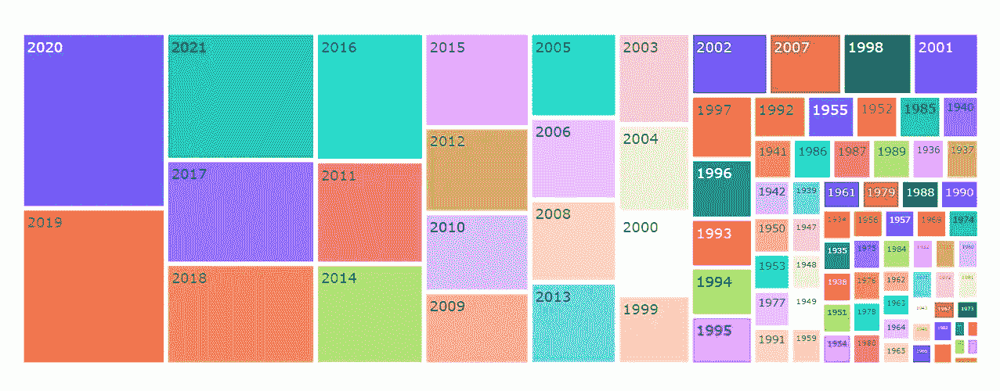

# 在 Python 中简单、交互地浏览数据

> 原文：<https://medium.com/geekculture/explore-data-simply-and-interactively-in-python-ef6138338ae2?source=collection_archive---------16----------------------->

对于许多人来说，编程似乎是一项艰巨的任务，尤其是那些认为自己可能不精通技术的人。然而，你可以在网上找到无数的工具、视频和文章，编程是几乎任何人都可以学习的技能之一，从我的个人经验来说，最好的方法是有意识地练习。