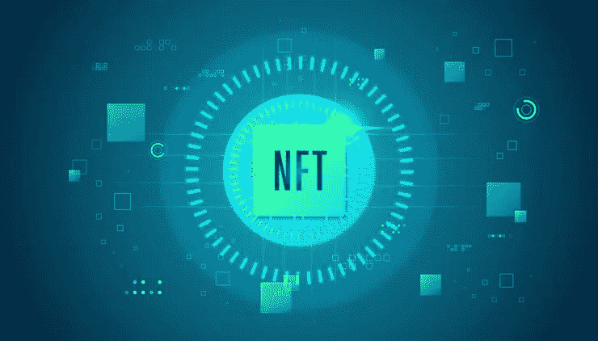

# 通过创建 NFT 市场探索利润和利益

> 原文：<https://medium.com/geekculture/explore-profits-and-benefits-by-creating-an-nft-marketplace-80ee4c9cae42?source=collection_archive---------18----------------------->

NFT 市场发展是一个价值百万美元的商业网络，在这里，众多非技术产业的数字企业家聚集在一起，将他们的收入提高到一个新的高度。不可替代代币具有独特的功能和专业知识，被视为在[***【NFT】***](https://www.blockchainappfactory.com/nft-marketplace-development?utm_source=GeekGulture+medium&utm_medium=11-04-2022&utm_campaign=Vishnu)市场提供了一系列卓越的解决方案。因此，允许稳定的投资机会和提高的结果。NFT 市场的发展对于早期采用的商业模式来说是完美的，这些商业模式已经准备好在数百万美元的收入领域留下他们的印记。但是，为了取得这一成功，第一件事将是执行 NFT 市场的发展。

## **NFT 市场-简介**

NFT 市场是分散的领域，作为购买、销售和交易非功能性金融产品的在线网站。这个市场运行在区块链网络上，如以太坊、币安智能链等等。NFTs 的受欢迎程度呈指数增长，这项技术有望成为加密领域的顶级数字部门。通常，在 NFT 市场上，用户可以有效地执行与 NFT 相关的交易。

## **NFT 市场发展的好处**

*   平台访问者作为 NFTs 的预定义用户工作。
*   通过最大化不可替代代币的视图数量，NFT 市场将其作为选择合适的 NFT 的机会来宣传。
*   跨链整合到 NFT 市场将带来来自不同区块链的广泛用户，从而最大化 NFT 交易流程。
*   市场上可以选择从加密钱包中即时铸造 NFT。

## **NFT 市场开发中需要考虑的顶级特性**

*   **现场拍卖**

这是包括关于卖方、买方、NFTs 和支付模式的信息的特征。此外，它还包括价格、买方报价的数量以及投标时间的可用性。

*   **过滤器**

过滤器是在市场上冲浪的一种极好的方式，特别是当平台上有大量的 NFT 可用时。这使得用户能够根据类别、支付方式、收藏和列表状态来选择他们想要的 NFT 收藏品。这将最大限度地缩短 NFT 选择和购买过程之间的时间。

*   **趋势**

NFT 市场包含一些不可读的 NFT，如果根据当前的市场趋势在平台上展示，它们会获得很高的销售价格。因此，NFT 市场必须为流行系列开辟一个单独的板块。因此，提供了有用的信息，例如平均价格、卖方数据、总供应量和交易率。

*   **上市状态**

列表状态使用户能够有效地选择购买 NFTs。这个特性允许用户以更简单的方式快速查找最佳的 NFTs。这是通过启动搜索、排序和过滤来完成的。此外，列表状态使得卖家更容易通过平台。因此，在该特征的帮助下，用户将对数字收藏品的验证过程的状态有所了解。

*   **通知**

NFT 市场具有快速通知机制，通过电子邮件产生最新的数据和信息，并向用户发送消息。这些通知主要包含 NFT 抵达、即将举行的拍卖等实时数据。

*   **客户支持**

客户服务是 NFT 市场的一个重要特征。该功能允许用户澄清他们在平台上工作期间所面临的所有技术细节和问题。

## **如何从零开始创建 NFT 市场？**

*   **为项目创建文档**

NFT 项目的文档化是 NFT 市场发展的第一步。大量的文档可能会非常繁琐和复杂，但它会节省时间。从长远来看，文档流程对业务非常有用。该文档包含有关该项目的白皮书和令牌组学的所有信息。

*   **UI/UX 设计的创建**

NFT 市场的 UI/UX 组件创建了完整的店面和前端功能。用户界面应该简单美观。因此，将会有非常多的用户进入这个平台。因此，NFT 市场所有者的业务增长被放大了。

*   **开发流程**

发展过程是 NFT 市场发展最重要的一步。这是通过雇佣一家顶级的 NFT 开发公司来完成的。NFT 开发商将提供开发 NFT 市场所需的所有必要工具。他们创造了与平台相关的一切，从后端到前端结构。在这一步，区块链网络和智能合约也被添加到平台中。

*   **测试运行**

NFT 市场的发展将从大范围的试运行开始。这些试运行将会发现技术上的缺陷，并得到完美的修正。因此，这是为商业平台建立一个功能齐全的 NFT 市场的重要一步。

## **最后的想法，**

[***NFT 市场发展***](https://www.blockchainappfactory.com/nft-marketplace-development?utm_source=GeekGulture+medium&utm_medium=11-04-2022&utm_campaign=Vishnu) 是一种**趋势科技**，它正以惊人的速度提升着企业的收入。因为不可燃硬币正在迅速增加，并在 NFT 社区变得非常受欢迎。此外，投资者对区块链平台感兴趣。因此，对于企业来说，这是一个将资源投入数字空间的绝佳机会。NFT 市场有望在不久的将来达到更高的水平。