# 探索用于端到端数据科学项目的 Python 库

> 原文：<https://medium.com/geekculture/explore-python-library-for-end-to-end-data-science-project-8068290be097?source=collection_archive---------21----------------------->

[你可以在这个[链接](https://bluemind1988.medium.com/explore-r-libraries-for-end-to-end-data-science-projects-b4d0af3a9f5c)中看到我的另一篇关于探索 R 库进行端到端数据科学项目的文章]

**重要提示**:这篇文章只是收集了我以前知道的最流行的数据科学 python 库，其他一些重要的库不在这个列表中，因此请给我留下您的反馈以供改进。为了保持客观性，几乎所有与这些图书馆相关的信息我都直接引用自他们的网站(**带链接/来源**)。对于我个人的意见，我也有一个具体的说明。快乐阅读！

Python 是一种非常强大的数据科学语言，尤其是在机器学习/深度学习方面。Python *可以涵盖完整的栈(端到端)数据科学项目，下面是一些重要的步骤:*

数据准备→数据可视化→特征工程→构建和验证 ML 模型→解释模型→交流结果→部署(web app)

今天，我们将探索一些有用的 Python 库，它们可用于全栈数据科学目的:

1.  **数据准备(获取和清理数据)**

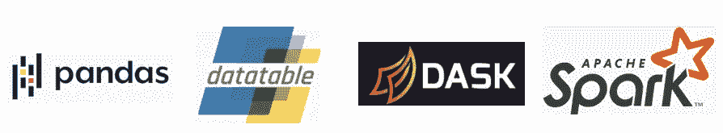

**对于适合内存的数据:**

*   熊猫([https://pandas.pydata.org/](https://pandas.pydata.org/))

**pandas** 是一个快速、强大、灵活且易于使用的开源数据分析和操作工具([链接](https://pandas.pydata.org/))。它可以用于不同的文件格式:csv，文本文件，SQL 数据库，excel，HDF5…

```
Example from this [**link**](https://pandas.pydata.org/docs/user_guide/10min.html):import pandas as pd
# Object creation:
s = pd.Series([1, 3, 5, np.nan, 6, 8])
dates = pd.date_range("20130101", periods=6)
# Viewing data:
df.head(5) ; df.tail(3); df.index; df.columns; df.describe()
# Selection:
df["A"], df[0:3] # select by column
df.loc["20130102", ["A", "B"]] # select by label
df.iloc[3], df.iloc[3:5,0:2] # select by position
df[df["A"] > 0], df2[df2["E"].isin(["two", "four"])] # Boolean indexing
# Missing data:
df1.dropna(how="any") # drop any rows that have missing data
df1.fillna(value=5) # filling missing data
```

我的看法:
优点:编码少，学习快，易于定制
缺点:语法相比 tidyverse (R)不易理解，难以处理大数据

**对于大于内存的数据或分布式环境(大数据):**

*   数据表([https://datatable.readthedocs.io/en/latest/](https://datatable.readthedocs.io/en/latest/))

**Datatable** 是一个用于操作表格数据的 python 库。它支持内存不足的数据集、多线程数据处理和灵活的 API。

```
Example from this [link](https://datatable.readthedocs.io/en/latest/start/quick-start.html)**import** datatable **as** dt
# Loading data:
DT4 = dt.fread("~/Downloads/dataset_01.csv") 
DT5 = dt.open("data.jay")
# Basic Frame Properties
**print**(DT.shape)   *# (nrows, ncols)* **print**(DT.names)   *# column names* **print**(DT.stypes)  *# column types
#* Select Subsets of Rows/Columns
DT[:, "A"]         *# select 1 column* 
DT[:10, :]         *# first 10 rows* 
DT[::-1, "A":"D"]  *# reverse rows order, columns from A to D* 
DT[27, 3]          *# single element in row 27, column 3 (0-based)*
```

*   达斯克([https://dask.org/](https://dask.org/))

[*定义*](https://docs.dask.org/en/latest/)*【*[*链接*](https://docs.dask.org/en/latest/)*】:Dask 是 Python 中用于并行计算的灵活库。* Dask 由两部分组成:

1.  **针对计算优化的动态任务调度**。这类似于 *Airflow、Luigi、Celery 或 Make* ，但针对交互式计算工作负载进行了优化。
2.  **“大数据”集合**如并行数组、数据帧和列表，将通用接口如 *NumPy、Pandas 或 Python 迭代器*扩展到大于内存或分布式环境。这些并行集合运行在动态任务调度器之上。

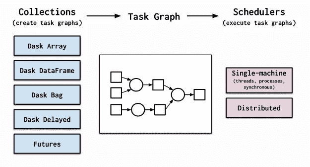

(图片来自[https://docs.dask.org/en/latest/](https://docs.dask.org/en/latest/))

*设计(*[https://docs.dask.org/en/latest/dataframe.html](https://docs.dask.org/en/latest/dataframe.html)*):*

Dask 数据框架协调许多沿索引排列的熊猫数据框架/系列。Dask 数据帧按行方式分区*，根据索引值对行进行分组以提高效率。这些熊猫对象可能存在于磁盘或其他机器上。*

*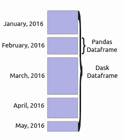*

*Dask DataFrame 复制了 Pandas API，因为`dask.dataframe`应用编程接口(API)是 Pandas API 的子集，**它应该为 Pandas 用户所熟悉。**由于 Dask 的并行性，有些细微的变化:*

```
*from dask.distributed import Client
client = Client(n_workers=4)
import dask
import dask.dataframe as dddf = dd.read_csv('2015-*-*.csv')
df2 = df[df.y == 'a'].x + 1# **As with all Dask collections, one triggers computation by calling the** **.compute()** **method:**df.groupby(df.user_id).value.mean().compute()
df2.compute()
df_filter=df[df[2]=='SU3037_0112'].compute()
df_filter.describe()*
```

*   *火花(【https://spark.apache.org/】T21)*

*定义([链接](https://spark.apache.org/docs/latest/) ) : Apache Spark 是用于大规模数据处理的统一分析引擎。它提供了 Java、Scala、Python 和 R 的高级 API，以及支持通用执行图的优化引擎。它还支持一套丰富的高级工具，包括用于 SQL 和结构化数据处理的 [Spark SQL](https://spark.apache.org/docs/latest/sql-programming-guide.html) ，用于机器学习的 [MLlib](https://spark.apache.org/docs/latest/ml-guide.html) ，用于图形处理的 [GraphX](https://spark.apache.org/docs/latest/graphx-programming-guide.html) ，以及用于增量计算和流处理的[结构化流](https://spark.apache.org/docs/latest/structured-streaming-programming-guide.html)。*

**

*(图片来自[databricks.com/spark/about](https://databricks.com/spark/about))*

```
*Run PySpark in Google Colab:
!apt-get update
!apt-get install openjdk-8-jdk-headless -qq > /dev/null
!wget -q [https://downloads.apache.org/spark/spark-3.0.0/spark-3.0.0-bin-hadoop3.2.tgz](https://downloads.apache.org/spark/spark-3.0.0/spark-3.0.0-bin-hadoop3.2.tgz)
!tar -xvf spark-3.0.0-bin-hadoop3.2.tgz
!pip install -q findsparkimport os
os.environ["JAVA_HOME"] = "/usr/lib/jvm/java-8-openjdk-amd64"
os.environ["SPARK_HOME"] = "/content/spark-3.0.0-bin-hadoop3.2"import findspark
findspark.init()
import spark
from pyspark.sql import SparkSession
spark = SparkSession.builder.master("local[*]").getOrCreate()path='Link to your data file'
df = spark.read.option("delimiter", "\t").csv(path)
df.show(5)
print((df.count(), len(df.columns)))
product_type='_c2'
df.groupBy(product_type).count().show()
product='SU3037_0112' 
df_product=df.filter(df._c2 == product)
df_product.describe().show()*
```

***2。数据可视化***

*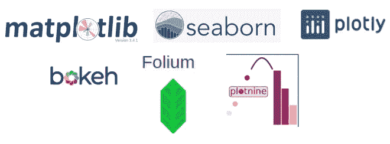*

***未互动图表:***

*   *matplotlib([https://matplotlib.org/](https://matplotlib.org/))*

*Matplotlib 是一个用于在 Python 中创建静态、动画和交互式可视化的综合库。从我的角度来看:与 ggplot (R)或 Seaborn 相比，这是一个非常复杂的数据可视化库(大量定制)。*

*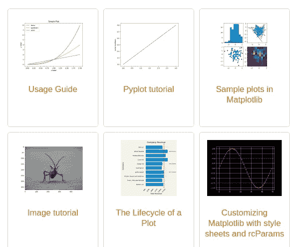*

*(图片来自 https://matplotlib.org/stable/tutorials/index.html[)](https://matplotlib.org/stable/tutorials/index.html)*

*   *seaborn(【https://seaborn.pydata.org/】T4)*

*Seaborn 是一个基于 [matplotlib](https://matplotlib.org/) 的 Python 数据可视化库。它提供了一个高层次的界面来绘制有吸引力的和信息丰富的统计图形。[我的观点]:使用 seaborn，你可以用比 matplotlib 更少的代码创建美丽的情节*

*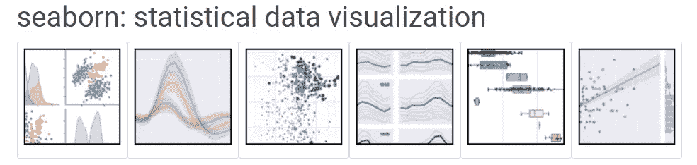*

*(图片来自[https://seaborn.pydata.org/index.html](https://seaborn.pydata.org/index.html))*

*   *剧情人物([https://plotnine.readthedocs.io/en/stable/](https://plotnine.readthedocs.io/en/stable/))*

*plotnine 是 Python 中图形的*语法的实现，它基于 [ggplot2](https://ggplot2.tidyverse.org/) 。该语法允许用户通过将数据显式映射到组成绘图的可视对象来组成绘图。使用语法绘图是非常强大的，它使得定制(或者复杂)的绘图易于思考和创建，而简单的绘图保持简单。**

** * * gg plot 2:R 中最好的数据可视化工具*

*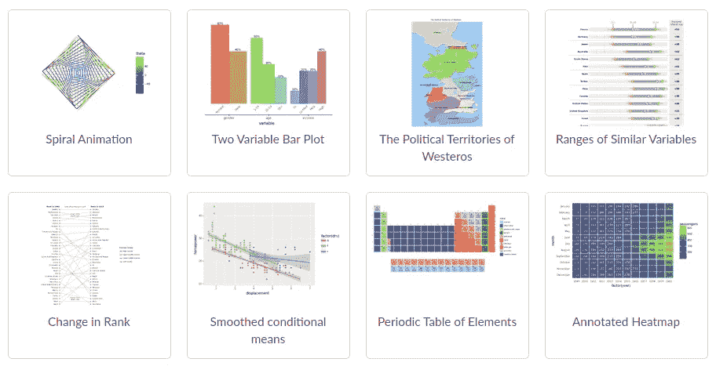*

*(图片来自[https://plotnine.readthedocs.io/en/stable/gallery.html](https://plotnine.readthedocs.io/en/stable/gallery.html))*

***互动图表:***

*   *阴谋地([https://plotly.com/python/](https://plotly.com/python/))*

*Plotly 的 Python 图形库使得**交互式**，出版质量的图形。如何制作折线图、散点图、面积图、条形图、误差线、箱线图、直方图、热图、子图、多轴图、极坐标图和气泡图的示例。*

*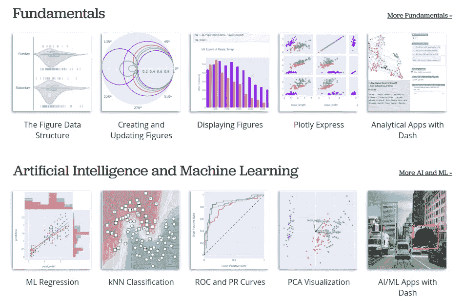*

*(图片来自[https://plotly.com/python/](https://plotly.com/python/))*

*   *散景([https://docs.bokeh.org/en/latest/index.html#](https://docs.bokeh.org/en/latest/index.html#))*

*Bokeh 是一个 Python 库，用于为现代网络浏览器创建**交互式**可视化。它帮助您构建美丽的图形，从简单的绘图到复杂的流数据集仪表板。使用 Bokeh，您可以创建 JavaScript 支持的可视化效果，而无需自己编写任何 JavaScript。*

*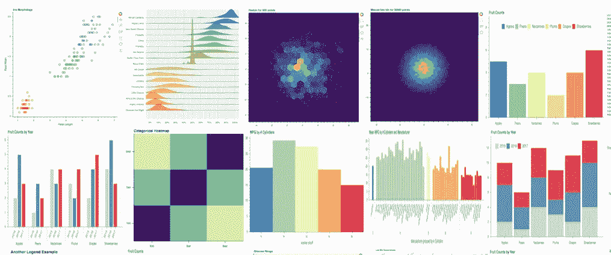*

*(图片来自[https://docs.bokeh.org/en/latest/docs/gallery.html](https://docs.bokeh.org/en/latest/docs/gallery.html))*

*   *叶([https://python-visualization.github.io/folium/](https://python-visualization.github.io/folium/))*

*`folium`建立在 Python 生态系统的数据优势和`leaflet.js`库的映射优势之上。用 Python 处理你的数据，然后通过`folium`在活页地图上可视化。*

*该库有许多来自 OpenStreetMap、Mapbox 和 Stamen 的内置 tileset，并支持带有 Mapbox 或 Cloudmade API 键的自定义 tileset。`folium`支持图像、视频、GeoJSON 和 TopoJSON 叠加。*

*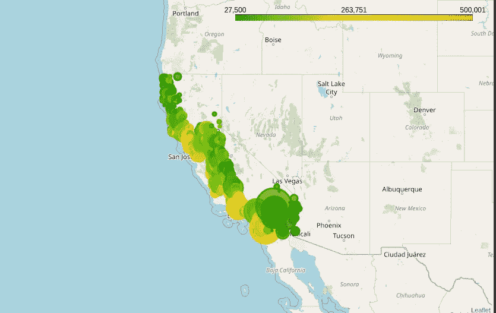*

***3。特征工程***

*   *scikit-learn([https://scikit-learn.org/stable/index.html](https://scikit-learn.org/stable/index.html))*

*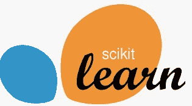*

*`Scikit-learn`是一个开源的机器学习库，支持监督和非监督学习。它还提供了用于模型拟合、数据预处理、模型选择和评估的各种工具，以及许多其他实用工具。我们将讨论 scikit learn 的特征工程师的**数据再处理**:*

*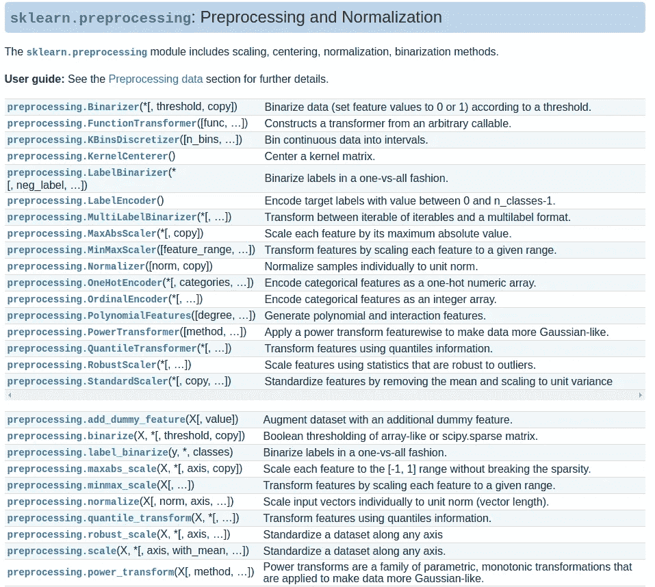*

*(图片来自[https://sci kit-learn . org/stable/modules/classes . html # module-sk learn .预处理](https://scikit-learn.org/stable/modules/classes.html#module-sklearn.preprocessing))*

*从上面的图片中，我们可以在 scikit learn 中使用许多功能工程师常用的方法:一个热编码器、标签编码器、缩放、power _ transform…然而在我看来， [**配方**](https://recipes.tidymodels.org/) 包(R)比 scikit learn 更容易使用，具有许多预构建功能。你应该尝试食谱包来了解更多。下图:配方包中包含的再加工数据的数量*

*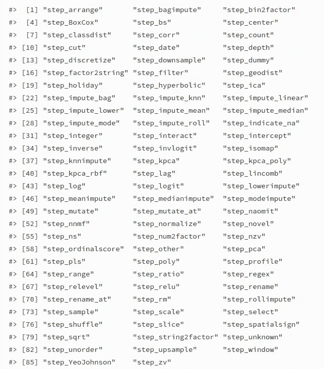*

*(图片来自:[https://recipes.tidymodels.org/articles/Simple_Example.html](https://recipes.tidymodels.org/articles/Simple_Example.html))*

*   *特征工具([https://www.featuretools.com/](https://www.featuretools.com/))*

*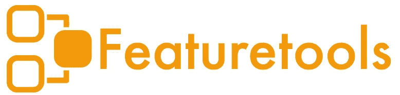*

*Featuretools 是用于自动化特征工程的开源 python 框架。它擅长将时态和关系数据集转换为机器学习的特征矩阵。*

*请参见此[链接](https://www.featuretools.com/demos/)中的功能工具演示*

*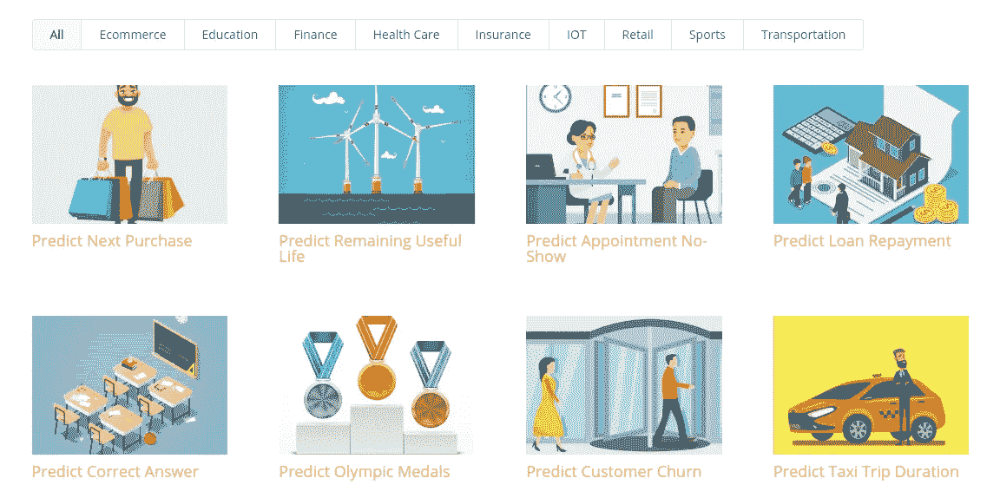*

*(图片来自[https://www.featuretools.com/demos/](https://www.featuretools.com/demos/))*

*特征工具工作流程:*

*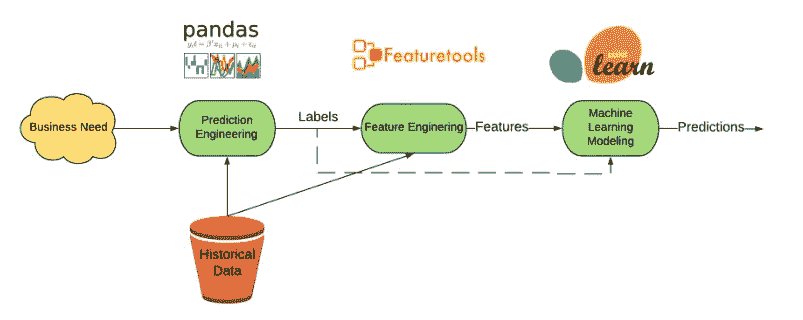*

*(图片来自[https://github . com/feature tools/predict-customer-churn/blob/main/churn/5。%20Modeling.ipynb](https://github.com/Featuretools/predict-customer-churn/blob/main/churn/5.%20Modeling.ipynb) )*

***4。构建&验证机器学习模型***

***手动设置&调机学习:***

*   *scikit-learn([https://scikit-learn.org/stable/](https://scikit-learn.org/stable/))*

**

*`Scikit-learn`是一个开源的机器学习库，支持监督和非监督学习。它还提供了用于模型拟合、数据预处理、模型选择和评估的各种工具，以及许多其他实用工具。*

*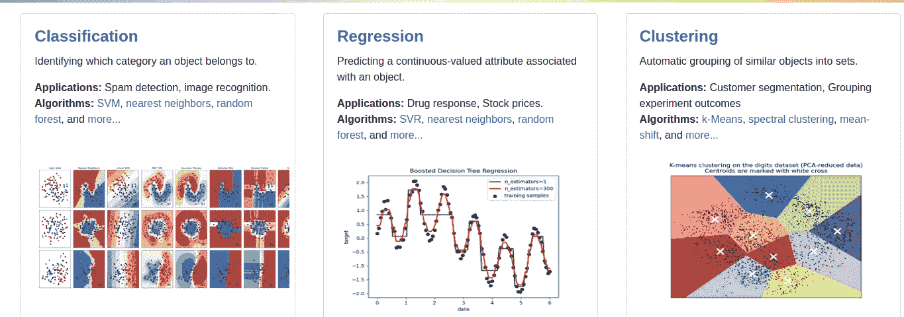**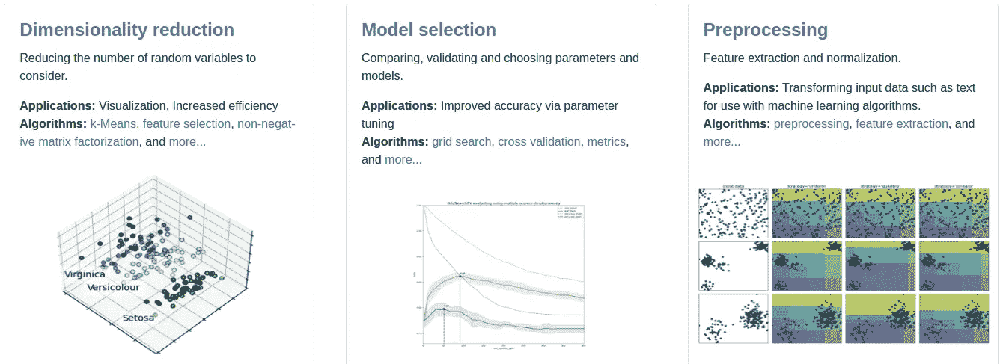*

*(图片来自[https://scikit-learn.org/stable/index.html](https://scikit-learn.org/stable/index.html))*

*教程:[https://scikit-learn.org/stable/auto_examples/index.html](https://scikit-learn.org/stable/auto_examples/index.html)*

*sci kit-学习 Keras 的包装:[https://github.com/adriangb/scikeras](https://github.com/adriangb/scikeras)*

*scikit-学习 Pytorch 的包装:【https://skorch.readthedocs.io/en/stable/ *

*   *https://docs.h2o.ai/h2o/latest-stable/h2o-docs/welcome.html 的 H2O*

*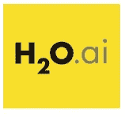*

*[定义[链接](https://docs.h2o.ai/h2o/latest-stable/h2o-docs/welcome.html) ] H2O 是一个开源、内存、分布式、快速、可扩展的机器学习和预测分析平台，允许您在大数据上构建机器学习模型，并在企业环境中提供这些模型的轻松生产。*

*H2O 的核心代码是用 Java 写的。在 H2O 内部，分布式键/值存储用于访问和引用数据、模型、对象等。，跨所有节点和计算机。这些算法是在 H2O 的分布式 Map/Reduce 框架之上实现的，并利用 Java Fork/Join 框架实现多线程。H2O 的 REST API 允许通过 JSON over HTTP 从外部程序或脚本访问 H2O 的所有功能。H2O 的 web 界面(Flow UI)、 **R 绑定(H2O-R)、Python 绑定(H2O-Python)** 使用 Rest API。*

*深度学习、树集成和 GLRM 等各种尖端监督和非监督算法的速度、质量、易用性和模型部署使 H2O 成为大数据数据科学领域备受追捧的 API。*

*请在此[链接](https://docs.h2o.ai/h2o/latest-stable/h2o-docs/welcome.html)中查看 Python 和 R 的 H2O 用户指南*

*   *克拉斯(【https://keras.io/】T4)*

**

*【定义[链接](https://keras.io/)Keras 是为人类设计的 API，不是为机器设计的。Keras 遵循减少认知负荷的最佳实践:它提供一致的&简单 API，最大限度地减少常见用例所需的用户操作数量，并提供清晰的&可操作错误消息。它还有大量的文档和开发人员指南。*

*Keras 教程:[https://keras.io/examples/](https://keras.io/examples/)(音频、视频、文本、图像、结构数据、时间序列、RL、GAN……)*

*面向 R 用户的 Keras 教程(Keras 的 R 接口):[https://keras.rstudio.com/articles/examples/index.html](https://keras.rstudio.com/articles/examples/index.html)*

*   *张量流([https://www.tensorflow.org/](https://www.tensorflow.org/))*

*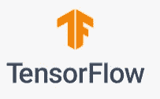*

***【**[**Wiki**](https://en.wikipedia.org/wiki/TensorFlow)**】tensor flow**是一个[免费开源的](https://en.wikipedia.org/wiki/Free_and_open-source_software) [软件库](https://en.wikipedia.org/wiki/Library_(computing))用于[机器学习](https://en.wikipedia.org/wiki/Machine_learning)。它可以用于一系列任务，但特别侧重于[训练](https://en.wikipedia.org/wiki/Types_of_artificial_neural_networks#Training)和[推理](https://en.wikipedia.org/wiki/Statistical_inference)的[深度神经网络](https://en.wikipedia.org/wiki/Deep_neural_networks)。TensorFlow 由谷歌大脑 T21 团队开发，供谷歌内部使用。它在 2015 年以 [Apache License 2.0](https://en.wikipedia.org/wiki/Apache_License_2.0) 发布*

*Tensorflow 是深度学习应用(NLP、计算机视觉、强化学习等)的最佳框架。).*

**tensor flow*:tensor flow 应用示例(图像、文本、音频、结构化数据、生成式、可解释性、强化学习……)请参见本教程([https://www.tensorflow.org/tutorials](https://www.tensorflow.org/tutorials))。)*

**R 用户的 tensor flow*:[https://tensorflow.rstudio.com/tutorials/](https://tensorflow.rstudio.com/tutorials/)*

*   *py torch([https://pytorch.org/](https://pytorch.org/))*

**

***【W**[**iki**](https://en.wikipedia.org/wiki/PyTorch)**】py Torch**是基于 [Torch](https://en.wikipedia.org/wiki/Torch_(machine_learning)) 库的[开源](https://en.wikipedia.org/wiki/Open_source) [机器学习](https://en.wikipedia.org/wiki/Machine_learning) [库](https://en.wikipedia.org/wiki/Library_(computing))，用于[计算机视觉](https://en.wikipedia.org/wiki/Computer_vision)[自然语言处理](https://en.wikipedia.org/wiki/Natural_language_processing)等应用，主要由[脸书](https://en.wikipedia.org/wiki/Facebook)的 AI 研究实验室(FAIR)开发。它是在[修正 BSD 许可](https://en.wikipedia.org/wiki/Modified_BSD_License)下发布的[免费开源软件](https://en.wikipedia.org/wiki/Free_and_open-source_software)。尽管 [Python](https://en.wikipedia.org/wiki/Python_(programming_language)) 接口更加完善并且是开发的主要焦点，PyTorch 也有一个 [C++](https://en.wikipedia.org/wiki/C%2B%2B) 接口*

*PyTorch 教程:[https://pytorch.org/tutorials/](https://pytorch.org/tutorials/)(图片、视频、音频、文字……)*

*rTorch 教程(针对 R 用户):[https://f0nzie.github.io/rTorch/](https://f0nzie.github.io/rTorch/)*

*   *Dask 用于**可扩展的**机器学习([https://ml.dask.org/](https://ml.dask.org/))*

**

*Dask-ML 使用 [Dask](https://dask.org/) 以及流行的机器学习库，如 [Scikit-Learn](http://scikit-learn.org/) 、 [XGBoost](https://ml.dask.org/xgboost.html) 和其他库，在 Python 中提供可扩展的机器学习。*

*教程:[https://ml.dask.org/](https://ml.dask.org/)*

*   *Spark for **可扩展的**机器学习(【https://spark.apache.org/docs/1.2.1/mllib-guide.html】的)*

**

*[ [链接](https://spark.apache.org/docs/1.2.1/mllib-guide.html)ml lib 是 Spark 的可扩展机器学习库，由常见的学习算法和实用程序组成，包括分类、回归、聚类、协同过滤、降维以及底层优化原语*

*教程:[https://spark.apache.org/docs/1.2.1/mllib-guide.html](https://spark.apache.org/docs/1.2.1/mllib-guide.html)(适用于 Scala、Python、Java)*

***自动设置&调机学习**:*

*   *py caret([https://pycaret.org/](https://pycaret.org/)*

**

*[ [链接](https://pycaret.org/) ] PyCaret 是一个开源的、**低代码的**Python 机器学习库，允许您在自己选择的笔记本环境中，在几分钟内从准备数据到部署模型。*

*请看本[链接](https://github.com/pycaret/pycaret/tree/master/tutorials)中的 Pycaret 教程:(异常检测，二元分类，聚类，多类分类，NLP，回归…)*

*   *自动 sklearn([https://automl.github.io/auto-sklearn/master/](https://automl.github.io/auto-sklearn/master/))*

**[* [*链接*](https://automl.github.io/auto-sklearn/master/)*]auto-sk learn*是一个自动化的机器学习工具包，是 scikit-learn 估计器的替代产品:*

```
***import** **autosklearn.classification**
cls = autosklearn.classification.AutoSklearnClassifier()
cls.fit(X_train, y_train)
predictions = cls.predict(X_test)*
```

*教程:[链接](https://automl.github.io/auto-sklearn/master/examples/index.html)*

*   *eval ml([https://evalml.alteryx.com/en/stable/](https://evalml.alteryx.com/en/stable/))*

**

*[ [链接](https://evalml.alteryx.com/en/stable/) ] EvalML 是一个 AutoML 库，它使用特定领域的目标函数来构建、优化和评估机器学习管道。*

*结合 [Featuretools](https://featuretools.featurelabs.com/) 和 [Compose](https://compose.featurelabs.com/) ，EvalML 可以用来创建端到端的监督机器学习解决方案。*

*教程:[链接](https://evalml.alteryx.com/en/stable/tutorials.html)*

*   *http://epistasislab.github.io/tpot/([TPOT](http://epistasislab.github.io/tpot/))*

*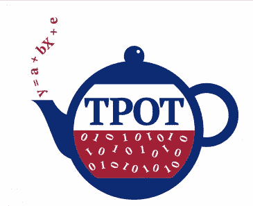*

*[ [链接](http://epistasislab.github.io/tpot/) ]把 TPOT 当成你的**数据科学助理**。TPOT 是一个 Python 自动化机器学习工具，它使用遗传编程优化机器学习管道。*

*教程:[链接](http://epistasislab.github.io/tpot/examples/)*

*   *AutoKeras([https://autokeras.com/](https://autokeras.com/))*

**

*【[链接](https://autokeras.com/)】auto Keras:基于 Keras 的 AutoML 系统。它是由德州农工大学的数据实验室开发的。AutoKeras 的目标是让每个人都可以使用机器学习。*

```
*import autokeras as ak  
clf = ak.ImageClassifier() 
clf.fit(x_train, y_train) 
results = clf.predict(x_test)*
```

*教程:[链接](https://autokeras.com/tutorial/overview/)*

*   *https://docs.h2o.ai/h2o/latest-stable/h2o-docs/automl.html H2O 汽车公司*

*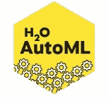*

*[ [链接](https://docs.h2o.ai/h2o/latest-stable/h2o-docs/automl.html) ] H2O 的 AutoML 可用于自动化机器学习工作流程，包括在用户指定的时间限制内自动训练和调整许多模型。[堆叠集成](http://docs.h2o.ai/h2o/latest-stable/h2o-docs/data-science/stacked-ensembles.html) —一个基于所有先前训练的模型，另一个基于每个系列的最佳模型——将在单个模型的集合上自动训练，以产生高度预测的集成模型，在大多数情况下，这些模型将是 AutoML 排行榜中表现最佳的模型。*

*H2O 提供了许多适用于 AutoML 对象(模型组)以及单个模型(例如 leader 模型)的[模型可解释性](http://docs.h2o.ai/h2o/latest-stable/h2o-docs/explain.html)方法。解释可以通过单个函数调用自动生成，提供了一个简单的界面来探索和解释 AutoML 模型。*

*Python 中的教程和 R: [链接](https://docs.h2o.ai/h2o/latest-stable/h2o-docs/automl.html#code-examples)*

```
*Example from: [https://docs.h2o.ai/h2o/latest-stable/h2o-docs/automl.html#code-examples](https://docs.h2o.ai/h2o/latest-stable/h2o-docs/automl.html#code-examples)**import** h2o
**from** h2o.automl **import** H2OAutoML

h2o**.**init()

*# Import a sample binary outcome train/test set into H2O*
train **=** h2o**.**import_file("https://s3.amazonaws.com/erin-data/higgs/higgs_train_10k.csv")
test **=** h2o**.**import_file("https://s3.amazonaws.com/erin-data/higgs/higgs_test_5k.csv")

*# Identify predictors and response*
x **=** train**.**columns
y **=** "response"
x**.**remove(y)

*# For binary classification, response should be a factor*
train[y] **=** train[y]**.**asfactor()
test[y] **=** test[y]**.**asfactor()

*# Run AutoML for 20 base models (limited to 1 hour max runtime by default)*
aml **=** H2OAutoML(max_models**=**20, seed**=**1)
aml**.**train(x**=**x, y**=**y, training_frame**=**train)

*# View the AutoML Leaderboard*
lb **=** aml**.**leaderboard
lb**.**head(rows**=**lb**.**nrows)*
```

*   *自动旋翼机(【https://auto.gluon.ai/stable/index.html】T4*

**

*[ [Link](https://auto.gluon.ai/stable/index.html) ] AutoGluon 支持易于使用和易于扩展的 AutoML，专注于自动化堆栈组装、深度学习和跨文本、图像和表格数据的现实应用。面向 ML 初学者和专家*

*教程:[链接](https://auto.gluon.ai/stable/tutorials/index.html)*

*   *Glu onts-概率时间序列建模([https://ts.gluon.ai/](https://ts.gluon.ai/))*

**

*【[链接](https://ts.gluon.ai/)】胶子时间序列(GluonTS)是用于概率时间序列建模的胶子工具包，专注于基于深度学习的模型。*

*GluonTS 提供了加载和迭代时间序列数据集的实用程序，可以训练的最先进的模型，以及定义自己的模型和快速试验不同解决方案的构建模块。*

*教程:[链接](https://ts.gluon.ai/tutorials/index.html)*

*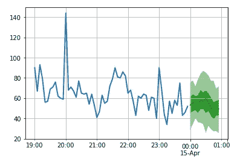*

*(图片来自此链接:[https://github.com/awslabs/gluon-ts/](https://github.com/awslabs/gluon-ts/))*

***5。解释型号***

*   *[Dalex](https://dalex.drwhy.ai/) 套餐(请在此[链接](https://ema.drwhy.ai/)中查阅关于这个精彩套餐的最佳书籍)*

*解释机器学习模型是非常重要的一步，因为它将帮助我们理解为什么我们的模型预测结果。有了 Dalex 包，机器学习不再是一个黑匣子，我们可以发现哪些重要特征影响我们的预测，并向我们的利益相关者/客户提出建议或解释。*

*根据 Dalex 包，我们有两个解释级别:实例级别(一个样本)和数据集级别(整个样本)。实例级包括分解图、shapley 附加解释、Lime、其他条件-同等条件曲线、其他条件-同等条件振荡、局部诊断图。数据集级别包括模型性能、变量重要性、部分相关性分布图、局部相关性和累积局部分布图、残差诊断图*

*Dalex 包概述(图片链接来自[https://ema.drwhy.ai/introduction.html](https://ema.drwhy.ai/introduction.html)*

*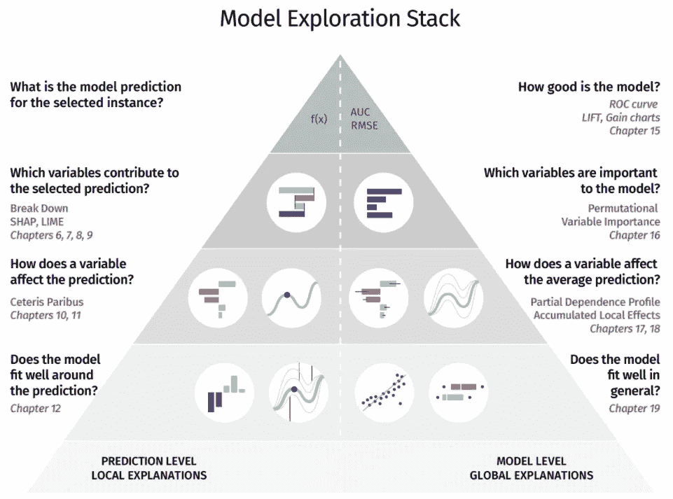*

*实例级讲解(图片链接:【https://ema.drwhy.ai/summaryInstanceLevel.html】T2)*

*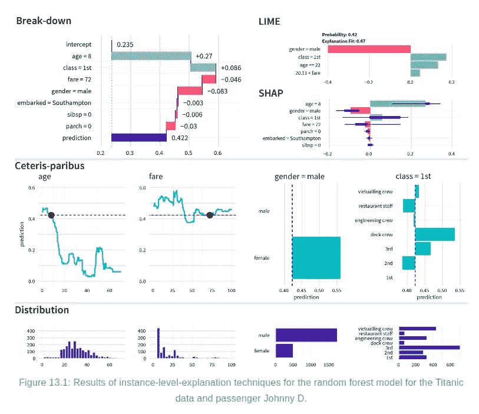*

*数据集层面讲解(图片链接:【https://ema.drwhy.ai/summaryModelLevel.html】T4)*

*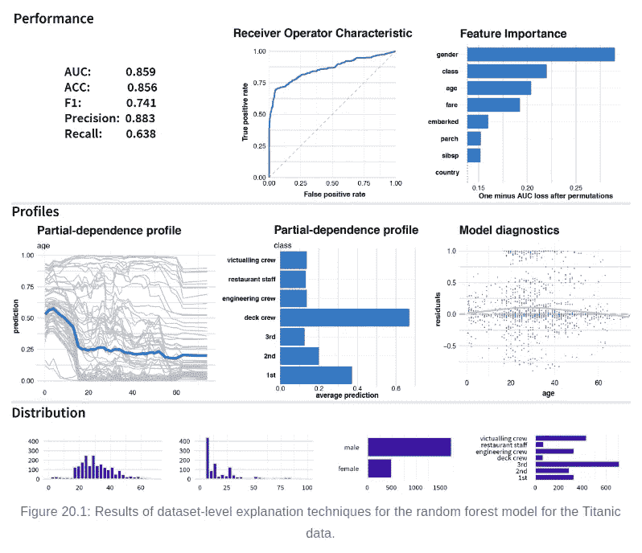*

***6。传达结果***

*   *木星实验室([https://jupyter.org/](https://jupyter.org/))*

*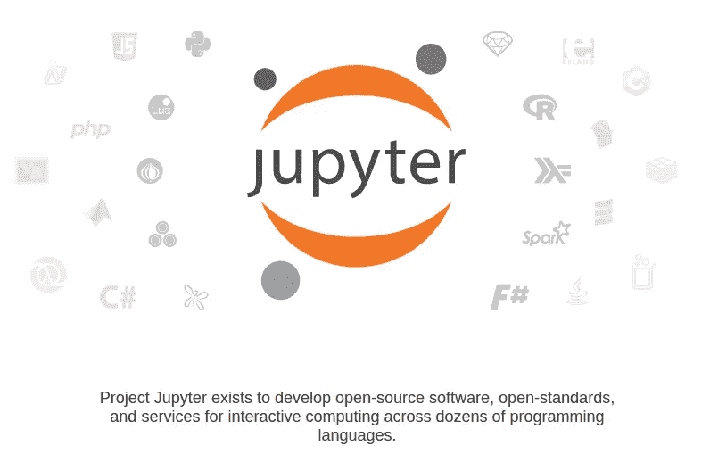*

*(图片来自此链接:[https://jupyter.org/](https://jupyter.org/))*

*[ [Link](https://jupyter.org/) ] JupyterLab 是一个基于 web 的交互式开发环境，用于 Jupyter 笔记本、代码和数据。JupyterLab 是灵活的:配置和安排用户界面，以支持数据科学、科学计算和机器学习中的广泛工作流。JupyterLab 是可扩展的和模块化的:编写插件来添加新组件并与现有组件集成。*

*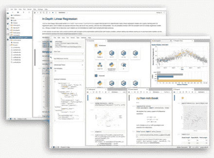*

*(图片来自此链接:[https://jupyter.org/](https://jupyter.org/))*

*   *nb viewer([https://nbviewer.jupyter.org/](https://nbviewer.jupyter.org/))*

**

*【[链接](http://Jupyter NBViewer is the web application behind The Jupyter Notebook Viewer, which is graciously hosted by OVHcloud.  Run this locally to get most of the features of nbviewer on your own network.  If you need help using or installing Jupyter Notebook Viewer, please use the jupyter/help issue tracker. If you would like to propose an enhancement to nbviewer or file a bug report, please open an issue here, in the jupyter/nbviewer project.)】Jupyter NBViewer 是[Jupyter 笔记本浏览器](http://nbviewer.jupyter.org/)背后的网络应用，由 [OVHcloud](https://ovhcloud.com/) 慷慨托管。*

*请注意:对于简单的笔记本，您可以使用 github link 共享您的代码，然而，对于大型笔记本和复杂的 javascript 库，这个 nbviewer 是更好的选择*

*   *瞧([https://github.com/voila-dashboards/voila](https://github.com/voila-dashboards/voila))*

**

*[ [链接](https://github.com/voila-dashboards/voila)voilà将 Jupyter 笔记本变成独立的网络应用。与通常的 HTML 转换笔记本不同，每个连接到 Voilà tornado 应用程序的用户都会获得一个专用的 Jupyter 内核，该内核可以对 Jupyter 交互式小部件中的更改执行回调。*

*点击此链接查看瞧画廊:【https://voila-gallery.org/ *

**

*(图片来自[https://voila-gallery.org/](https://voila-gallery.org/))*

*瞧，教程:[链接](https://github.com/voila-dashboards/voila/tree/master/notebooks)*

***7。部署(网络应用程序)***

*复杂程度增加:流线→破折号→烧瓶*

*   *细流([https://streamlit.io/](https://streamlit.io/))*

**

*Streamlit 可以在几分钟内将数据脚本转化为可共享的 web 应用程序。
**全在 Python。全部免费。不需要前端经验。***

*[ [链接](https://docs.streamlit.io/en/stable/) ] [Streamlit](https://streamlit.io/) 是一个开源的 Python 库，可以轻松创建和共享漂亮的、定制的机器学习和数据科学 web 应用。只需几分钟，您就可以构建和部署强大的数据应用*

*我的观点:虽然使用 streamlit 我们可以只用 python 语言非常快速地构建 web 应用程序(对于前端和后端)，但 Shiny (R)仍然更胜一筹，它为 web 应用程序开发提供了许多强大的支持功能。Shiny 的主要缺点是你要学习 R :-)*

*教程:[链接](https://docs.streamlit.io/en/stable/getting_started.html)*

*流线 Galery: [链接](https://streamlit.io/gallery)*

*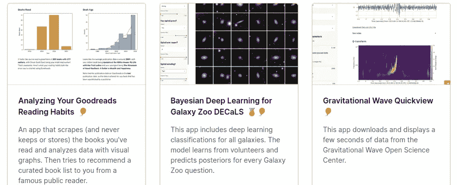**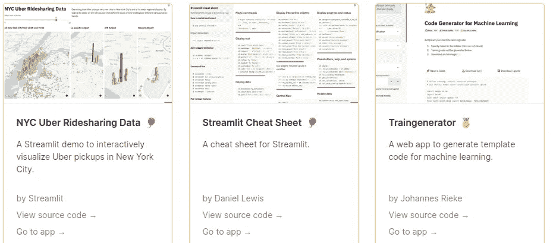*

*(图片形式[https://streamlit.io/gallery](https://streamlit.io/gallery))*

*   *破折号([https://plotly.com/dash/](https://plotly.com/dash/))*

**

*[ [Link](https://plotly.com/dash/) ] **Dash 应用程序为用 Python、R 和 Julia 编写的模型提供了一个点——&——点击界面——极大地扩展了传统“仪表板”的可能性概念**借助 Dash 应用，数据科学家和工程师将复杂的 Python 分析交给了业务决策者和运营商。*

*Python 已经占领了世界，Dash Enterprise 是向商业用户提供 Python 分析的领先工具。在当今人工智能和人工智能驱动的世界中，传统的 BI 仪表板不再适用。新兴行业的复杂分析需要生产级的低代码 Python 应用，如自动驾驶汽车、可再生能源、量子计算、新型疗法等*

*我的观点:Dash 是一个强大的 web 应用程序开发工具(大部分是纯 python 语言)，但它比 streamlit 更复杂。我建议我们可以对简单的应用程序使用 streamlit，对复杂的应用程序使用 Dash*

*短跑教程:【https://dash.plotly.com/ *

*仪表盘图库:[https://dash-gallery.plotly.host/Portal/](https://dash-gallery.plotly.host/Portal/)*

*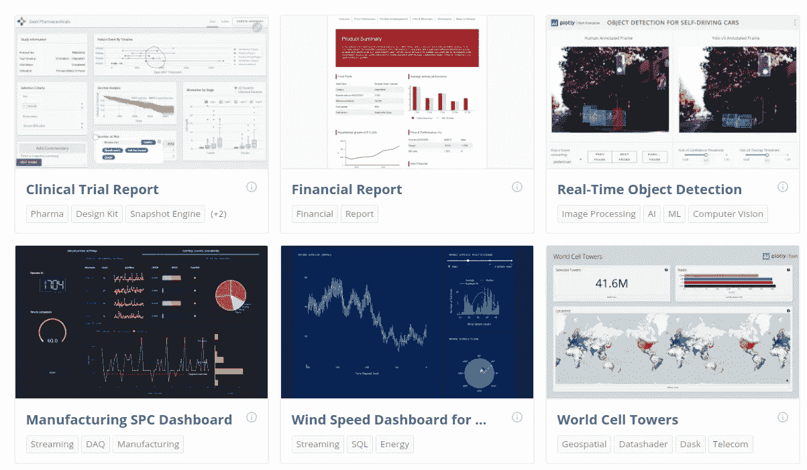**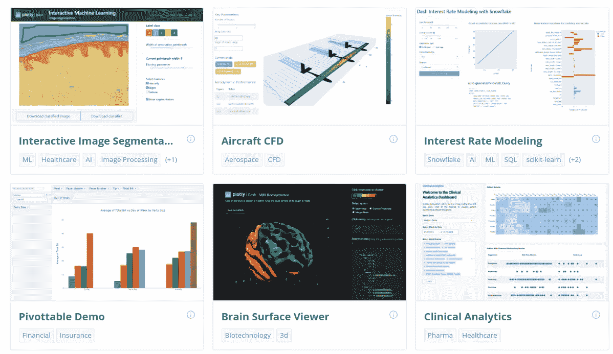*

*(图片来自[https://dash-gallery.plotly.host/Portal/](https://dash-gallery.plotly.host/Portal/))*

*   *烧瓶([https://palletsprojects.com/p/flask/](https://palletsprojects.com/p/flask/)*

**

*[链接] Flask 是一个轻量级的 [WSGI](https://wsgi.readthedocs.io/) web 应用框架。它旨在快速轻松地开始使用，并能够扩展到复杂的应用程序。它最初是一个简单的包装器，围绕着 [Werkzeug](https://palletsprojects.com/p/werkzeug) 和 [Jinja](https://palletsprojects.com/p/jinja) ，现在已经成为最流行的 Python web 应用程序框架之一。*

*烧瓶教程:[https://flask.palletsprojects.com/en/1.1.x/tutorial/](https://flask.palletsprojects.com/en/1.1.x/tutorial/)*