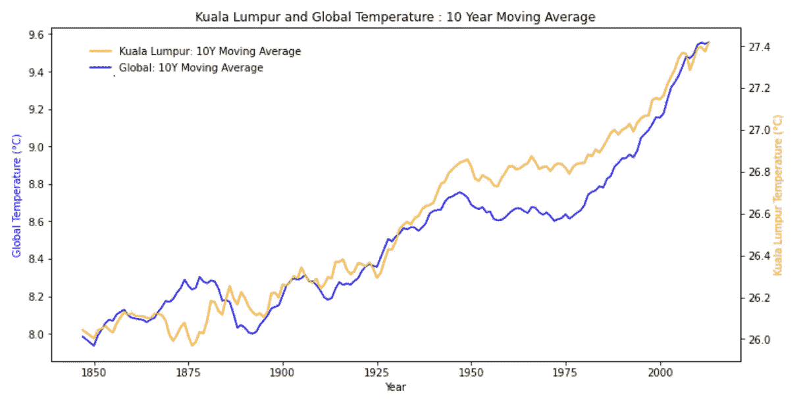
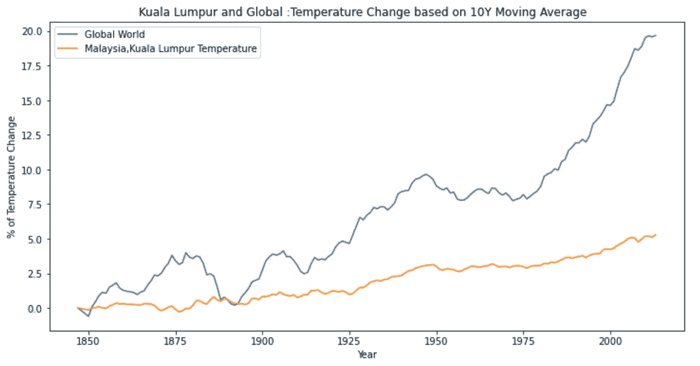

# 探索天气趋势

> 原文：<https://medium.com/geekculture/explore-weather-trend-e78765e22380?source=collection_archive---------13----------------------->

# 分析本地和全球温度数据，并将您所在地区的温度趋势与全球整体温度趋势进行比较。

SQL server 上的数据库模式记录了从 1825 年到 2013 年的所有全球平均温度和国家平均温度。

数据库中有三个表:

1.  city _ list 包含数据库中城市和国家的列表。
2.  city _ data 包含每个城市每年的平均温度(°C)。
3.  global _ data 包含每年的全球平均温度(°C)。

*使用 SQL 代码获取我们想要的数据集，导出到 CSV 文件名'* [*temp* erature *。CSV*](https://github.com/HockChong/Explore-The-Weather-Trend/blob/main/temperature.csv)*’。*

```
SELECT g.avg_temp as global_avg_temp, c.year,c.city, c.country, c.avg_temp
FROM global_data as g
INNER JOIN city_data as c
ON g.year = c.year
WHERE country =’Malaysia’
```

# 探索数据

使用熊猫来探索数据集，我发现吉隆坡的平均温度有 17 个缺失数据。让我们放下数据，继续探索。你可以在这里找到完整的代码语法。

```
temp.isnull().sum()global_avg_temp     0
year                0
city                0
country             0
avg_temp           17
dtype: int64
```

删除缺失值后，总共有 172 行。

让我们通过使用`.[rolling](https://www.datacamp.com/community/tutorials/moving-averages-in-pandas)()`方法获得数据的滚动窗口来创建 10 年移动平均线，然后使用`.mean().`移动平均线来平滑数据，以便更容易观察长期趋势，并帮助我们消除那些噪音。

```
temp[‘global_10Y_MA’] = temp.iloc[:,0].rolling(window=10).mean()
temp[‘malaysia_10Y_MA’] = temp.iloc[:,4].rolling(window=10).mean()
```



这很难区分。让我们用温度变化的百分比来看这些数据。

***#计算全年气温变化的百分比***

```
temp[‘global_temp_Percentage’] = temp[‘global_10Y_MA’]*100/temp[‘global_10Y_MA’].iloc[9] — 100temp[‘Malaysia_temp_Percentage’] = temp[‘malaysia_10Y_MA’]*100/temp[‘malaysia_10Y_MA’].iloc[9] — 100
```



结论:

1.  马来西亚吉隆坡的气温在这些年里上升了 5.37%。
2.  全球气温逐年急剧升高，增幅为 19.69%。
3.  马来西亚吉隆坡的 10 年平均气温比全球 10 年平均气温高 3.12 倍。
4.  由于全球变暖，全球气温将继续升高。