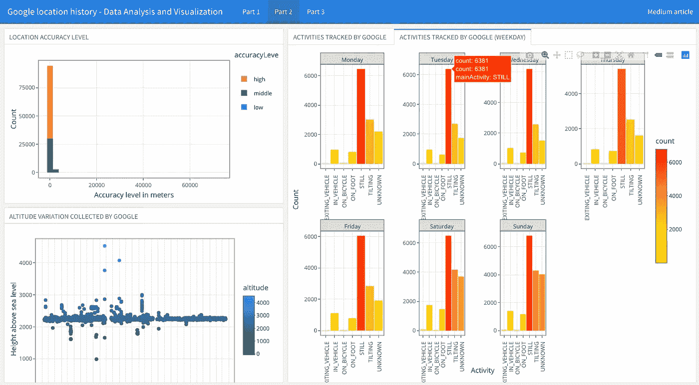

# 用 R 探索你在 Google 上的活动:如何分析和可视化你的位置历史

> 原文：<https://medium.com/geekculture/explore-your-activity-on-google-with-r-how-to-analyze-and-visualize-your-location-history-2ea8edabe733?source=collection_archive---------2----------------------->

## 使用您的个人数据副本，找出您允许谷歌跟踪您的方式和程度

Dashboard to view your Google Location History. The link at the end of the article.

多亏了谷歌地图，今天即使你在一个陌生的地方也很难迷路，只要你有一个良好的互联网连接…