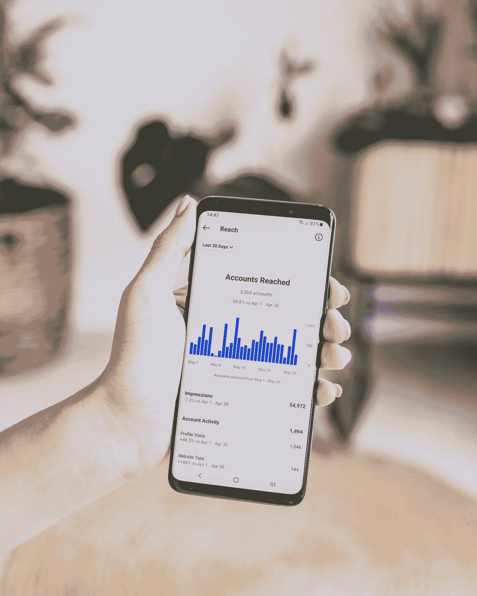

# 无需应用程序，探索您自己的 Instagram 关注者

> 原文：<https://medium.com/geekculture/explore-your-own-instagram-followers-without-an-app-18620d9d05aa?source=collection_archive---------1----------------------->

你是否经常想知道 Instagram 上谁取消了对你的关注？如果是这样，那么这篇文章和下面的项目都适合你！

我们会在 Instagram 上检查谁没有关注我们，基本上，我们会讨论如何在没有应用程序的情况下在 Instagram 上查看谁没有关注你。

Photo by [Georgia de Lotz](https://unsplash.com/@georgiadelotz?utm_source=medium&utm_medium=referral) on [Unsplash](https://unsplash.com?utm_source=medium&utm_medium=referral)

这肯定是在 Instagram 上找出谁没有关注你的最安全的方法。你不应该…