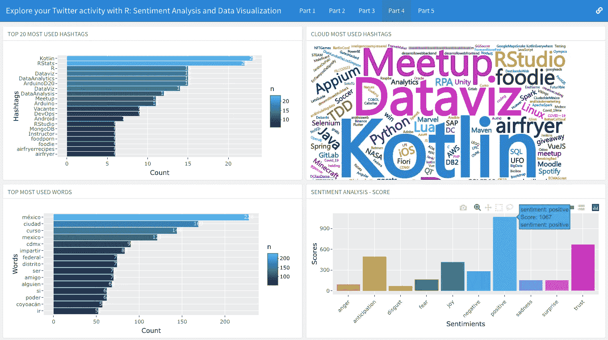

# 使用 R:情绪分析和数据可视化探索您的 Twitter 活动

> 原文：<https://medium.com/geekculture/explore-your-twitter-activity-with-r-sentiment-analysis-and-data-visualization-5d16442b517d?source=collection_archive---------2----------------------->

## 如何分析你的 Twitter 账户(或任何账户)，用“rtweet”包和 NLP 发现你的习惯和情绪

Explore your Twitter activity with R: Sentiment Analysis and Data Visualization — Screenshot: dashboard to see generated plots. Link at the end of the article. (Image by author)

那是在 2006 年，脸书成立两年后，最受欢迎的社交网络和微博之一…