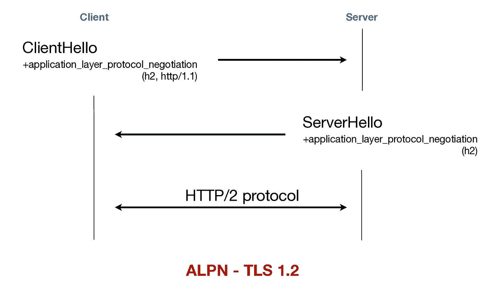
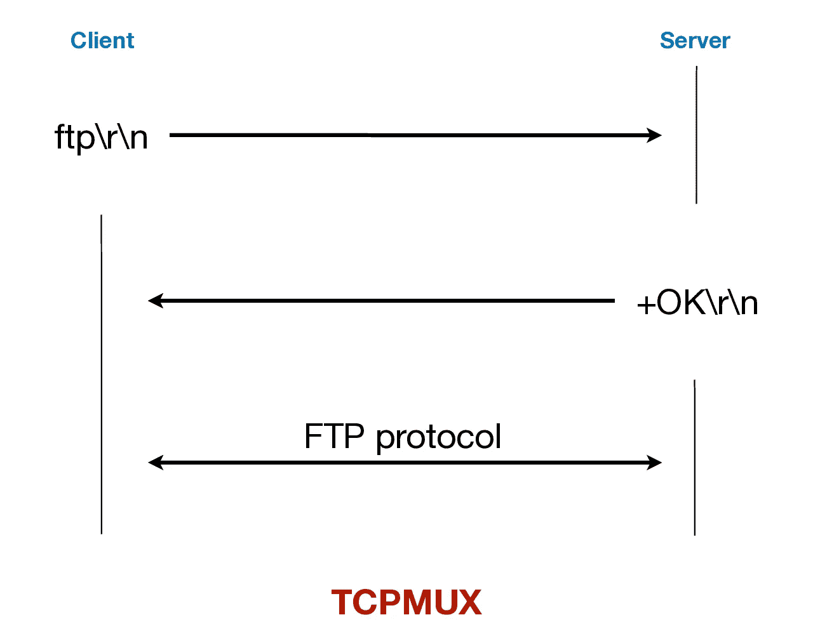
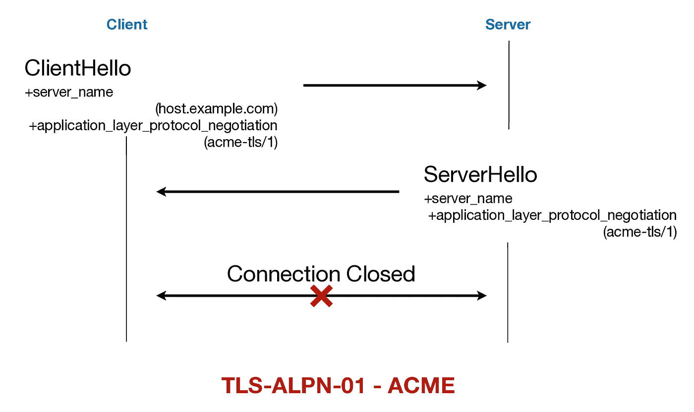

# 探索应用层协议协商(ALPN)

> 原文：<https://medium.com/geekculture/exploring-application-layer-protocol-negotiation-alpn-c47b5ec3b419?source=collection_archive---------4----------------------->

## [第 0 根安全网络(0SNet)](https://www.0snet.com)

## 简单的 TLS 扩展，在单个端口上支持不同的应用程序


Photo by [Julius Jansson](https://unsplash.com/@juliusjansson?utm_source=medium&utm_medium=referral) on [Unsplash](https://unsplash.com?utm_source=medium&utm_medium=referral)

互联网协议组是现代互联网的基础，它允许单个主机提供不同的服务。这些服务被分配了一个端口号，并且到该端口的任何连接都被认为是用于该服务的。举个例子，服务 *http* 和 *https* 分别使用端口号 **80** 和 **443** 。

这使得网络流量及其管理具有良好的可见性。然而，如果服务使用的协议已经改变并且不是向后兼容的，则需要使用新的端口号。当 **HTTPS** 简单地建立一个 **TLS** 会话并在其上运行 **HTTP** 时，它使用端口 **443** 而不是端口 **80** 。

这导致在部署中，运行在 *https* 端口上的服务将只处理 TLS 终止，并将请求传递给处理 *http* 的同一服务。否则，让服务在 *http* 端口上运行，将请求重定向到 *https* 服务，这是它唯一的功能。

# **应用层协议协商— ALPN**

HTTP/2 的引入改善了这种情况。HTTP/2 依靠 TLS 扩展[应用层协议协商(ALPN)](https://tools.ietf.org/html/rfc7301) 来使用通过 TLS 提供 HTTP/1.1 服务的同一个 *https* 端口。这可以无缝地工作，不会导致任何额外的网络延迟，也不需要任何额外的往返或升级机制。



一旦与服务器建立了连接，TLS 要求客户端发送一个 **ClientHello** 消息。该消息将包括扩展*应用层协议协商*，包含客户端支持的协议 id 列表。接收端的服务器可以忽略该扩展，或者选择一个协议，并将其作为其 **ServerHello** 消息的一部分发送给客户端。

协议 id 可以是[个注册 id](https://www.iana.org/assignments/tls-extensiontype-values/tls-extensiontype-values.xhtml#alpn-protocol-ids)中的一个，如**“http/1.1”**代表 HTTP/1.1，**“H2”**代表 HTTP/2。一旦 TLS 会话建立，客户机和服务器都将使用商定的应用程序协议。举个例子，如果客户端在其协议列表中发送**【H2】**，而服务器以**【H2】**响应，则客户端应该向服务器发送 HTTP/2 请求，而不是 HTTP/1.1 请求，即。，即使使用了 *https* 端口。

# TCP 端口服务复用器— **TCPMUX**

将单个端口用于多种服务的想法并不新鲜。事实上，端口号 **1** 被分配给一个名为 [TCP 端口服务复用器(TCPMUX)](https://tools.ietf.org/html/rfc1078) 的服务。客户端可以连接到端口 1 并发送**服务名<CRLF>。 *tcpmux* 服务会以**+原因< CRLF >** 或**-原因< CRLF >** 进行响应。如果得到肯定的响应，客户端就可以启动服务的协议，否则就关闭连接。**



TCPMUX 被[弃用](https://tools.ietf.org/html/rfc7805)。然而，我们可以用 ALPN 获得类似的功能。非 HTTP TLS 客户端有可能发送 ALPN 服务请求，服务器可以接受或拒绝该请求。请注意，ALPN 确实为拒绝案例定义了致命警报*no _ application _ protocol*。

然而，没有任何单一的端口分配给 ALPN 连接到一个人希望的服务。即使有，也有缺点，人们可以从 [TCPMUX 弃用](https://tools.ietf.org/html/rfc7805#page-4)中了解到，例如两台机器之间的最大连接数减少以及复杂的防火墙管理。

# 顶点

ALPN 的另一个主要用途是自动证书颁发。在 2018 年初发现[自动证书管理环境(ACME)](https://tools.ietf.org/html/rfc8555) 协议使用的基于 SNI 的方法通过 *https* 端口进行域验证是不安全的。这促使一种新的挑战方法在 ALPN 上进行域名验证。



为此目的分配了 ALPN 协议 id**“acme-TLS/1”**。支持客户端和服务器将使用 ALPN 扩展中的**“acme-TLS/1”**来执行域验证。需要注意的一个有趣事实是，没有[应用数据](https://tools.ietf.org/html/rfc8737#section-4)。

> 该协议包括一个 TLS 握手，其中传输所需的验证信息。“acme-tls/1”协议不携带应用程序数据。握手完成后，客户端不能再与服务器交换任何数据，必须立即关闭连接。

## nginx 配置

实际上，可以配置代理服务器，根据 ALPN 将流量路由到相应的服务。使用 *nginx* ，用户可以使用[*stream _ SSL _ preread _ module*](http://nginx.org/en/docs/stream/ngx_stream_ssl_preread_module.html)并将 ALPN 协议 id 映射到其相应的上游服务。

```
stream {
  map $ssl_preread_server_name $x_name {
    hostnames;
    default 10.0.3.11:443;
  } map $ssl_preread_alpn_protocols $x_up {
    ~\bacme-tls/1\b 127.0.0.1:10443;
    default         $x_name;
  } server {
    listen 443;
    proxy_pass $x_up;
    ssl_preread on;
  }
}
```

上面显示的示例配置可用于基于 ALPN 协议 id 和服务器名称(SNI)设置代理。它将协议 id**“acme-TLS/1”**映射到本地服务 127.0.0.1:10443，并将所有其他应用协议映射到基于服务器名称的映射。请注意，TLS 终端将位于上游服务器上。

随着 ALPN 的引入，术语**超过 *https*** 可以有新的含义。因为只要客户端支持 ALPN，就可以在 https 端口上提供几乎任何服务。这提供了很大的灵活性。而且，随着对 ALPN 的支持越来越广泛，我们可能会看到它的真正潜力。

## 参考资料:

1.  **https://tools.ietf.org/html/rfc7301**，[ALPN](https://tools.ietf.org/html/rfc7301)
2.  **TCPMUX** ，[https://tools.ietf.org/html/rfc1078](https://tools.ietf.org/html/rfc1078)
3.  **TLS-ALPN-01** ，【https://tools.ietf.org/html/rfc8737】T2

*在第 0 根，我们提供解决方案* [*第 0 根安全网络— 0SNet*](https://www.0snet.com/) *使用 TLS 客户端证书保护组织的内部 web 应用。请检查我们的产品，它易于部署，并可作为图像显示在*[*AWS*](https://0snet.info/#install.aws)*，*[*GCP*](https://0snet.info/#install.gcp)*和*[*Azure*](https://0snet.info/#install.azu)*上。*