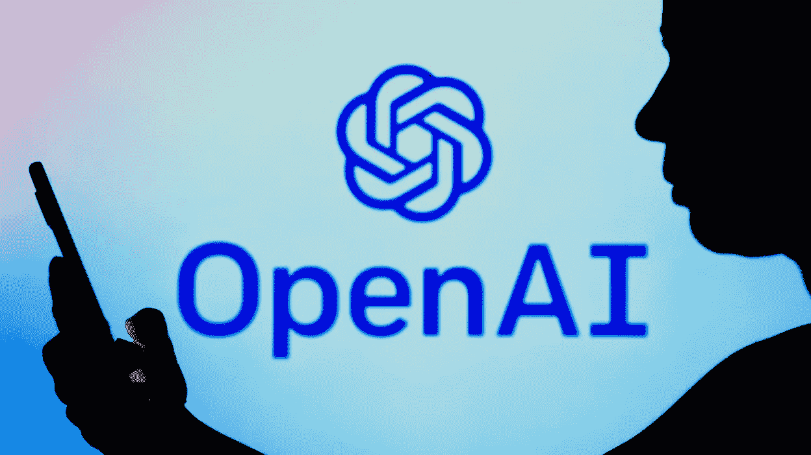

# 探索 ChatGPT:自然语言处理的未来

> 原文：<https://medium.com/geekculture/exploring-chatgpt-the-future-of-natural-language-processing-98597d866df5?source=collection_archive---------6----------------------->

释放 ChatGPT 的力量:这种最先进的人工智能模型如何革新自然语言处理

Credit: Getty / SOPA Images / Contributor

近年来，由于人工智能(AI)和机器学习的进步，自然语言处理(NLP)领域取得了重大进展。该领域最令人兴奋的发展之一是 ChatGPT，这是 OpenAI 为各种 NLP 任务训练的大型语言模型。

# 什么是 ChatGPT？

ChatGPT 是一个最先进的人工智能模型，已经在大规模文本数据数据集上进行了训练。这使得它能够理解和生成类似人类的文本，使其成为广泛的 NLP 任务的强大工具。

ChatGPT 的一个独特特性是它能够根据给定的提示继续生成文本。例如，如果您为 ChatGPT 提供一个句子的开头，它可以以一种听起来自然和类似人类的方式生成句子的其余部分。这使得它成为语言翻译和文本摘要等任务的优秀工具。

ChatGPT 另一个有趣的方面是它能够生成各种风格和色调的文本。这使得它可以用于制作营销文案或创意写作等任务，在这些任务中，文本的风格和语气非常重要。

# ChatGPT 是如何工作的？

ChatGPT 基于一种称为 transformer 的人工智能模型，它使用深度学习和自我关注机制的组合来处理和生成文本。这允许它理解输入文本的上下文和含义，并生成连贯和相关的输出文本。

ChatGPT 的一个关键创新是它能够生成长格式文本，比如整段甚至几页的文本。这是由于模型的庞大规模和分层架构的使用而成为可能的，这允许它在输入数据中捕获和生成复杂的模式。

# 为什么 ChatGPT 很重要？

生成类似人类的文本的能力在各种领域中具有许多潜在的应用。例如，ChatGPT 可以用来提高语言翻译系统的准确性和速度，或者自动总结长文档。

此外，ChatGPT 还可用于协助客户服务或内容审核等任务，有助于减少人工工作量并提高这些流程的效率。

总的来说，ChatGPT 是 NLP 领域的一个令人兴奋的发展，有可能彻底改变我们与语言交互的方式。随着人工智能技术的不断进步，我们可以期待在未来看到这一领域更令人兴奋的发展。

未来，随着人工智能技术的不断进步以及 ChatGPT 和其他大型语言模型的新应用的发现，我们可以期待在 NLP 领域看到更令人兴奋的发展。凭借其理解和生成类似人类文本的能力，ChatGPT 有可能彻底改变我们与语言和信息交互的方式。

PS:这个博客的内容是使用 [OpenAI 的 ChatGPT](https://chat.openai.com/chat) 生成的