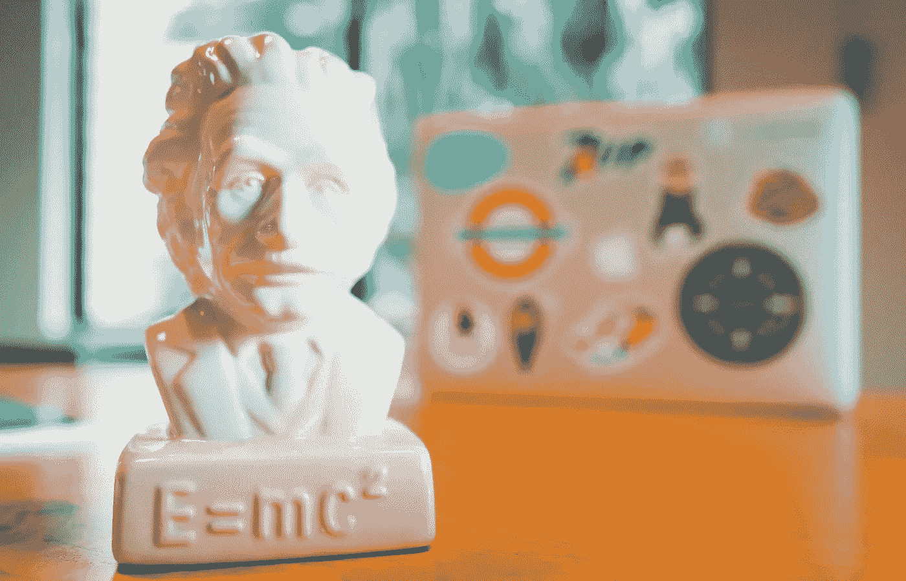

# 探索干净的代码——就像你是一个五岁的孩子。

> 原文：<https://medium.com/geekculture/exploring-clean-code-like-you-a-five-year-old-f80413505013?source=collection_archive---------26----------------------->

定义干净代码的技巧——为自己和他人易于维护。

MacBook Pro with E = mc2 figure on desk

# 从用户界面开始

解耦 UI 是等式的第一部分。这听起来可能不正确，但是，UI 可以在整个项目期间发生变化。努力巩固前期的 UI 元素讨论或布局选择有助于确定编码…