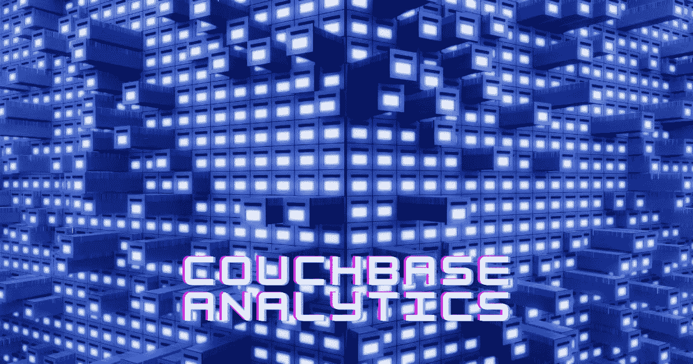

# 探索 Couchbase 分析服务

> 原文：<https://medium.com/geekculture/exploring-couchbase-analytics-service-6d2af7ea5043?source=collection_archive---------30----------------------->



最近，我一直在探索 Couchbase 分析服务，并发现与 Couchbase 查询服务相比，它如何更有用并提高效率。

Couchbase 分析服务附带企业附加功能。

Couchbase Analytics 是 Couchbase Server 的一个并行数据管理功能，旨在对许多记录高效地运行大型即席连接、集合、聚合和分组操作。

**为什么选择分析？**

每个企业都在循环或螺旋中做这三件事(目标)。

1.  运行业务流程，向客户交付产品或服务。
2.  分析业务，确定要改什么，改什么。
3.  让改变发生。

查询服务由运行业务所需的应用程序使用；它是为大量并发查询而设计的，每个查询执行少量的工作。在 RDBMS 世界中，这种工作负载称为 OLTP 工作负载。

用于分析的应用程序或工具具有不同的工作负载特征。这些通常使用分析服务；它是为分析大量文档的少量并发查询而设计的。在 RDBMS 世界中，这种工作负载被称为 OLAP 工作负载(在线分析处理)

Couchbase 分析方法的优势/为什么选择 Couchbase 分析？

**通用数据模型**:我们不必强制将数据放入一个扁平的、预定义的关系模型中进行分析
**工作负载隔离**:运营查询延迟和吞吐量不会因您的分析查询工作负载而降低
**高数据新鲜度**:分析运行在最新的数据上，没有 ETL 或延迟。**持续数据同步**
**易于管理的 SQL++接口**
通过单一系统降低基础架构复杂性、应用开发复杂性和运营与分析成本。

分析服务应该在它自己的集群节点上单独运行，由于它可能执行的操作的大规模和持续时间，没有其他 Couchbase 服务在该节点上运行。

分析服务所需的最低内存(RAM)配额为 1024 MB。

分析查询从不触及 Couchbase 数据服务器，而是并行运行在我们数据的实时阴影副本上。因此，不必担心复杂查询会降低 Couchbase 服务器节点的速度。

# 数据世界

分析数据世界中的顶级组织概念是 dataverse。

一个 **dataverse** ，是一个名称空间，它为您提供了一个为给定的分析应用程序创建和管理数据集和其他工件的地方。

在这方面，dataverse 类似于数据库或模式(模式是表示整个数据库的逻辑视图的框架结构。它定义了在关系 DBMS 中数据是如何组织的以及它们之间的关系是如何关联的。

数据集是保存 JSON 对象集合的容器。它们类似于 RDBMS 中的表或 N1QL 中的键空间。一个数据集链接到一个 Couchbase 存储桶，这样数据集就可以从 Couchbase 服务器获取数据。

新的分析实例从两个数据部分开始，一个称为元数据(系统目录)，一个称为默认值(可用于保存数据)。

第一个任务是告诉 Analytics 关于您想要隐藏的 Couchbase 服务器数据和您想要它存在的数据集。

```
CREATE DATASET datasetName ON `bucketName`;
```

如果 bucket 有不同类型或类别的数据，我们可以为那些使用`WHERE`的数据创建一个单独的数据集，它将被创建。

```
CONNECT LINK Local;
```

Local =本地服务器(同一集群中的数据服务)

现在从分析服务执行基本查询，检查是否一切正常。

```
SELECT meta(k) AS meta, k AS data 
FROM datasetName k 
LIMIT 1;
```

与 SQL 一样，查询的 FROM 子句将变量`k`递增地绑定到位于名为`datasetName`的数据集中的数据实例。SELECT 子句返回所有元信息以及满足谓词的每个绑定的数据值。

一旦设置完成，你也可以从 Couchbase java SDK 访问这个服务。

按照[使用 Couchbase Java SDK](https://kirankamath.hashnode.dev/establishing-connection-to-couchbase-server-from-aws-ec2-instance) 建立与 Couchbase 服务器的连接来设置 Java SDK。

在这篇博客之后，用下面的代码编辑 App.java 代码以使用 Couchbase analytics。

```
import com.couchbase.client.java.*;
import com.couchbase.client.java.kv.*;
import com.couchbase.client.java.json.*;
import com.couchbase.client.java.query.*;
import com.couchbase.client.core.error.CouchbaseException;
import com.couchbase.client.java.analytics.*;public class App {
    public static void main(String[] args) {
        try {
            Cluster cluster = Cluster.connect("localhost", "username", "password");
              final AnalyticsResult result = cluster
                .analyticsQuery("SELECT * FROM datasetName LIMIT 2;");for (JsonObject row : result.rowsAsObject()) {
                    System.out.println("Found row: " + row);
                    System.out.println();}} catch (CouchbaseException ex) {
              ex.printStackTrace();
            }
    }
}
```

学分: [Couchbase 文档](https://docs.couchbase.com/home/index.html)

*原发布于*[*https://blog . learnwithdata . me*](https://blog.learnwithdata.me/exploring-couchbase-analytics-service)*。*