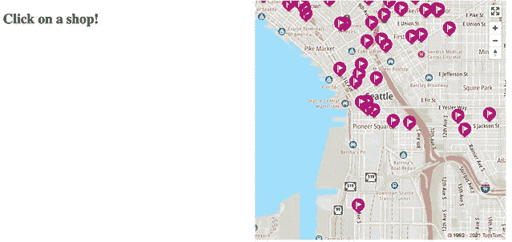
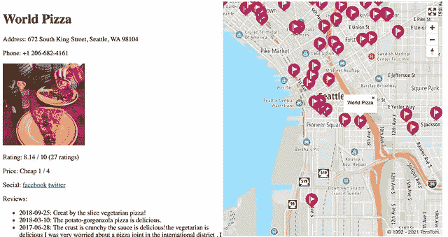

# 使用 TomTom 搜索 API 探索详细的 POI 数据

> 原文：<https://medium.com/geekculture/exploring-detailed-poi-data-with-the-tomtom-search-api-121c7de2980d?source=collection_archive---------55----------------------->


## 通过一点 JavaScript，我们将使用 TomTom POI Details API 创建一个简单的地图网页，突出显示西雅图周围不同的披萨店，并允许用户更详细地探索每家企业。

TomTom 搜索 API v6 帮助开发者访问[详细的兴趣点(POI)信息](https://developer.tomtom.com/search-api/search-api-documentation/points-of-interest-details)。示例包括商店的评级和评论、营业时间和照片。这为基于地图的应用程序增加了价值，通过每个 POI 的详细信息增强了用户体验。

本文使用 TomTom POI Details API 创建了一个简单的地图网页，突出显示了西雅图周围不同的披萨店，并允许用户更详细地了解每家企业。要学习这篇教程，你只需要知道一些 JavaScript。

# 兴趣点详细信息示例

常规搜索 API 已经返回了基本信息和兴趣点。这些信息包括企业名称、联系信息(如地址和电话号码)和 POI 类别类型。它还包含一个 POI 详细信息 ID，我们可以使用它来请求其他详细信息。您可以在嵌套在每个搜索 API 结果中的 dataSources 对象中找到它，如下所示:

```
"dataSources": {
  "poiDetails": [
    {
      "id": "45d78933f964a520e1421fe3",
      "sourceName": "Foursquare"
    }
  ]
}
```

详细数据添加了更具体的信息，如果可用的话。例子包括照片、价格区间、社交媒体链接、一周中每天的热门时段，甚至是文字评论。

例如，下面是我在西雅图最喜欢的一家比萨饼店的 JSON 格式的详细数据示例:

```
{
        "result": {
        "description": "Thin crust pizza in bustling Chinatown. World Pizza originated in the 1990's in the Belltown neighborhood.",
        "rating": {
            "totalRatings": 27,
            "value": 7.7,
            "minValue": 0,
            "maxValue": 10
            "id": "Rm91cnNxdWFyZTo0ZTE4YmI1NDdkOGI4YWY5MTM5MGQ3ZDg=", },
        "priceRange": {
            "value": 1,
            "label": "Cheap",
            "minValue": 1,
            "maxValue": 4
        },
        "socialMedia": [
            {
                "name": "facebook",
                "url": "https://facebook.com/profile.php?id=158562957492458"
            },
            {
                "name": "twitter",
                "url": "https://twitter.com/World_Pizza"
            }
        ],
        "photos": [
            {
                "id": "a35f4c83-2463-366f-a07b-1fde5877d415"
            },
            {
                "id": "ea498b33-d06c-3fa5-abbb-33662e6f32b7"
            },
            {
                "id": "08f6a677-f976-3c44-a1f2-0baacbd1870c"
            },
            {
                "id": "2b2c84da-df78-3e50-8682-03625e6993a6"
            },
            {
                "id": "0fa0f767-5181-3449-a62f-3d4f2337dcc0"
            }
        ],
        "reviews": [
            {
                "text": "Great by the slice vegetarian pizza!",
                "date": "2018-09-25"
            },
            {
                "text": "The potato-gorgonzola pizza is delicious.",
                "date": "2018-03-10"
            },
            {
                "text": "The crust is crunchy the sauce is delicious!the vegetarian is delicious I was very worried about a pizza joint in the international district , I am here at least once a week yummy",
                "date": "2017-06-28"
            },
            {
                "text": "Owner's very kind. Vegan pizza is honestly the best I've ever had! The happy hour was SUPER cheap (beer was only $1.50) and the atmosphere was perfect",
                "date": "2015-12-18"
            },
            {
                "text": "Best veggie pizzas",
                "date": "2015-05-16"
            },
            {
                "text": "Spicy field roast + pineapple pizza is awesome",
                "date": "2014-08-20"
            },
            {
                "text": "The red potato pizza is a delicious comfort food. Ingredients are super fresh and tasty (and all vegetarian!). The two owners are very nice guys! Excellent happy hour at 3 with pizza & drink specials.",
                "date": "2014-01-28"
            },
            {
                "text": "They have amazingly crispy chocolate chip cookies too!",
                "date": "2013-06-08"
            },
            {
                "text": "I'm not vegetarian, but that doesn't keep me from saying it's perhaps  the best pizza I've ever had. My favorites: the potato & the spicy veg pepperoni. Adam & Aaron are great guys!",
                "date": "2011-09-09"
            }
        ],
        "popularHours": [
            {
                "dayOfWeek": 1,
                "timeRanges": [
                    {
                        "startTime": {
                            "hour": 11,
                            "minute": 0
                        },
                        "endTime": {
                            "hour": 14,
                            "minute": 0
                        }
                    },
                    {
                        "startTime": {
                            "hour": 17,
                            "minute": 0
                        },
                        "endTime": {
                            "hour": 20,
                            "minute": 0
                        }
                    }
                ]
            },
            {
                "dayOfWeek": 2,
                "timeRanges": [
                    {
                        "startTime": {
                            "hour": 11,
                            "minute": 0
                        },
                        "endTime": {
                            "hour": 14,
                            "minute": 0
                        }
                    },
                    {
                        "startTime": {
                            "hour": 16,
                            "minute": 0
                        },
                        "endTime": {
                            "hour": 21,
                            "minute": 0
                        }
                    }
                ]
            },
            {
                "dayOfWeek": 3,
                "timeRanges": [
                    {
                        "startTime": {
                            "hour": 11,
                            "minute": 0
                        },
                        "endTime": {
                            "hour": 19,
                            "minute": 0
                        }
                    }
                ]
            },
            {
                "dayOfWeek": 4,
                "timeRanges": [
                    {
                        "startTime": {
                            "hour": 11,
                            "minute": 0
                        },
                        "endTime": {
                            "hour": 21,
                            "minute": 0
                        }
                    }
                ]
            },
            {
                "dayOfWeek": 5,
                "timeRanges": [
                    {
                        "startTime": {
                            "hour": 11,
                            "minute": 0
                        },
                        "endTime": {
                            "hour": 21,
                            "minute": 0
                        }
                    }
                ]
            },
            {
                "dayOfWeek": 6,
                "timeRanges": [
                    {
                        "startTime": {
                            "hour": 11,
                            "minute": 0
                        },
                        "endTime": {
                            "hour": 20,
                            "minute": 0
                        }
                    }
                ]
            },
            {
                "dayOfWeek": 7,
                "timeRanges": [
                    {
                        "startTime": {
                            "hour": 12,
                            "minute": 0
                        },
                        "endTime": {
                            "hour": 18,
                            "minute": 0
                        }
                    }
                ]
            }
        ]
    }
}
```

很不错，对吧？JSON 对象中的大部分数据应该是不言自明的，但是您可能会注意到 photos 部分包含一组 id 而不是 URL。

您可以使用这些 id 和[TomTom Points of Interest Photos API](https://developer.tomtom.com/search-api/search-api-documentation/points-of-interest-photos)来检索指定宽度和高度的图像。使用该 API 时，请务必遵循[条款和条件](https://developer.tomtom.com/terms-and-conditions)。这包括将来自细节 API 和照片 API 的结果归为“由 Foursquare 提供支持”另外，缓存结果的时间不要超过 30 天。

# 从 TOMTOM 获取 POI 详细数据

现在，看看如何使用兴趣点细节 API 通过 JavaScript 获取详细数据。

首先，收集一个 [TomTom API 密钥](https://developer.tomtom.com/how-to-get-tomtom-api-key)来使用这些 API。注册 TomTom 开发者门户既快捷又免费。TomTom 自动生成第一个密钥。

下一步是用 [TomTom Maps SDK for Web](https://developer.tomtom.com/maps-sdk-web-js/documentation) 设置网页，这样就可以详细搜索兴趣点。创建一个新网页，并在标题中包含 TomTom SDK 文件。下面使用了[映射 JS 库](https://api.tomtom.com/maps-sdk-for-web/6.x/6.13.0/documentation/dist/modules/Maps.html)、它的 CSS 样式表和[服务 JS 库](https://api.tomtom.com/maps-sdk-for-web/6.x/6.13.0/documentation/dist/modules/Services.html)。

```
<!DOCTYPE html>
<html>
    <head>
        <meta http-equiv='X-UA-Compatible' content='IE=Edge' />
        <meta charset='UTF-8'>
        <title>TomTom POI Details API Example</title>
        <meta name='viewport'
              content='width=device-width,initial-scale=1,maximum-scale=1,user-scalable=no'/>
        <link rel='stylesheet' type='text/css' href='https://api.tomtom.com/maps-sdk-for-web/cdn/6.x/6.12.0/maps/maps.css'>
        <script src='https://api.tomtom.com/maps-sdk-for-web/cdn/6.x/6.12.0/maps/maps-web.min.js'></script>
        <script src='https://api.tomtom.com/maps-sdk-for-web/cdn/6.x/6.13.0/services/services-web.min.js'></script>
    </head>
    <body>
        <script>
            ( async () => {
                // Your Code Here
            })();
        </script>
    </body>
</html>
```

接下来，获取一些兴趣点位置。从各种选项中进行选择，以从 TomTom 搜索和检索 POI 位置，如[模糊搜索](https://developer.tomtom.com/search-api/search-api-documentation-search/fuzzy-search)、[类别搜索](https://developer.tomtom.com/search-api/search-api-documentation-search/category-search)和[附近搜索](https://developer.tomtom.com/search-api/search-api-documentation-search/nearby-search)。使用 [TomTom Maps POI 搜索 API](https://developer.tomtom.com/search-api/search-api-documentation-search/points-interest-search) 并以经纬度坐标为中心获取默认距离半径内的结果。

POI 搜索 API 支持许多选项来帮助缩小结果范围，包括企业类型或位置。本例使用带有**中心**选项的**查询**字段来查找与某个位置附近的搜索短语相匹配的任何兴趣点。我们将尝试搜索西雅图附近的比萨饼。

使用 SDK，将 [API 键](https://developer.tomtom.com/how-to-get-tomtom-api-key)连同查询文本“pizza”和西雅图的经度和纬度位置坐标(-122.33，47.60)传递给 **tt.services.poiSearch** 服务:

```
const data = await tt.services.poiSearch({
    key: "YOUR API KEY HERE",
    query: "pizza",
    center: [ -122.33, 47.60 ] // Seattle
});
```

返回的数据应该类似于以下内容:

```
{
    "summary": {
        "query": "pizza",
        "queryType": "NON_NEAR",
        "queryTime": 276,
        "numResults": 100,
        "offset": 0,
        "totalResults": 369504,
        "fuzzyLevel": 1,
        "geoBias": {
            "lat": 47.6,
            "lon": -122.33
        }
    },
    "results": [
        {
            "type": "POI",
            "id": "g6JpZK84NDA1MzkwMDMwNzQ0MTShY6NVU0GhdqdVbmlmaWVk",
            "score": 2.5745153427,
            "dist": 195.61886948402355,
            "info": "search:ta:840539003074414-US",
            "poi": {
                "name": "Mod Pizza",
                "phone": "+1 206-338-7356",
                "brands": [
                    {
                        "name": "Mod Pizza"
                    }
                ],
                "categorySet": [
                    {
                        "id": 7315036
                    }
                ],
                "url": "https://modpizza.com/locations/occidental-square/",
                "categories": [
                    "pizza",
                    "restaurant"
                ],
                "classifications": [
                    {
                        "code": "RESTAURANT",
                        "names": [
                            {
                                "nameLocale": "en-US",
                                "name": "restaurant"
                            },
                            {
                                "nameLocale": "en-US",
                                "name": "pizza"
                            }
                        ]
                    }
                ]
            },
            "address": {
                "streetNumber": "202",
                "streetName": "Occidental Avenue South",
                "municipalitySubdivision": "Downtown Seattle",
                "municipality": "Seattle",
                "countrySecondarySubdivision": "King",
                "countrySubdivision": "WA",
                "countrySubdivisionName": "Washington",
                "postalCode": "98104",
                "extendedPostalCode": "98104-3120",
                "countryCode": "US",
                "country": "United States",
                "countryCodeISO3": "USA",
                "freeformAddress": "202 Occidental Avenue South, Seattle, WA 98104",
                "localName": "Seattle"
            },
            "position": {
                "lng": -122.33251,
                "lat": 47.60048
            },
            "viewport": {
                "topLeftPoint": {
                    "lng": -122.33384,
                    "lat": 47.60138
                },
                "btmRightPoint": {
                    "lng": -122.33118,
                    "lat": 47.59958
                }
            },
            "entryPoints": [
                {
                    "type": "main",
                    "position": {
                        "lng": -122.33289,
                        "lat": 47.60079
                    }
                }
            ],
            "dataSources": {
                "poiDetails": [
                    {
                        "id": "Rm91cnNxdWFyZTo1Y2UzMTJlNTAxYmM1YTAwMmM3M2MzNDE=",
                        "sourceName": "Foursquare"
                    }
                ]
            }
        },
        ...
    ]
}
```

一些结果包括一个**数据源**字段，指示它们具有额外的 POI 细节。通过使用兴趣点细节 API 引用 ID 值，从 TomTom 检索这些细节。作为测试，通过使用 TomTom SDK for Web 传递 API 键和 POI 数据源 ID 值，接收第一个 POI 结果的详细信息:

```
const details = await tt.services.poiDetails({
    key: "YOUR API KEY HERE",
    id: data.results[ 0 ].dataSources.poiDetails[ 0 ].id
});
```

这就是访问应用程序位置数据的全新细节的全部内容。但是，这还没有完成。

既然我们已经设置好检索感兴趣点的详细信息，那么让我们将它与 TomTom 地图显示 API 结合起来，创建一个该地区周围比萨饼店的交互式地图。

# 集成兴趣点详细信息数据

要完成该应用程序，请向代码中添加一些用户界面(UI)元素:地图显示和细节部分。

## **添加地图显示**

首先，在网页标题的

```
<style>
    #map {
        width: 48vw;
        height: 98vh;
    }
 #details {
        width: 48vw;
        padding: 3px;
        float: left;
    }
</style>
```

接下来，在 UI 页面主体中添加这两个

元素:

```
<div id="details"><h1>Click on a shop!</h1></div>
<div id="map"></div>
```

将 API 键、位置坐标和搜索查询作为全局变量放在顶部。(请注意，在产品发布应用程序中，保持 API 密钥比将其直接放在网页中更安全)。

然后初始化地图显示并添加一些控件:

```
const key = "YOUR API KEY HERE";
const position = [ -122.33, 47.60 ]; // Seattle
const query = "pizza";( async () => {
    var map = tt.map({
        key: key,
        container: "map",
        dragPan: true,
        center: position,
        zoom: 13
    });
    map.addControl(new tt.FullscreenControl());
    map.addControl(new tt.NavigationControl());
    const data = await tt.services.poiSearch({
        key: key,
        query: query,
        center: position
    });
})();
```

此时，当您在浏览器中打开网页时，您应该会在页面的右半部分看到以西雅图为中心的交互式地图，在页面的左半部分看到详细信息的空间。



## 添加兴趣点搜索结果

接下来，将我们的 POI 搜索结果的标记添加到地图中，并使用户能够单击它们来动态加载和查看 POI 的详细信息。

创建一个名为 **createMarker** 的辅助函数，在地图显示的特定位置放置一个定制颜色的标记，并弹出一个位置名称的弹出窗口。如果作为参数传入，它应该分配并调用 **onclick** 事件处理程序:

```
function createMarker( map, position, color, data, onClick ) {
    const popup = new tt.Popup({ offset: 30 }).setText( data.poi.name );
    const marker = new tt.Marker({ anchor: "bottom", color: color })
        .setLngLat( position )
        .setPopup( popup )
        .addTo( map );
    if( onClick ) {
        marker._element.addEventListener( "click", onClick );
    }
}
```

然后，创建第二个名为 **displayDetails** 的辅助函数。这使用基本 POI 数据和详细数据来填充我们的详细信息部分，这是页面左半部分的一个信息面板。此外，根据 API 条款和条件，确保文本“由 Foursquare 提供支持的结果”显示在底部。

```
function displayDetails( data, details ) {
    const element = document.getElementById( "details" );
    // Clear out the current details
    element.innerHTML = "";
    // Show the location name
    const title = document.createElement( "h1" );
    title.innerText = data.poi.name;
    element.append( title );
    // Show additional information if it is included
    if( data.address ) {
        const address = document.createElement( "p" );
        address.innerText = `Address: ${data.address.freeformAddress}`;
        element.append( address );
    }
    if( data.poi.phone ) {
        const phone = document.createElement( "p" );
        phone.innerText = `Phone: ${data.poi.phone}`;
        element.append( phone );
    }
    if( details ) {
        if( details.photos ) {
            const photo = document.createElement( "img" );
            photo.src = `https://api.tomtom.com/search/2/poiPhoto?key=${key}&id=${details.photos[ 0 ].id}&width=200&height=200`;
            element.append( photo );
        }
        if( details.rating ) {
            const rating = document.createElement( "p" );
            rating.innerText = `Rating: ${details.rating.value} / ${details.rating.maxValue} (${details.rating.totalRatings} ratings)`;
            element.append( rating );
        }
        if( details.priceRange ) {
            const price = document.createElement( "p" );
            price.innerText = `Price: ${details.priceRange.label} ${details.priceRange.value} / ${details.priceRange.maxValue}`;
            element.append( price );
        }
        if( details.socialMedia ) {
            const social = document.createElement( "p" );
            social.innerHTML = `Social: ${details.socialMedia.map( s => `<a href="${s.url}">${s.name}</a>` ).join( " " )}`;
            element.append( social );
        }
        if( details.reviews ) {
            const reviewsHeader = document.createElement( "p" );
            reviewsHeader.innerText = "Reviews:";
            element.append( reviewsHeader );
            const reviews = document.createElement( "ul" );
            details.reviews.forEach( r => {
                const review = document.createElement( "li" );
                review.innerHTML = `<li>${r.date}: ${r.text}</li>`;
                reviews.append( review );
            });
            element.append( reviews );
        }
        // Per usage terms and conditions
        const poweredText = document.createElement( "p" );
        poweredText.innerText = "Results powered by Foursquare";
        element.append( poweredText );
    }
    else {
        const detailText = document.createElement( "p" );
        detailText.innerText = "No Additional Details";
        element.append( detailText );
    }
}Also, expand the POI Search from the default limit of 10 results to 100\. This shows more locations on the map.const data = await tt.services.poiSearch({
    key: key,
    query: query,
    center: position,
    limit: 100,
});
```

最后，遍历搜索结果。在地图上为每个结果放置一个标记，并在 click 事件处理程序中加载和显示详细信息:

```
data.results.forEach( p => {
    createMarker( map, [ p.position.lng, p.position.lat ], "#c30b82", p, async () => {
        if( p.dataSources && p.dataSources.poiDetails.length > 0 ) {
            // Detail sources available
            const details = await tt.services.poiDetails({
                key: key,
                id: p.dataSources.poiDetails[ 0 ].id
            });
            displayDetails( p, details.result );
        }
        else {
            // No detail sources
            displayDetails( p, null );
        }
    });
});
```

一切就绪后，点击地图上的披萨店，查看照片、评分和评论、价格范围等。



以下是完整的项目代码，供参考:

```
<!DOCTYPE html>
<html>
    <head>
        <meta http-equiv='X-UA-Compatible' content='IE=Edge' />
        <meta charset='UTF-8'>
        <title>TomTom POI Details API Example</title>
        <meta name='viewport'
              content='width=device-width,initial-scale=1,maximum-scale=1,user-scalable=no'/>
        <link rel='stylesheet' type='text/css' href='https://api.tomtom.com/maps-sdk-for-web/cdn/6.x/6.12.0/maps/maps.css'>
        <script src='https://api.tomtom.com/maps-sdk-for-web/cdn/6.x/6.12.0/maps/maps-web.min.js'></script>
        <script src='https://api.tomtom.com/maps-sdk-for-web/cdn/6.x/6.13.0/services/services-web.min.js'></script>
        <style>
            #map {
                width: 48vw;
                height: 98vh;
            }
 #details {
                width: 48vw;
                padding: 3px;
                float: left;
            }
        </style>
    </head>
    <body>
        <div id="details"><h1>Click on a shop!</h1></div>
        <div id="map"></div>
        <script>
            const key = "YOUR API KEY HERE";
            const position = [ -122.33, 47.60 ]; // Seattle
            const query = "pizza"; function createMarker( map, position, color, data, onClick ) {
                const popup = new tt.Popup({ offset: 30 }).setText( data.poi.name );
                const marker = new tt.Marker({ anchor: "bottom", color: color })
                    .setLngLat( position )
                    .setPopup( popup )
                    .addTo( map );
                if( onClick ) {
                    marker._element.addEventListener( "click", onClick );
                }
            } function displayDetails( data, details ) {
                const element = document.getElementById( "details" );
                // Clear out the current details
                element.innerHTML = "";
                // Show the location name
                const title = document.createElement( "h1" );
                title.innerText = data.poi.name;
                element.append( title );
                // Show additional information if it is included
                if( data.address ) {
                    const address = document.createElement( "p" );
                    address.innerText = `Address: ${data.address.freeformAddress}`;
                    element.append( address );
                }
                if( data.poi.phone ) {
                    const phone = document.createElement( "p" );
                    phone.innerText = `Phone: ${data.poi.phone}`;
                    element.append( phone );
                }
                if( details ) {
                    if( details.photos ) {
                        const photo = document.createElement( "img" );
                        photo.src = `https://api.tomtom.com/search/2/poiPhoto?key=${key}&id=${details.photos[ 0 ].id}&width=200&height=200`;
                        element.append( photo );
                    }
                    if( details.rating ) {
                        const rating = document.createElement( "p" );
                        rating.innerText = `Rating: ${details.rating.value} / ${details.rating.maxValue} (${details.rating.totalRatings} ratings)`;
                        element.append( rating );
                    }
                    if( details.priceRange ) {
                        const price = document.createElement( "p" );
                        price.innerText = `Price: ${details.priceRange.label} ${details.priceRange.value} / ${details.priceRange.maxValue}`;
                        element.append( price );
                    }
                    if( details.socialMedia ) {
                        const social = document.createElement( "p" );
                        social.innerHTML = `Social: ${details.socialMedia.map( s => `<a href="${s.url}">${s.name}</a>` ).join( " " )}`;
                        element.append( social );
                    }
                    if( details.reviews ) {
                        const reviewsHeader = document.createElement( "p" );
                        reviewsHeader.innerText = "Reviews:";
                        element.append( reviewsHeader );
                        const reviews = document.createElement( "ul" );
                        details.reviews.forEach( r => {
                            const review = document.createElement( "li" );
                            review.innerHTML = `<li>${r.date}: ${r.text}</li>`;
                            reviews.append( review );
                        });
                        element.append( reviews );
                    }
                    // Per usage terms and conditions
                    const poweredText = document.createElement( "p" );
                    poweredText.innerText = "Results powered by Foursquare";
                    element.append( poweredText );
                }
                else {
                    const detailText = document.createElement( "p" );
                    detailText.innerText = "No Additional Details";
                    element.append( detailText );
                }
            } ( async () => {
                var map = tt.map({
                    key: key,
                    container: "map",
                    dragPan: true,
                    center: position,
                    zoom: 13
                });
                map.addControl(new tt.FullscreenControl());
                map.addControl(new tt.NavigationControl());
                const data = await tt.services.poiSearch({
                    key: key,
                    query: query,
                    center: position,
                    limit: 100,
                });
                data.results.forEach( p => {
                    createMarker( map, [ p.position.lng, p.position.lat ], "#c30b82", p, async () => {
                        if( p.dataSources && p.dataSources.poiDetails.length > 0 ) {
                            // Detail sources available
                            const details = await tt.services.poiDetails({
                                key: key,
                                id: p.dataSources.poiDetails[ 0 ].id
                            });
                            displayDetails( p, details.result );
                        }
                        else {
                            // No detail sources
                            displayDetails( p, null );
                        }
                    });
                });
            })();
        </script>
    </body>
</html>
```

# 后续步骤

只需一点代码，TomTom Maps SDK for Web 和 Points of Interest Details API，我们就可以在网页中创建一个完全可探索的披萨地图。游客可以查看每家披萨店的有用信息。现在我们可以找个地方今晚吃晚饭了！

尝试使用这段代码的有趣想法包括:

*   将位置更改为不同的城市，或在应用程序中启用城市选择
*   通过将查询更改为“冰激凌”或“咖啡”来创建不同的 POI 搜索地图
*   将自定义图标添加到标记中，以指示商店的类型
*   添加一个 HTML 元素覆盖图，将详细信息直接嵌入到弹出窗口中

TomTom 的 iOS SDK 和 T2 的 Android SDK 也有助于将这一功能嵌入到移动应用中。要了解更多关于 TomTom 地图 API 的信息，请查看[文档](https://developer.tomtom.com/docs-and-tools)和[教程](https://developer.tomtom.com/tutorials)。此外，[在线文档和示例](https://developer.tomtom.com/maps-sdk-web-js)是展示 TomTom SDK for Web 还能做什么的很好的资源。

*本文原载于*[*https://developer.tomtom.com/blog*](https://developer.tomtom.com/blog)*。*