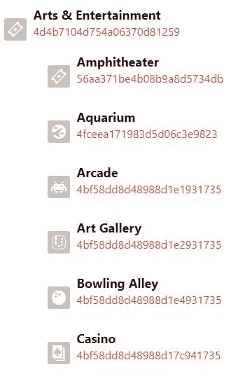
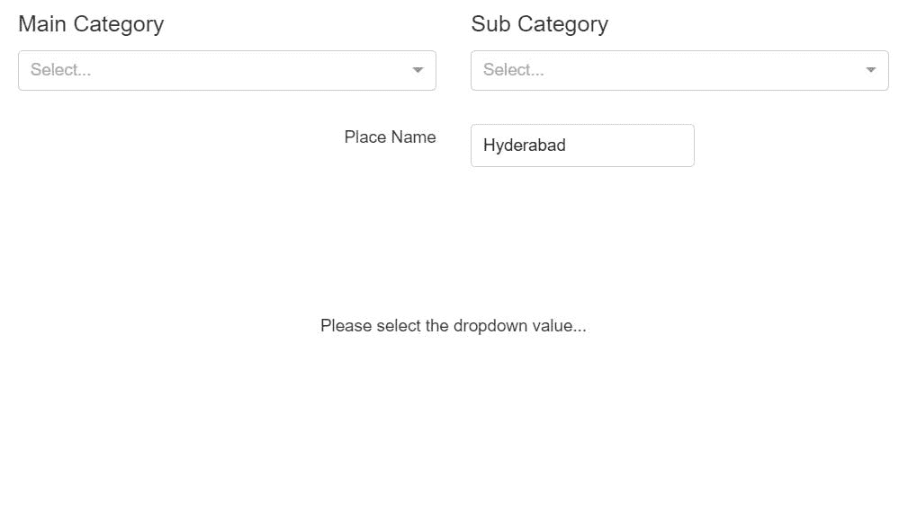
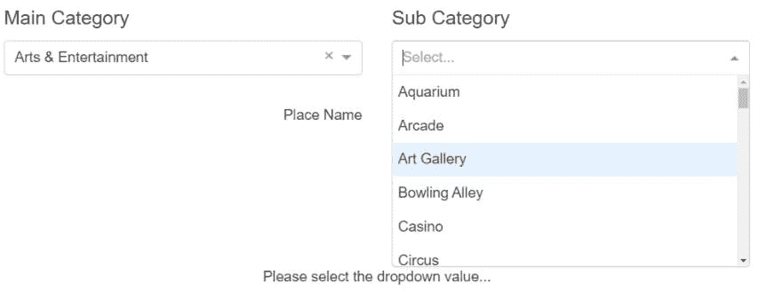
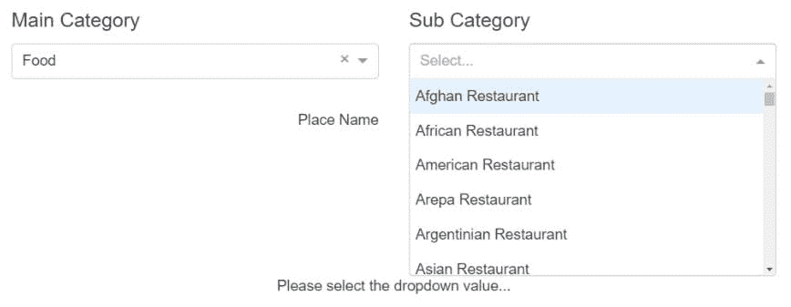
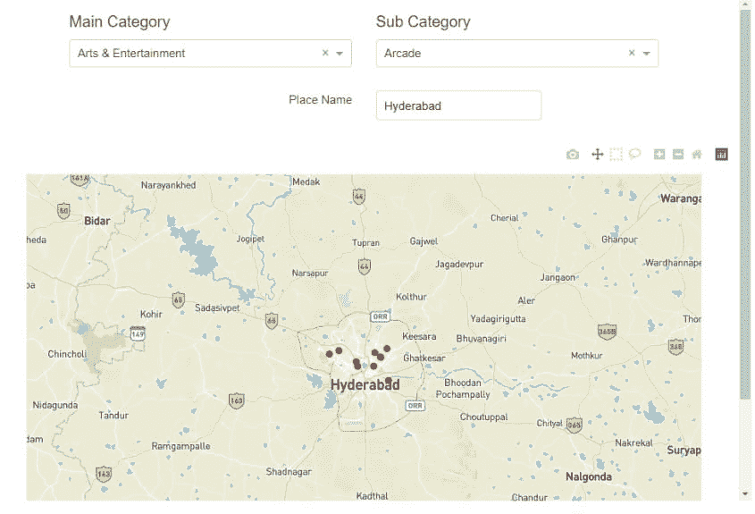

# 使用 Python 和 JupyterDash 探索 Foursquare 场馆 API

> 原文：<https://medium.com/geekculture/exploring-foursquare-api-for-venues-with-python-and-jupyterdash-b95d21aae307?source=collection_archive---------14----------------------->

一些有趣的定位服务

Photo by [Alessandra Onisor](https://unsplash.com/@aless_onisor?utm_source=medium&utm_medium=referral) on [Unsplash](https://unsplash.com?utm_source=medium&utm_medium=referral)

# 介绍

在本文中，我们将尝试探索 Foursquare(一家以基于位置的服务而闻名的公司)提供的 API。有了这个 API，我们可以在我们的应用程序或网站中增强基于位置的体验。

给定一个特定的位置，我们可以找到不同类型的场所，从咖啡店到旅游和交通。为了利用 API，我们需要首先创建一个[开发者账户](https://developer.foursquare.com/docs/places-api/getting-started/)。在创建 so 时，Foursquare 提供了两种类型的 ID:

1.  客户端 ID
2.  客户机密

这两项对于获取与所提供的位置相关的任何类别的场馆数据非常重要。除此之外，我们还需要[openrouteservice.org](http://openrouteservice.org/)API 和[mapbox.com](http://mapbox.com/)API。你可以参考我之前的[博客](https://python.plainenglish.io/exploring-open-route-service-api-820a0ccffecc)来了解一下。

在这个博客上，我想分享我在周末项目中实现的工作概念验证。

# 履行

如果你想得到视频解释，你可以看下面的视频和一些额外的细节。

# `import`包装

和往常一样，我们从导入对 POC 至关重要的包开始。

# API 读数

**OpenRouteService 令牌**

**地图框令牌**

**四方场馆**

Foursquare 提供了几个场地类别。对于每个场馆类别，我们都有一个唯一的 ID(具体称为`categoryId`)。要了解公司提供的不同场地的类别，您可以查看[这个](https://developer.foursquare.com/docs/build-with-foursquare/categories/)获取信息。下图解释了这一点。

Foursquare venues

从图像中，我们可以注意到我们有一个`categoryName`和它的`categoryId`。

*   我们每次都可以参考该网站，并获取我们感兴趣的场地的详细信息。
*   或者，我们可以保存所有的名称和 id，并创建一个下拉列表，让用户可以自由地从列表中选择任何内容。

(作为这个项目的一部分，我已经按照类别收集了所有的名字和 id，并将它们保存在一个 JSON 文件中。不过，如果你有兴趣了解我是怎么刮的，可以看看我的[笔记本](https://jovian.ai/msameeruddin/foursquare-api-test/v/3)。您也可以从[这里](https://gist.githubusercontent.com/msameeruddin/a701042de9bfb58206d2d763dee665a6/raw/13b358e01e81f9f57cc8c82223e46f52c0e954ea/foursquare_venue_categories.json)下载数据。)

总的来说，我们有`10`个主要类别。在每个类别中，我们都有子类别。

**四方凭证**

我已经创建了我的开发者帐户，并将秘密保存在我的本地文件中。

凭证的`keys`见下图。

# 提取主要和子类别

由于数据被加载到一个名为`foursquare_venues`的变量中，我们只需要相应地解析数据来提取主类别和相应的子类别。

因此，下面的助手函数。

# 位置助手(地理编码器)

Foursquare API 的主要目的是获取与位置相关的场馆数据。没有位置(坐标)，我们无法获取数据。要得到位置坐标，我们必须遵循两个方面:

*   设备位置(默认情况下)
*   用户的兴趣(应用程序用户可以更改位置区域)

因此，下面的助手函数。

# 应用程序初始化

`JupyterDash`是`Dash`软件包的一部分，专用于在笔记本电脑环境中创建用户应用程序。让我们初始化应用程序。

默认`external_stylesheets`用于 app 设计。这是一个经典的设计，可以用于任何 web 应用程序。

# 应用程序布局

`JupyterDash`应用的布局设计类似于`Dash`应用。变量(对象)`app`有一个名为`layout`的属性，用于保存整个设计。

**布局设计**

**布局输出**

Image by Author

用户必须选择下拉列表值来可视化与地名和类别相关的场馆位置。后端还没有出现。

# 应用回调

`JupyterDash`应用程序的回调(后端)类似于`Dash`应用程序。回调充当更新函数的装饰器，因此不需要调用函数来表示输出/结果。

在上面的代码中，我们有两个回调。

*   第一个指示子类别下拉列表的修改。请注意当主类别更新时，子类别下拉列表是如何变化的。

Image by Author

Image by Author

*   第二个用于显示地图。

Image by Author

(以上只是图片而非工作 app。)

# 应用服务器

要查看应用程序，需要激活应用程序的服务器。请随意从下拉列表中选择不同的值，以观察地图结果的变化。

(无论什么时候想换地点，只要提一个不同的地名，回车就可以了。)

Image by Author

好了，这篇文章就到这里。你可以在这里找到我的笔记本，里面有完整的代码。你也可以订阅我的时事通讯来获取这些独家内容。谢谢大家。

**结束**