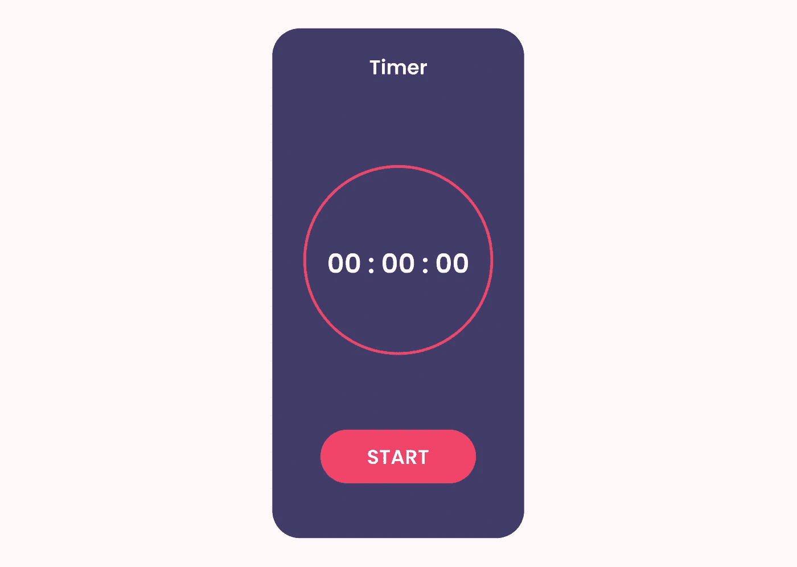
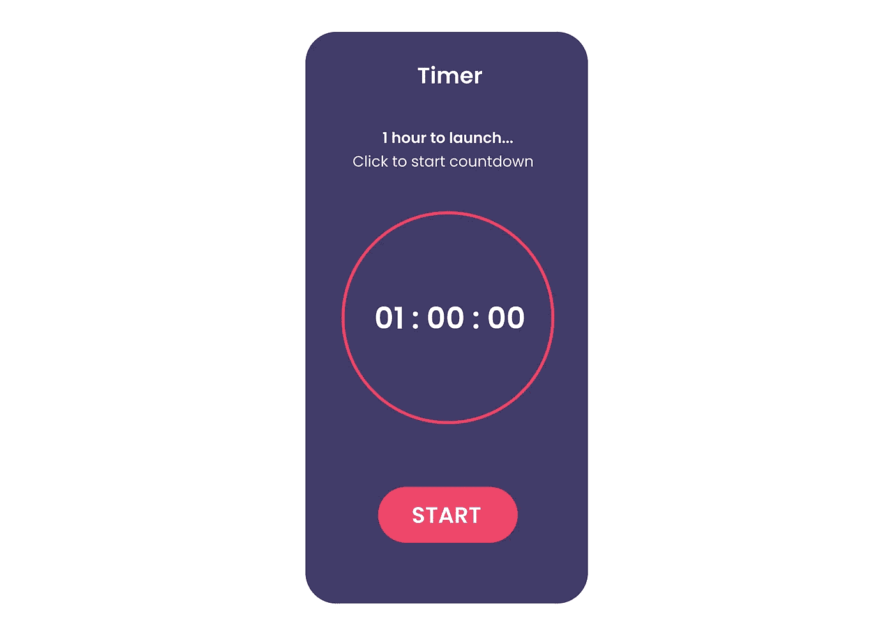

# 探索 Jetpack Compose —构建一个简单的倒计时应用程序

> 原文：<https://medium.com/geekculture/exploring-jetpack-compose-build-a-simple-countdown-timer-app-3151f8000529?source=collection_archive---------2----------------------->

## 药典



最近，Android 团队宣布发布 Jetpack Compose 测试版

“Android 构建原生 UI 的现代工具包。它简化并加速了 Android 上的 UI 开发。借助更少的代码、强大的工具和直观的 Kotlin APIs，快速实现您的应用。”

基本上，Jetpack Compose 通过提供声明性 API，使用“声明性”方法来构建 UI。

简而言之——有了 Jetpack Compose，就不需要创建“XML”布局来构建 UI。

我将通过构建一个简单`Countdown Timer App`，即从`60`秒(1 小时)到`0`的倒计时，向您展示如何开始使用 JetPack Compose。

最终的应用程序将如下所示:



这里有一段视频展示了它是如何工作的

好了，让我们开始“作曲”🎼

**步骤**

1.  设置 Android Studio
2.  添加依赖关系
3.  创建活动、类、文件

**1。设置 ANDROID 工作室**

*   在撰写本文时，Jetpack Compose 目前处于测试阶段，所有功能都没有完全稳定。建议下载 Android Studio Canary 的最新版本，以便与 Jetpack Compose 配合使用。在此下载—[https://developer.android.com/studio/preview](https://developer.android.com/studio/preview)
*   安装
*   安装完成后，**新建一个项目**，在**选择项目模板**窗口中，选择**空合成活动**，点击**下一步**。
*   在**配置您的项目**窗口中，执行以下操作:
*   像平常一样设置**名称**、**包名称**和**保存位置**。
*   请注意，在**语言**下拉菜单中， **Kotlin** 是唯一可用的选项，因为 Jetpack Compose 只适用于用 Kotlin 编写的类。
*   在**最低 API 等级下拉菜单**中，选择 API 等级 21 或更高。
*   点击**完成**
*   在项目包名称下创建 **5 个**新包:
    命名为:`helper`、`ui`(大多数时候这是自动为你创建的)、`utils`、`view`、`viewmodel`

2.**添加依赖关系**

*   转到 **Build.gradle** (模块:App)
*   包括以下依赖项以及默认提供的依赖项

```
//life cycle 
implementation 'androidx.lifecycle:lifecycle-runtime-ktx:2.3.0'

//runtime liveDate
implementation "androidx.compose.runtime:runtime-livedata:$compose_version"

//viewModel
implementation "androidx.lifecycle:lifecycle-viewmodel-//view binding - added if you prefer to use viewBinding with compose
implementation "androidx.compose.ui:ui-viewbinding:$compose_version"compose:1.0.0-alpha02"//konfetti
implementation 'nl.dionsegijn:konfetti:1.2.6'
```

*   你完整的 **Build.gradle** (模块:App) `dependency block`应该是这样的:

3.**创建** **活动、类和文件**

## **助手和实用程序类**

*   在`helper`包下，右键选择 N **ew Kotlin 文件/类**
*   单击并将该类命名为 **SingleLiveEvent**
*   这个类是`MutableLiveData`的子类，每次只有一个观察者观察它，因此它知道视图的生命周期，并在需要时发出一次数据
*   以下是完整代码

*   太好了，在 **utils** 包下，创建一个新的 Kotlin — `Object`，命名为**utility**
*   `Utility Object`包含:
    -时间常数—将 1 小时转换为毫秒— `60000L`
    -格式化时间的函数，将数值转换为分和秒显示在 UI 中。
*   完整代码如下:

## **ViewModel 类**

*   在`viewmodel`包下，创建一个名为 **MainViewModel** 的新类
*   **MainViewModel** 类扩展了`viewModel`，它包含了以生命周期意识的方式存储和管理 UI 相关数据的代码。`[ViewModel](https://developer.android.com/reference/androidx/lifecycle/ViewModel)`类允许数据在屏幕旋转等配置变化后仍然存在。
*   它还包含逻辑，例如:
    -用于处理倒计时的功能-暂停、停止、开始
    -保存进度、时间等值的状态
*   下面是 **MainViewModel** 的完整代码:

## **视图—组件和活动**

**组件**

*   在`view`包下，创建一个名为**组件**的子包
*   这个`components`包包含了所有与 UI 相关的视图，比如倒计时指示器、按钮和倒计时结束后的五彩纸屑视图
*   右击**组件**包，创建一个新的 kotlin 文件，命名为 **CountDownIndicator**
*   该文件包含:
    -圆形进度条指示器
    -圆形进度条背景的 UI
*   下面是**倒计时指示器**的完整代码:

*   再次在`components`包下，创建一个名为— **CountDownButton** 的新文件
*   该视图包含应用程序上显示的按钮的 UI 代码——根据计时器的状态，文本显示“开始”或“停止”
*   下面是**倒计时按钮**的完整代码

*   最后，在 components package 下，创建一个名为—**showcelebrationinview**的新文件
*   该视图仅包含倒计时结束时显示的“五彩纸屑”。这是在外部库[https://github.com/DanielMartinus/Konfetti](https://github.com/DanielMartinus/Konfetti)的帮助下实现的
*   **ShowCelebrationView** 的完整代码

*   注意我们如何使用 androidView()来引用传统的自定义 Android 视图/UI。这对于组合互操作性很有用。在可组合中使用时，还可以使用 AndroidViewBinding()来绑定 xml 布局。
    更多—[https://developer.android.com/jetpack/compose/interop](https://developer.android.com/jetpack/compose/interop)
*   现在，在`view`包下，创建一个名为— **CountDownScreen** 的新文件
*   这个文件将我们刚刚创建的所有组件作为一个可组合组件分组到一个文件中，因此我们最终可以在我们的活动中使用它。
*   下面是**倒计时屏幕**的完整代码

*   注意就像`coroutines`一样，一个可组合的函数只能在一个可组合的函数中被调用，这就是为什么我们能够在这个用`@Composable`注释的类中调用那些函数

**活动**

*   现在打开您的 **MainActivity.kt** 文件，并将它们添加到`super.OnCreate`之后

```
*setContent* **{** *MyTheme* **{** *TransparentStatusBar*(windows = *window*)
            *MyApp*() **}
}**
```

*   `MyApp`是一个可组合函数，它调用显示 UI 相关项目的`CountDownScreen`可组合函数
*   下面是**主活动**的完整代码:

我们完了。👏

你能相信我们刚刚构建了一个没有任何 XML 布局的 android 应用程序吗？

这个项目是作为 jetPack Compose 第`#AndroidDevChallenge`周`2`的参赛作品的一部分而构建的。

**全码** —

[https://github.com/ibrajix/TimerJetpackCompose](https://github.com/ibrajix/TimerJetpackCompose)

**学习资源**:

*   了解如何使用 jetpack compose 构建布局(UI)——[https://developer.android.com/jetpack/compose/layout](https://developer.android.com/jetpack/compose/layout)
*   通过 jetpack compose 了解动画—[https://developer.android.com/jetpack/compose/animation](https://developer.android.com/jetpack/compose/animation)
*   了解如何使用 jetpack compose 处理状态—【https://developer.android.com/jetpack/compose/state 
*   查看 android 团队使用 Jetpack compose 构建的示例应用程序—[https://github.com/android/compose-samples/](https://github.com/android/compose-samples/)
*   观看 JetPack Compose 入门视频播放列表—[https://www.youtube.com/watch?v=zqHPE7Tib-c&list = PLgCYzUzKIBE _ I0 _ tu 5 tvkfqpnmrp _ 9xv 8](https://www.youtube.com/watch?v=zqHPE7Tib-c&list=PLgCYzUzKIBE_I0_tU5TvkfQpnmrP_9XV8)

我对喷气背包作曲的看法

**优点**

*   易于构建布局，非常灵活且可重复使用
*   可维护的代码——易于测试——基于组件的用户界面。
*   更少的代码行
*   recyclerView 不需要适配器
*   与传统的 XML 相比，更容易创建动画和复杂的形状。

**CONS**

*   不稳定的预览布局，大部分时间都不起作用
*   学习资源有限，当遇到困难时，很难快速找到解决方案
*   对内置 API 的更改，例如在可组合的 was 中获取上下文:
    `val context = ContextAmbient.current,` its now:
    `val context = LocalContext.current.` Also`RoundedCornerShape()`类现在需要 top，bottom，(start/end)值作为参数，这在以前是没有的。类似于— `shape = RoundedCornerShape(25.dp)`，抛出一个错误— *“类型不匹配。必需:找到的角尺寸:Dp"*

参见—[https://stack overflow . com/questions/66496662/jetpack-compose-has-cutcornershape-API-now-changed/66496849 # comment 117588166 _ 66496849](https://stackoverflow.com/questions/66496662/jetpack-compose-has-cutcornershape-api-now-changed/66496849#comment117588166_66496849)

**判决结果**

Jetpack Compose 很棒，当它稳定发布时，我列出的大多数缺点肯定会得到改进。
显然，还没有为“生产应用”做好准备(对我来说！)

感谢阅读！🙌

**联系我**

[https://linktr.ee/Ibrajix](https://linktr.ee/Ibrajix)