# Grafana Labs 使用 k6 进行负载测试

> 原文：<https://medium.com/geekculture/exploring-k6-io-by-grafana-labs-6470a982835a?source=collection_archive---------4----------------------->

在这篇简短的文章中，我们将探索如何使用 k6.io 在本地和通过 k6 Cloud 运行一些基本的负载测试。我们开始吧！！


# k6 简介

> Grafana k6 是一个开源的负载测试工具，它让工程团队的性能测试变得简单而高效。k6 是免费的、以开发者为中心的、可扩展的。
> 
> *使用 k6，您可以测试系统的可靠性和性能，并更早地捕捉性能退化和问题。k6 将帮助您构建可伸缩的弹性和高性能的应用程序。*

以上几段摘自他们的官方文档，简单总结一下 k6 基本上是一个很牛逼的负载测试工具，是工程师为工程师开发的，可以让工程师以轻松得多的方式进行负载测试和混沌实验测试。它主要使用 Javascript 作为脚本语言，所以如果你的技术栈是基于 JS 的，那么它真的会很有帮助，其中开发工程师也可以在特性开发的早期阶段对负载测试做出贡献。它提供了良好的文档和社区支持，并且可以轻松地与各种监控工具(如 Grafana、Datadog、Prometheus)和流行的 CI 解决方案(如 Jenkins、Gitlab、TeamCity 和 GitHub Actions)集成，这样您的负载测试就可以轻松地集成，以便在构建/发布管道中每天运行或按需运行。

它有两个版本，一个是 OSS 版本，另一个是位于 SaaS 的 k6 Cloud。

> 一定要看看他们的[宣言](https://k6.io/our-beliefs/#developer-experience-is-super-important)

# k6 怎么安装？

> *在 Windows 或 macOS 上，只需几个命令，就可以使用 Chocolatey 或 Homebrew 等包管理器轻松安装 k6。*

查看他们的[安装](https://k6.io/docs/getting-started/installation/)页面了解更多信息。它们在 Visual Studio 代码中也有一个有用的扩展。

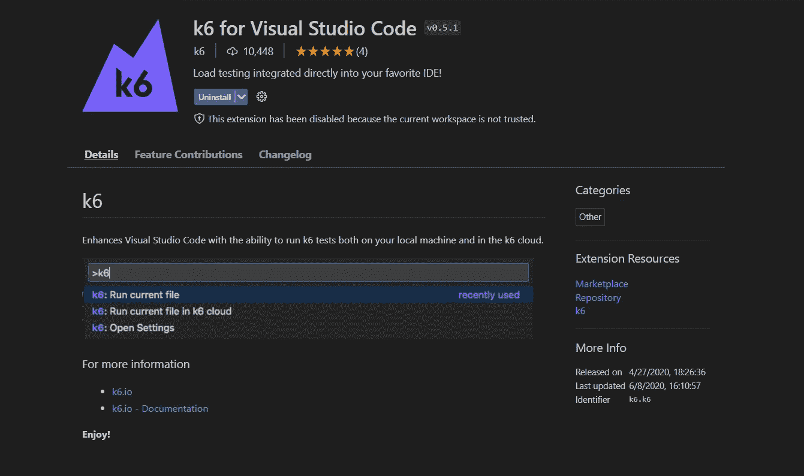

# 在本地环境中使用 k6 运行负载测试

让我们看看如何创建一个脚本，并在我们安装了 k6 的本地环境中使用 k6 执行它。

现在，我将使用他们的文档部分中可用的示例代码和例子，打开 VS 代码，并创建一个新的。js 文件。我们可以将其命名为 sample.js，并将下面的代码片段粘贴到其中。

```
import http from 'k6/http';
import { sleep } from 'k6';export default function () { http.get('https://test.k6.io'); sleep(1);}
```

基本上，上面的脚本将使用 1 个用户执行 GET 请求，要使用 k6 运行上面的脚本，只需在终端中执行下面的命令。

```
k6 run script.js
```

运行后，您将在您的终端窗口中看到结果摘要，正如您在下面看到的，该脚本是使用 1VU(虚拟用户)运行的。在 http_req_duration 下，您还将看到其他重要的详细信息，如平均时间、90%百分比、95%百分比、最小/最大时间等。此外，需要注意的重要一点是，执行模式是本地的。


现在，我们可以再添加几个 vu，比如:10 个 vu，持续时间为 60 秒，然后运行脚本，为此，我们只需在 options 部分指定细节，然后使用上面的命令运行这个更新的脚本。

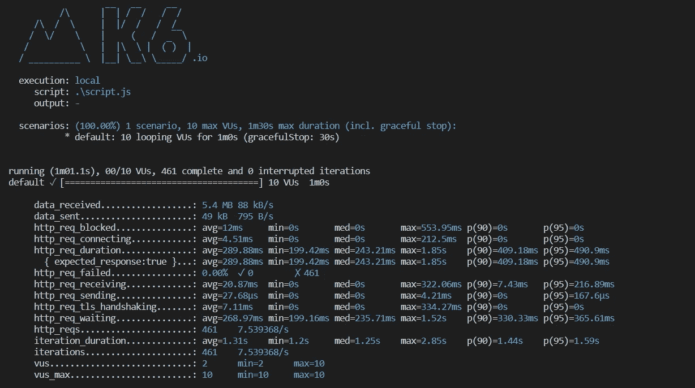

使用 options 中的 stages，我们可以在指定的持续时间内为几个用户执行负载测试。

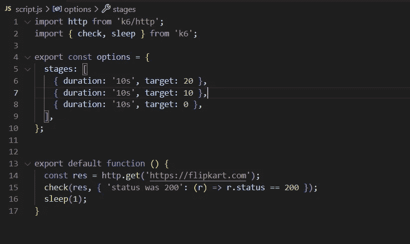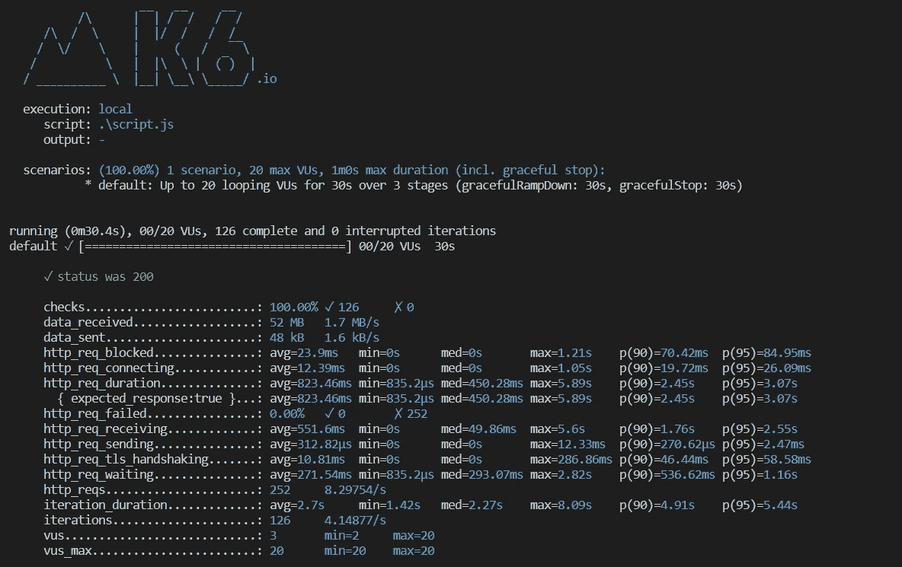

# 在 k6 云中运行负载测试

除了 OSS，k6 还提供了一个基于云的 SaaS 解决方案，称为 k6 Cloud，可以用来构建和运行测试，分析结果等。

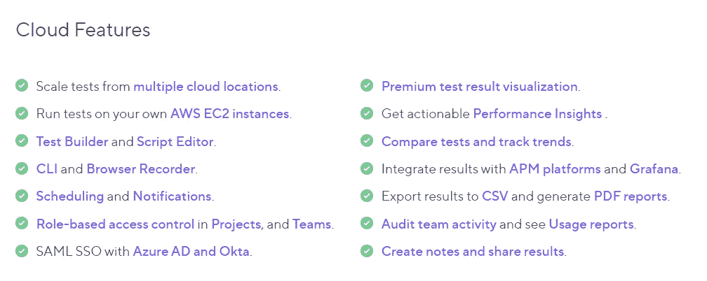

要注册，请前往此[页面](https://app.k6.io/account/register)并创建一个帐户，对于免费层，它提供了在云版本中运行 50 个测试的选项，当您使用您的新帐户详细信息登录时，您将被重定向到您的 k6 云仪表板，在那里您可以使用测试生成器创建您的第一个测试。


您可以手动创建一个场景，也可以根据需要记录一个场景，还可以选择导入任何场景。har 文件，您可能手边就有。


> *我将点击请求选项，并为我个人最喜欢的网站创建一个简单的 GET 请求:亚马逊*

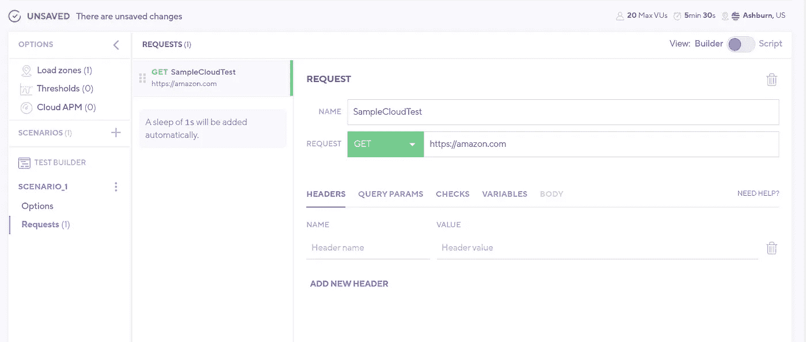

> *接下来，我将添加一些选项，10 个用户在 30 秒内保持负载 60 秒，然后在 5 秒内执行斜坡下降。*

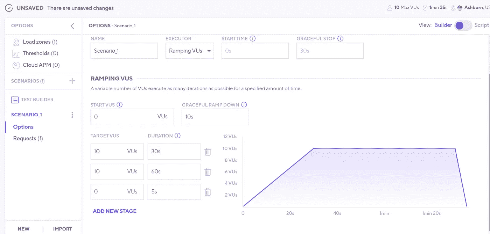

> *让我们为响应持续时间添加一个阈值，然后保存详细信息。*

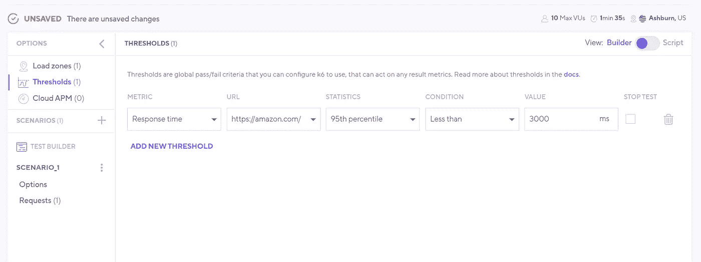

> *保存后，我还可以通过选择页面上的脚本选项，获得基于已完成配置的完整脚本。*

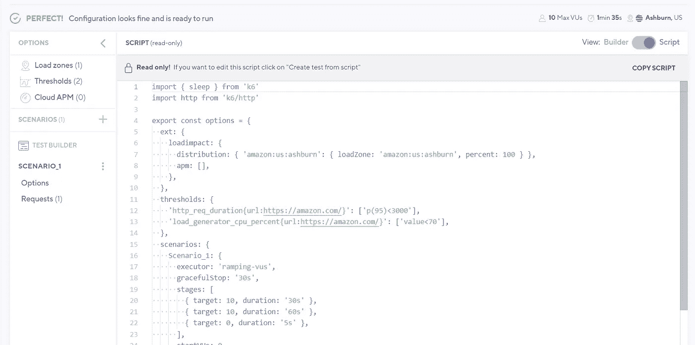

> *要运行此脚本，请单击页面上的 run 按钮，发布后您将看到一些非常好的指标和图表来总结您上次运行的详细信息，这些信息可用于进一步分析。*

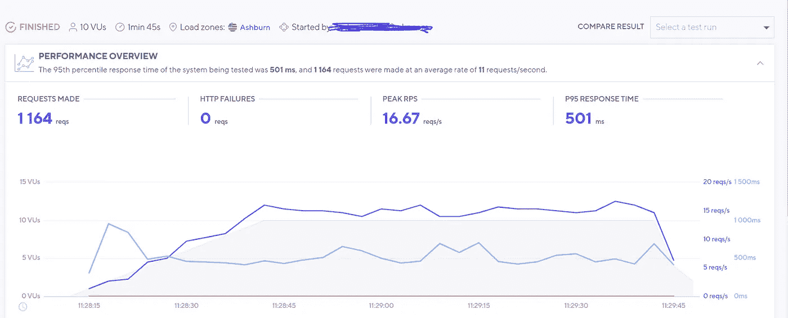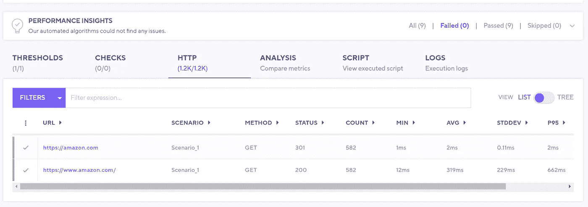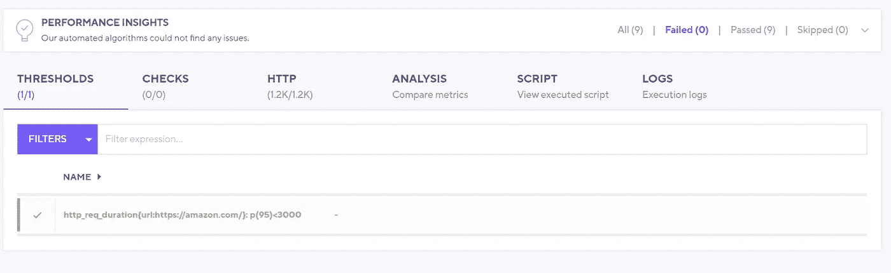

> 此外，您还有额外的选项来导出结果，与您的团队成员共享，并将此测试设置为未来测试的基线，这真的很棒。

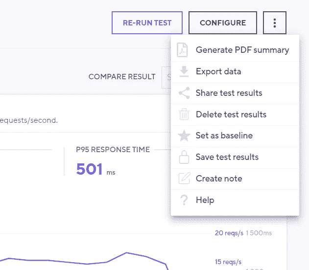

还有一个在 VS 代码中运行负载测试的选项，但是使用 CLI 选项让它们在 k6 Cloud 中运行，为此您必须首先使用下面的命令配置您的令牌或登录详细信息。

```
k6 cloud login
```

然后，要执行测试，只需从您的终端运行以下命令。

```
k6 cloud script.js
```

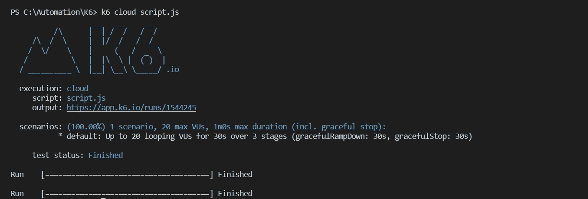

如上图所示，执行模式为 cloud，输出数据/指标将导出到您的 k6 cloud 账户。

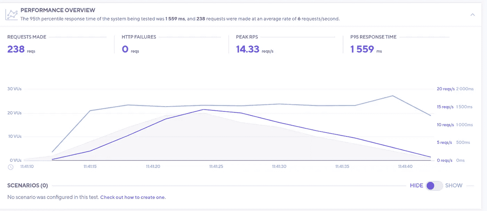

# 使用 Github 动作运行 k6s 负载测试

k6s 还提供了在 CI 管道中运行测试的选项，并可以轻松地与流行的解决方案集成，如 GitHub Actions、Jenkins、TeamCity、Gitlab 等。

为此，我们将需要一个如下所述的操作工作流文件，在主分支上将触发器用作 push 和 pull_requests。

```
on: 
  push:
    branches:
      - master
  pull_request:
    branches:
      - master

name: k6 Load Test
jobs:
  k6_ubuntu_load_test:
    name: k6 Ubuntu Load Test
    runs-on: ubuntu-latest
    steps:
      - name: Checkout
        uses: actions/checkout@v1 - name: Run local k6 test
        uses: grafana/k6-action@v0.2.0
        with:
          filename: script.js
```

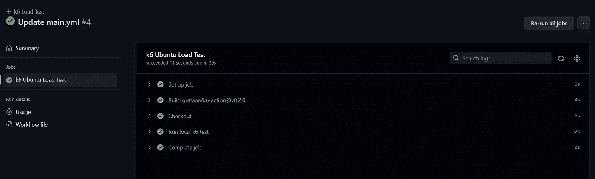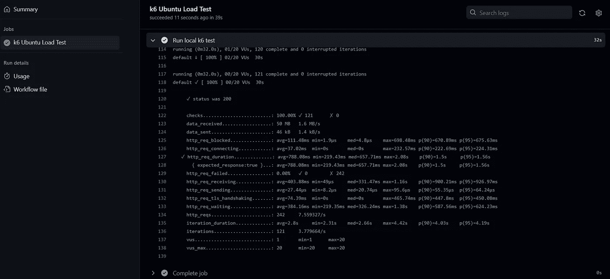

到此，我将结束这篇文章，我个人喜欢玩 k6，并相信它是一个用于负载测试需求的神奇工具。

一定要在 Youtube/Twitter 上探索和关注它们！！