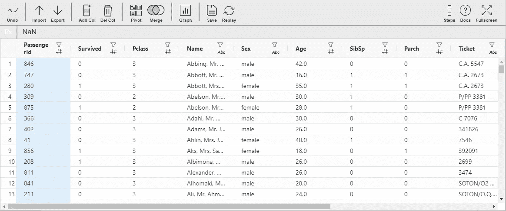

# 探索用于 EDA 和数据预处理的 Mitosheets

> 原文：<https://medium.com/geekculture/exploring-mitosheets-for-eda-and-data-preprocessing-3e73fb1dcc5c?source=collection_archive---------18----------------------->

## 使用 Mitosheets 实现自动化 EDA 和数据处理

Source: By Author

在创建机器学习模型之前，探索数据是一项重要的任务。它帮助我们探索任何隐藏的数据模式，可以通过创建不同的数据可视化进行分析，帮助我们解开不同数据列之间的关系，类似地…