# 侵入大脑的技术和创业公司第二部分:超越医疗保健市场

> 原文：<https://medium.com/geekculture/exploring-neurotech-applications-beyond-the-healthcare-market-ad9fafd4efb3?source=collection_archive---------5----------------------->

## **回顾 30 家初创公司，它们的市场、商业模式、技术，以及机器学习在哪里适用**

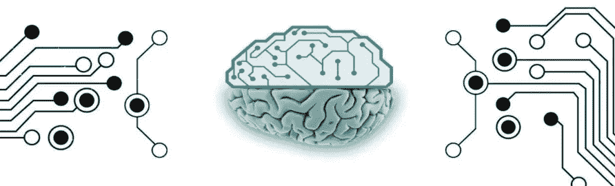

‘Nexus, Apex Connect’ book cover, Ramez Naam

> “网络游戏、增强现实系统、照片、视频和音频工具、DJing 应用程序、文件共享系统……、面部识别器、记忆补充器、性爱应用程序、虚拟、醒酒应用程序、聚焦应用程序、多任务应用程序、睡眠应用程序、兴奋剂应用程序，甚至是人们已经适应只在大脑内部运行的数字货币”。 **Ramez Naam，Apex。《Nexus 三部曲》**

科幻小说作家在描述神经技术如何发展以及我们可以使用什么样的应用来增强大脑方面做了令人惊叹的工作。

**在这篇文章中，我探索了医疗领域之外的各种神经技术应用。**这是我关于人工智能技术如何融入神经技术的研究[的结果，神经技术主要涵盖医疗保健领域。](/hackernoon/technologies-and-startups-that-hack-brain-e51ea6983edb)

这篇文章对神经技术有一个相当广泛的看法，涵盖了脑机接口( [BCIs](https://en.wikipedia.org/wiki/Brain%E2%80%93computer_interface) ，有创和无创两种)和各种技术，例如脑电图( [EEG](https://en.wikipedia.org/wiki/Electroencephalography) )、肌电图( [EMG](https://pages.ucsd.edu/~pwinkiel/courses/emg-posted.pdf) )、功能近红外光谱( [fNIRS](https://en.wikipedia.org/wiki/Functional_near-infrared_spectroscopy) )等。它还涵盖了与 BCIs 空间部分重叠的[神经调节](https://en.wikipedia.org/wiki/Neuromodulation_(medicine))。

**我观察了 30 家在医疗保健之外的市场上工作的初创公司，并将它们按照两个维度排列(图 1):**

1.  堆栈层—应用与基础设施和研究；
2.  市场——各种用例，主要分为三种类型。

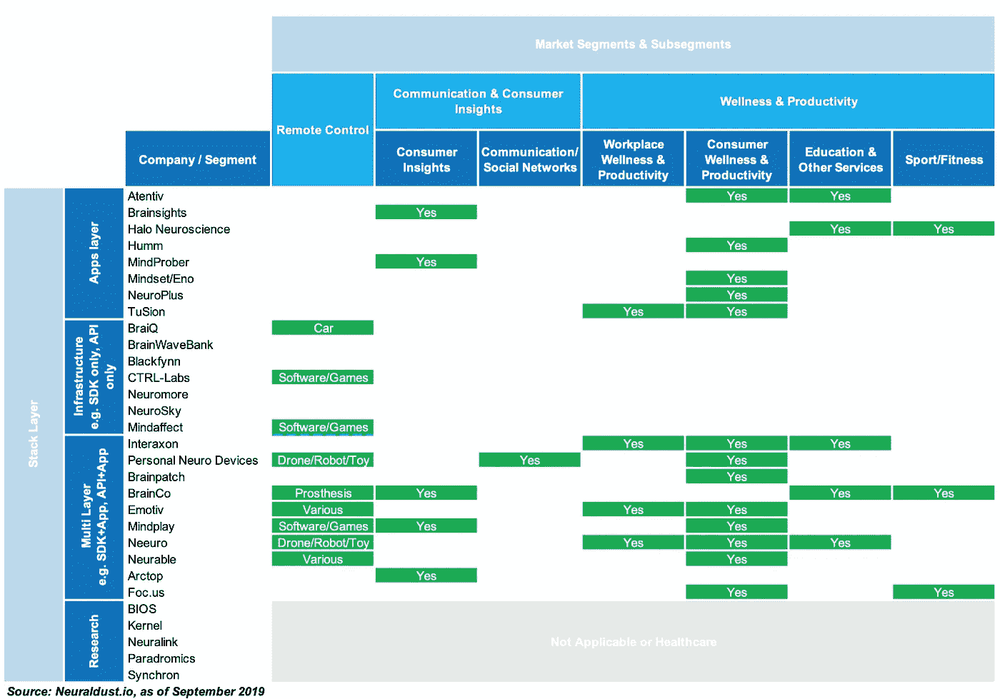

***Chart 1\. Selected neurotech startups by the stack layer and market segment,*** [**astrocyte.me**](https://www.astrocyte.me)

这篇文章分为四个部分:

**一、申请**

1.  健康和生产力
2.  遥控
3.  沟通和消费者洞察

**二。基础设施和研究**

1.  核心 SDK、应用开发工具
2.  其他基础设施
3.  研究

**三。“所有机器学习问题之母”——神经技术中的数据科学**

**四。分析和讨论**

***

# 一.应用程序

医疗保健之外的神经技术应用至少有三种用例:

1.  最受欢迎的用例是**健康和生产力**，它至少与三类客户相关:
    A .普通大众(或/和运动员等特定消费群体)；
    B .为员工提供企业计划的雇主；
    C .教育工作者和/或健康/保健专业人员，他们可能会使用神经技术来更好地为他们的客户服务。
2.  另一个受欢迎的用例是 **BCIs 用于远程控制**，至少有 9 家初创公司开发 BCIs 来控制各种玩具、设备、应用程序，甚至假肢。
3.  不太受欢迎的用例是**沟通和消费者洞察**。令人惊讶的是，很少有初创公司为市场开发神经技术，这个市场过去是、现在可能也是现代技术领域的关键——社交媒体和广告。

让我们更详细地探索这些用例。

# 1.健康和生产力

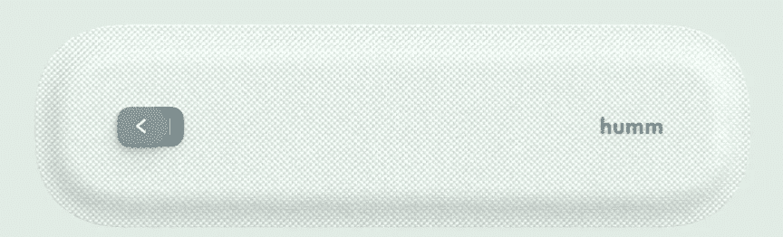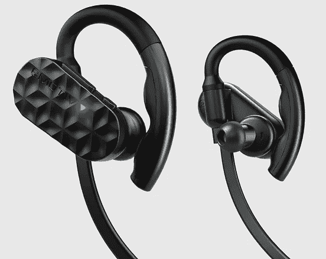

Tech by Humm and Emotiv

**健康和生产力神经科技应用**围绕改善各种认知功能，通常面向普通大众。例如， [MyEmotiv](https://www.emotiv.com/myemotiv/) 旨在管理压力，提高注意力。注意力和放松也是 [Neeuro](https://www.neeuro.com/) 和 [NeuroPlus](https://www.neuro.plus/) 的重点。也有一些应用程序对某种认知功能有更专门的方法。使用 focus 最多的应用有[attentive mind](https://www.atentiv.com/)、[mind](https://www.thinkmindset.com/)、 [BrainCo](https://www.brainco.tech/) 和 [Humm](https://thinkhumm.com/) 。

与此同时，由脑电图头带驱动的冥想应用程序通常覆盖更广的认知功能，例如 [Muse](https://choosemuse.com/) 和 [TuSion](https://tusion.xyz/) 。例如，后者针对注意力、放松、睡眠、上瘾等。

一些创业公司将其受众从普通大众缩小到有特定需求的细分市场。BrainCo 提供了一系列锻炼前/锻炼后练习，并伴有脑电图反馈。锻炼前的练习可以提高注意力，锻炼后的[有助于](https://web.archive.org/web/20190924174208/https://www.brainco.tech/focusfit/)“通过神经反馈和引导冥想，恢复得更快更深，已被证明可以减少锻炼后的炎症和皮质醇水平”。

**另一种神经科技应用是电磁刺激应用**。[光环](https://www.haloneuro.com/)为运动员提供了“一个大脑刺激器，有助于更快地开发肌肉记忆”。而 [Foc.us](https://foc.us/) 认为大脑刺激“……被不同的人用于不同的目的”，并提供了可能以各种方式使用的设备。 [BrainPatch](https://brainpatch.ai/) 开发可以“听”和“说”你的大脑的硬件，虽然他们的一些工作得到了欧盟和英国的资助，专注于治疗神经疾病，但他们最近宣布计划推出一种使用背景音乐的电刺激来控制压力的产品。

可能改善认知功能的应用不仅直接提供给消费者，也提供给商业客户。例如，企业可以将它们作为企业健康计划的一部分。有一些证据表明，使用神经反馈来将个人的觉醒转变为一种提高表现的状态。

**由 [EMOTIV](https://www.emotiv.com/workplace-wellness-safety-and-productivity-mn8/) 开发的工作场所健康和生产力产品**，目的是“……提供关于压力和注意力分散程度的易于理解的反馈，以告知工作场所健康、安全和生产力”。Muse 耳机的开发商 Interaxon 提供[企业健康计划](https://choosemuse.com/corporate/)，旨在帮助员工“……降低压力，增强弹性，提高敬业度”。Neeuro 和 TuSion 也提供明确的公司报价。

瑜伽教练和教育工作者等专业人士也成为了神经科技应用开发者的目标。例如，Muse app 有[专业版，](https://choosemuse.com/muse-professionals/)旨在帮助导师“……发展他们的实践，并教授他们的客户冥想技巧”。【BrainCo 的产品 FocusEDU ，承诺让“……学校将实时参与度指标以及基于神经反馈的专注和放松训练带入课堂”。NeeuroEDU 也致力于将神经技术应用于教育。它的产品“…将脑波技术与 DIY 机器人结合起来，让学生们享受编码的乐趣”。

# 2.遥控

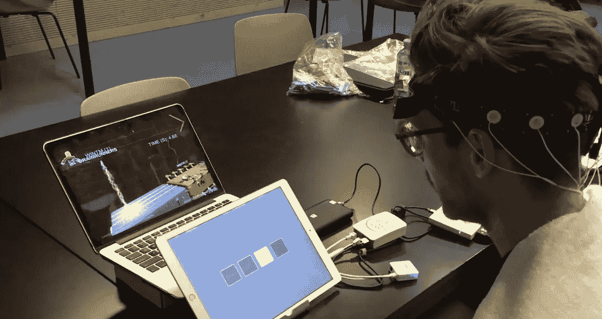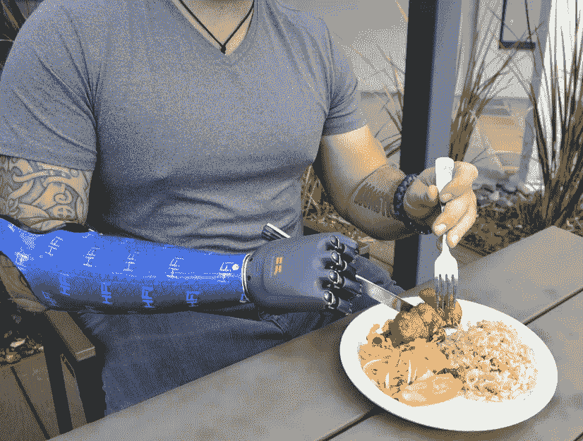

Tech by MindAffect and BrainRobotics

企业家们已经开始致力于实现将人脑与机器连接起来的梦想。根据它们帮助控制的对象，可以将远程控制 BCI 应用程序分为两组:

1.  实现对软件的控制；
2.  实现对硬件的控制。

本节介绍面向最终用户的远程控制应用。构建这些应用程序所需的开发人员工具将在本文的“基础设施和研究”部分介绍。侵入式脑机接口，除了其他功能之外，还可能具有远程控制功能，目前还处于开发的初级阶段，本文的“基础设施和研究”部分也有涉及。

1.  例如，软件的 BCI 由 [Myndplay](https://myndplay.com/) 和 [Mindaffect](https://www.mindaffect.nl/) 开发。Mindplay 迎合娱乐市场，建立了一个“…视频平台，允许用户仅使用他们的思想和情感来控制、影响视频游戏、应用程序和电影，并与之互动”。Mindaffect 建立了一个界面，允许你控制一个虚拟键盘，并“用你的大脑一个字母一个字母地拼写”。
2.  硬件的 BCI 主要处理玩具，至少目前是这样。Neeuro 的 [SenzeBand](http://www.neeuro.com/mindsync/) 允许对 Makeblock mBot、micro:bit、乐高 EV3 和 Arduino UNO 的机器人进行基本控制。 [Spark Kids](https://personalneuro.com/pages/about) 与一个专有的水晶球和一个玩具无人机一起工作，对大脑活动做出反应。一些初创公司超越了玩具，建立了 BCI 来控制更复杂的设备。例如，BrainCo 致力于假肢，BraiQ 致力于通过多种接口将人类与汽车连接起来。
    与其他使用脑电图的初创公司不同， [BrainCo](https://www.brainrobotics.com/blank-3) 试图通过皮肤表面肌电信号(sEMG)将其假肢与大脑连接起来。在训练阶段，用户被要求使用训练互动应用程序记录不同手势的 sEMG。[这些 sEMG 信号]用于训练深度神经网络模型。[…那个]会被送回假手里。
    直到关闭， [BraiQ](https://web.archive.org/web/20180605201331/https://braiq.ai/%20https://www.welcome.ai/braiq) 一直在开发一个平台，该平台旨在使汽车能够“…通过车内传感器(如摄像头、脑电图、心率监测器)感知乘客的认知和情绪状态。(并利用它)定制汽车的驾驶行为，以符合用户的偏好。

# 3.沟通和消费者洞察

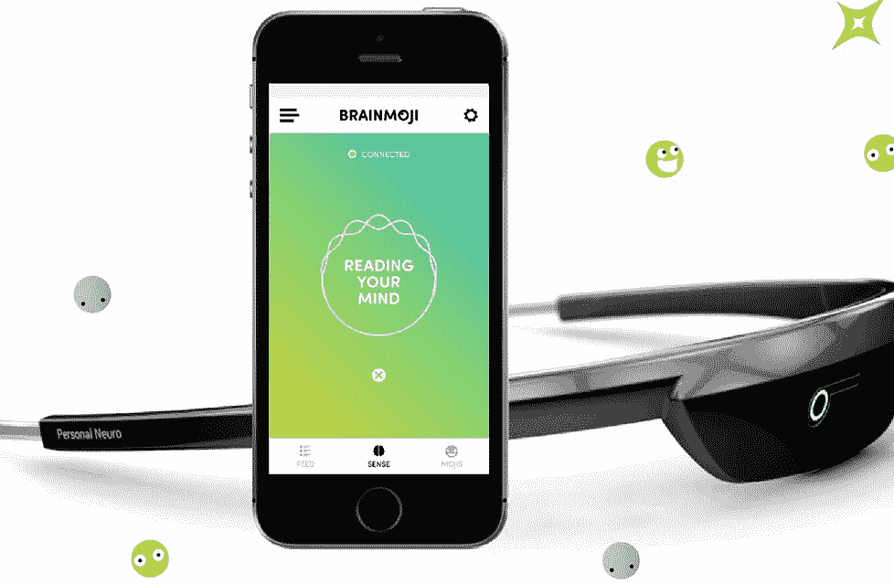

Tech by Mindprober and Brainmoji

**我将这两个用例放在一起，因为它们的组合过去是，现在可能仍然是现代技术的关键**。在广告商希望更多了解消费者的推动下，社交网络能够获得数十亿人所需的资源，并将连通性提升到另一个水平。

我的猜测是，以某种方式，企业对“以皮下方式接触人们”的渴望将推动神经技术的采用，它将成为社交平台和通讯应用的下一件大事。例如，这可以通过赞助耳机和将 BCI 与消费产品集成来实现(想象一下，你不需要从口袋中拿出手机来回复 WhatsApp 的消息)。

*   **至少有五家创业公司帮助企业更好地了解消费者**。Brainsights 和 MindProber 是洞察专家，而 Arctop、Mindplay 和 BrainCo 是开发其他产品洞察的通才。
*   然而，我发现只有一款应用将 BCI 与社交网络功能融为一体。

[Brainsights](https://www.brainsights.com/technology) 开发了一个脑电图驱动的测量平台，为品牌/广告商和媒体/制作公司提供广告价值链多个要素的洞察力。例如，初创公司的目标是概念开发和创造性效率等任务。 [Arctop](https://arctop.com/product/) 旨在帮助“……创作者通过测量追踪真实世界行动的内容成功的精确大脑指标，在数字领域有效地制定战略和执行”。

[MindProber](https://www.mindproberlabs.com/) 使用多种类型的数据(皮肤电反应、心率活动或眼球追踪以及陈述性数据)“…测量观众对媒体内容的参与度，并预测观众流失**”。**BrainCo 也提供测量参与度的服务。它使用其 FocusEDU 平台，让公司能够衡量群体的参与度，并找到“……优化和个性化向客户提供内容”的方法。

除了衡量参与度，MyndPlay 还参与了更广泛的项目。例如，[一位顾客](https://myndplay.com/service/joy-of-dairy-adhb-dairy-uk)要求 mind play“……找出在日常食物中添加乳制品是否对(消费者)大脑和身体有任何影响”。[另一位顾客](https://myndplay.com/service/ebay-the-science-of-shopping-are-we-a-nation-of-trend-shoppers)订购了“……一项调查年轻专业人士网上购物习惯的实验，以确定新一代人是否更依赖潮流而不是其他任何东西来获得灵感”。

**在通信/社交网络方面**只确定了一家初创公司。个人神经设备公司开发了 [Brainmoji 应用](https://personalneuro.com/pages/brainmoji)，允许用户创建反映他们大脑状态/情绪的表情符号。与社交媒体平台的整合使得这个表情符号可以共享。

脸书宣布了“布莱恩打字”项目，并承诺一种能够以每分钟 100 个单词的速度解码大脑语言中心信号的非侵入性接口。但是后来这个项目[改变了方向](https://www.theverge.com/2019/7/30/20747483/facebook-ucsf-brain-computer-interface-typing-speech-recognition-experiment)。

# 二。基础设施和研究

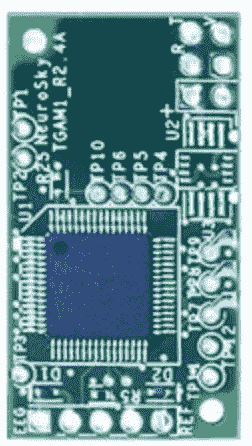

Tech by Neurosky and Blackfynn

咨询公司 Gartner[将](https://www.gartner.com/it-glossary/infrastructure-software) IT 基础设施定义为“支持业务系统交付和 IT 支持流程的硬件、软件、设施和服务组件的系统”。公司[在 IT 基础设施中包括](https://www.gartner.com/it-glossary/it-infrastructure/)几个组件，其中有应用程序开发、集成和中间件、信息管理软件和安全软件。

**神经科技的基础设施层现在非常薄**，初创公司在各个组成部分之间分布不均匀。例如，你很难找到一家神经科技网络安全初创公司，而市场上有多种核心 SDK。

也是**难以区分图层**。基础设施、研究和应用程序层之间融合的最大胆的例子可能是埃隆·马斯克(Elon Musk)试图将 Neuralink 打造为一种端到端产品，包括一台专有的 BCI、一个手术机器人，甚至还有一个基于 Neuralink 的应用程序商店。

我看到至少有三种类型的 BCI 基础设施/研究型创业公司:

1.  **核心 SDK**允许开发者构建支持 neurotech 的应用，这些是应用开发工具；
2.  **其他基础设施**，如用于集成、信息管理、安全等的软件。该基础设施可以作为工具或端到端产品套件交付；
3.  **寻找连接人类和机器的新方式的研究初创公司**。

# 1.核心 SDK、应用开发工具

这一领域的大多数初创公司都是基于 EEG 或其他非侵入性技术开发 SDK，通常基于专有的耳机/传感器。比如 [NeuroSky 的](https://store.neurosky.com/products/ios-developer-tools-4)开发者工具包里就有注意力、眨眼检测等算法。 [Emotiv 的](https://www.emotiv.com/developer/) SDK 提供开发者工具和 API 访问各种数据流，如动作数据、面部表情数据等。

[Brainco](https://www.brainco.tech/focus-sdk/) 、 [Neeuro](https://www.neeuro.com/neeurodev-software-development-kit/) 和 [MyndPlay](https://store.myndplay.com/products.php?prod=48) 也提供具有松弛度检测、原始 EEG 信号等功能的 SDK。 [Arctop](https://arctop.com/product/) 构建了一个 API，它“……在情绪和认知事件发生时提供洞察，以便大脑以外的系统能够做出响应”。游戏开发者和培训公司使用 API 来调整他们的内容以满足个人需求。Foc.us 向编写应用程序以控制 Foc.us 大脑刺激设备的开发人员提供了一个[有限的蓝牙 API](https://foc.us/bluetooth-api/) 。

在计划发布 SDK 或在实现后停止支持的创业公司中，有 Mindaffect ( [计划](https://www.mindaffect.nl/))、Muse ( [停止](https://choosemuse.com/development/))、Personal Neuro Devices ( [停止](https://neurogadget.net/2013/11/12/qa-with-personal-neuro-devices-developers-of-neuronauts-upcake-and-other-bci-apps/8925))和 CTRL-Labs(被脸书收购后似乎[停止](https://web.archive.org/web/20190426185316/https://www.ctrl-labs.com/ctrl-kit/))。Neurable 似乎已经[用](https://www.neurable.com/developers)[neuro select SDK 和 NeuroInsight API](https://www.webwire.com/ViewPressRel.asp?aId=241208) 对进行了实验，将脑电图数据用于虚拟现实和对软件和设备的实时控制，但现在这些尝试可能会停止。

# 2.其他基础设施

至少有四家初创公司提供超越核心神经技术功能的软件，其中包括:

1.  Blackfynn 开发了一个[平台](https://www.blackfynn.com/platform/)，用于处理脑电图、放射学、病理学和基因组学数据以及以安全合规的方式描述这些数据的元数据；
2.  Neuromore studio 提供了一个[扩展的](https://www.neuromore.com/open-source) SDK，带有拖放界面、云部署和协作工具；
3.  除了 SDK 之外，个人神经设备公司还在考虑开发’…一个数据存储和处理系统，让应用程序开发人员能够查看大量数据，并发现更多关于用户精神状态的信息；
4.  [BrainWaveBank](https://brainwavebank.com/) 为神经科学研究提供端到端的产品套件。它包括一个耳机、一个认知测试目录、一个基于云的分析平台和一个试验管理仪表板。

# 3.研究

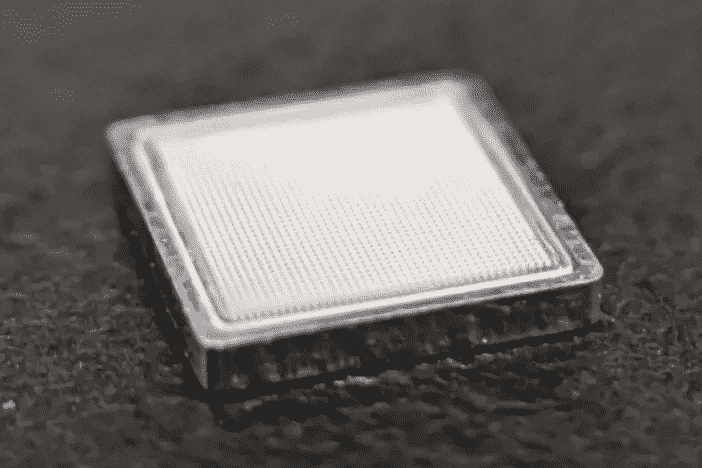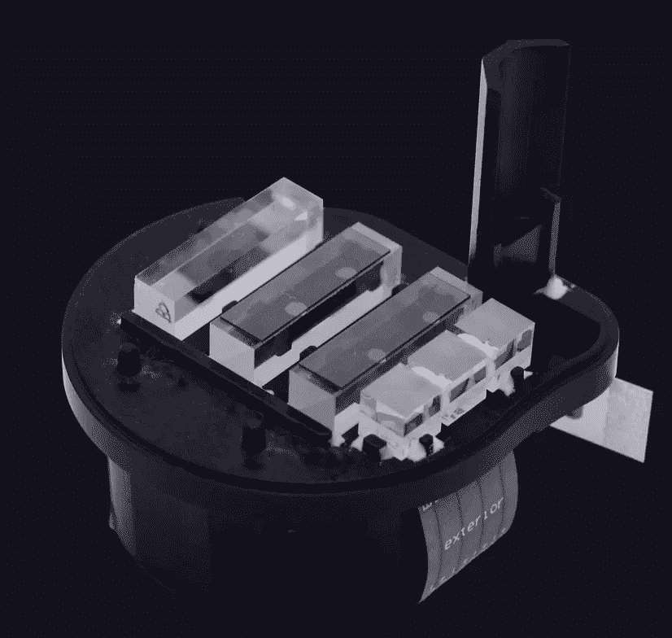

Tech by Paradromics and Kernel

**研究 BCI 的初创公司主要关注机器与大脑连接的新方式**。其中一些初创公司进行了人体试验，但他们通常既没有公开可用的产品，也没有开放的 API/SDK(尽管 CTRL-Labs 宣布了一个)。然而，如果一切顺利，这些创业公司可能会成为 neurotech 的根本支柱。

*   Neuralink 可能是最知名的 BCI 开发者。它的工作原理如下:“微米级的细丝被插入大脑中控制运动的区域。每根线包含许多电极，并将它们连接到一个植入物上。然后，植入物向一个应用程序发送信号，这将允许控制键盘或鼠标。该设备有几个设计迭代，你可以在这里找到更多的。
    Neuralink 构建的不仅仅是接口本身，而是围绕它工作的 hole 生态系统，包括一个精密的自动化神经外科手术机器人，一个 app，在某些时候，一种应用程序商店；
*   Synchron 致力于神经调节和神经假体的 BCI。它开发了一种微创可植入大脑设备，通过颈静脉植入运动皮层，而无需开胸手术。这个设备 Stenrode 与 BrainPort 和 BrainOS 连接，与其他设备和应用程序进行通信；
*   [Paradromics](https://paradromics.com/) 构建了神经输入输出总线，即“……[看起来像](http://www.siliconhillsnews.com/2019/02/04/paradromics-moved-from-silicon-valley-to-austin-and-is-creating-a-brain-modem/)一把梳子，有大约 50，000 根微丝，是模块化的，允许记录和刺激多达 100 万个神经元”。Paradromics 认为“……为了能够对大脑相关疾病进行新的有效治疗，我们需要建立能够与大脑有效沟通的技术”；
*   [Kernel 的](https://www.kernel.com/) [原技术是](https://www.technologyreview.com/s/603771/the-entrepreneur-with-the-100-million-plan-to-link-brains-to-computers/)一个记忆假体，同时也考虑了其他的想法。例如“……表面蚀刻有微小电极的针状探针，……通过将微小的光纤穿过大脑的毛细血管来[记录]神经活动……”。
    该公司目前的重点可能是两个设备，“内核通量(Kernel Flux)，它使用磁力计来测量磁场和内核流的微小变化，它通过头骨发出脉冲光并进入血液，以测量血液在任何给定时间携带的氧气量”；
*   [BIOS](https://www.bios.health/news-why-we-rebranded) (原剑桥生物增强系统)开发了一个“全栈神经接口平台，使用人工智能对从大脑到身体的信号进行解码和编码，以治疗慢性健康状况”。从[媒体](https://tech.eu/features/26779/bios-profile-healthtech/)可能看到的内容来看，该公司本身并没有创造一个 BCI。相反，它开发了“神经数据生物标记发现平台”，将长寿命神经接口与人工智能系统相结合，直接从神经数据中“学习”生物标记。这项技术允许“…直接了解神经和器官并与之交流，以便进行实时治疗”。

# 三。“所有机器学习问题之母”——神经技术中的数据科学

被一些研究人员称为“能够实时解码神经活动并将其转化为控制的想法”的“所有机器学习(ML)问题之母”提供了 ML 如何应用于神经技术的两个主要场景。

**在被研究的公司中，有两者兼而有之的例子，应用 ML 解码神经活动，并以某种方式影响它，或将其转化为某种东西。**此外，****第三个场景出现了，其中 ML 作为一种工具被应用来解决一些特定的研究/商业问题**，与前两个场景相关，但并没有完全覆盖它们。我们进一步探讨所有三种情况:**

1.  ****挑战“…收集和处理大量的神经数据，然后准确地解释神经信号**，【这些信号】令人难以置信地嘈杂，不断变化，并以令人难以置信的速度在身体各处传播”是[生物信息系统公司正在努力的事情](https://techcrunch.com/2018/12/04/bios-health/)。
    将神经活动与最终行为联系起来，实时理解“这些神经元的代码”是 CTRL-Labs 的核心任务之一[。另一家初创公司 EMOTIV](https://venturebeat.com/2019/11/20/ctrl-labs-ceo-well-have-neural-interfaces-in-less-than-5-years/) [实时测量](https://www.emotiv.com/our-technology/)六种不同的认知状态——兴奋(唤醒)、兴趣(效价)、压力(沮丧)、参与/厌倦、注意力(专注)和冥想(放松)。利用算法，思维模式还能检测出脑电图信号中显示注意力集中或注意力分散的模式。
    [Arctop](https://www.startuphub.ai/startups/arctop/) ， [BrainPatch](https://www.abstractsonline.com/pp8/#!/7883/presentation/71131) ， [Neeuro](https://www.neeuro.com/meet-the-neeuro-team-founder/) ， [Atentiv](http://www.atentiv.com/science.html) ，[脑波库](https://www.brainwavebank.com/)， [NeuroSky](http://neurosky.com/biosensors/eeg-sensor/algorithms/) 也提供了使用 ML 解释神经活动的例子。**
2.  **创造一种让大脑控制某物的方式，例如它自己或一个外部物体，是另一种 ML 派上用场的场景。
    比如，EMOTIV '…。[开发了](https://www.emotiv.com/our-technology/)系统……用户训练系统识别与不同期望结果相关的思维模式，比如移动物体或让它们消失。BrainCo 的算法[实时检查](https://www.brainco.tech/technology/)’…一个人的一千多个脑电图特征…以无与伦比的准确性确定大脑状态。该系统用于确定假肢佩戴者的意图，并实现如何使用该装置的高精度和快速训练。 [Neurable](https://www.businesswire.com/news/home/20191218005586/en/Neurable-raises-Series-A-to-build-an-%E2%80%9Ceveryday%E2%80%9D-brain-computer-interface) 和 [Mindaffect](https://www.mindaffect.nl/) 也使用 ML 将信号转化为可操作的见解，分别提供对连接设备、玩具或键盘的控制。
    其他创业公司应用算法向大脑提供反馈。例如，Brainpatch [使用](https://cordis.europa.eu/project/id/867386)强化机器学习算法来提高无创大脑刺激的有效性。内核[使用算法](https://www.wired.com/story/inside-the-race-to-build-a-brain-machine-interface/)来分析和增强记忆测试中神经元产生的信号，然后将这些信号发送回大脑，以便再次激发记忆。
    Paradromics 利用机器学习向大脑提供数据。它的系统每秒可以收集 30 千兆字节的数据，预计它将把数据作为药物送回大脑。**
3.  **机器学习可以用来解决研究人员或应用程序开发人员的一些特定挑战。例如，Interaxon [与几名研究人员](https://www.prnewswire.com/news-releases/new-deep-learning-discovery-paves-way-for-ai-interpretation-of-brainwave-data-301213520.html)合作开发新的 ML 方法“……利用、挖掘和利用大量未标记的 EEG 数据，有效地发现 EEG 中的相关信息”。Blackfynn 的[分析工具](https://www.blackfynn.com/platform/)，除其他外，有助于动态识别综合数据集中的模式，以创建患者队列并可视化疾病随时间的进展。Mindprober 使用算法[预测内容的相关 KPI](https://www.mindproberlabs.com/automated-consumer-neuroscience-platform/)，比如收视率。**

****随着 ML 生态系统的发展，人们可能会期待它与 neurotech 的更紧密集成。然而，要让它真正实现，还需要解决一些挑战。正如[一篇研究论文注意到的](https://www.liebertpub.com/doi/full/10.1089/bioe.2020.0040?fbclid=IwAR2aflgDpNIauWWnkShnsCVI6yeTd6Omv21BNbylBKCwohIbqpi0jlGdbtU&)，“…根本的问题是新流行的深度学习算法是一个黑箱，不能提供任何对决策的洞察”。****

# **四。分析和讨论**

****我们生活在神经科技的形成期。在 30 家被调查的公司中，有 17 家成立于 2015 年或之后。Neurotech 也基本上没有找到适合其产品市场(PMF)的产品。似乎是研究驱动的，通常是硬件驱动的，神经科技初创公司远远超过了 SaaS/消费者企业通常需要 1-2 年才能实现 PMF 的时间(根据[陈楚翔](https://andrewchen.co/ttpmf-time-to-product-market-fit/) / [Quora 讨论](https://www.quora.com/How-long-does-it-take-to-get-to-product-market-fit))。**显示 neurotech 年轻程度的一些指标包括:******

*   ****早期融资**——每家特色公司在其生命周期内筹集的风险资本中值为 650 万美元，远远超过一家美国公司仅 A 轮融资的中值 860 万美元(图 2)；**

**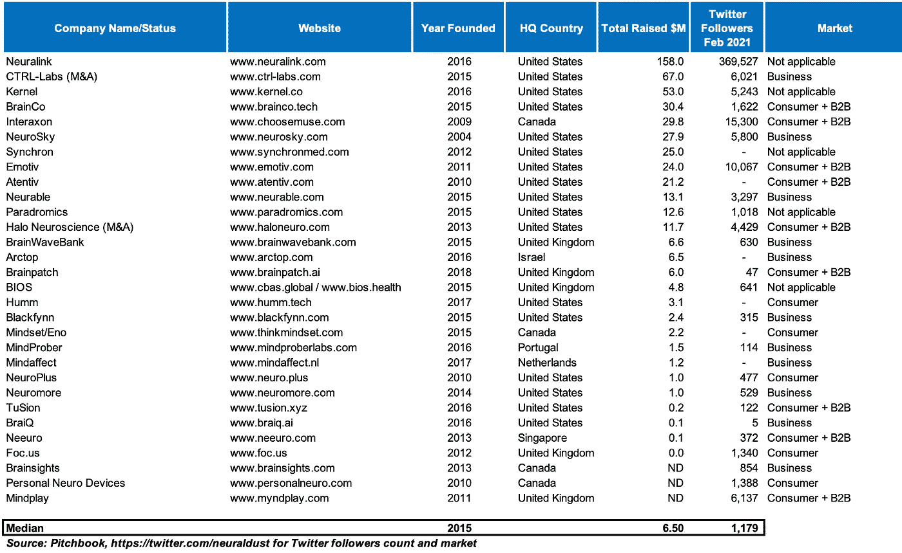**

*****Chart 2\. Selected neurotech startups,*** [***astrocyte.me***](https://www.astrocyte.me)***, PitchBook*****

*   ****社交媒体上的有限关注**。一家神经科技公司的 Twitter 粉丝数中位数是 1179 人(一个显著的例外是 Neuralink)。将其与在移动、可穿戴设备或虚拟现实等更成熟领域运营的公司进行比较:苹果(Apple)——590 万，Fitbit——369 万，Oculus——69 万追随者；**
*   ****模糊的商业模式**——30%被评估的创业公司同时服务于消费者和企业。此外，1/3 的初创公司跨多层运营，不仅构建业务或消费者应用程序，还提供开发工具，提供 SDK(图 1)。
    在 18 家提供应用程序的初创公司中，有 11 家瞄准了两个或更多的市场，而这些市场往往互不相关。例如，为营销专业人员提供见解，为教育提供商提供产品。**

****鉴于这一早期阶段，非医疗神经技术将何去何从？** **我预计消费者和商业领域的神经科技应用会受到更多重视，而不是基础设施** [“新技术的历史表明，应用会产生基础设施，而不是相反](https://www.usv.com/writing/2018/10/the-myth-of-the-infrastructure-phase/)”。**

**我们已经见证了由消费者应用推动的多个技术采用周期。手机、虚拟现实耳机，甚至允许大规模机器学习的图形处理单元([GPU](https://en.wikipedia.org/wiki/Graphics_processing_unit))——所有这些技术都得到了消费应用的强劲推动。**

****发现 neurotech 的巧妙应用将影响其在两波中的采用。**首先，与消费应用程序(有时是商业应用程序)相关的高容量将使我们能够避免这样的情况，即一个 100 美元物料清单的消费 EEG 耳机只因为订单量低和需要支付经营业务的固定成本而卖到 300-500 美元。后来，当神经技术在大型市场被采用，并且价格下降时，在较小/较薄的市场被采用将成为可能。**

**很难说什么样的消费者应用程序将启动最初的神经技术采用。例如，控制虚拟/游戏环境的能力(见 [CTRL-Labs](https://www.ctrl-labs.com/) 、 [Brink Bionics](https://www.kickstarter.com/projects/brinkbionics/impulse-neuro-controller-for-pc-gaming) )可能会让神经科技在游戏玩家中流行起来。冥想、正念和生产力运动看起来也像是促进神经技术的相关候选者。**不管具体的应用，在我看来，消费者采用神经科技的可能性在中期更大，有几个因素对其有利:****

1.  ****消费科技巨头似乎对神经科技**感兴趣，脸书收购了 CTRL Labs，[支付的](https://www.theverge.com/2019/9/23/20881032/facebook-ctrl-labs-acquisition-neural-interface-armband-ar-vr-deal)可能比谷歌[支付的](https://techcrunch.com/2014/01/26/google-deepmind/)还要多，DeepMind 是一项有助于人工智能炒作和 ML/DL 采用的大型收购；**
2.  **这些巨头有足够的现金来赞助研发和头戴式耳机的分销，这暂时限制了神经技术的采用。或者，消费巨头有能力找到将这些耳机货币化的方法，而不是直接向消费者收费，例如通过其他产品，如 AppleHealth 或 Google Fit、游戏或广告；**
3.  ****消费互联网巨头都是围绕** [**网络效应**](https://www.nfx.com/post/network-effects-manual/) 展开的。用最简单的方式来说，网络效应“……发生在公司的产品或服务随着使用量的增加而变得更有价值的时候”，例如，你的朋友使用社交网络越多，这个网络对你就越有用。Neurotech 似乎非常适合这些网络效应。想象一下，通过你最喜欢的信使分享受你大脑电信号启发的表情符号。或者在你的音乐订阅应用程序中管理播放列表，完美地反映你的心情。
    信息传递、分享、监管，这些以及其他消费平台的机制可以通过神经科技得到加强。反过来，增加其采用；**
4.  **除了大型消费技术公司，**新进入者可能会受益于神经技术的广泛应用**,并有可能在那里投资。像 Headspace 和 Calm 这样的冥想应用正在快速增长，前者已经达到了[独角兽](https://venturebeat.com/2019/02/06/the-meditation-unicorn-calm-raises-88-million-at-1-billion-valuation/)的地位。[健身创业公司](https://techcrunch.com/2019/06/03/fitness-startup-mirror-nears-300m-valuation/)，像 Mirror 和 Peloton(已经是独角兽)给观众带来了新类型的体验。在这类产品中加入神经技术看起来是一个相关的选择；**
5.  **早期的消费互联网对技术创新反应非常迅速。例如，通过消费者应用程序进行[风格转移](https://techcrunch.com/2016/06/24/prisma-uses-ai-to-turn-your-photos-into-graphic-novel-fodder-double-quick/)和[增强现实](https://qz.com/715103/snapchat-has-quietly-introduced-the-world-to-augmented-reality/)，机器学习变得广为人知。第一波值得注意的收购 ML 初创公司的浪潮发生在消费互联网领域，Snapchat [在 2015 年收购了](https://techcrunch.com/2015/09/15/snapchat-looksery/) Looksery，FB [在 2016 年收购了](https://techcrunch.com/2016/03/09/facebook-acquires-video-filter-app-msqrd-to-square-up-to-snapchat/) MSQRD，等等。我以为神经科技会有类似的发展。**

**神经科技的商业应用也一定会出现。即使现在也有创业公司使用 EEG 传感器来挖掘营销洞察或帮助开发者保持心流状态。然而，有一些因素限制了企业对神经技术的采用:**

1.  **在工作场所实施之前，神经技术需要得到更广泛的社会认可。除非被广泛接受，否则雇主很难说服员工佩戴脑电图耳机或其他技术，并提供对深层个人数据的访问；**
2.  **与消费者不同，**企业拥有成熟的现有技术体系**，引入任何新技术都需要整合到其中。在 neurotech 足够成熟之前(在网络安全、合规、API 等方面。)企业对它的采用将是有限的；**
3.  **就产品而言，**消费者通常比企业需要更少的功能**。例如，与消费者应用不同，企业消息应用更有可能拥有更强大的搜索功能、协作功能、更复杂的权限控制和管理功能等。**

****因此，我预计在越来越多的可用功能的支持下，企业将逐渐采用神经技术，而在“杀手级功能”的推动下，消费者将更快采用神经技术。然后是基础设施的建立，在消费者、企业和基础设施部分之间有多个反馈回路。****

****消费者的采用可能会为神经科技初创公司带来炒作和资本流入。**这反过来会积极影响那些建立企业神经科技的人。此外，**我预计最成功的消费者神经科技公司将在获得一些肌肉和能力以满足所需的监管([可能扩展到 GDPR 之外](https://academic.oup.com/jlb/advance-article/doi/10.1093/jlb/lsaa051/5864051))之后，向企业和医疗保健**市场拓展。**

**从企业/政府技术到消费技术的反馈循环也可能发生。**我们已经看到了一些消费者重用企业技术**的例子，例如， [Slack 和 Zoom 已经从专注于企业的产品开始](https://nbt.substack.com/p/consumer-and-enterprise)，但是这些产品已经被消费者根据他们的用途进行了调整，甚至经历了像消费者一样的病毒式采用。军用研发的成果很可能会溢出到消费应用中。就像美国军方的研发一样，那就是“… [负责你的 iPhone](https://www.businessinsider.com/the-us-military-is-responsible-for-almost-all-the-technology-in-your-iphone-2014-10?r=US&IR=T) 中几乎所有的技术”。**

**被锁定在这些采纳周期和反馈循环中，**我们仍然需要考虑开放对我们大脑的访问比开放对我们手机的访问更危险。因此，更重要的是，无论是初创公司还是现有公司[都要将“强大的数据伦理”作为其战略的一部分](https://in.mashable.com/tech/9970/2019-in-focus-the-year-big-tech-tried-to-fight-user-privacy-concerns-but-failed-anyway)，而不是求助于臭名昭著的“[延迟、否认和转移”](https://www.nytimes.com/2018/11/14/technology/facebook-data-russia-election-racism.html)方法。****

**[**订阅**](https://www.astrocyte.me/subscribe) **📩，在 Medium 或上关注我🐦** [**Twitter**](https://twitter.com/PeterZhegin) **关于神经科技和创业公司的新文章，DM/comment 让我关注你的创业公司。****

*************

*****🙏🙏🙏感谢*** [***佐伊·钱伯斯***](https://www.linkedin.com/in/zoe-chambers-52a85b20/) ***和*** [***马特·瓦尔林***](https://www.linkedin.com/in/matthieu-vallin-b4772a40/) ***(投资方为*** [***章鱼创投******💰🦄)和***](https://octopusventures.com)[***nickolai vysokov***](https://www.linkedin.com/in/n-vysokov/?originalSubdomain=uk)***和***[***dauren toleukhanov***](https://www.linkedin.com/in/dauren-darr-toleukhanov-12932924/)***(联合创始人在***[***brain patch***🔬🎧，如上所述)来查看这篇文章的早期草稿。](https://www.brainpatch.ai)**

*******

***数据收集说明***

**关于筹集的资本和公司状况的数据来自 Pitchbook。一些倒闭的公司也在展示各种神经技术应用的名单中。这很难算是神经科技初创公司的完整列表。我把那些筹集了大量风险资本或/和刚好在我的关注范围内的人包括在内。**

**在与社区一起阅读了这篇文章后，我收到了许多关于一些出色的神经科技创业公司和开源项目的建议。例如，NeuroPype 和 Rune Labs 在基础设施方面被提及，而 OpenWater 在研究方面被提及。我会把他们和其他人包括在我正在绘制的更广泛的神经科技地图中。**