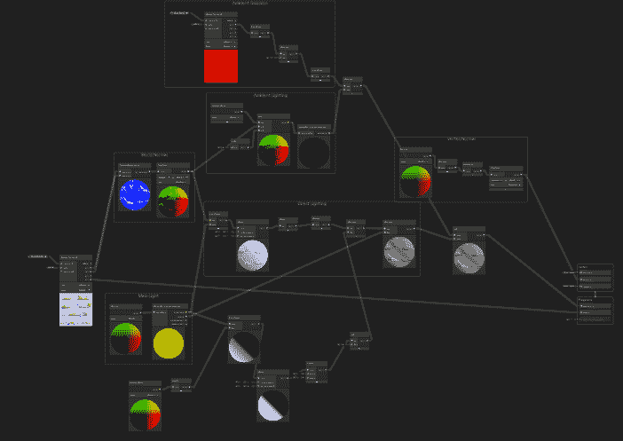
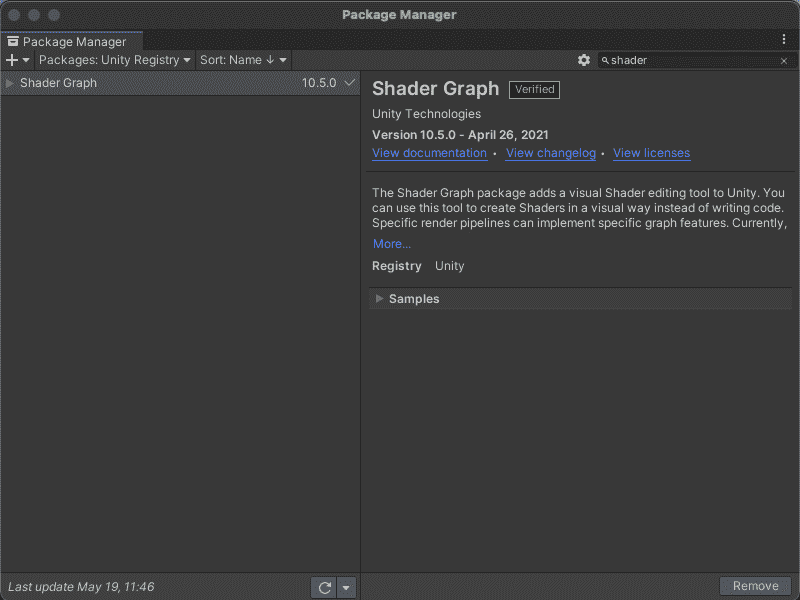
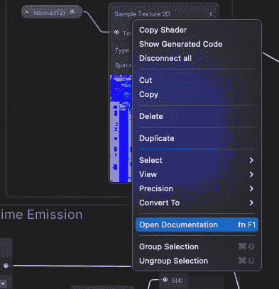
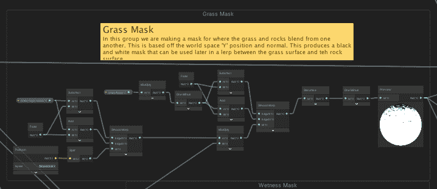

# 探索 Unity 中的着色器图形

> 原文：<https://medium.com/geekculture/exploring-shader-graph-in-unity-b9b0d5263139?source=collection_archive---------42----------------------->

当你开始编写游戏程序时，你会很快意识到一件事，那就是素材的编码不同于其他任何东西。它们几乎以神秘的方式工作，通常很难描述，代码通常是非常密集的 c 风格代码，无法解释事物如何或为什么以这种方式工作。

进入着色器图形，Unity 的最新尝试，以帮助缓解一些关于着色器如何工作的神秘和困惑。该功能最近退出了预览版，它有一系列旨在改变着色器制作方式的功能。之前，您使用代码制作着色器，现在希望您使用如下图制作着色器:

想跟着去吗？[这里有一个样本项目的链接！](https://on.unity.com/2Yqn6Vm)

那么如果着色器是为了编程素材，为什么这么难呢？因为你写的是低级代码，GPU 需要用它来决定这个物体的外观。这是一个复杂的过程，但好处是您不会因为计算繁重的任务而占用宝贵的 CPU 时间，而这些任务通常需要确定某些东西的外观(例如，闪亮、暗淡、透明等)。

着色器图形允许编码人员可视地组装“图形元素”,这些“图形元素”操纵某些内容的最终属性。在视频中，我们将了解什么是节点、如何连接节点以及如何找到每个可能节点的相关文档。我们也回顾了着色器图形中的一些[新特性](https://www.youtube.com/watch?v=-QcwEYOHt2I)，因为自从该项目现在得到官方支持以来已经有了一些变化。

# **亲提示**

## 1.确保项目中包含着色器图形

要确保您可以使用着色器图形，请转到窗口->包管理器，并确保着色器图形包含在项目资源中。

## 2.快速获得关于节点功能的文档。

当查看一个节点时，可能很难确切地说出这个黑盒在计算时做什么。要快速转到文档，右键单击节点并点击“查看文档”。它将弹出一个包含相关信息的 Unity 页面。

## 3.使用便笺条和群组！！

一个新的特性是你可以添加便笺和节点组来帮助组织你的图表。这对以后看你的图表的人理解某些东西是如何工作的有很大帮助。在下面的例子中，你可以看到一个贴有便签的“草面具”组。

在 Twitter[上关注我，获取更多科技文章！](https://twitter.com/maurerpwer)