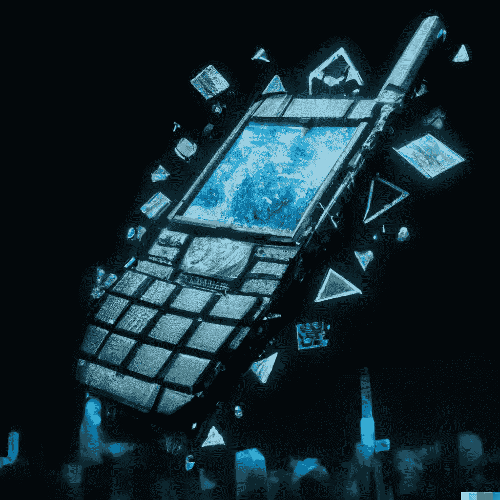

# 探索移动设备的未来

> 原文：<https://medium.com/geekculture/exploring-the-future-of-mobile-devices-f6cea59d8054?source=collection_archive---------18----------------------->

*阅读更多此类结束于*

**

*手机对我们的生活有很大影响，这不是新闻。还有什么设备被所有人广泛使用？*

*这些手机的设计比我们想象的影响更大。我们被宠坏了还是不幸了，这取决于你如何看待它，我们每年都从大公司那里得到一部新手机。有时会有大的创新，有时会有美学上的改变，或者只是同样的东西重新包装，这样公司就能跟上潮流，发布视窗。*

# *统计数据*

*当今世界上大约有 72.6 亿部移动电话，相当于世界人口的 91%。在 2017 年至 2022 年期间，全球智能手机用户增长了 49.89%，整体移动设备用户预计将增至 75.16 亿。如果数据可靠的话，手机显然已经融入了我们的日常生活。就这一点而言，物联网蜂窝连接比全球人口多 30 亿(109.8 亿)。手机和设备不会很快消失。*

*(来源: [Statista](https://www.statista.com/statistics/245501/multiple-mobile-device-ownership-worldwide/) )*

***但是，手机和移动设备的发展方向是什么？***

*我们兜了一圈，尺寸越来越大，翻盖手机又回来了，摩托罗拉 Razr 的重新发明引领了这一潮流(令人质疑)。但我们也进入了新的领域，比如折叠手机和柔性显示屏。我们可以看到创新层出不穷，但很难说我们会走向什么样的新方向。对我来说，展望移动设备的未来以及我们将进入什么样的设计方向，我将我的想法分成 4 个部分；环境、创新、技术和生活方式。*

**

*Photo Generated by [DALL·E](https://labs.openai.com/) 2*

***环境***

*手机行业对环境的影响是巨大的。用户手中有 70 多亿部手机，生产和流通中的手机肯定更多。手机行业发展迅速。每年都有采用新电池技术的新手机发布，制造这些手机需要更多的自然资源，这导致对自然材料的开采增加。由于前几年材料和物流方面的芯片短缺，我们看到了设备和生产的巨大延迟。是的，移动电话在其生命周期结束时可以回收，但即使是这样也是一个充满排放的过程。*

*虽然阴沉沉的，但前方有光。像 Fairphone 这样的公司在创造手机方面处于领先地位，这些手机可以从道德和可持续的角度采购，并且容易修理。这减轻了使用智能手机的总体负面影响，但也意味着你可以购买替换部件并自己修理，从而节省资金并延长手机的生命周期。*

*我们也看到了维修权的繁荣，ifixit 为消费者提供了他们修理自己的手机、延长手机寿命或回收手机所需的指导和工具。Youtube 上还有大量关于如何修理手机的视频和教程——你只需要有足够的勇气去尝试一下。*

*允许消费者自己修理手机显然有好处。在一天结束的时候，我们喜欢上了它们，并且经常使用它们。是的，我们想要新的闪亮的设备，但如果三星和苹果这样的公司允许你保留同一部手机，但通过硬件和软件更新来改进它，他们可能会成为赢家。我确实认为我们会看到更多这种情况，很可能不是来自苹果或三星，而是来自新的和即将到来的手机制造商。*

*我希望看到市场朝着这个方向发展:手机可能是一个你已经拥有多年的 DIY 项目，但是你可以自己定制、改进和制作。您可以购买一个基本模型，然后用制造商或第三方模块化部件升级，并根据您的需求进行定制。几年前，谷歌的项目 Ara 与[有些相似。这可能是一个开源行业，包括硬件和软件，你认为呢？](https://www.cnet.com/tech/mobile/project-ara-everything-we-know-about-googles-modular-phone/)*

***创新***

*创新显然是一个大问题。今年，许多苹果粉丝对 Iphone 14 感到失望。这是 13 的一个小升级，有些人认为它不值得花这么多钱。我们确实看到了关于 Iphone 14 的动态岛的大规模病毒式传播，这是对美学缺陷的巧妙利用，苹果公司利用了这一点，给我留下了深刻的印象。但除此之外，我们没看到什么。*

*创新是一件棘手的事情，尽管我们每年都有新的技术、想法和设备，但它们只是一小步一小步的改进。这很好，但我们不时需要在真正的创新上有一个大的飞跃，以引导市场走向新的方向。*

*对于铁杆科技迷或那些梦想科幻般进步的人来说，这没什么特别的。我们需要公司不断创新，瞄准未来，就像埃隆和他的火箭一样(但要低调)。*

*有一家公司让我无法停止阅读或浏览他们的网站，那就是人道公司。*

*由前苹果传奇人物 Imran Chaudhri 和 Bethany Bongiorno 领导(如果你不认识他们，去找他们，说真的，你可能已经在用他们做的东西了)humanual 是一家需要跟上的公司。在某种程度上的秘密状态下，他们的网站并没有透露太多，但是经过一些研究和他们的新媒体负责人 Sam Sheffer 的精彩视频和直播，我们可以一窥他们在做什么。其中一项专利是“[可穿戴多媒体设备和云计算平台及应用生态系统](https://patents.justia.com/patent/10924651)”。简而言之，他们似乎正在创造可穿戴的、侵入性更小的媒体和移动设备。*

*这是我们希望看到的创新，也是我们希望看到的公司的创新。我慢慢地越来越少使用我的手机，并把它看作是一个更实用的东西，因为我想每天为自己体验更多。一种侵入性更小、无处不在的无缝设备可能是前进的方向。用 12 英寸厚的玻璃和金属板顶着你的脸的日子已经一去不复返了。*

***技术***

*这与环境和创新部分相吻合。新技术通过原材料和制造对环境产生影响。没有创新，新技术就无法发展。然而，这要求公司需要新的硬件材料，因为软件只能带我们走这么远，这些天它有点过于复杂。无尽的循环。*

*我们已经看到电池效率变得更好，这是软件和硬件的共同努力。我们已经看到，在折叠和滚动屏幕的情况下，屏幕变得更坚固，也更灵活。我们还看到了动态岛中软件和硬件美学的有趣结合。还有摄像机，嗯，它们越来越好了？除非你专业地使用你的相机，否则大多数人不会看太多，只要他们的自拍和他们牛排的照片看起来不错。*

*所有这些对普通手机用户来说都是显而易见的。但是接下来呢？实体键盘会回来吗？当然不是来自黑莓，但其他人可能会。未来几年，技术的下一个重大突破肯定会对手机产生影响。我的猜测是，我们将获得更灵活和折叠的屏幕，并可能会看到形状因素的转变。到目前为止，我真的看不出三星和苹果会有什么疯狂的举动。在接下来的 5 年里，我们可能会看到像 Humane 这样的公司或小公司带来巨大的影响，帮助我们朝着一个新的令人兴奋的方向前进——我当然希望如此。*

***生活方式***

*这里以生活方式为主。老实说，硬件和软件一直在变化，在我们生活的这个时代，趋势来来去去。我们总是会使用某种形式的手机或移动设备，但我们的生活方式将决定接下来会发生什么。消费者在这一点上统治了市场。是的，我们对公司生产什么没有最终决定权，如果它还算不错，我们仍然会使用它，但如果我们不使用它，他们就会停止生产它。这将推动市场的下一个方向。*

*人道主义者会跟进此事。他们关注的是我们如何将技术和设备融入我们的生活，而不是他们如何将半功能包装的新手机塞到我们手中，让我们等待更新改进。他们希望改善人类体验，让我们回到“熟悉、自然和人性化”的互动中不像你的抖音通知那样侵扰，金属和噪音。然而，要确保它无缝地融入我们的生活，还有很多工作要做，这并不容易。尽管如此，我还是对我们能到达那里持谨慎乐观的态度。*

*我们的生活方式在某种程度上取决于我们使用的设备和产品。我们需要公司开始关注如何让我们回归人际关系和现实。这是我们需要走的真正创新且具有讽刺意味的开创性方向。*

*但是，如果你想使用你的手机，使用它，他们并不都是坏的，只是现在有点无聊*