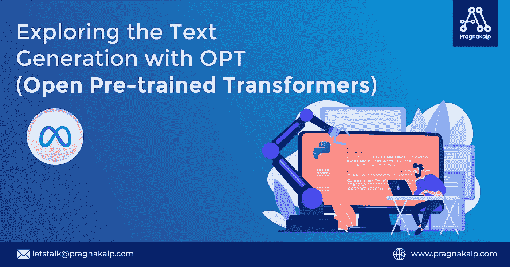
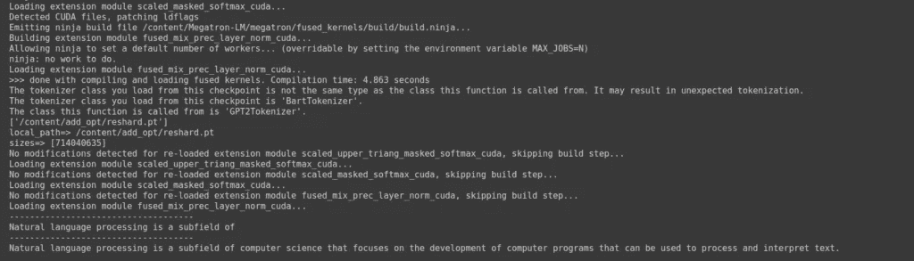

# 探索用 OPT(开放预训练变压器)生成文本

> 原文：<https://medium.com/geekculture/exploring-the-text-generation-with-opt-open-pre-trained-transformers-989135756479?source=collection_archive---------16----------------------->



# 介绍

脸书/meta AI 已经推出了一个新的大型语言模型，它训练了数十亿个参数，称为 OPT(开放式预训练变压器)，参数范围从 125M 到 175B。它可以用于生成创造性的文本、解决简单的数学问题、回答阅读理解问题以及解决其他自然语言处理相关的问题。

我们用 OPT 模型尝试了一些不同的东西来生成文本。按照下面的说明，我们将学习如何使用 OPT-350M 模型生成多达 30 个单词。

# 所需资源

我们在 Google Colab pro 上用一个 GPU 测试了 125M、350M 和 1.3B 模型，在两个 T4 AWS GPU 实例上测试了 2.7 模型。我们也尝试过测试 6.7B 模型，但是 2 个 T4 GPU 是不够的。

**Colab Pro:**
1.10 GB RAM
2 个 vCPU
T4 GPU

**AWS 实例:**
8.89 GB RAM
32 个 vCPU
2 个 T4 GPU

# 先决条件

在使用 OPT 模型之前，必须确保系统中安装了所有必需的软件包。执行以下操作来安装所有必需的软件包:

**1。安装 Pytorch**

```
pip3 install torch==1.10.1+cu113 torchvision==0.11.2+cu113 torchaudio==0.10.1+cu113 -f https://download.pytorch.org/whl/cu113/torch_stable.html
```

**2。安装威震天**

```
git clone https://github.com/patrickvonplaten/Megatron-LM.git
cd Megatron-LM
pip3 install six regex
pip3 install -e .
```

**3。安装公平秤**

```
pip install fairscale==0.4.1
```

**4。安装 metaseq**

```
git clone https://github.com/patrickvonplaten/metaseq.git
cd metaseq
pip3 install -e .
```

**5。安装变压器**

```
pip install transformers
```

# 克隆模型的 Github 存储库

在我们的包成功安装之后，是时候克隆模型库了。在本教程中，我们将使用 350M，您可以从 [OPT 型号](https://huggingface.co/models?other=opt_metasq)中克隆您需要的模式回购，如下所示:

要克隆 350 万型号的回购:

```
git lfs install
git clone https://huggingface.co/patrickvonplaten/opt_metaseq_350m
```

要克隆 150 万型号的回购:

```
git lfs install
git clone https://huggingface.co/patrickvonplaten/opt_metaseq_150m
```

要克隆 1.3B 型号的回购:

```
git lfs install
git clone https://huggingface.co/patrickvonplaten/opt_metaseq_1300m
```

要克隆 2.7B 型号的回购，请执行以下操作:

```
git lfs install
git clone https://huggingface.co/patrickvonplaten/opt_metaseq_2700m
```

# 加载 OPT 模型并将其用于文本生成

现在，我们将重点关注如何加载模型以及如何生成多达 30 个单词的下一个单词。请创建一个名为“run_model.py”的 python 文件，并将下面的代码粘贴到该文件中。

```
import os
from transformers import AutoTokenizer, GPT2Tokenizer
from megatron.initialize import initialize_megatron
from metaseq import checkpoint_utils
import torch

path = "/content/opt_metaseq_350m/model"
metaseq_path = "/content/metaseq"

# arguments taken from: https://arxiv.org/pdf/2205.01068.pdf | table 1
initialize_megatron(args_defaults={
    "micro_batch_size": 1, 
    "num_layers": 24, 
    "hidden_size": 1024, 
    "num_attention_heads": 16,
    "max_position_embeddings": 2048, # TODO check if it is the correct args
    "encoder_seq_length": 2048 # TODO check if it is the correct args
})

tokenizer = GPT2Tokenizer.from_pretrained("facebook/bart-large")
tokenizer.save_pretrained(path)

checkpoint = checkpoint_utils.load_model_ensemble_and_task(
    [os.path.join(path, "reshard.pt")],
#    [os.path.join(path, "reshard-model_part-0.pt"), os.path.join(path, "reshard-model_part-1.pt")],
    arg_overrides={
        "vocab_filename": os.path.join(path, "vocab.json"),
        "merges_filename": os.path.join(path, "merges.txt"),
    }
)

model = checkpoint[0][0].eval()
model.to('cuda')
start = 'Natural language processing is a subfield of'
indexed_tokens = tokenizer.encode(start)
for i in range(30):
  tokens_tensor = torch.tensor([indexed_tokens])
  tokens_tensor = tokens_tensor.to('cuda')
  with torch.no_grad():
    outputs = model(tokens_tensor)
    predictions = outputs[0]
    predicted_index = torch.argmax(predictions[0, -1, :]).item()
    # print(i,tokenizer.decode(predicted_index))
    indexed_tokens = indexed_tokens + [predicted_index]

predicted_text = tokenizer.decode(indexed_tokens)
print("------------------------------------")
print(start)
print("------------------------------------")
print(predicted_text)Run the following command
```

# 运行以下命令

```
torchrun run_model.py --pipeline-model-parallel-size 1 --tensor-model-parallel-size 1 
```

# 结果

结果将向我们显示我们使用 350M 提供的句子旁边可能出现的单词。输出应该如下图所示。



我们将相同的文本作为输入，并对不同的模型进行测试。这是结果。

# OPT-125M 的结果

测试 1:
———
输入:自然语言处理是
———
的一个子领域输出:自然语言处理是语言学的一个子领域 4090 4090 4090 4090 4090 4090 4090 4090 4090 4090 4090 4090 4090 4090 4090 4090 4090 4090 4090 4090 4090 4090 4090 4090 4090 4090 4090 4090 4090

测试 2:
———
输入:今天是美好的一天，我想
————
输出:今天是美好的一天，我想感谢所有参与的人！“惊呼 4090 4090 4090 4090 4090 4090 4090 4090 4090 4090 4090 4090 4090 4090 4090 4090 4090 4090 4090 4090 4090 4090 4090 4090 4090 4090 4090 4090 4090 4090

测试 3:
———
输入:文本分类是一种机器学习技术
—————
输出:文本分类是一种机器学习技术，通过这种技术，算法基于从概率中导出的概率来计算概率，所述概率从概率中导出，所述概率从概率中导出，所述概率从概率中导出，所述概率从

# OPT-350M 的结果

— — — —
输入:自然语言处理是
———
输出:自然语言处理是计算机科学的一个分支，专注于开发可用于处理和解释文本的计算机程序。
使用术语“语言处理”

输入:今天是美好的一天，我想……输出:今天是美好的一天，我想感谢你为我们做的一切。我爱你。我爱你。我爱你。我爱

— — — —
输入:文本分类是一种机器学习技术
———
输出:文本分类是一种机器学习技术，利用机器学习对数据进行分类。分类过程基于使用一组规则对数据进行的分类。分类过程基于

# OPT-1.3B 的结果

— — — —
输入:自然语言处理是
———
输出:自然语言处理是机器学习的一个子领域，它使用人工智能技术分析文本文档，从中提取含义。自然语言处理技术用于分析诸如电子邮件的文本文档

输入:今天是美好的一天，我想分享一些我们昨天下午去约塞米蒂山谷旅行的照片。我们从约塞米蒂瀑布路开车到约塞米蒂山谷路，停在约塞米蒂瀑布路停车场

— — — —
输入:文本分类是一种机器学习技术
————
输出:文本分类是一种机器学习技术，它使用统计模型来识别数据集中的模式。分类算法基于数据集之间的相似性对数据集进行分类。分类算法基于相似性对数据集进行分类

# OPT-2.7B 的结果

输入:自然语言处理是
———
的一个子领域输出:自然语言处理是人工智能的一个子领域，涉及将语言翻译成可理解的形式。不同文化中的语言差异很大，不同语言中的语言差异也很大。不同文化中的语言差异很大，语言也各不相同

— — — —
输入:今天是美好的一天，我想
———
输出:今天是美好的一天，我想和你一起庆祝！她对他灿烂地笑了笑。他感激地回以微笑。他们一起向湖边的小路走去

— — — —
输入:文本分类是一种机器学习技术
———
输出:文本分类是一种机器学习技术，计算机根据从安装在汽车顶部的摄像机捕获的图像中提取的属性对对象进行分类。分类算法基于从摄像机捕获的图像中提取的属性对对象进行分类

我们希望您喜欢我们的 OPT 模型实验，现在您能够按照给定的步骤生成文本。如果您在遵循该文档时遇到任何问题，请在下面评论。我们正在进一步利用 OPT 模型生成更多的文本，并对其进行微调。

*原载于 2022 年 6 月 18 日* [*用 OPT(打开预训练变形金刚)*](https://www.pragnakalp.com/exploring-the-text-generation-with-opt-open-pre-trained-transformers/) *探索文本生成。*