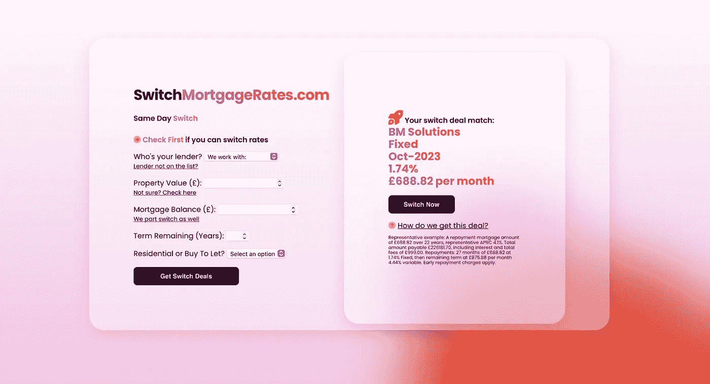

# 探索人工智能和机器学习在抵押贷款推荐中的应用。

> 原文：<https://medium.com/geekculture/exploring-the-use-of-ai-and-machine-learning-for-mortgage-recommendations-95a22ea07d13?source=collection_archive---------60----------------------->

My latest project SwitchMortgageRates.com

# 抵押技术和 API:

抵押贷款 API 的年份不是 2020 年。贷款人与选定的合作伙伴结成伙伴，帮助他们最大和最赚钱的客户通过他们自己的定制系统发布 API 解决方案。门对其他人关闭了。这不是我们酝酿抵押贷款技术创新的方式。现在，深入到 2021 年，我们仍然在等待一个更加开放和透明的 API 与所有主要银行和抵押贷款方面的建筑协会整合的迹象。

等待 API 的挫败感让我关注 MortgageTech 的其他解决方案。与此同时，我可以用我自学的 Python 知识和全栈开发技能做些什么呢？这并不严重依赖于贷款人的整合。人工智能和机器学习是答案。

# 该项目:人工智能和机器学习的抵押贷款建议。

首先，我想使用 Python 从头开始设计和构建一个网站。Python 是一种能够进行机器学习和人工智能的高级编程语言。我的主要网站目前过于依赖第三方服务。比如 Wordpress，它是一个很棒的博客网站，但是它不够灵活，不能集成更强大的代码。

> 【于是我建了[*【SwitchMortgageRates.com】*](https://www.switchmortgagerates.com)

现在的主要功能是一个面向贷方的 API——但是有所不同。如果第一次搜索失败，API 将重试不同的搜索，扫描抵押贷款产品信息中的特定参数。这是一个基于 Python 的问题解决方案:目前抵押贷款公司和 Twenty7Tech 对抵押贷款产品的分类很差。T7T 是目前整个行业中唯一的抵押贷款产品 API 采购解决方案——我觉得这在 2021 年很奇怪！

An API result for a non-regulated buy to let switch rate mortgage option (product transfer) with BM Solutions / Birmingham Midshires. Information correct as of 02/08/2021 but should not be relied upon after this date.

API 是现在已经完成的项目的第一部分。[SwitchMortgageRates.com](https://www.switchmortgagerates.com/)可以很好地访问和检索现有客户的产品转让抵押交易，即在提供产品信息时。

**第二部分**(开发中)将测试客户的输入，以识别和理解他们现在和未来的目标。它将允许客户自己使用人工智能测试各种抵押贷款和房地产场景。

**这里有一个例子:**

> ***顾客 A:*** *我们正在考虑改变价格，但可能会在不到两年的时间内搬家，因为我们打算结婚成家。现在对我们来说最好的选择是什么？*

**AI 会踢进**。它将根据当前提议的最佳新交易、初始利率周期以及客户的未来计划来分析他们的当前利率。基于这些条件，并了解现在和将来涉及的所有成本，建议将考虑这种情况。提前还款费用将与前期费用和其他成本一起计算在内。我甚至在考虑从英国银行提供的数据中引入[标准可变利率分析](https://www.bankofengland.co.uk/boeapps/database/FromShowColumns.asp?Travel=NIxAZxI1x&FromCategoryList=Yes&NewMeaningId=RSVRM&CategId=6&HighlightCatValueDisplay=Standard%20variable%20rate%20mortgage)。

诚然，监管机构对任何潜在的人工智能能力都有自己的看法——这就是为什么我现在私下测试这个。所以，在我们得意忘形之前，这种技术可能需要很多年才能实现。它可能还需要发布一个大的免责声明，但这个概念是令人兴奋的。如果客户决定保存他们的个人资料，机器学习部分将会发挥作用。该系统将记住客户的意向计划，并学习适应这些计划的变化，因此也更新了人工智能。

虽然现在我对我最新项目的结果很满意。我的第一个全栈 Python 网站，为现在或未来寻求改变抵押贷款利率的客户提供了一些很好的工具。基础已经就绪，准备迎接人工智能、机器学习，当然还有 MortgageTech 的未来——当银行和建筑协会决定完全开放他们的抵押 API 时。