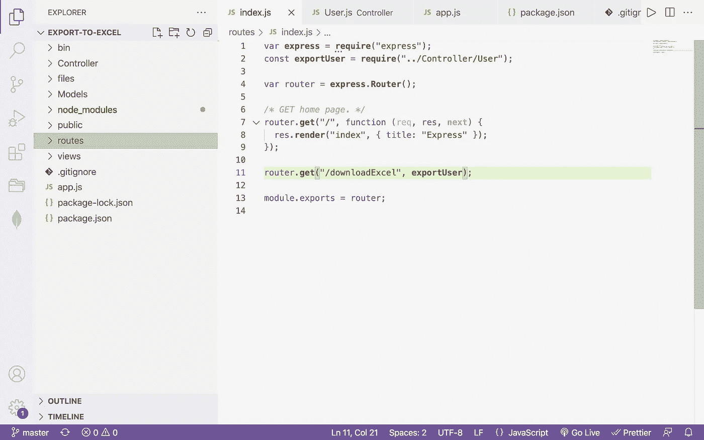
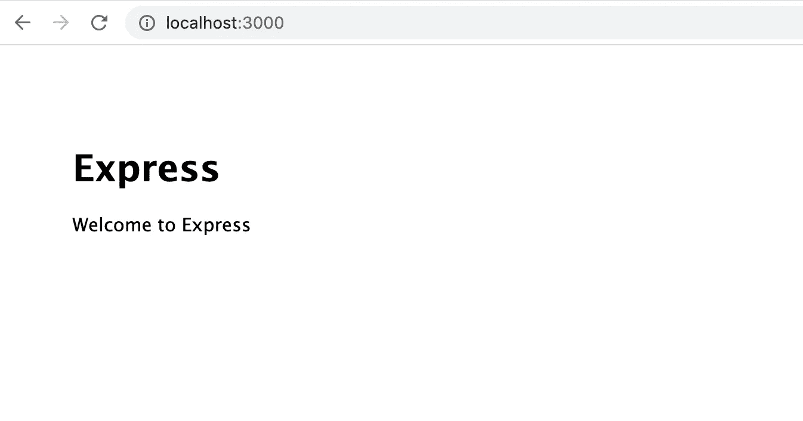
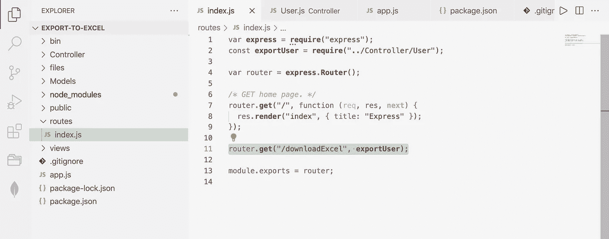
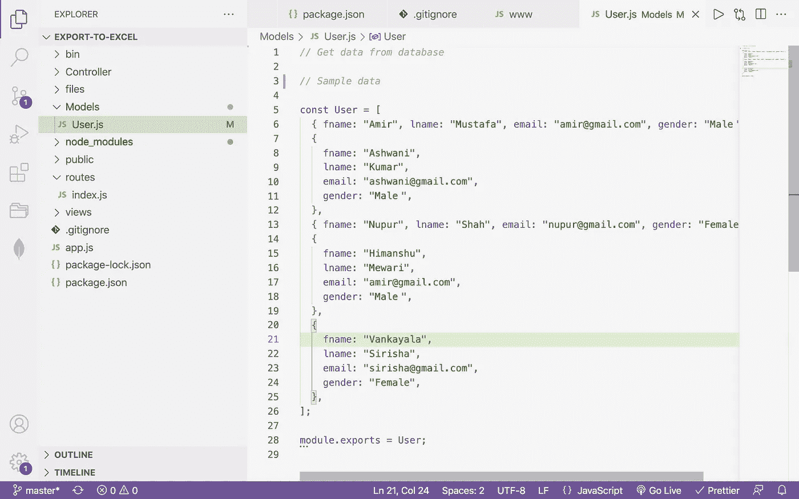
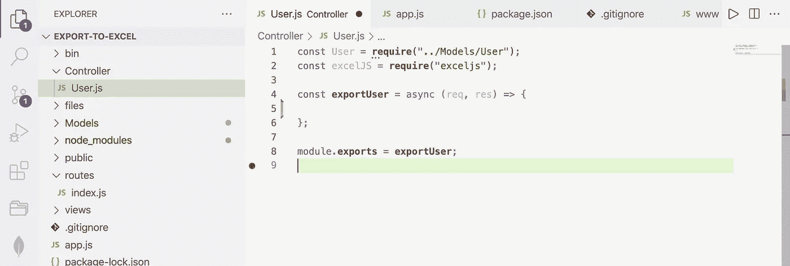
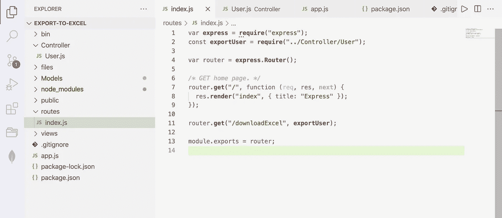
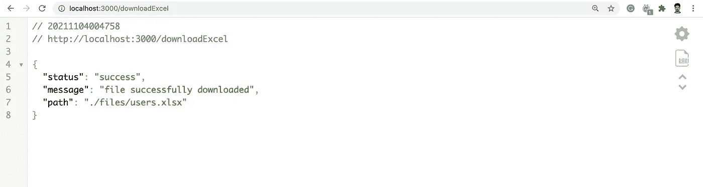
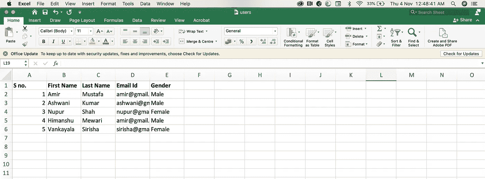

# 在 Node.js 中导出 excel 文件中的数据

> 原文：<https://medium.com/geekculture/exporting-data-in-excel-file-in-node-js-f1b298997d47?source=collection_archive---------0----------------------->


→很多时候，当我们有一些报告或管理面板应用程序时，我们需要下载 excel 文件中的数据。

→这可以在**任何 JavaScript 框架**中实现。对于本文，我们将使用节点和 **express.js.**

→同样，我们将使用 [exceljs](https://www.npmjs.com/package/exceljs) 包。

→我们需要使用以下命令安装基本快速设置

```
express <your_app_name> --view=ejs
```

→在您最喜欢的代码编辑器中打开应用程序。目录结构将如下所示:



→让我们使用下面的命令**启动节点服务器**

```
npm start
```

→在浏览器中打开 **localhost:3000** 。默认归属路由打开。



→一旦项目建立，我们将安装 **exceljs** 包

```
npm install exceljs
```

→ **步骤 1:** 我们将创建一个**路径**，用于下载。打开 **route/index.js** 文件。

这里的**导出用户**是一个**控制器**，我们将在步骤 3 中创建它

```
router.**get**("/downloadExcel", **exportUser**);
```



→ **第二步:**我们将**创建一个模型**。这个页面将**保存我们想要导出的数据**。在实际场景中，我们将连接关系或非关系数据库并获取数据。

→这里，为了简单起见，我们只写了任何数据库的数据输出。

创建**模型/User.js**

```
*// GET DATA FROM DATABASE**// Sample data*const User = [{ 
 fname: "Amir", 
 lname: "Mustafa", 
 email: "amir@gmail.com", 
 gender: "Male" 
},{
 fname: "Ashwani",
 lname: "Kumar",
 email: "ashwani@gmail.com",
 gender: "Male",
},{ 
 fname: "Nupur", 
 lname: "Shah", 
 email: "nupur@gmail.com", 
 gender: "Female" 
},{
 fname: "Himanshu",
 lname: "Mewari",
 email: "himanshu@gmail.com",
 gender: "Male",
},{
fname: "Vankayala",
lname: "Sirisha",
email: "sirisha@gmail.com",
gender: "Female",},];module.exports = User;
```



→ **步骤 3:** 我们将**创建一个控制器**，它将链接到我们的路线

创建**控制器/用户. js**

```
const User = **require**("../Models/User");const excelJS = **require**("exceljs");const **exportUser** = async (req, res) => { // WRITE DOWNLOAD EXCEL LOGIC};module.**exports** = **exportUser**;
```



在**路线**中，我们将**导入这个控制器**并配置到我们的路线中

**route/index.js**

```
var **express** = **require**("express");const **exportUser** = **require**("../Controller/User"); // CONTROLLERvar router = **express**.**Router**(); router.**get**("/downloadExcel", **exportUser**); // DOWNLOAD ROUTEmodule.exports = router;
```



→步骤 5:这里，我们将在用户控制器中编写下载 excel 的**逻辑:**

控制器/用户. js

```
const User = **require**("../Models/User"); // This has data to be used
const excelJS = **require**("exceljs");const **exportUser** = async (req, res) => {   const workbook = new excelJS.**Workbook**();  // Create a new workbook const worksheet = workbook.**addWorksheet**("My Users"); // New Worksheet const path = "./files";  // Path to download excel // Column for data in excel. key must match data key
  worksheet.columns = [ { header: "S no.", key: "s_no", width: 10 }, 
    { header: "First Name", key: "fname", width: 10 },
    { header: "Last Name", key: "lname", width: 10 },
    { header: "Email Id", key: "email", width: 10 },
    { header: "Gender", key: "gender", width: 10 },];// Looping through User data
let counter = 1;User.**forEach**((user) => { user.s_no = counter; worksheet.**addRow**(user); // Add data in worksheet counter++;});// Making first line in excel bold
worksheet.**getRow**(1).**eachCell**((cell) => { cell.font = { bold: true };});try { const data = await workbook.xlsx.**writeFile**(`${path}/users.xlsx`) .then(() => { res.**send**({ status: "success", message: "file successfully downloaded", path: `${path}/users.xlsx`, });
   });} catch (err) { res.**send**({ status: "error", message: "Something went wrong", }); }};module.**exports** = **exportUser**;
```

→这里我们**创建一个工作簿。**在工作簿内部，我们创建一个**工作表**。

→每张工作表包含不同的数据集。对于本文，我们只有一个文件可以下载，即用户工作表

→下一步，我们**定义要打印的列**。每个条目的键应该与用户模型中的用户数据相匹配。

→我们使用以下命令下载。这将以 xlsx 格式下载。exceljs 还提供了 CSV 格式的下载工具

```
await workbook.xlsx.**writeFile**(`${path}/users.xlsx`)
```

→保持节点服务器运行。让我们在浏览器中运行该路线

本地主机:3000/downloadExcel



→文件现已下载到回复中提到的路径中



# 视频:

[https://secure . vid yard . com/organizations/1904 214/players/QR 56 rbg 9 fmt qb1 sretx 2 ut？edit = true&npsRecordControl = 1](https://secure.vidyard.com/organizations/1904214/players/Qr56rBG9FMtqB1SrETx2ut?edit=true&npsRecordControl=1)

# 存储库:

https://github.com/AmirMustafa/export-to-excel

# 结束语:

我们已经看到了在 excel 文件中导出数据是多么简单。尝试阅读 exceljs 文档。在那里，我们可以在 excel 文件中进行许多格式化和下载选项。

> 谢谢你一直坚持到最后🙌。如果你喜欢这篇文章或者学到了新的东西，请点击下面的分享按钮来支持我，让更多的人了解我和/或在 [Twitter](https://twitter.com/amir__mustafa) 上关注我，看看我在那里学到和分享的其他技巧、文章和东西。

[](https://twitter.com/amir__mustafa) [## 关注 Amir Mustafa 的 JavaScript、TypeScript 和 AWS 内容。

### twitter.com](https://twitter.com/amir__mustafa)