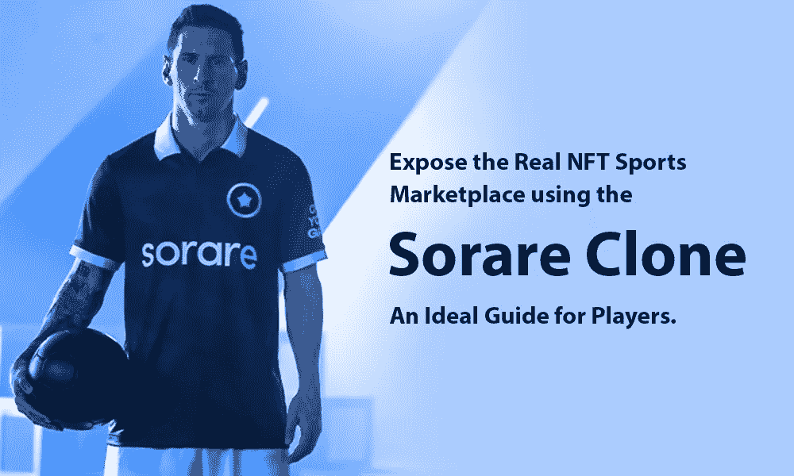

# 使用 Sorare clone 展示真实的 NFT 体育市场——玩家的理想指南。

> 原文：<https://medium.com/geekculture/expose-the-real-nft-sports-marketplace-using-the-sorare-clone-an-ideal-guide-for-players-a8d5610beaf8?source=collection_archive---------15----------------------->

Expose the Real NFT Sports Marketplace using the Sorare clone — An Ideal Guide for Players.

orare Marketplace 拥有全球超过 215 家足球俱乐部的会员资格，该市场专门出售足球收藏品。大约 9%的受访者表示，他们在过去 12 个月里花了 42-61 英镑购买他们最喜欢的顶级联赛俱乐部的商品。

让您的用户收集他们最喜爱的足球运动员的交易卡并赢得比赛以获得更多奖励。

# Sorare 克隆脚本是什么？

[**Sorare 克隆脚本**](https://www.alwin.io/sorare-clone-script) 是一个分散的 NFT 市场脚本，集成了与 Sorare 相似的幻想足球游戏功能。它使足球迷能够收集他们喜欢的球员的交易卡，参与幻想的体育活动，并给他们留下深刻印象。Sorare 克隆脚本是一个 NFT 游戏平台脚本，为那些没有时间或资源来建立一个自定义的交易解决方案。它具有用户友好的功能，可以增强游戏体验。任何人都可以通过商业模式开发白标 Sorare 克隆脚本，创造出 Sorare 这样的全球奇幻足球游戏。

作为一名企业家，你可能熟悉 NFT 空间和那里的最新动态。Sorare 克隆脚本是一个在线平台，将引导您加密诗句，并享受其收益。不要忘记 Sorare clone 是完全可定制的，因此您可以为美式足球、棒球、板球、曲棍球、混合武术(MMA)、网球和许多其他运动创建自己的平台。

# Sorare 克隆脚本——一个基于幻想体育的 NFT 市场。

疯狂的足球迷和用户在完成为期四周的新秀比赛后，欢迎来到 Sorare 克隆。是时候让他们和新主人打一场真正的冲突了。但是要参与并赢得游戏，用户需要有最近玩过的玩家的交易卡。Sorare clone marketplace 是足球爱好者购买他们最喜欢的球员卡的地方。

玩家卡在 NFT 市场上有索引。用户可以浏览基于区块链的平台，并在他们出价购买球员卡之前感到非常好奇，一旦用户完成出价，如果他们的出价高，交易卡将自动转移到一个粉丝。玩家可以使用这些卡参加并赢得大奖。体育迷对年轻球员出价是咨询性的；这是因为一旦用户购买了数字卡，他们就可以永远保留它，除非他们自己决定出售它。幸运的话，用户的路径将被加密资产击中。

# Sorare 克隆软件开发能力

现在您已经了解了 Sorare marketplace 的功能，是时候学习该平台的基本功能了。

*   允许用户根据自己的喜好购买收藏。
*   让卖家向感兴趣的买家出售藏品，以及
*   将钱包资金以法定货币的形式提取到用户的银行账户中。

# Sorare 克隆如何让用户购买收藏品？

要在 Sorare 上购买收藏品，用户必须对卖家拍卖的收藏品出价。他们的出价将与同一令牌上的其他出价竞争。如果拍卖给了卖家比其他出价更高的价格，卖家就赢得了拍卖。否则，款项将通过 ETH 或信用卡返还给投标人。一旦你赢了，收藏品将会显示在买家的画廊中。

# 你怎么能在 Sorare clone 上卖收藏品呢？

要出售一件收藏品，你必须先把它放在市场上出售。这种方式更容易从画廊中选择一个收藏品，设定价格，然后单击“出售”按钮。如果潜在买家的出价与卖家的价格一致，他就会购买收藏品。之后，该物品从卖家的画廊消失，几天后付款进入他们的钱包。与此同时，如果卖不出去，收藏品会留在他们的画廊里。

# 列出 Sorare 克隆软件的功能

当讨论像这样的综合软件时，理解所提供的功能是很重要的，

请记住，玩家的表现是实时更新的，因此参与者可以对他们的行为做出明智的决定。与区块链联邦理工学院的整合防止了两个不同的团体使用相同的集合，保护持有者免受欺诈。由于 NFT 和加密货币的高波动性，参与风险在这种商业模式中非常重要。Sorare 消除了这种参与风险，因为代币是通过声誉良好的俱乐部分销商购买的。

下面提到的是 Sorare clone 软件提供的一些最佳功能，

*   **加密钱包**

我们要讨论的第一个功能是加密钱包，它使整个过程对客户来说非常容易。你可以选择将你的加密货币存放在这个特殊的钱包中，然后用它来交易或购买顶级玩家。

*   **数码收藏品**

现实生活中的足球运动员被制作成了 NFTs 的数字卡片。这些虚拟资产是增加你的梦幻足球游戏价值的关键，因为每张交易卡都是独一无二的。除了在联赛中使用，还可以作为收藏使用。

*   **商场**

NFT 的一个市场，用户可以在这里买卖他们的数字播放器。体育爱好者可以拍卖或快速出售他们的加密资产。在分散式拍卖中，出价最高者赢得玩家卡。

*   **梦幻足球游戏**

一个投机游戏界面，用户用自己的交易卡组队，参加联赛、系列赛或锦标赛。

# 索拉雷克隆人是如何工作的？

**步骤 1** —新用户必须通过输入所需的凭据向 Sorare clone 注册。

**第二步—** 玩家将他们的加密钱包与 Sorare clone 结合起来，实现无缝交易体验。

**第三步—** 新粉丝将在前四周玩新秀游戏，他们将获得 10 张白色卡片作为奖励，并被称为经理。

**步骤 4** —玩家在每场游戏中使用五张交易卡。

一旦他们通过赢得游戏开始赚钱，他们就可以开始从交易市场购买新卡。

**第 6 步** —玩家在四周的游戏后从经理晋升为新经理。

**第 7 步**——现在，真正的游戏开始了，玩家使用五张卡参加他们注册的每个联盟。

**第八步** —用户要明智地选择玩家。由于足球明星在现实生活中表现出色，用户获胜的机会更多。

**第九步** —当球迷们掌握了比赛的诀窍，开始赢球的时候，他们就可以开始从转会市场上购买更好的球员卡，以增加成功的概率。

**第 10 步** —用户可以进入转会市场，他们将会看到一份球员名单。有了交易卡，他们想要购买，玩家可以出价。如果他们的出价足够高，他们将最终拥有稀有的收藏品。

# 使用 Sorare 克隆脚本的好处

*   通过广告获得稳定的收入。
*   预发布克隆平台
*   零收入制度
*   用户友好的用户界面
*   使您能够运行忠诚度计划
*   可以添加额外的创收模式。
*   搜索引擎友好平台
*   多语言帮助
*   兼容 iOS 和 Android 平台
*   增加目标受众的覆盖面

# 结果

Sorare 克隆脚本是一个有趣的实验，展示了 NFT 市场的未来。如果执行得当，为像 Sorare 这样的特定受众创建一个专属的 NFT 市场是一个好主意。与 Sorare 类似的项目目前正在市场上出现。然而，只有少数能给他们的目标受众留下印象。营销在创造这种影响方面发挥着重要作用。Sorare 是最好的项目之一。如果你想创建一个类似的软件，与顶级的 [**NFT 游戏开发公司**](https://www.alwin.io/nft-gaming-platform-development) 取得联系，并创建一个令人惊叹的 Sorare 克隆来迷住足球迷。