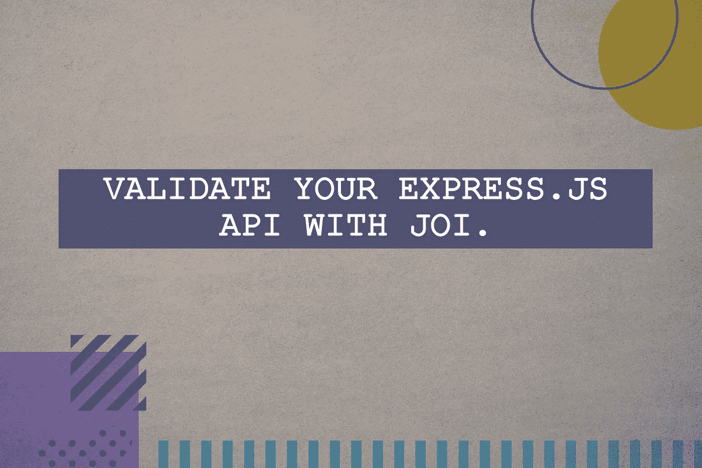
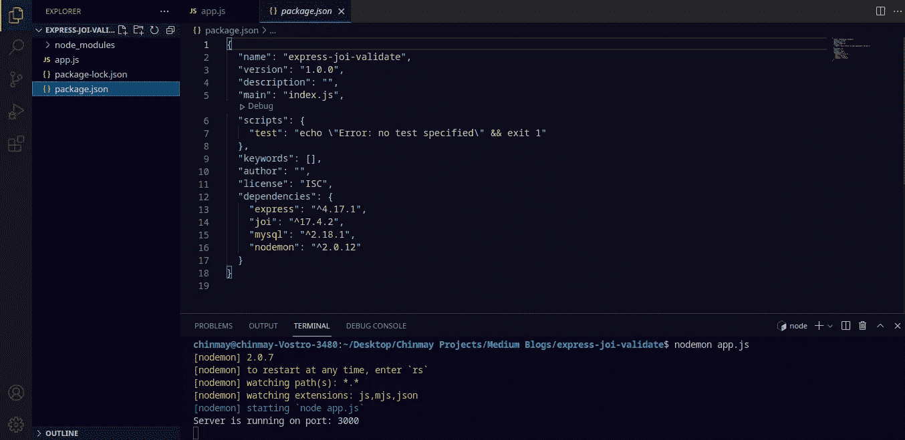
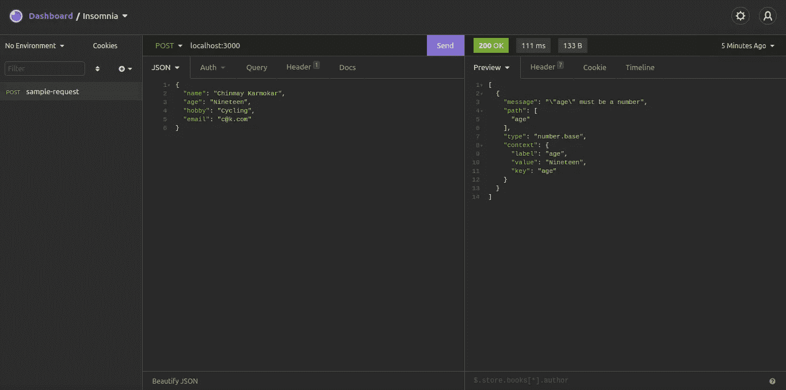
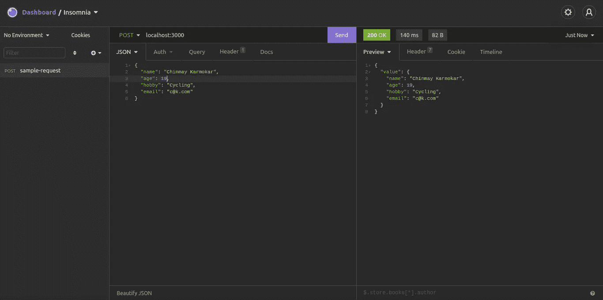
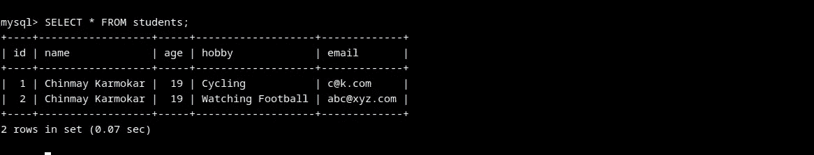

# 用 Joi 验证您的 Express.js API。

> 原文：<https://medium.com/geekculture/express-js-api-validation-with-joi-4840505f1e5f?source=collection_archive---------2----------------------->



> 在本文中，我们将看到如何用 Joi(一个 JavaScript 数据验证器)来验证我们的 Express.js API。我将尽可能保持它的简单，这样任何新手都会发现它很容易实现。

在开始之前，我们需要验证 Node.js 和 npm 是否安装在我们的系统上。如果安装了，下面的命令将为您提供相同的各自版本。另外，检查是否安装了 MySQL。

```
node -v
npm -v
mysql -V
```

如果没有安装，可以从[官网](https://nodejs.org/en/)下载。对于在 Linux 系统上安装 Node.js、npm 和 MySQL，最后提供了所有这些的链接以供参考。

如果您已经安装了这些，那么我们可以继续进行。

## 步骤 1:设置我们的 MySQL 数据库和表来查询数据:

我们将创建一个新的数据库。这是一个可选步骤，如果您想在现有数据库中创建您的表，那么您可以自由地这样做。首先，使用以下信息登录 MySQL:

```
mysql -h HOST -u USER -p
```

创建新数据库:

```
CREATE DATABASE *validate_db*;
```

使用我们刚刚创建的数据库:

```
USE DATABASE *validate_db*;
```

现在，我们将在刚刚创建的数据库中创建我们的表，即进入 **validate_db** 。我们将创建一个表，其中包含学生的姓名、年龄、爱好和电子邮件。

```
CREATE TABLE *students* (
    id int NOT NULL AUTO_INCREMENT,
    name varchar(50) NOT NULL,
    age int NOT NULL,
    hobby varchar(50) NOT NULL,
    email varchar(50) NOT NULL,
    PRIMARY KEY (id)
);
```

## 步骤 2:设置我们的 Express.js 环境:

现在我们的数据库和表已经创建好了，我们将创建我们的文件夹，在那里我们将设置我们的开发环境。

```
mkdir express-joi-validate
```

**注意:**你可以在系统上任何想要的位置创建文件夹。

```
npm init -y
```

这将在我们的文件夹的根目录下创建一个 **package.json** 文件。我们在 npm init 中提供的'-y '标志自行配置所有的依赖关系和其他命名形式。如果需要，您可以跳过该标志，根据需要手动配置它们。现在我们将安装 express、MySQL、Joi 和 nodemon:

```
npm i express@4.17.1
npm i joi@17.4.2
npm i nodemon@2.0.12
npm i mysql@2.18.1
```

我们已经安装了 nodemon，这样我们就不必在每次进行更改并保存它们时手动启动服务器。Nodemon 将监视 **mjs** 、 **js** 和 **json** 扩展。接下来，我们在文件夹的根目录下创建 **app.js** 。在这里，我们将需要到目前为止我们已经安装的所有依赖项。



Project structure with the installed dependencies in package.json

**设置 app.js**

在 app.js 中我们需要 express、MySQL 和 Joi。为了看看服务器是否工作正常，我们对它进行了如下测试:

Testing our Express.js server.

**设置 MySQL 与我们服务器的连接:**

在我们的 app.js 文件中，我们将编写下面几行代码来帮助我们建立与数据库的连接。

Setting up MySQL database connection.

这里，我已经将我的数据库凭证作为环境变量进行了传递。这是一种方法，您可以将您的数据库凭证直接作为字符串传递，但是，当您在生产数据库上工作时，不建议这样做。请注意对象密钥 tls，tls 代表传输层安全性。通过将 rejectUnauthorized 设置为 true，我们正在验证服务器证书。如果验证失败，则给出一个错误。**注意:**reject authorized key 只取**布尔**值，即**真**或**假**。

**向 MySQL 表发送数据的 POST 请求:**

由于我们已经建立了与数据库的连接，我们可以继续向表中插入数据了:

Testing POST request.

## 步骤 3:用 Joi 验证我们的 API:

Joi 将验证所有将值传递给数据库的对象键。然后，经过验证的模式将作为响应发送出去。我们完整的 POST 请求现在将如下所示:

Validating POST request with Joi.

**schema . validate(req . body)**有一个主对象，它有两个键，值**和错误**作为响应发送。如果没有发现错误，那么只返回带有值键的对象，否则还会获得带有错误详细信息的错误键。****

现在，我们在 connection.query 外部初始化模式验证器是有原因的。如果我们在 connection.query 内部初始化模式，即使验证失败，它也会始终向数据库发送数据。为了避免这个问题，我们在它之外定义了模式。此外，我们有条件地处理 DB insert 查询，这样，如果发现错误，就不会提交响应。如果它通过了所有的验证测试，没有任何错误，那么它将被插入到我们的数据库中。

**发送失眠请求:**

我将用失眠来测试我的反应。您可以随意使用任何其他您喜欢的 API 开发工具。



Sending response with incorrect datatype in JSON.



Sending response data with all the required datatypes. Success.



As seen from our MySQL table.

这样我们就实现了验证 Express.js API 的目标。

**链接到 GitHub 资源库:**[express-joi-validate](https://github.com/chinmaykarmokar/express-joi-validate)

**安装:** [Node.js 和 npm](https://linuxize.com/post/how-to-install-node-js-on-ubuntu-18.04/) ， [MySQL](https://www.javahelps.com/2019/08/install-mysql-8-on-ubuntulinux-mint.html)