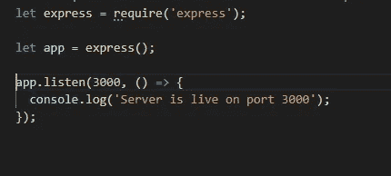
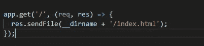
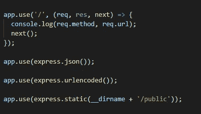
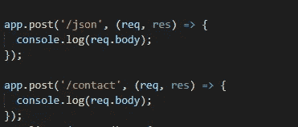

# 在节点中使用 npm 的快速服务器。JS 和搬运路线。

> 原文：<https://medium.com/geekculture/express-server-using-npm-and-handling-routes-524d7a6205a7?source=collection_archive---------25----------------------->

# 1)如何在节点中使用 express 创建基本服务器。射流研究…

*   首先，我们必须使用以下命令在我们的项目中创建一个 package.json 文件:- " ***npm init*** "
*   在创建 package.json 文件之后，我们必须使用 npm 安装 express，并且必须使用下面的命令将它输入到 package.json 文件中:" **npm install express - -save** "。
*   现在我们只需要通过请求导入 express 模块。之后，我们必须创建一个新变量，并存储 express()返回的值。请参见下图:-

creating basic server

*   一旦上述步骤完成，我们就必须调用 listen 方法，该方法接受第一个参数作为将要部署服务器的**端口**。以及**回调函数**作为第二可选参数

## — —这样，在 node.js 中使用 Express 创建基本服务器

# 2)在 Express 中处理路线。

*   假设我们必须处理路由“/”(索引路由)上的“GET”方法。
*   我们可以使用 app 变量中的方法来处理路由，如下所示

express handle GET method on route “ / ”

*   如上所示，我们必须使用应用程序。[method_name]()方法来处理我们想要的任何方法。
*   如上例所示，它接受两个参数:

1)路线。

2)回叫功能。

*   回调函数接受两个参数“**请求**和“**响应**”。
*   我们可以在回调函数内部使用“ **res.send()** ”或者“ **res.sendFile()** ”方法来结束响应。

> 注意:- res.sendFile()只接受文件的绝对路径。

# 3)如何在 Express 中处理 CSS 文件和图片路径。

*   为了处理项目中的 CSS 文件和图像，我们必须使用 **express.static()** 方法。
*   express 为我们提供了一个非常简单的方法来处理 CSS 文件和图像请求，我们不需要为每件事创建一个单独的路径。
*   首先，我们必须将所有资产移动到一个文件夹中，假设是“public”文件夹。
*   现在，为了检查即将到来的请求的请求方法和请求 URL，我们可以在每个路由上使用中间件 Console.log()，如下图所示。

static method to handle images and CSS files.

*   现在我们可以在中间件内部使用 express.static()方法，它只接受公共文件夹的绝对路径。
*   现在我们完成了。现在我们不必处理图像和 CSS 文件的路径。

# 5)访问来自 URL 主体的数据。

*   我们可以使用中间件来获取 URL 的主体数据。
*   express 提供了“ **express.json()** ”和“ **express.urlencoded()** ”方法。
*   **express.json()** :-当传入的数据是 json 格式时使用该方法。
*   **express . urlencoded()**:-当数据为 URL 字符串格式时使用此方法。
*   之后，我们可以在使用 req 对象" **req.body** "处理路由时访问这些数据。
*   参考下图:-

fetching data from req.body.