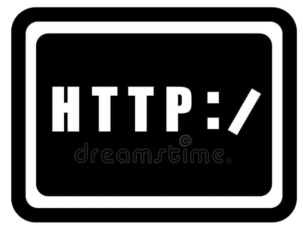

# 你应该知道的 ExpressJS 和后端中间件…

> 原文：<https://medium.com/geekculture/expressjs-and-back-end-middleware-that-you-should-know-about-a48b6c9298de?source=collection_archive---------37----------------------->


Photo by [Ian Battaglia](https://unsplash.com/@ianjbattaglia?utm_source=medium&utm_medium=referral) on [Unsplash](https://unsplash.com?utm_source=medium&utm_medium=referral)

对于我们这些学习后端的人来说，开始时事情可能没有太多意义，结构与我们在前端学到的完全不同，现在我们与服务器而不是客户端进行通信。

Node 中的结构非常简单，您在一开始就导入项目需要的所有包和不同的资源，然后是中间件，这是您想要注入代码的软件，然后是您想要设置的路线。我们还需要记住 listen()函数，这对于初始化端口并从中获得反馈是至关重要的。

在本指南中，我们将重点关注后端的中间件方面，因为一旦我们学习了 Node 的基础知识，并希望继续学习更复杂的框架，为我们提供更多像 ExpressJs 这样的选项，这是必不可少的。

首先，让我们仔细看看什么是中间件，它被定义为“除了操作系统提供的服务之外，为软件应用程序提供服务的计算机软件”，或者换句话说，中间件是一个可以访问请求和响应对象及其周期的软件，因此，它可以执行任何代码，对请求和响应对象进行更改，结束请求-响应周期，并调用堆栈中的下一个中间件。

我们可以用一行简单的代码导入 ExpressJs:

> var express = require(' express ')；

然后初始化它:

> const app = express()；

这样，Express 就设置好了，并准备好在我们的应用程序中运行，我们现在可以利用它的资源丰富的中间件，最常用的是 app.use()函数，它用于在指定的路径上安装指定的中间件函数。它主要用于为您的应用程序设置中间件。

举例来说，我们需要使用一个中间件函数来记录被调用时的响应方法，然后我们需要将该中间件函数包装在 app.use()函数中，如下所示:

```
app.use('/print', function (req, res, next) {
  console.log(res.method);
  next();
})
```

重要的是在方法的末尾注明方法 next()的使用，因为函数跳转到下一个中间件是必不可少的，如果没有这个方法，只有第一个中间件函数会运行，其余的路由会被阻塞。



现在我们已经学会了如何设置 express，让我们来看看允许我们在服务器上设置路线的不同中间件，由于 express 及其 HTTP 函数，我们可以仅使用中间件轻松创建 CRUD(创建、读取、更新、删除)应用程序:

app.get()将帮助使用从服务器读取 get 响应。

```
app.get('/', function (req, res) {
  res.send('GET request to the homepage')
})
```

app.post()将用于创建一个新对象并将其添加到数据库中。

```
app.post('/', function (req, res) {
  res.send('POST request to the homepage')
})
```

app.put()是用于更新现有对象数据的方法。

```
app.put('/user', function (req, res) {
  res.send('Got a PUT request at /user')
})
```

app.delete()用于从数据库中移除现有对象。

```
app.delete('/user', function (req, res) {
  res.send('Got a DELETE request at /user')
})
```

正如在前面的例子中看到的，我们的路由可以有不同的处理函数，甚至在同一条路由上。这就是路由作为 Express 的一个资源丰富的工具发挥作用的地方，路由指的是应用程序的端点(URIs)如何响应客户端请求。

一种更有效、更简洁的处理路线的方式是使用*路由器，在 express 中使用*，这可以通过以下代码简单地设置:

> 常量路由器= express。路由器()；

这个工具允许我们为单个路由设置可链接的路由处理程序，路由器作为一个模块，在其中加载一个中间件功能，定义一些路由，并将路由器模块挂载到主 app 中的一个路径上。需要注意的是，主应用程序中的路由必须在语法上用 app 代替 router。

我们可以在下面的例子中看到这是如何工作的(假设这是 route.js):

```
// middleware that is specific to this router
router.use(function timeLog (req, res, next) {
  console.log('Time: ', Date.now())
  next()
})
// define the home page route
router.get('/', function (req, res) {
  res.send('home page')
})
// define the about route
router.get('/about', function (req, res) {
  res.send('About Us')
})

module.exports = router
```

现在让我们看看这条路线在 app.js 上的样子:

```
var routes = require('./routes.js')

// ...

app.use('/routes', routes)
```

此处路由器的功能是让我们以更有组织的方式访问'/routes '的路由处理程序，例如'/routes/'和'/routes/about '，只需使用导入/导出工具并使用 app.use()安装此中间件。


Photo by [Terry](https://unsplash.com/@blueskin?utm_source=medium&utm_medium=referral) on [Unsplash](https://unsplash.com?utm_source=medium&utm_medium=referral)

这些概念可以更深入地扩展，但是我希望这篇文章能够帮助您基本理解后端是如何工作的，以及 expressJS 如何成为 NodeJS 的必要补充，以便通过使用中间件软件来提高代码效率和功能。和所有事情一样，你测试和实现这些想法越多，你就能更好地理解它们，所以不要害怕钻研它们，慢慢地但肯定地事情会变得有意义。

下一篇文章再见。编码快乐！