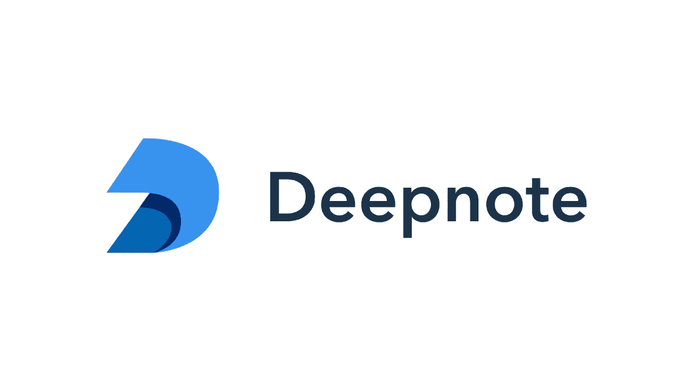
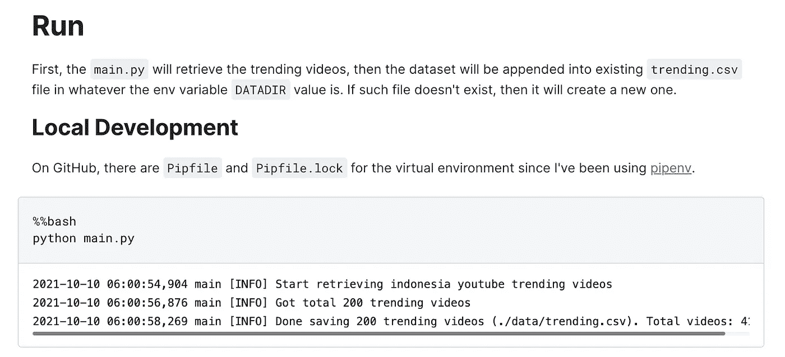
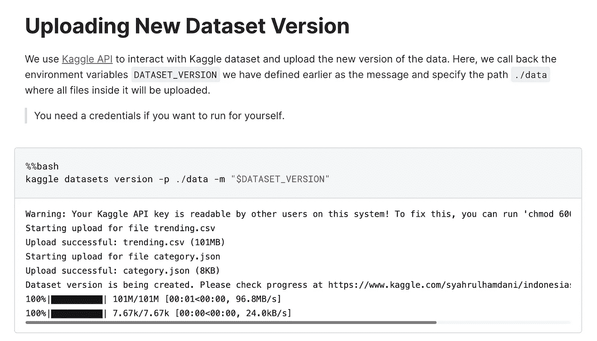

# 提取每日 YouTube 趋势视频统计数据

> 原文：<https://medium.com/geekculture/extracting-daily-youtube-trending-video-statistics-5de5f9fdc1b7?source=collection_archive---------5----------------------->

## 在 Deepnote 中使用 YouTube 数据 API 和预定的笔记本


Photo by [Christian Wiediger](https://unsplash.com/@christianw?utm_source=medium&utm_medium=referral) on [Unsplash](https://unsplash.com?utm_source=medium&utm_medium=referral)

> “YouTube 不仅仅是电视”

我们可能在某个地方听到有人说过这句话。好吧，至少，在印度尼西亚，这种说法是被人听到的。我个人认为是的…在我查看趋势列表之前。

我想，大多数上流行榜的视频基本上都来自电视。那么，我为什么不自己跟踪名单呢？

## 关于文章

受其他人的[类似工作的启发，我想分享一下我是如何构建一个 python 脚本来使用 YouTube 数据 API 自动提取趋势视频并从 Deepnote 中托管的笔记本上安排运行的。](https://www.kaggle.com/datasnaek/youtube-new)

# 你需要什么

首先，由于我们想要检索 YouTube 视频统计数据，我们需要遵循一些“入门”步骤来获取与 YouTube 数据 API 交互所需的 **API 键**。基本上，我们需要在 Google Developer Console 中创建一个项目，获得一个访问 YouTube 数据 API 的凭据，并获得一个 API 密钥。查看文档[此处](https://developers.google.com/youtube/v3/getting-started#before-you-start)了解更多详情。

接下来，确保安装了 Python 和 **2 个主库**、`requests`和`Pandas`。数据收集后我没有做花哨的分析，所以只安装了那 2 个库。另外，`kaggle`自从我把所有收集到的数据存储到 Kaggle Dataset。

# 了解 YouTube 的资源

YouTube 有很多资源和资源类型。引用[文档](https://developers.google.com/youtube/v3/getting-started#resources)，“资源是具有唯一标识符的单个数据实体”。在这种情况下，我们只关心视频资源，它代表一个单独的 YouTube 视频。

在每种资源中，都有一些我们可以用来做我们想做的事情的方法。视频资源本身有`getRating`、`reportAbuse`、`list`等方法。在我们的例子中，因为我们想要提取**一个趋势视频列表**，所以我们使用`list`方法。

`list`方法将返回一个匹配我们请求的视频列表。因此，**我们需要告诉 API 我们正在请求什么样的视频**。产生的资源表示被分成几个部分，称为`part`，每个部分都有自己的属性，包装成 JSON 格式。

例如，`snippet`零件由`publishedAt`、`channelId`、`title`、`description`等属性组成。而`statistics`部分由`viewCount`、`likeCount`、`dislikeCount`等属性组成。

# 剧本

我创建的脚本遵循模块化代码，这意味着我没有在一个大文件`main.py`中编写所有代码。相反，我把它分成了几个部分:

*   在`YouTube`类中定义的存储库代码
*   `common`目录中的一些实用功能
*   其他杂务，如日志设置、异常处理程序等。

所有这些模块都在主脚本`main.py`中使用。完整的目录结构如下所示。

> 我用 [pipenv](https://github.com/pypa/pipenv) 和 [pyenv](https://github.com/pyenv/pyenv) 来管理 python 版本和虚拟环境，因此有 Pipfile 文件。

```
.
├── Pipfile
├── Pipfile.lock
├── README.md
├── common
│   ├── __init__.py
│   ├── utils.py
│   └── video.py
├── data
├── last_retrieved_trending.py
├── main.py
├── storage
│   └── trending.csv
└── ytid
    ├── __init__.py
    ├── config.py
    ├── exceptions.py
    └── logger.py
```

## YouTube API 类

我定义了一个用于与 YouTube API 交互的`YouTube`类。我们可以认为这是我们为 YouTube 开发的 python API。

ytid/__init__.py

正如我们看到的，方法`get_trendings`将遍历响应项，直到没有找到光标。这是我们的主要方法。

在`main.py`中，我们可以导入类并编写

```
youtube = YouTube(url=config.URL, api_key=config.API_KEY)
videos = youtube.get_trendings()
```

## 录像

对于从响应项中收集的每个视频，我们将其定义为`Video`，它代表一个 YouTube [视频资源](https://developers.google.com/youtube/v3/docs/videos)。

common/video.py

由于我们要求 YouTube 返回`snippet`、`contentDetails`和`statistics`资源，我们首先为每个部分提供必要的属性。你可以在 [YouTube 数据 API 文档](https://developers.google.com/youtube/v3/docs/videos#properties)上查看其他零件资源。

## 家务模块

还有一些杂务模块。一些像 API Key 这样的秘密被存储为环境变量，通过使用 pipenv，我们可以使用位于`config.py`的`os.getenv`函数来访问和读取它们。我们还定义了一些自定义异常和日志格式。

# 日程笔记本



Pict from [https://analyticsdrift.com/data-science-real-time-collaboration-tool-deepnote-is-now-open-for-all/](https://analyticsdrift.com/data-science-real-time-collaboration-tool-deepnote-is-now-open-for-all/)

代码准备好之后，就该运行并获取趋势数据了。因为我想收集每日趋势数据，所以它需要每天运行。我的第一次尝试是每天手动运行。直到我在某些时候忘记运行它，因此一些趋势数据没有被正确收集。

2021 年 5 月，我通过邮件收到了产品更新，宣布 Deepnote 现在支持预定笔记本！当时，我知道这是我可以自动和按计划运行 YouTube 趋势代码的地方。

> 引用[deepnote.com](https://deepnote.com/)的话，“Deepnote 是一种新型的数据科学笔记本。jupyter-兼容实时协作，运行在云中。”

下面是已发布文章的快照，其中代码计划在 UTC+7 每天下午 1 点运行。如果你很好奇，可以在这里查看文章。



Pict by author

如果你想使用 Deepnote 上的日程安排功能，请阅读这里的文档。

## 推送至 Kaggle 数据集

检索趋势数据后，下一步是将其上传到 Kaggle 数据集。同样，因为我想在预定的笔记本中自动嵌入上传/更新步骤，所以我使用`kaggle` API 并在笔记本单元中作为 bash 命令运行它，就像代码一样。



Pict by author

# 要关闭此…

谢谢你一直读到这里的最后一节。到目前为止，您已经了解了我检索 YouTube 趋势数据的方法，包括代码和“部署”。我鼓励你看看下面的代码库，了解全部细节。

[](https://github.com/syahrulhamdani/ytid-trends) [## GitHub-syahrulhamdani/ytid-趋势:印度尼西亚 YouTube 趋势视频统计

### 提取 YouTube 印度尼西亚趋势数据。受提供趋势 YouTube 视频统计数据的 datasnaek 的启发，我…

github.com](https://github.com/syahrulhamdani/ytid-trends) 

谢谢，注意安全！