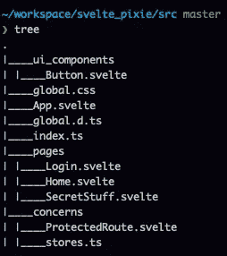
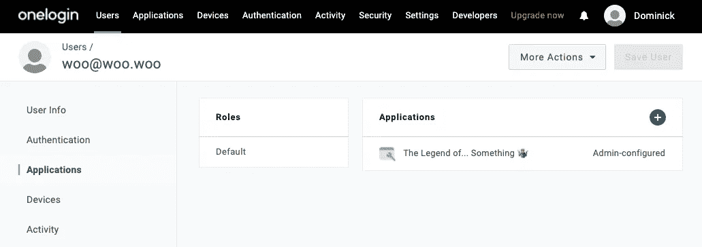
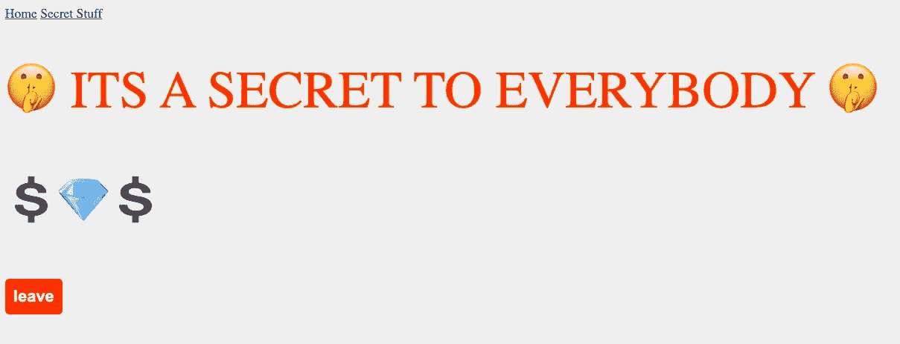

# EZ PZ 保护路线苗条

> 原文：<https://medium.com/geekculture/ez-pz-protected-routes-in-svelte-c276a796e13b?source=collection_archive---------10----------------------->

我没有在这上面花太多时间，因为我真的不需要👍


不过说真的， [Svelte](https://svelte.dev) 是一个前端框架，它让构建单页面应用程序变得非常容易，我非常喜欢使用它——我敢说比 React 更喜欢，主要是考虑到与 Svelte 相比，React 有一个陡峭的学习曲线。

听着，在你把我绑在火刑柱上烧死之前，先看看这个。在苗条路线真的很简单，保护你的路线也很容易。我通过制作世界上最省力的地牢爬虫《某事物的传说》给你看。

# 设置—项目

通过运行这个并把<your_project_name>替换成你愚蠢的地牢爬虫游戏的名字，开始旋转一个苗条的项目。</your_project_name>

```
npx degit sveltejs/template <your_project_name>
```

Svelte 自带`rollup`功能，但我更喜欢使用`webpack`,因为这是我所知道的，我已经知道如何让它与 Typescript 一起工作。如果你想像我一样设置，你需要做一些额外的功课。TLDR——让你的项目看起来像带有`.tsconfig` `webpack.config.ts` `.babelrc`的[矿井](https://github.com/dcaponi/svelte_pixie)，并添加所需的包。

查看我提供的示例项目[以了解更多细节，因为这超出了本文的范围(如果您想要详细了解如何设置 Svelte + Webpack + Typescript，请告诉我)。](https://github.com/dcaponi/svelte_pixie)

一旦你的项目建立并运行，我们就可以开始做一些改变。您需要首先安装一些 npm 软件包:

```
npm install svelte-routing dotenv @onelogin/sdk
```

`svelte-routing`是我们的路线。

让我们使用环境变量。

`[@onelogin/sdk](https://github.com/onelogin/onelogin-node-sdk)`处理我们的登录流程&用户管理(稍后会详细介绍)。

在我们开始“真正的工作”之前，我们将创建一些文件夹/文件。这里是最热闹的地方。在`/src`中，我们执行以下操作:

```
cd src
mkdir ui_components pages concerns
touch ui_components/Button.svelte
touch pages/Login.svelte pages/Home.svelte pages/SecretStuff.svelte
touch concerns/stores.ts concerns/ProtectedRoute.svelte
```

您的项目结构应该看起来像图片。如果你正在使用 Typescript，把你所有的`.js`文件转换成`.ts`文件。



`ui_components`文件夹非常简单明了，但是有趣的是`pages`和`concerns`。`pages`文件夹是每个“页面”或“屏幕”所在的位置。`concerns`文件夹用于横切组件和其他辅助代码。这是我们添加`ProtectedRoute`组件和`store`的地方。

# 设置—身份验证服务器(一次登录)

我使用 OneLogin 作为我的认证后端，因为它免费，易于使用，他们有一个很棒的开发者社区(我碰巧在那里工作，但这已经足够了😶).

有一种方法可以使用用户迁移挂钩将登录页面转换为登录/注册页面，但这是另一篇文章了。现在，我们假设你已经注册了用户&手动注册了一个非常早期的启动。

假设你已经从你的 [OneLogin 开发者账户](https://www.onelogin.com/developer-signup?utm_medium=web&utm_source=devsite&utm_campaign=freedeveloperaccount&utm_content=headernav)获得了你的 API 证书，你可以用它们来获得一个 API 访问令牌，你将需要这个应用和用户创建调用。我在我的环境中将我的保存为`ONELOGIN_CLIENT_ID`和`ONELOGIN_CLIENT_SECRET`。

如果你使用 Mac 并且安装了 jq，你可以通过管道把它发送到`pbcopy`以便稍后粘贴，或者省略`| jq '."access_token"' | pbcopy`并且只在响应上复制粘贴。

```
curl '[https://api.us.onelogin.com/auth/oauth2/v2/token'](https://api.us.onelogin.com/auth/oauth2/v2/token') \
-X POST \
-H "Authorization: client_id:$ONELOGIN_CLIENT_ID, client_secret:$ONELOGIN_CLIENT_SECRET" \
-H "Content-Type: application/json" \
-d '{
  "grant_type":"client_credentials"
}' | jq '."access_token"' | pbcopy
```

创建应用程序—这是您的苗条应用程序在 OneLogin 的认证服务器中进行认证的方式。注意`redirect_uri`。在投入生产之前，请确保更新应用程序中的这些内容，以反映生产领域，否则对于本地开发来说，这将起作用。

对于此流程需要的 OIDC 应用，请确保您的`connector_id`为 ***108419*** 并且`token_endpoint_auth_method`设置为 ***2*** 用于 PKCE，如卷曲所示。

```
curl --location --request POST '[https://api.us.onelogin.com/api/2/apps'](https://pied-piper-dev.onelogin.com/api/2/apps') \
--header 'Content-Type: application/json' \
--header 'Authorization: Bearer <access_token>' \
--data-raw '{
  "connector_id": 108419,
  "name": "Legend of Something",
  "description": "Svelte Demo",
  "visible": true,
  "configuration": {
    "redirect_uri": "[http://localhost:3000\nhttps://localhost:3000](http://localhost:3000\nhttps://localhost:3000)",
    "token_endpoint_auth_method": "2",
    "oidc_application_type": "0"
  }
}'
```

创建一个用户——我们不会将注册作为其中的一部分，所以现在我们将进行预填充。

```
curl --location --request POST '[https://api.us.onelogin.com/api/2/users'](https://pied-piper-dev.onelogin.com/api/2/users') \
--header 'Content-Type: application/json' \
--header 'Authorization: Bearer <access_token>' \
--data-raw '{
  "email": "woo@woo.woo", 
  "password": "123asdf!", 
  "password_confirmation": "123asdf!"
}'
```

在门户中找到新用户——对他们的用户名、密码等进行最后的更改，然后在右侧的`Applications`下，通过单击+按钮启动菜单，将`Legend of Something`应用添加到用户的可用应用中。



# 设置—路线

在`App.Svelte`中，我们将添加我们的路线。您也可以定义一个`routes.js`并导入它——但是对于一个 2 路线的项目来说，这完全没问题。

`App.Svelte`超级简单，没有逻辑——只有`Router`和一个愚蠢的导航条。每条路线都有一个`path`，这是你到达你正在看的页面`component`的路径。我们有一个`Home`页面和一个`SecretStuff`页面。到`/*`的最后一条路线是当我们试图导航到`/asdf`或我们浏览器搜索栏中的某个东西时，把我们带回家。请注意，`SecretStuff`组件位于我们定义的名为`ProtectedRoute`的定制组件中。

# 与 PKCE 之间的受保护路线

`ProtectedRoute`我们今天节目的明星是一个横切组件，它“包装”了一条路线，要么让你转到受保护的页面，要么让你跳回到`Login`页面。

这使用了 [PKCE 认证流程](https://oauth.net/2/pkce/)——一种 OAuth 流程，现在用于单页面应用程序，取代了隐式流程。PKCE 的好处是，应用程序做了一个额外的步骤来建立一个`code_verification`值和与认证服务器的机制，因此在重定向之后(它添加了`code`作为一个可以被拦截的查询参数),应用程序可以发送`code_verification`值，只要它散列到在重定向之前发送到认证服务器的值，你就可以开始了。关于 PKCE 以及 OneLogin SDK 如何实现它的详细解释，这里有一个很好的帖子。

`ProtectedRoute`组件是这样工作的:

1.  使用您的 OIDC 应用程序`clientID`和`redirectURL`建立与 OneLogin 客户端的连接。
2.  生成 authURL，这是用户单击以转到登录页面的 URL。
3.  如果我们从认证服务器回来(我们刚刚完成登录)，我们的 URL 中应该有一个`?code=something`。当这种情况发生时，我们获取它并使用它来请求一个`access_token`，这表明我们已经正确地输入了我们的凭证。

PKCE `code_verifier`的东西都是在引擎盖下完成的，所以没有必要担心它，但同样，它只是增加了一些额外的保证，即发送`code`以获得`access_token`的应用程序是启动认证过程的同一应用程序。

有了`ProtectedRoute`设置和处理我们的认证状态，添加一个`Login`组件变得非常简单。

```
// src/pages/Login.svelte<script lang="ts">
  import { authURL } from '../concerns/stores';
  import Button from '../ui_components/Button.svelte';
  import { navigate } from 'svelte-routing';
</script><h2>This door is locked</h2>
<*Button* on:message={() *=>* *navigate*($authURL)} label="🔐 unlock"/>
```

我们使用 svelte-stores 来处理访问令牌和 auth URL。当应用程序加载时，我们首先尝试从 localStorage 中获取数据，否则我们将在内存中处理这种数据，并将其“持久化”在 localStorage 中，以便在刷新后继续存在。

```
// src/concerns/store.tsimport { writable } from 'svelte/store';export const accessToken = *writable*(localStorage.*getItem*('accessToken'));export const authURL = *writable*(localStorage.*getItem*('auth-url'));
```

⚠️如果你选择使用 localStorage，确保你的应用能够抵御跨站点脚本攻击。任何可以在你的页面上运行任意 javascript 的人都可以添加代码来转储本地存储，并将其发送到其他服务器，因此净化你的输入，javascript `eval`函数应该会吓到你⚠️

# “成品”

如果一切顺利，你应该看到你的网页开始出现。我没有在这上面花太多时间，所以我们只是得到了默认的苗条外观和感觉——我告诉过你这是低努力…

家很简单——它是我们冒险的开始。注意顶部的劣质导航条


如果你想看密室，你需要一把钥匙(密码)


这🔐解锁按钮实际上只是一个到认证服务器的重定向。单击它会将我们转到 OneLogin 登录页面，在此输入我们的凭据。检查 URL 时，您会看到它包含我们的散列 code_verifier 和散列算法，因此您知道 PKCE SDK 正在做它的工作。



最后，如果你登录成功，你会发现一个密室，里面有很多“钱”(那是我用游戏币虚构的)。您可以刷新或导航到您想要的主页，并且您仍然能够到达密室，因为 access_token 已被缓存。

点击离开会激活`access_token`，然后你会被带回家，你必须重新登录。

# 包扎

瞧啊。多亏了 PKCE 和 OneLogin，用不到 50 行代码就实现了一个快捷肮脏的保护路线。我将是第一个承认它并不完美的人，因为 Svelte 和 OneLogin 都是相对较新的产品(Svelte 是一个新的框架，OneLogin 闯入了开发者的关注领域),我们一直在改进。

如果你看到一些可以改进的地方，我欢迎你的建议和意见，并且 [OneLogin SDK](https://github.com/onelogin/onelogin-node-sdk) 是开源的，所以欢迎 PRs 和问题。