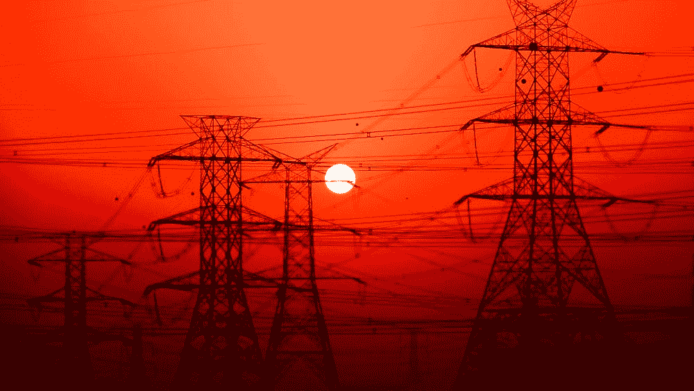
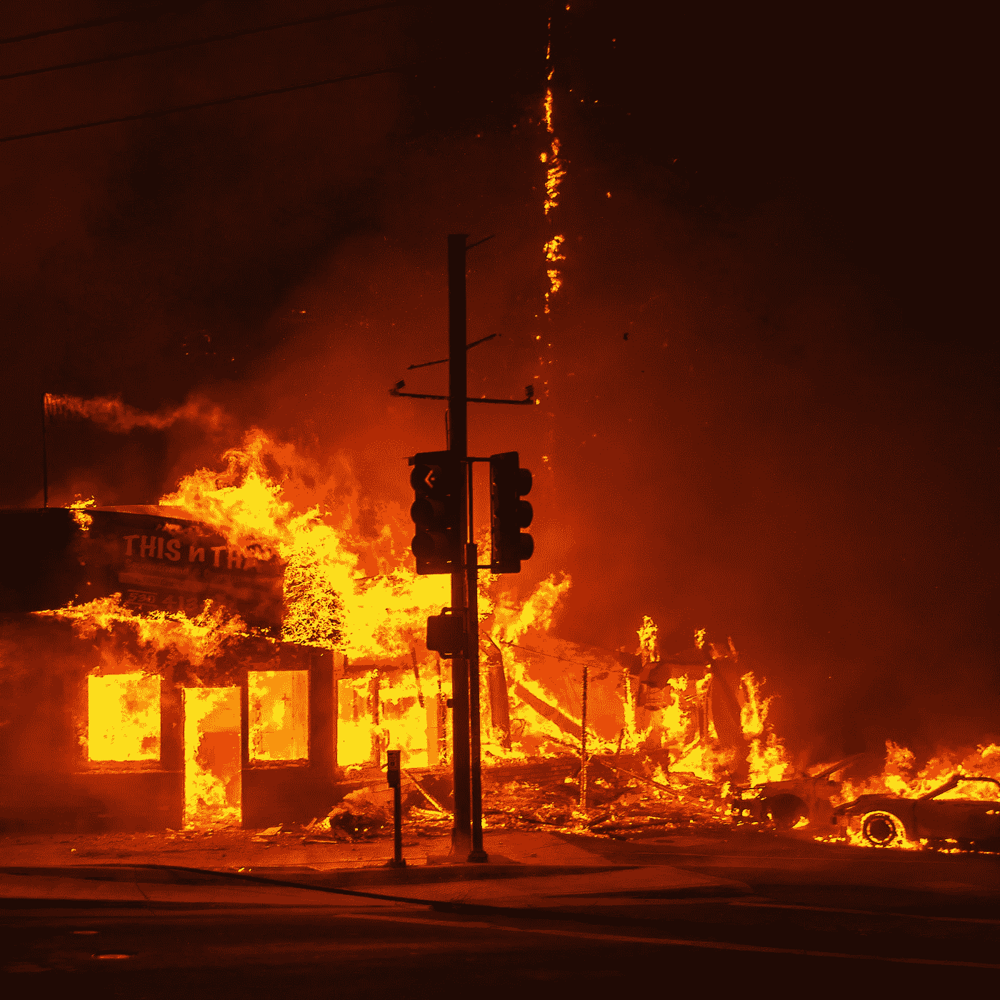
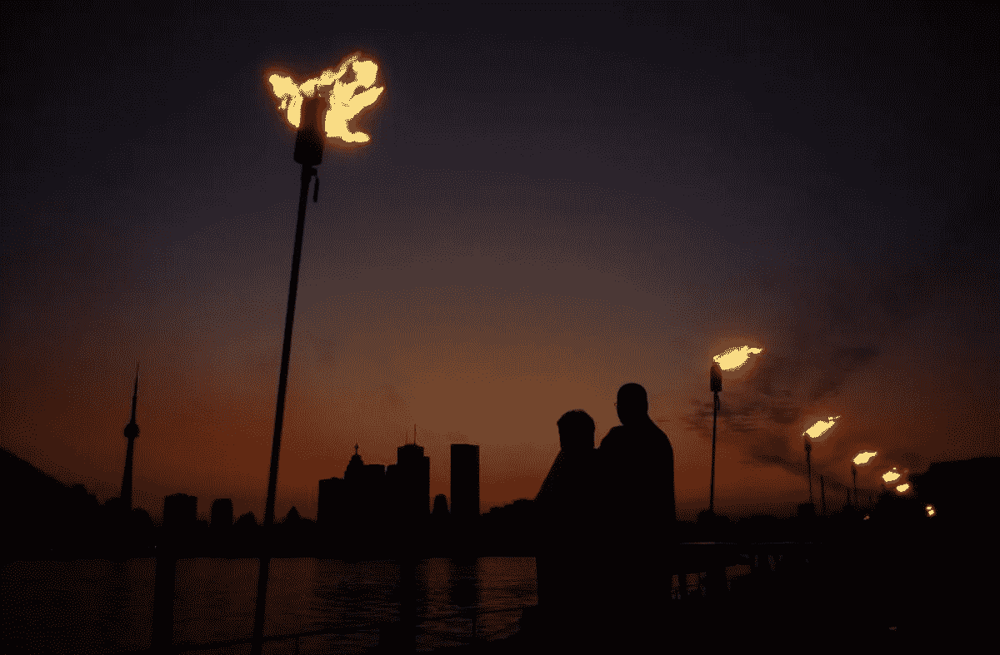
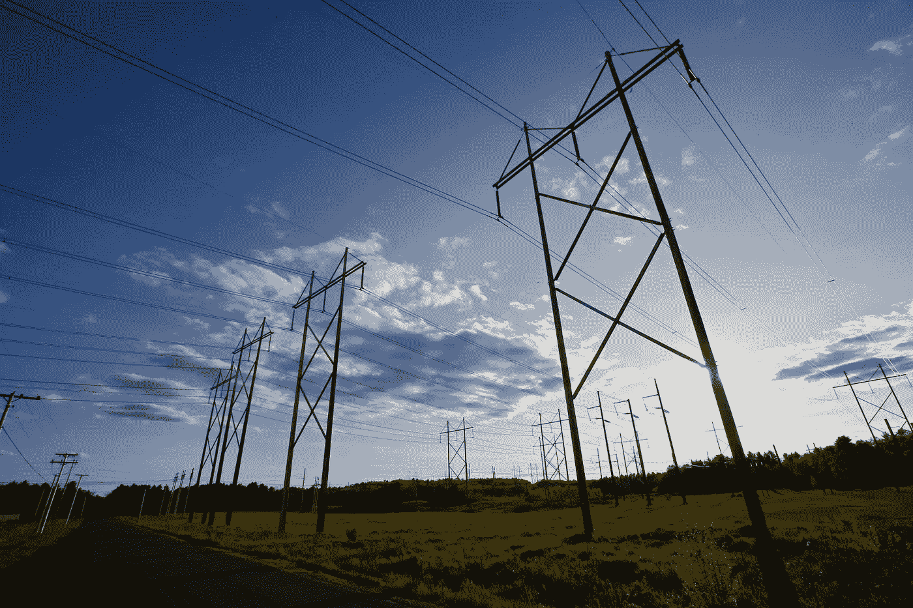
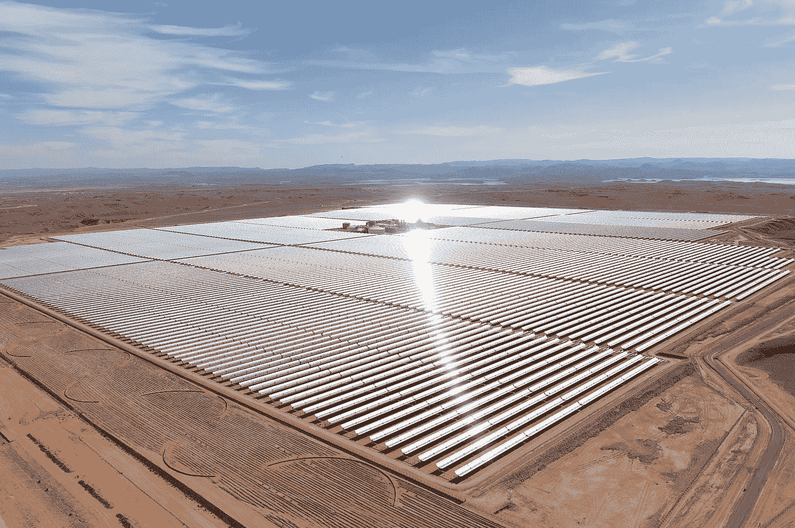
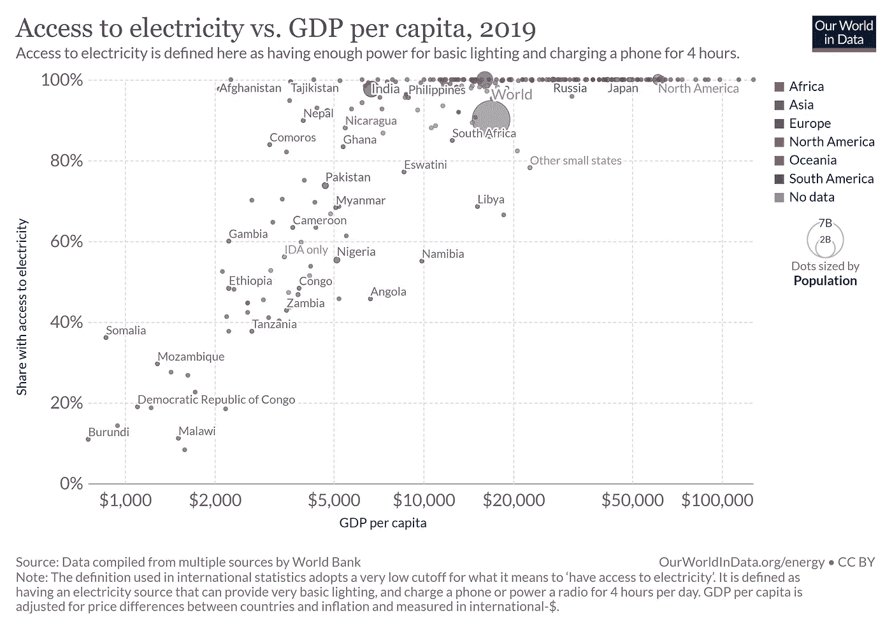

# 电线:为什么我们需要一种新的输电方式

> 原文：<https://medium.com/geekculture/f-ck-wires-why-we-need-a-new-way-to-transfer-electricity-72495b4947c?source=collection_archive---------4----------------------->

Credit: [Unsplash](https://unsplash.com/photos/U6tYeEhEVTk)

自从电出现以来，它就通过电线传输，为世界提供动力。自从第一个弧光灯出现以来，世界已经将发电从像煤这样的重污染物转移到像水力、风力和太阳能这样的环境友好、可再生和可持续的来源。问题是，如果我们在等式的世代方面已经取得了如此大的进步，为什么传播却没有跟上？

**高昂的维护成本**

有线电力传输的最大问题之一是确保所有塔架和电线安全正确运行所需的大量维护。据估计，北美有超过 1.5 亿根电线杆横跨整个大陆，随着新基础设施项目的完成，这一数字预计还会增加。如此庞大的工作量可以预见，公用事业公司根本没有时间、资金或人力来适当地检查和维护每一根电杆，这将导致致命的后果。

Effects of the Camp Fire. Credit: [Wired](https://www.wired.com/story/the-terrifying-science-behind-californias-massive-camp-fire/)

这场加州历史上最致命、破坏性最大的野火，造成 85 名平民死亡，18，804 座建筑被毁，153，336 英亩土地被烧毁。原因？一个有缺陷的 C 形钩负责支撑电线，它的金属支架被磨坏了，在一场风暴中折断了。拥有这条电线的电力公司 PG&E 知道这是一个反复出现的问题，但却没有做出回应。他们从地面和空中进行了目视检查，但未能在问题造成灾难之前将其纠正。这些只是我们所知道的电力线。

显而易见，尽管公用事业公司存在疏忽，但有线电力需要复杂的检查，这很昂贵，还需要工人爬上高塔检查各个组件。公用事业公司寻求一种更具成本效益的解决办法，这种办法无法解决问题，灾难就会降临。

**易受外界干扰**

有线电力的另一个关键问题是它易受天气事件和自然干扰的影响。雪、风、温度变化和雷暴都会对电网产生直接影响。如果输电线接触到任何东西，无论是倒下的树还是一堆气球，都可能导致整条输电线瘫痪。尽管工程师和城市规划者尽了最大努力安装断路器、变电站和其他预防措施，许多社区仍然发生大停电。

View of Toronto in the dark. Credit: [Toronto Star](https://www.thestar.com/photos/2013/08/13/blackout_2003_the_day_in_photos.html)

以 2003 年 8 月 14 日的大停电为例。由于天气炎热，许多东北人开着空调来保持凉爽。这给克利夫兰等地带来了巨大的电力需求，这些地方从伊利湖附近和更南边的发电厂获得电力。由于一系列树木与将电力引入该地区的高压电线接触，以及计算机故障导致电力控制人员忽略了这一事实，系统上的负载不可持续，电网上的断路器开始停止电流。三分钟之内，一个比伊朗还大的电岛就建成了。从底特律到多伦多到纽约，超过 5000 万人没有电力供应。停电导致大规模烧水咨询，中断手机服务，并在受影响城市的街道和高速公路上造成混乱。它导致了近 100 人死亡。

**发展问题**

Halted electricity transmission project. Credit: [WBUR](https://www.wbur.org/news/2021/01/15/avangrid-maine-massachusetts-power-energy-grid)

有线电力传输项目也是出了名的难以建立，特别是在发达国家，在建立项目时要咨询各方。例如，在美国或加拿大，新能源项目需要地方和市政府、省和州政府、私人土地所有者、能源监督委员会、原住民部落理事会和其他各种利益相关者的许可。在美国，缅因州的选民举行了公投，否决了一条将从加拿大引进清洁水电的新高压线。Mainers 只是不想要更多的，阻碍性的电力线。《波特兰新闻先驱报》(Portland Press Herald)称之为“缅因州历史上分歧最大、代价最高的环境战役之一”。在肯尼亚，土地所有者反对电线穿过他们的土地，导致几条 240 千伏和 404 千伏线路的建设严重延误。

2011 年，当巴拉克·奥巴马总统试图加快七条主要输电线的建设以支持国家经济愿景时，只有两条成功建成。事实上，超过 75%的可持续能源项目从未进入市场。这是由于从资源丰富的农村地区向主要城市中心输送可再生能源所需的新高压基础设施的成本和影响。

**案例研究:非洲**

以非洲为例。随着太阳能和风能技术在 2010 年经历了 60%的价格下跌，它们成为了为该地区快速增长的经济提供额外动力的最合理选择。Noor Ouarzazate 太阳能发电站是世界上最大的集中式太阳能农场，摩洛哥超过三分之一的电力是由可再生能源提供的。非洲开发银行和欧洲投资银行正在创建大量投资基金，向当地经济注入资本，以鼓励可持续电力的增长。这些项目旨在为仍生活在黑暗中的超过 5.97 亿非洲人提供充足的电力。

Noor Ouarzazate Solar Power Station in southern Morocco. Credit: [CNN](https://www.cnn.com/2016/02/08/africa/ouarzazate-morocco-solar-plant/index.html)

为了给每个人供电，非洲大陆需要一种远距离传输电力的有效方法，最好是一种不会出现有线电力持续存在的许多缺点的方法。

但是人们真的需要电吗？答案是响亮的是。长期以来，能源获取一直是一个国家经济增长的最重要因素。电力供应越多，越多的人可以完成工作。许多西方国家生活水平前所未有的提高，很大程度上是由技术创新推动的，而技术创新是通过电网输送的大量电力实现的。电力带来了可获得的和负担得起的手段来使家庭现代化，使从电制冷到照明的一切成为可能。

Credit: [Our World In Data](https://ourworldindata.org/grapher/access-to-electricity-vs-gdp-per-capita)

目前，非洲的可持续能源模式在规模上往往局限于小型微型电网和单户太阳能系统。家用太阳能系统只在太阳升起的时候为顾客提供电力，给电池充电可以为三个灯泡和一台收音机提供整夜的电力。虽然这比根本没有电力供应有了明显的改善，但这仍被归类为能源贫困。需要大幅增加社区可用的电量，以使它们能够采用上个世纪引入的技术创新来实现繁荣。取代了几盏灯和一台收音机，我们给人们提供了电机、冰箱和互联网。

为什么我们不通过电线给他们供电呢？似乎上面提到的原因还不够，对于发展中国家政府来说，建设和维护输电线也很昂贵。现实情况是，政府根本不愿意建造数百公里的电线杆来为一个偏远村庄的几百人供电。穿越偏远地区时还存在地理挑战，这意味着必须将茂密的丛林、沙漠、山脉和湖泊纳入电网建设成本。所有这些因素加在一起，使得电力基础设施的建设成本高得惊人。

如果输电线不再是一个可行的解决方案，还有什么可做的？我们如何让发展中国家的人们获得足够的电力，同时降低传输成本并鼓励新的可再生电力增长？

我目前正在研究这个问题，为人们创造一种在 jointungsten.com 以无线方式获取电力的方式，成本只是无线方式的一小部分。请随意查看。如果你有兴趣，联系我:alexanderyevchenko@gmail.com 和推特上的 [@alex_yevchenko](https://twitter.com/alex_yevchenko) 。