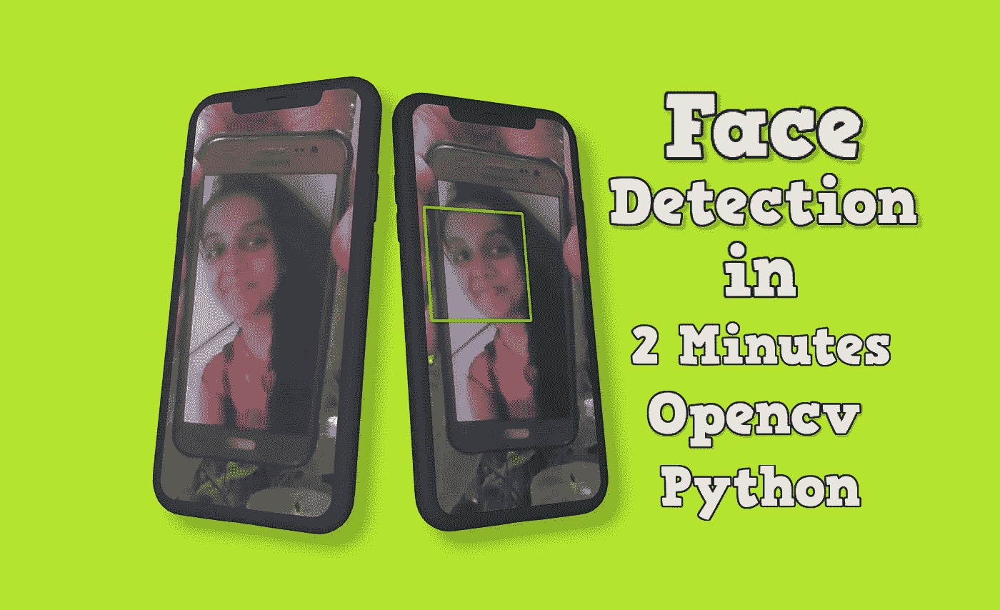
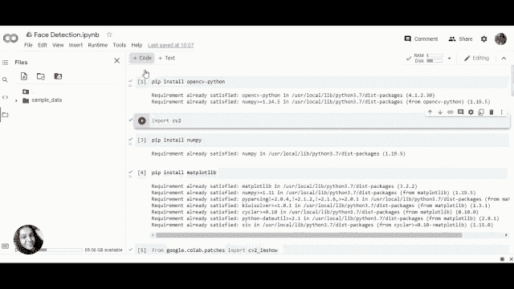
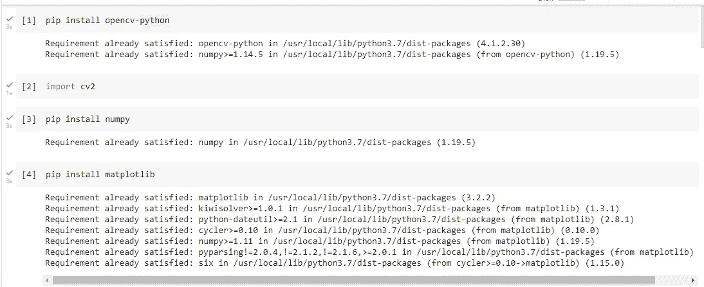
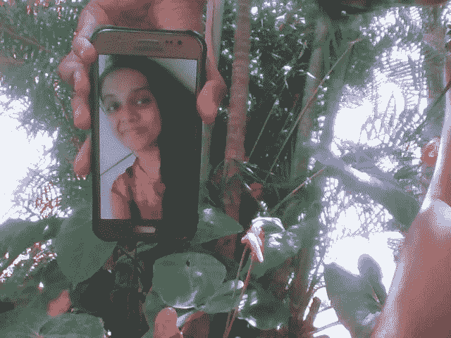
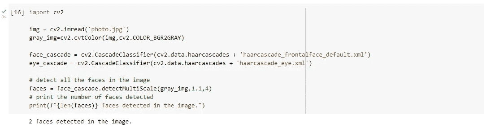
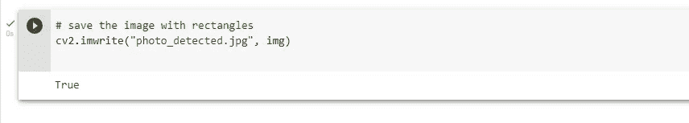
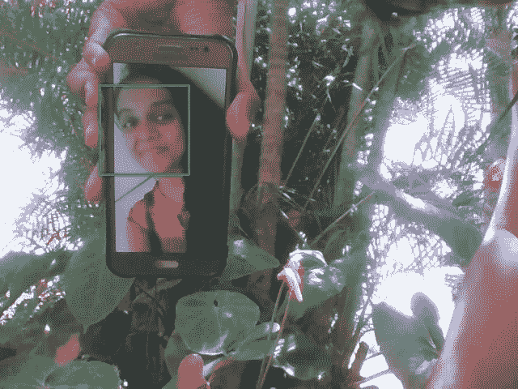

# 使用 OpenCV 和 Python 在 2 分钟内进行人脸检测——Google colab

> 原文：<https://medium.com/geekculture/face-detection-in-2-minutes-using-opencv-python-google-colab-f32531c64741?source=collection_archive---------3----------------------->



## 在这篇快速的帖子中，我想分享一种在 OpenCV 和 Python 中使用 Haar 级联检测人脸的非常流行和简单的方法



为此我使用了 google collab，首先，确保你已经安装了 OpenCV。您可以使用 pip 安装它:

```
pip install opencv-python
```

请确保已经安装了这些库。

**步骤 01，02，03，04**



Step 01,02,03,04

在检测面部之前，我们应该使用 google collab 打开网络摄像头。

**第 05 步**

```
from IPython.display import display, Javascriptfrom google.colab.output import eval_jsfrom base64 import b64decodedef take_photo(filename='photo.jpg', quality=0.8):js = Javascript('''async function takePhoto(quality) {const div = document.createElement('div');const capture = document.createElement('button');capture.textContent = 'Capture';div.appendChild(capture);const video = document.createElement('video');video.style.display = 'block';const stream = await navigator.mediaDevices.getUserMedia({video: true});document.body.appendChild(div);div.appendChild(video);video.srcObject = stream;await video.play();// Resize the output to fit the video element.google.colab.output.setIframeHeight(document.documentElement.scrollHeight, true);// Wait for Capture to be clicked.await new Promise((resolve) => capture.onclick = resolve);const canvas = document.createElement('canvas');canvas.width = video.videoWidth;canvas.height = video.videoHeight;canvas.getContext('2d').drawImage(video, 0, 0);stream.getVideoTracks()[0].stop();div.remove();return canvas.toDataURL('image/jpeg', quality);}''')display(js)data = eval_js('takePhoto({})'.format(quality))binary = b64decode(data.split(',')[1])with open(filename, 'wb') as f:f.write(binary)return filename
```

**第 06 步**

```
from IPython.display import Imagetry:filename = take_photo()print('Saved to {}'.format(filename))# Show the image which was just taken.display(Image(filename))except Exception as err:# Errors will be thrown if the user does not have a webcam or if they do not# grant the page permission to access it.print(str(err))
```

运行这两个代码后，网络摄像头打开，您可以拍摄照片。

照片被保存为 photo.jpg。



使用哈尔级联的人脸检测是一种基于机器学习的方法，其中用一组输入数据训练级联函数。OpenCV 已经包含了许多预先训练好的人脸、眼睛、微笑等分类器。今天我们将使用面部分类器。您也可以尝试其他分类器。

若要检测图像中的人脸:

**第 07 步**



Step 07

需要注意一些事情:

*   该检测仅对灰度图像有效。因此，将彩色图像转换为灰度图像非常重要。(第 3 行)

```
gray_img=cv2.cvtColor(img,cv2.COLOR_BGR2GRAY)
```

*   **detectMultiScale** 函数(第 7 行)用于检测人脸。它采用 3 个参数—输入图像、*比例因子、*和 minN *邻居*。*比例因子*指定图像尺寸随每个比例缩小多少。*最小邻居*指定每个候选矩形应该有多少邻居来保留它。你可以[在这里](https://www.bogotobogo.com/python/OpenCV_Python/python_opencv3_Image_Object_Detection_Face_Detection_Haar_Cascade_Classifiers.php)详细了解。您可能需要调整这些值以获得最佳结果。
*   *面*包含了找到面的矩形区域的坐标列表。我们使用这些坐标来绘制图像中的矩形。

接下来，我们可以使用绿色矩形来检测人脸。

**第 08 步**


Step 08

要查看检测到的面部，

**第 09 步**



Step 09

转到文件并打开 photo_detected.jpg。

结果:



希望这对你有用。如果你在实现这个过程中有任何困难或者你需要任何帮助，请联系我。