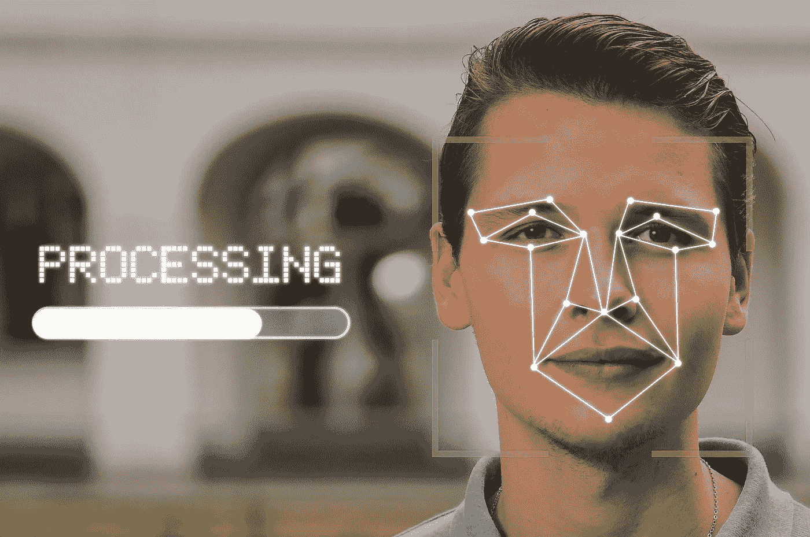
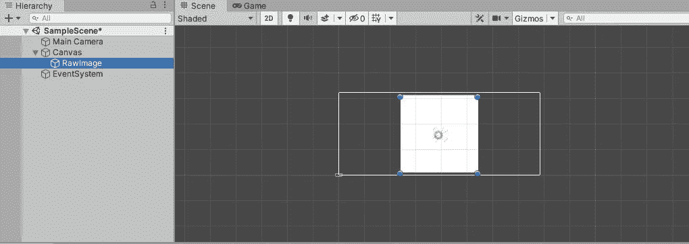
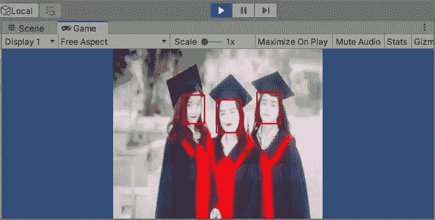
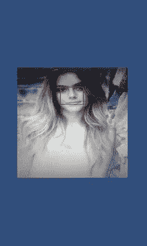

# 基于 OpenCV 的 Unity 人脸检测

> 原文：<https://medium.com/geekculture/face-detection-in-unity-using-opencv-2df17a9e8ecd?source=collection_archive---------8----------------------->



Image by [Tumisu](https://pixabay.com/users/tumisu-148124/?utm_source=link-attribution&utm_medium=referral&utm_campaign=image&utm_content=5946820) from [Pixabay](https://pixabay.com/?utm_source=link-attribution&utm_medium=referral&utm_campaign=image&utm_content=5946820)

人脸检测是使用算法在图像中识别人脸的过程。有很多这样的算法，OpenCV 中提供的“Haar cascades”算法是一种广泛使用的技术。

在这篇文章中，我将开发一个可以在 Android 上运行的人脸检测的 Unity 应用程序。

让我们将这些步骤分成两个主要部分:

1.  安装
2.  编码

## **设置**

在开始实现代码之前，我们需要设置一些东西。

1.  首先，让我们创建一个 Unity 项目，并向 UI 画布添加一个 RawImage。我已经将游戏窗口中的画布大小从自由纵横比更改为 4:3，并调整了 RawImage 的大小。设置应该如下所示:



1.  接下来，我们需要将 OpenCV 导入到我们的项目中。

该资产可在以下位置找到:

[OpenCV for Unity | Integration | Unity Asset Store](https://assetstore.unity.com/packages/tools/integration/opencv-for-unity-21088)。

3.接下来，我们需要将“Haar scade _ front alface _ default . XML”包含到我们的项目中。为此，先将[中的**文件下载到**中的](https://raw.githubusercontent.com/opencv/opencv/master/data/haarcascades/haarcascade_frontalface_default.xml)。然后在 Unity 项目的 Assets 文件夹中创建一个名为“StreamingAssets”的文件夹，并将上述 xml 文件包含在该文件夹中。

*提示:* [*OpenCV github 资源库*](https://github.com/opencv/opencv/tree/master/data) *中为人脸检测算法提供了其他几种预训练的分类算法。你也可以试试。*

3.接下来，让我们创建一个 C#脚本并将其命名为“FaceDetection.cs ”,然后在 Visual Studio 或您首选的 IDE 中打开它。

现在，我们已经完成了开始编码所需的配置设置。让我们继续下一部分。

## 2.编码

首先，我们需要导入以下包:

```
using OpenCVForUnity.CoreModule;
using OpenCVForUnity.ImgprocModule;
using OpenCVForUnity.ObjdetectModule;
using OpenCVForUnity.UnityUtils;
using UnityEngine;
using UnityEngine.UI;
```

接下来，我们需要用于 WebCamTexture 的变量和用于存储 xml 文件名的变量，一个用于加载 xml 数据的“CascadeClassfier”变量，一个用于存储提取的人脸的“MatOfRect”变量，一个用于将检测到的人脸渲染到 RawImage 的“Texture2D”变量，以及两个用于存储 rgb 帧和灰度帧的 mat。让我们按如下方式创建这些成员变量:

```
private WebCamTexture webcamTexture;
private string filename;
private CascadeClassifier cascade;
private MatOfRect faces;
private Texture2D texture;
private Mat rgbaMat;
private Mat grayMat;
```

现在，让我们创建一个函数来初始化上述变量。注意，我们将把这个脚本添加到 UI 中的 RawImage。因此，我们可以从代码中直接访问 RawImage。因此，首先，我们获得 RawImage 的 RectTransform 组件，并且我们将根据 WebCamTexture 的旋转来旋转 RawImage。这样做是因为在 Android 设备上，相机馈送是旋转的。接下来，我们将把 xml 文件数据加载到级联变量中，并初始化其他变量，如下所示:

```
void initializeData()
{
 //rotate RawImage according to rotation of webcamtexture
 this.GetComponent<RectTransform>().Rotate(new Vector3(0, 0, 360 - webcamTexture.videoRotationAngle));//store name of xml file
 filename = "haarcascade_frontalface_default.xml"; //initaliaze cascade classifier
 cascade = new CascadeClassifier(); //load the xml file data
 cascade.load(Utils.getFilePath(filename)); //initalize faces matofrect
 faces = new MatOfRect();//initialize rgb and gray Mats
 rgbaMat = new Mat(webcamTexture.height, webcamTexture.width, CvType.CV_8UC4);
 grayMat = new Mat(webcamTexture.height, webcamTexture.width, CvType.CV_8UC4);

 //initialize texture2d
 texture = new Texture2D(rgbaMat.cols(), rgbaMat.rows(), TextureFormat.RGBA32, false);
}
```

接下来，我们需要获得可用的相机设备，初始化 WebCamTexture 并调用上面的' initializeData()'函数。让我们在“Start()”方法中实现这一点。

```
void Start()
{
 //obtain cameras avialable
 WebCamDevice[] cam_devices = WebCamTexture.devices; //create camera texture
 webcamTexture = new WebCamTexture(cam_devices[0].name, 480, 640, 30); //start camera
 webcamTexture.Play(); // initialize members;
 initializeData();
}
```

接下来，我们需要对相机馈送的每一帧执行面部检测。为此，我们可以使用“Update()”方法，该方法在应用程序运行时每帧执行一次。

首先，我们需要将 webcamTexture 转换为 Mat。为此，我们使用 OpenCV 提供的“Utils.webCamTextureToMat()”方法。接下来，我们使用' Imgproc.cvtColor()'方法将此 Mat 转换为灰度。之后，我们可以提取使用' cascade.detectMultiScale()'方法检测到的面部，并使用' Imgproc.rectangle()'方法在它们周围绘制矩形。最后，我们可以使用“Utils.fastMatToTexture2D()”方法将这个 Mat 转换为纹理，并将其呈现为 RawImage。让我们看看我们如何能做到这一点。

```
void Update()
{
 //convert webcamtexture to rgb mat
 Utils.webCamTextureToMat(webcamTexture, rgbaMat); //convert rgbmat to grayscale
 Imgproc.cvtColor(rgbaMat, grayMat, Imgproc.COLOR_RGBA2GRAY); //extract faces
 cascade.detectMultiScale(grayMat, faces, 1.1, 4); //store faces in array
 OpenCVForUnity.CoreModule.Rect[] rects = faces.toArray(); //draw rectangle over all faces
 for (int i = 0; i < rects.Length; i++)
 {
  Debug.Log("detect faces " + rects[i]);
  Imgproc.rectangle(rgbaMat, new Point(rects[i].x, rects[i].y), new Point(rects[i].x + rects[i].width, rects[i].y + rects[i].height), new Scalar(255, 0, 0, 255), 2);
 }//convert rgb mat back to texture
 Utils.fastMatToTexture2D(rgbaMat, texture);

 //set rawimage texture
 this.GetComponent<RawImage>().texture = texture;
}
```

现在我们也完成了编码部分。现在您所要做的就是将这个脚本作为一个组件附加到 RawImage 上，并运行应用程序。

这是我的结果:



Image used - [Friend Student Graduate — Free photo on Pixabay](https://pixabay.com/photos/friend-student-graduate-young-2727305/)

(我已经用手机向网络摄像头显示了来自 [pixabay](https://pixabay.com/photos/friend-student-graduate-young-2727305/) 的图像，这样就可以看到检测到的多张脸)。

最后，要从这个应用程序中创建一个 Android 应用程序，从播放器设置中切换到 Android 平台，根据需要调整原始图像的大小，然后构建并运行这个应用程序。

这是我的结果:



Image Used — [Woman Fashion Beauty — Free photo on Pixabay](https://pixabay.com/photos/woman-fashion-beauty-glamour-1274056/)

这个项目到此为止。请让我知道你的反馈。谢谢大家！干杯！😀

# 参考

[主 enox software/OpenCVForUnity GitHub 上的 OpenCVForUnity/facetectionwebcamtextureexample . cs](https://github.com/EnoxSoftware/OpenCVForUnity/blob/master/Assets/OpenCVForUnity/Examples/MainModules/objdetect/FaceDetectionExample/FaceDetectionWebCamTextureExample.cs)

[使用 OpenCV & Python 在 2 分钟内进行人脸检测| Adarsh Menon |走向数据科学](https://towardsdatascience.com/face-detection-in-2-minutes-using-opencv-python-90f89d7c0f81)