# Keras 中使用自动编码器的人脸图像重建

> 原文：<https://medium.com/geekculture/face-image-reconstruction-using-autoencoders-in-keras-69a35cde01b0?source=collection_archive---------6----------------------->

## 使用自动编码器恢复噪声图像的完整指南

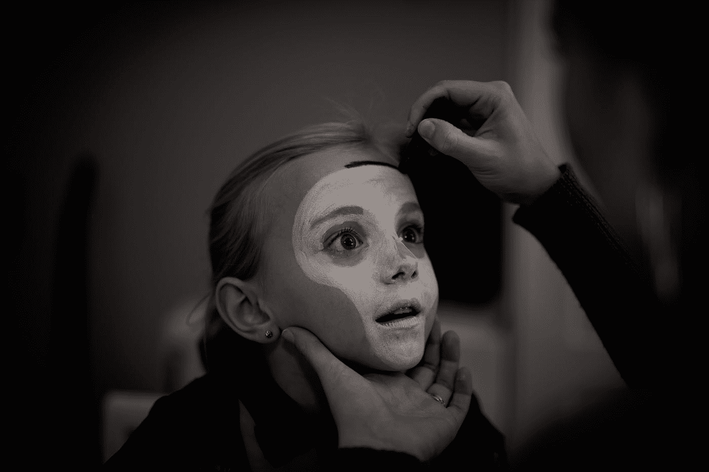

Photo by [🇸🇮 Janko Ferlič](https://unsplash.com/@itfeelslikefilm?utm_source=medium&utm_medium=referral) on [Unsplash](https://unsplash.com?utm_source=medium&utm_medium=referral)

自动编码器被用作无监督的深度学习技术，用于学习*数据编码*。它们的工作原理是从给定的未标记数据中学习一种表示，并尽可能准确地从该表示中重建数据。学习到的表征状态也被称为**潜在空间**或**代码**。自动编码器分两部分工作。**编码器**(第一部分)用于学习给定图像的重要和有代表性的特征，并将其表示到潜在空间中。**解码器**(第二部分)用于通过去除图像中的噪声和不重要的特征，从潜在空间重建图像。这将产生一个压缩的图像。压缩可能是*有损的*，因为一些特征在压缩中丢失了，结果图像可能会模糊。

*自动编码器可用于图像去噪、信息检索、数据压缩、图像彩色化和图像增强等应用。*

下图展示了自动编码器工作的高级架构。


Source: [https://towardsdatascience.com/applied-deep-learning-part-3-autoencoders-1c083af4d798](https://towardsdatascience.com/applied-deep-learning-part-3-autoencoders-1c083af4d798)

> 出于重建目的，输入层和输出层中的节点数量必须相同。一般模型由一个输入、一个输出和一个隐藏层组成，但是具有多个隐藏层使它们成为**深度自动编码器**。

数据通过输入层提供给编码器。在通过隐藏层之后，数据被压缩到一个代码/潜在空间中，其中相似的数据点彼此更接近。然后，潜在状态被传递到解码器，在解码器中，数据的必要模式和特征被拾取并被重新转换成原始图像。

# 自动编码器的数学理解

下图显示了数学表示。这里 *W* 和 *V* 分别代表编码器和解码器部分的权重。z 是取编码器权重和输入的乘积，然后通过函数得到的潜在空间。之后，在解码器中，潜在空间向量乘以解码器权重以获得重建图像。均方误差用于寻找重建损失。这种损失会在训练模型以获得准确结果时传播回来。

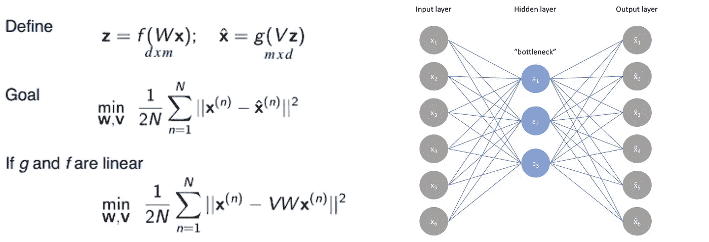

source: [https://www.jeremyjordan.me/autoencoders/](https://www.jeremyjordan.me/autoencoders/)

# 面部图像重建示例

让我们使用人脸图像构建一个自动编码器，并尽可能精确地重建它们。我们将从[**Flickr-Faces-HQ 数据集(FFHQ)**](https://github.com/NVlabs/ffhq-dataset) 数据集获取图像，并通过有意放置充当噪声的黑盒来移除它们的一些部分。原始数据集包含大小为 1024 x 1024 的图像，但我们只拍摄了 128 x 128 的图像。我们的自动编码器将尝试重建图像的丢失部分。

# **第一步:导入库…**

# 步骤 2:数据生成和预处理…

将包含 70，000 幅图像的整个数据集一次性加载到内存中几乎是不可能的。因此，我们将实现一个**自定义生成器函数**来批量加载图像。这里，我们将从生成器返回元组 *(corrupted_images_batch，original_images_batch)* ，而不是返回图像及其标签，其中损坏的图像与原始图像相同，但从中删除了一个小方块。

现在我们将创建一个函数，通过在图像上绘制一个黑色方框来移除图像的一部分。这里画的正方形在图像中的任意位置都是 28x28。

> 我们使用 PIL *库* **的 **ImageDraw** *函数来生成盒子。***

现在，我们将为训练目的生成批量数据。在这里，我们将继续迭代数据集以检索图像批次。图像从存储在文件变量中的路径中读取。我已经在 Colabs 目录中存储了图像的路径。读取图像后，我们会将原始图像添加到 *original_images_batch* 列表中，并将预处理后的损坏图像添加到 *corrupted_images_batch* 列表中。最后，我们将以元组的形式返回原始图像和损坏的图像。

在批量处理数据和获取图像后，我们损坏的数据看起来会像这样。

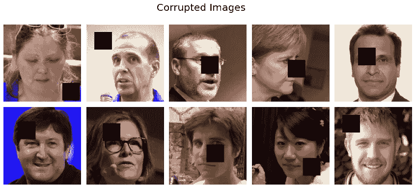

Image by Author

# 第 3 步:模型构建…

接下来，我们将通过首先创建编码器和解码器的架构来构建我们的模型。之后，我们将合并它们，得到完整的自动编码器。

## **编码器架构**

编码器架构由一堆卷积层组成，后跟一个密集(全连接)层，该层输出一个大小为 **Z_DIM** (潜在空间维度)的向量。尺寸为 128x128x3 的整个图像解码成这个尺寸为 **Z_DIM** 的潜在空间向量。

你可以参考这个[链接](https://blog.keras.io/building-autoencoders-in-keras.html)来看看如何在 *Keras* 中创建 Autoencoder 模型。

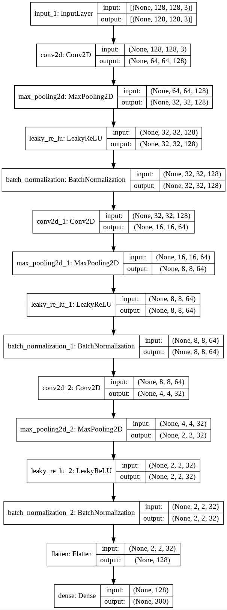

Image by Author

## 解码器架构

解码器模型通常与编码器相反，但不是强制性的。由于编码器使用卷积层来解压缩图像，为了在解码器中实现相反的效果，我们将使用 [Conv2DTransponse](https://keras.io/layers/convolutional/#conv2dtranspose) 层。这一层产生的输出张量在高度和宽度上都是输入张量的两倍。解码器的输入是尺寸为 **Z_DIM** 的向量，输出将是尺寸为 **INPUT_DIM** (128x128x3)的图像。

> *与编码器不同，解码器将有激活功能，因为它将输出图像。我们希望像素值在 0 到 1 之间。这里我们使用* **sigmoid** *作为我们的激活函数。*

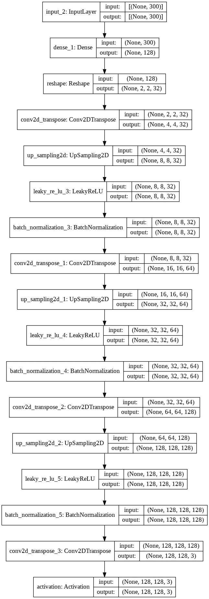

Image by author

## 合并编码器和解码器

作为最后一步，我们将编码器附加到我们的解码器，以获得我们的自动编码器的最终版本。

# 步骤 4:训练模型…

快好了！现在我们只剩下训练部分了。我们可以改变各种参数，找到准确的结果。参数列表包括:

*   学习率
*   训练时代
*   批量
*   潜在向量大小
*   误差函数
*   【计算机】优化程序

我已经用*学习率= [0.01，0.001]，优化器= [Adam，SGD]，损失= mse，批量= 64，历元= 15，潜在空间大小= 300* 训练了模型

训练代码如下。

# 第五步:结果…

终于到了公布结果的时候了！我的训练模型花费了大约 4-5 个小时在 Google Colabs 上讨论每个参数。在训练**损失:0.0111** 和**准确度:85.10%** 的情况下，给出最佳结果的参数如下:

***潜在空间:300，历元:50，学习率:0.001，批量:64，优化器:亚当，损耗:mse***

## 图像结果

结果我得到的图像很模糊。这是因为损失函数 *MSE* 平均了像素值并导致模糊。

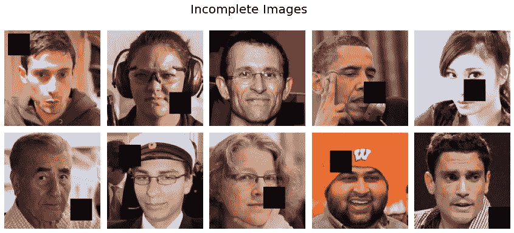

Given Test Images Batch

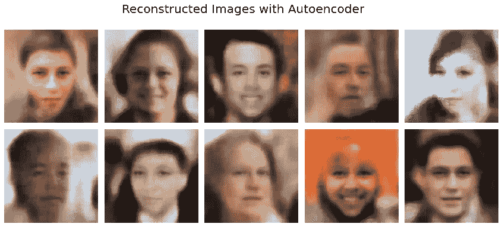

Reconstructed Images.

## 其他结果！

我用不同的参数组合得到的一些其他结果如下:

```
*Parameters: epoch:15, learning rate:0.01,  batch size:64, optimizer:Adam, loss:mse*Results: loss_value: 0.0121 - accuracy: 0.8392
```

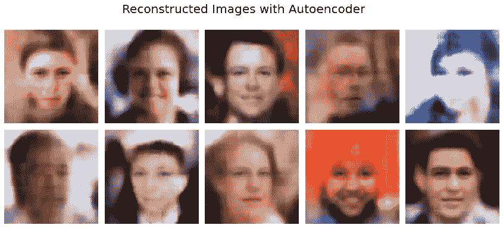

Image by Author

```
*Parameters:* epoch:15, learning rate:0.01,batch size:64, optimizer:SGD, loss:mseResults: loss_value: 0.0118 - accuracy: 0.8433
```

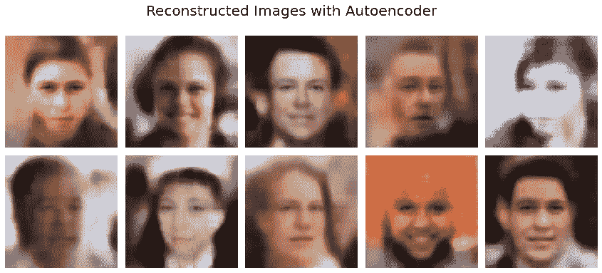

Image by Author

```
*Parameters:*epoch:15, learning rate:0.001, batch size:64, optimizer:Adam, loss:mseResults: loss_value: 0.0111 - accuracy: 0.8475
```

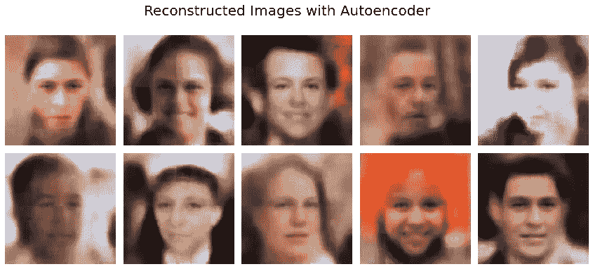

Image by Author

```
*Parameters:*epoch:15, learning rate:0.001, batch size:64, optimizer:SGD, loss:mseResults: loss_value: 0.0111 - accuracy: 0.8469
```

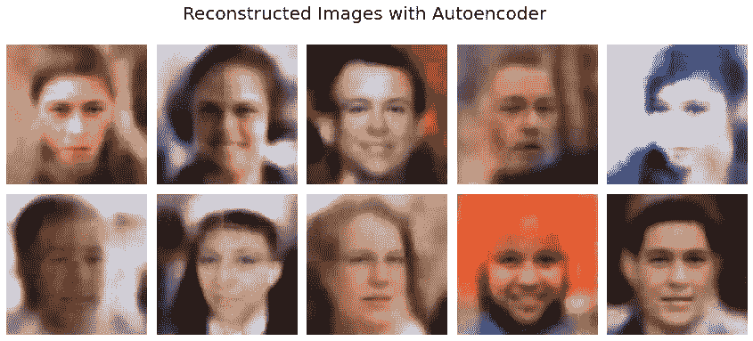

Image by Author

```
*Parameters:*epoch:30, learning rate:0.0001, batch size:32, optimizer:Adam, loss:mseResults: loss_value: 0.0125 - accuracy: 0.8357
```

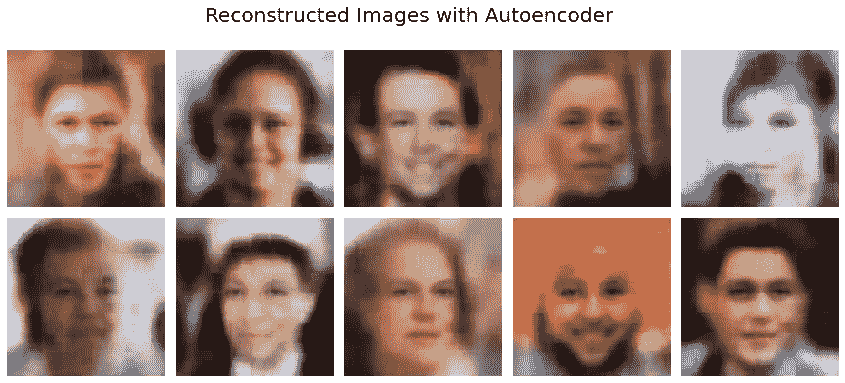

Image by Author

```
*Parameters:*epoch:10, learning rate:0.01, batch size:64, optimizer:RMSprop, loss:binary_crossentropyResults: loss_value: 0.5712 - accuracy: 0.8022
```

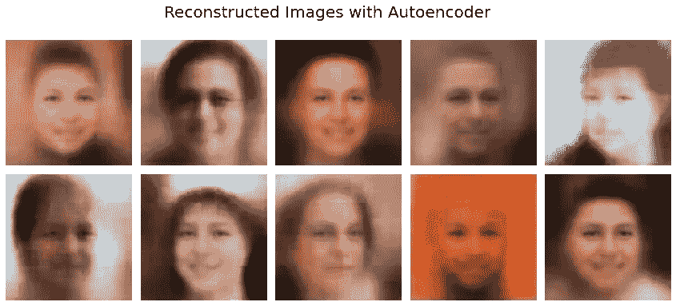

Image by Author

# 第六步:结论…

对于图像去噪、重建和异常检测，我们可以使用自动编码器，但它们在生成图像时并不太有效，因为它们会变得模糊。它们效率低下的最大原因是自动编码器的***潜在空间不连续，因为它们只学习数据*** 的单个潜在表示。

# 参考资料…

我在撰写本文时使用的一些参考资料如下:

*   [https://medium.com/r?URL = https % 3A % 2F % 2fwww . Jeremy Jordan . me % 2 fauto encoders % 2F](https://medium.com/r?url=https%3A%2F%2Fwww.jeremyjordan.me%2Fautoencoders%2F)
*   [https://medium.com/r?URL = https % 3A % 2F % 2 ftowardsdata science . com % 2f applied-deep-learning-part-3-auto encoders-1c 083 af 4d 798](https://medium.com/r?url=https%3A%2F%2Ftowardsdatascience.com%2Fapplied-deep-learning-part-3-autoencoders-1c083af4d798)
*   [https://towards data science . com/understanding-variable-auto encoders-vaes-f 70510919 f 73](https://towardsdatascience.com/understanding-variational-autoencoders-vaes-f70510919f73)

那都是关于自动编码器的。如果你觉得它有帮助、有趣，或者想提出一些反馈意见，请随时给我发电子邮件至 emanijaz583@gmail.com**或者通过*[***Linkedin***](http://www.linkedin.com/in/eman-ijaz)*与我联系。*你可以在 Google Colab [这里](https://drive.google.com/file/d/1Cz4md6kgwxC7ncw9IbcrhcVpKb21M-we/view?usp=sharing)找到完整的代码。我将很快尝试写另一篇关于 variable Autoencoder(一种更高级的 Autoencoder)及其与 auto encoder 的比较的文章。*