# 脸书·艾和加州大学伯克利分校与变形金刚开战

> 原文：<https://medium.com/geekculture/facebook-ai-picks-a-fight-with-transformers-5e0f511b4383?source=collection_archive---------0----------------------->

## 随着围绕 GPT3、DALLE、PaLM 和更多产品的疯狂炒作，现在是报道本文的最佳时机。

浏览这些天的机器学习新闻，你会到处看到变形金刚([观看这个视频 IBM Technology 快速概述](https://www.youtube.com/watch?v=ZXiruGOCn9s&ab_channel=IBMTechnology)这个想法)。而且理由很充分。自推出以来，变形金刚已经席卷了深度学习领域。虽然它们传统上与自然语言处理相关联，但变形金刚现在也用于计算机视觉管道中。就在最近几周，我们已经看到了变形金刚在计算机视觉中的一些疯狂应用。因此，变压器似乎将取代卷积神经网络(CNN)来完成一般的计算机视觉任务。

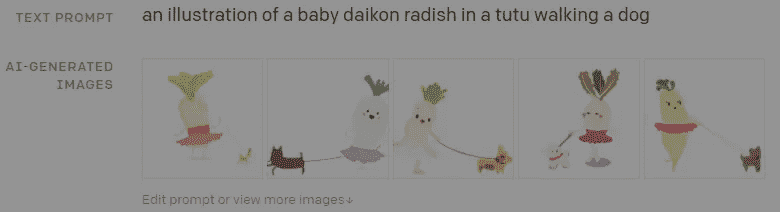

[DALL·E: Creating Images from Text](https://openai.com/blog/dall-e/) really pushed a lot of boundaries with what was considered possible.

然而，脸书人工智能的研究人员有一些补充。在他们的论文“[2020 年代的 ConvNet】”中，作者假设变形金刚在视觉相关任务中表现优于 CNN 的很大一部分原因是变形金刚使用的高级训练协议(这是一种较新的架构)。因此，他们认为，通过改善模型周围的管道，我们可以缩小变压器和 CNN 之间的性能差距。用他们的话说，](https://arxiv.org/abs/2201.03545)

> 在这项工作中，我们重新审视了设计空间，并测试了纯 ConvNet 所能达到的极限。我们逐渐将标准 ResNet“现代化”,用于视觉转换器的设计，并在此过程中发现了影响性能差异的几个关键组件。

结果相当有趣，它们表明 CNN 甚至可以在某些任务中胜过**和**变形金刚。这更证明了你的深度学习管道可以通过更好的训练来改善，而不是简单地去寻找更大的模型。在这篇文章中，我将介绍他们论文中一些有趣的发现。但首先介绍一下变形金刚和 CNN，以及每种架构在计算机视觉任务中的优势。

# CNN:OG 计算机视觉网络

卷积神经网络从一开始就是计算机视觉的架构。[其实 CNN 的根基都比我老](http://yann.lecun.com/exdb/publis/pdf/lecun-89e.pdf)。CNN 实际上是为视觉而建的。

The feature extraction is the true CNN revolution. Taken from [IBM’s Writeup on ConvNets](https://www.ibm.com/cloud/learn/convolutional-neural-networks)

那么 CNN 有什么好的呢？卷积神经网络背后的主要思想是，它们逐段遍历图像，并从中提取主要特征。CNN 的早期层通常提取更粗糙的特征，例如边缘和颜色。然而，添加更多的层允许以非常高的细节分辨率提取特征。

CNNs use the sliding window technique to build their feature maps. As you can see, Good Machine Learning requires good software engineering. [Image Source](https://towardsdatascience.com/a-comprehensive-guide-to-convolutional-neural-networks-the-eli5-way-3bd2b1164a53)

这篇文章更详细地介绍了 CNN。对于我们的目的来说，有一件事很重要:**CNN 一直是计算机视觉的首选，主要是因为它们能够构建特征地图。**

# 变形金刚——新一代？

变形金刚是 CNN 的表亲。它们是对传统递归神经网络的改进。创建 rnn 是为了处理时态数据，即过去跟随未来。我们举个简单的例子。想象一下那句话，“别吃我的 _”。为了填充 _，我们需要从句子中前面的单词中找出上下文。随意填写单词对我们没有任何好处。与传统网络不同，rnn 从先前的输入中获取信息。[code basics 的这个视频很好地介绍了这个想法，对于那些想了解更多的人来说](https://youtu.be/Y2wfIKQyd1I)。

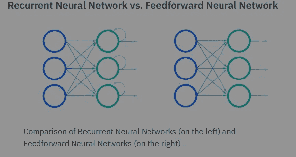

RNN hidden layers feedback into themselves, allowing them to use prior input in their predictions. [Image Source](https://www.ibm.com/cloud/learn/recurrent-neural-networks)

然而，rnn 有一个缺陷。因为它们处理的是顺序数据，所以数据顺序很重要。这使得它们不可能并行化，因为我们必须按顺序输入。变形金刚就是为了解决这个问题而产生的。变压器利用注意力来识别输入的重要部分，并将其存储在内存中。

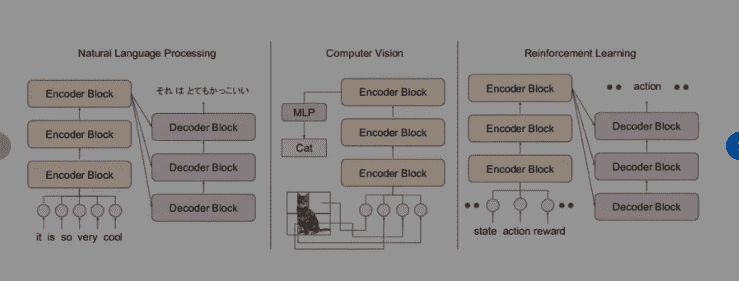

How Transformers are adapted to different tasks. [Image Source](https://www.researchgate.net/figure/Some-applications-of-transformers-in-different-fields-of-machine-learning-For-NLP-a_fig1_356159551)

由于转换器可以并行化，我们已经看到一些巨大的数据集被训练。Googles 的 [BERT](https://github.com/google-research/bert) 和 OpenAI 的 [GPT3](https://openai.com/blog/gpt-3-apps/) 就是一些显著的例子。我们已经看到他们实现了一些疯狂的功能。然而，这留下了一个问题——变形金刚是为 NLP 设计的，为什么它们对计算机视觉有好处？仅仅是盲目的运气+大量的训练吗？

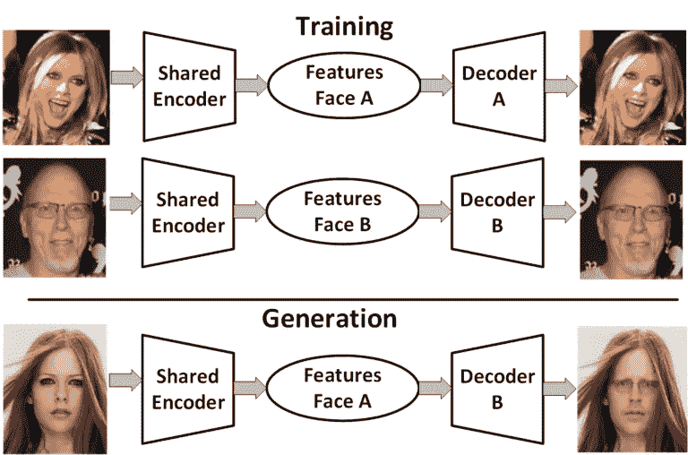

Encoder-Decoder pairs have a lot of use in translation, reconstruction, deepfakes, and a bunch of other cool ideas. [Image Source](https://showmecyber.com/deepfakes-or-ai-generated-synthetic-media-not-just-for-porn-anymore/)

变压器非常有效，因为它们处理输入的方式。变压器利用编码器和解码器。编码器接收你的输入，并将其编码到一个潜在的空间。解码器从潜在空间中提取矢量，并将其转换回来。

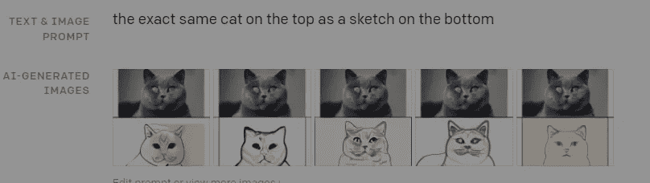

DALL-E truly is amazing. This is another one of their functionalities.

这在计算机视觉中有多种用途。对抗性学习、重建、图像存储和生成是一些显著的例子。它在 DALL-E 中也起着至关重要的作用。我们将文本输入编码到潜在空间中。然后我们可以用一个解码器把潜在向量解码成图像。这就是我们如何能够从文本描述中生成图像。脸书·艾的[制作场景:基于场景的人类先验文本到图像生成](https://arxiv.org/abs/2203.13131)

Taken from Make-A-Scene. The quality of images that Meta’s AI generates is stunning. [Read about how this ties into their MetaVerse aspiration](/geekculture/machine-learning-for-the-metaverse-why-metas-ai-lab-is-so-random-42975ab28a26)

在我为这个视频做研究的时候，我实际上了解到了视觉变形金刚如此有效的另一个原因。这关系到他们的注意力机制。这是足够有趣的担保它自己的文章，但这里是一个总结。

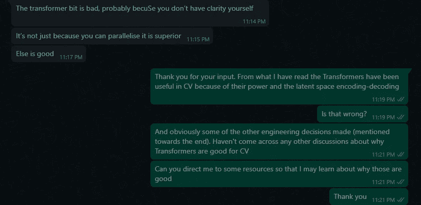

I sent an earlier draft of this article to some experts. One of them actually taught me about the following properties of vision transformers. Goes to show you how deep and complex AI is. Shoutout to [Dr. Ajun Jain](https://www.linkedin.com/in/arjunjain/) for his constant assistance and input on my drafts.

[变形金刚的注意力机制](https://machinelearningmastery.com/the-transformer-attention-mechanism/)让它们能够识别句子中重要的部分。注意力让变形金刚过滤掉噪音，捕捉相距甚远的单词之间的关系。

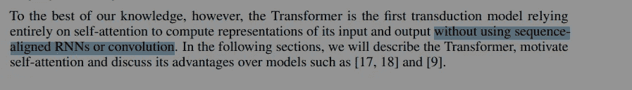

Taken from the legendary Google Paper, [Attention Is All You Need](https://arxiv.org/abs/1706.03762). Not needing sequence is a big deal.

在 NLP 的上下文中，大家已经知道了这一点。我不知道的是，这甚至适用于 CV。注意力机制允许变形金刚保持“图像的全局视图”,允许它们提取与 ConvNets 非常不同的特征。记住，CNN 使用核来提取特征，这意味着它们只能找到局部特征。注意让变压器绕过这个。

Since Transformers also use Conv Priors, this is a best of both worlds sort of deal.

上图取自非常有趣的，[视觉变形金刚看起来像卷积神经网络吗？](https://arxiv.org/abs/2108.08810)有趣的是，我稍后会对这篇论文进行分解。重要的方面是下面的引用，也来自该文件。

> 证明获取更多的全球信息也会导致与 ResNet 下层的局部感受野所计算的特征在数量上不同的特征

很明显，变形金刚非常强大。注意力机制、大规模训练和现代建筑使它们成为许多视觉任务的支柱。所以问题是，纯 CNN 有机会吗？这里有一个新的 CNN 训练方法与视觉变形金刚的比较，摘自论文。

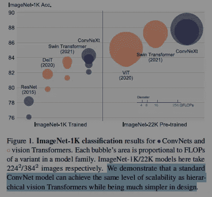

As we can see by this diagram, ConvNeXt is able to even beat Swin Transformers.

显然，这是非常令人兴奋的东西。通过改进围绕 CNN 架构的训练管道，我们可以媲美 SOTA 变形金刚。这显示了建立良好的机器学习训练管道的力量。它们可以弥补使用较弱模型的不足，通常更具成本效益。

> ConvNeXts 完全由标准 ConvNet 模块构建而成，在精度和可扩展性方面与变压器不相上下，实现了 87.8%的 ImageNet top-1 精度，在 COCO 检测和 ADE20K 分段方面优于 Swin 变压器，同时保持了标准 conv net 的简单性和效率。

# CNN 基础设施的现代化

显然，我们可以改进我们的标准模型，实现惊人的性能。让我们来谈谈他们为实现这一目标所做的一些有趣的设计调整(要了解所有这些调整，请务必阅读本文)。我也将回顾一下我在阅读这篇论文时的一些见解，我很乐意与你们大家讨论。通过 IG/LinkedIn/Twitter(本文末尾的链接)在评论/与我分享你的想法。

# 增加内核大小

转换器使用比 ConvNets 更大的内核大小。作者指出，“*虽然 Swin Transformers 重新将局部窗口引入了自我注意块，但窗口大小至少是 7×7，明显大于 ResNe(X)t 内核大小 33。在这里，我们再次讨论大内核大小的卷积在卷积网中的应用。*“作者对内核大小进行了实验，发现更大的大小可以提高性能。然而，他们发现增加内核大小的好处在达到 7x7 内核后就消失了。

> 有了所有这些准备，采用更大内核大小的卷积的好处是显著的。我们试验了几种内核大小，包括 3、5、7、9 和 11。网络的性能从 79.9% (33)提高到 80.6% (77)，而网络的失败次数大致保持不变。

# 倒置瓶颈设计

瓶颈设计在神经网络中很常见。许多编码器-解码器对倾向于对潜在空间的输入进行下采样，并从潜在空间进行上采样。然而，作者发现使用一个倒置的瓶颈设计更优越(这也是变形金刚所使用的)。

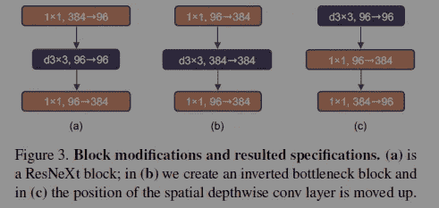

这种设计模式的好处如下所示-

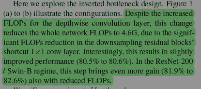

大型网络中性能的提高是一个有趣的现象。我很想知道这种改进的性能是否会随着更大的型号继续扩展。这在今天已经成为趋势的超大规模语言模型中有很大的潜力。如果有人知道为什么会这样，请分享。我很想学。

# 调整激活功能

[正如我之前提到的，激活功能是一件大事](/codex/learnings-from-googles-comprehensive-research-into-activation-functions-4a9d6566ba2c)。作者对 ResNet 块进行了一些修改，以模仿变形金刚。第一个是将激活函数从 ReLU 改为 GeLU(高斯误差)

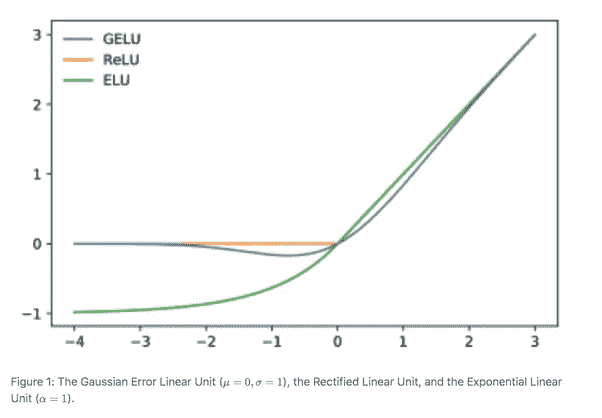

GeLU is a much smoother function than ReLU. This is why Google and OpenAI use it. [Source](https://www.quora.com/What-are-some-good-Activation-Functions-other-than-ReLu-or-Leaky-ReLu)

作者还改变了一个模块中激活函数的数量。如图 4 所示，除了两个 1x1 层之间的一个层之外，我们从剩余块中消除了所有的 GELU 层，复制了变压器块的样式。 " **这导致了 0.7%的改善。**

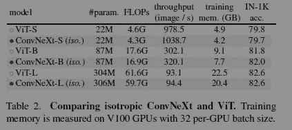

While the results were impressive, look at the ROI for accuracy compared to the amount of memory used. The reason I recommend most people stick to the basics is that they don’t have Google’s resources

# 分隔缩减取样图层

另一个来自变形金刚的灵感，作者决定分离下采样。与在一个阶段的开始(像传统的 ResNet)做所有这些不同，它们也在层之间进行缩减采样(像视觉变形金刚)。ConvNeXt 块看起来是这样的

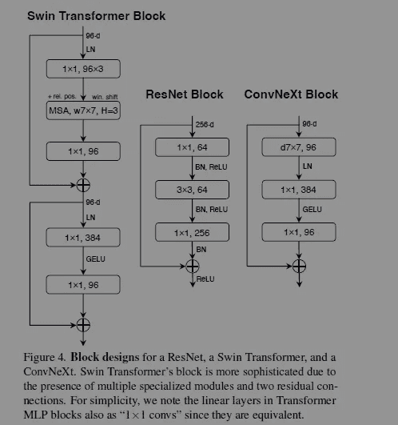

LN- Layer Normalization. Notice our new network uses LN instead of BN (batch normalization) like traditional CNNs (ResNet)

这有相当大的影响，作者指出，通过遵循这一策略“*，我们可以将准确率提高到 82.0%，大大超过 Swin-T 的 81.3%* 。”

# 关于 AGI 的笔记

我所涉及的变化绝不是全面的。为了让他们的网络更加“现代”，作者们做了大量的改变。幸运的是，他们在论文的附录中列出了这些变化，以及每个变化带来的好处。

That, my lovely reader, is why we should always read the appendix. This gem is perfect.

当我阅读这篇论文时，它让我想到了人工通用智能(AGI)。许多这些变化都是受到其他模式/网络的成功的启发(作者从《变形金刚》和其他 CNN 获得了灵感)。给出对数据插补、学习率、批量、架构等的研究结果。这让我想到一个问题——AGI 的关键在于“一个完美的训练协议”。有没有跨任务训练的完美配置？[我会在这段 6 分钟的视频中更详细地介绍这一点](https://youtu.be/L48-g85Kg6A)，但我很想听听你的想法。

本文到此为止。撇开有趣的 AGI 假设不谈，这篇论文再次向我们展示了不断学习机器学习基础研究的重要性。为了将你的基本 ML 技能发展到足以与论文互动的程度，请查看我的文章[如何在 2022 年学习机器学习](/geekculture/how-to-learn-machine-learning-in-2022-9ef2ea904986)。它介绍了免费的在线资源，你可以利用这些资源来提高你的机器学习水平。

为了帮助我写更好的文章和了解你[填写这份调查(匿名)](https://forms.gle/7MfQmKhEhyBTMDUD7)。最多花 3 分钟，让我提高工作质量。请务必使用我的社交媒体链接来获得更多反馈。所有反馈都有助于我提高。

对于机器学习来说，软件工程的基础至关重要。它将帮助你概念化，建立和优化你的 ML。我的每日时事通讯，[Coding interview make simpled](https://codinginterviewsmadesimple.substack.com/)涵盖了算法设计、数学、最近的技术事件、软件工程等主题，让你成为更好的开发人员。 [**我目前正在进行全年八折优惠，所以一定要去看看。**](https://codinginterviewsmadesimple.substack.com/subscribe?coupon=1e0532f2)

我创建了[编码面试，使用通过指导多人进入顶级科技公司而发现的新技术，使面试变得简单](https://codinginterviewsmadesimple.substack.com/p/faqs-and-about-this-newsletter?r=4tnbw&s=w&utm_campaign=post&utm_medium=web)。时事通讯旨在帮助你成功，避免你在 Leetcode 上浪费时间。[您可以阅读常见问题解答，并在此了解更多信息](https://codinginterviewsmadesimple.substack.com/p/faqs-and-about-this-newsletter?r=4tnbw&s=w&utm_campaign=post&utm_medium=web)

如果你也有任何有趣的工作/项目/想法给我，请随时联系我。总是很乐意听你说完。

以下是我的 Venmo 和 Paypal 对我工作的金钱支持。任何数额都值得赞赏，并有很大帮助。捐赠解锁独家内容，如论文分析、特殊代码、咨询和特定辅导:

https://account.venmo.com/u/FNU-Devansh

贝宝:[paypal.me/ISeeThings](https://www.paypal.com/paypalme/ISeeThings)

# 向我伸出手

使用下面的链接查看我的其他内容，了解更多关于辅导的信息，或者只是打个招呼。另外，查看免费的罗宾汉推荐链接。我们都得到一个免费的股票(你不用放任何钱)，对你没有任何风险。**所以不使用它只是损失免费的钱。**

查看我在 Medium 上的其他文章。https://rb.gy/zn1aiu

我的 YouTube:[https://rb.gy/88iwdd](https://rb.gy/88iwdd)

在 LinkedIn 上联系我。我们来连线:[https://rb.gy/m5ok2y](https://rb.gy/f7ltuj)

我的 insta gram:[https://rb.gy/gmvuy9](https://rb.gy/gmvuy9)

我的推特:[https://twitter.com/Machine01776819](https://twitter.com/Machine01776819)

如果你正在准备编码/技术面试:【https://codinginterviewsmadesimple.substack.com/ 

获得罗宾汉的免费股票:【https://join.robinhood.com/fnud75 