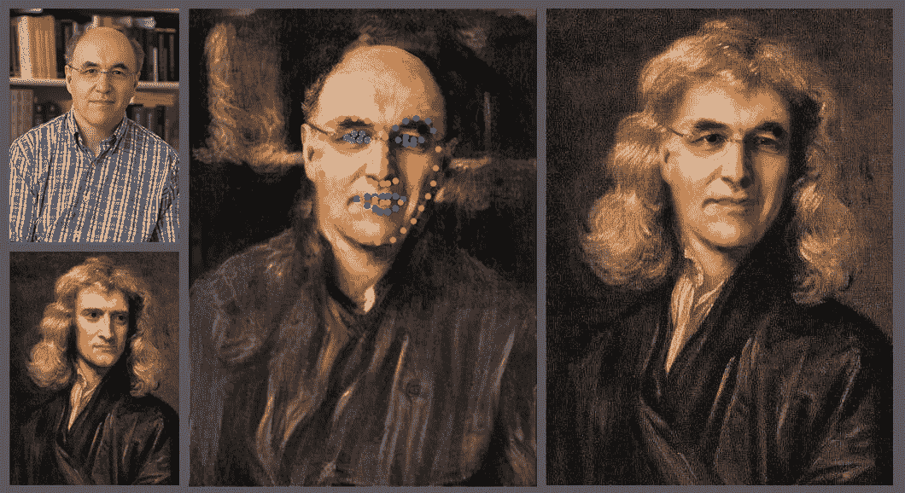

# 脸书变成了我们都希望的假十字军

> 原文：<https://medium.com/geekculture/facebook-becomes-the-deepfake-crusader-we-all-want-it-to-be-3a8003fc7284?source=collection_archive---------44----------------------->

## **从单一深度假图像逆向工程生成模型——脸书**

Stephen Wolfram, [CC BY-SA 4.0](https://creativecommons.org/licenses/by-sa/4.0) via Wikimedia Commons

# 脸书的研究人员正在使用逆向工程来打击深度造假。

虽然大多数 deepfakes 是为了娱乐，但 deepfakes 也有黑暗的一面，必须…