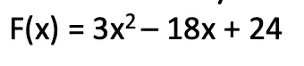
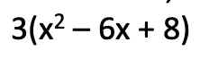
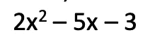
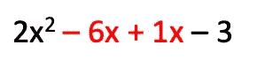
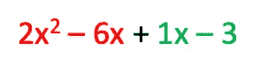
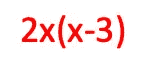
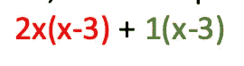
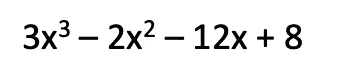
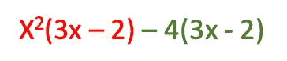
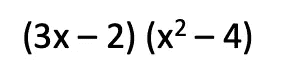

# 分解多项式变得容易(2/5)

> 原文：<https://medium.com/geekculture/factorizing-polynomials-made-easy-ff2ac1039b33?source=collection_archive---------48----------------------->


理解多项式如何因式分解很重要。这将允许稍后理解如何计算零来指示 x 轴上的截距。如果你喜欢看，那就看看我的 youtube 教程。

事实上，因式分解的过程是如此重要，以至于在不理解它的情况下，很少能完成超过这一点的代数。

如果你喜欢看，那就继续看 YouTube，否则继续向下滚动…

# 示例 1:具有 GCF 的二次曲线

理解这一点最简单的方法是做一个例子，假设我们有多项式:



所以，我们的第一步是看看能不能找到最大公因式(gfc)。在这种情况下，它将是 3，因此这允许我们将每一项除以 3。这导致:



现在，我们需要将 8 分解成 2 个数字，它们相乘应该等于 8，但是相加等于 6:

```
 8
 /   \
-4   -2
```

所以，-4 * -2 = 8，而-4–2 = 6
现在我们有了-4 和-2，我们可以因式分解我们的多项式如下:

```
F(x) = (x — 4) (x — 2)
```

在我们的因式分解多项式或原始多项式中插入一个 x 值，会得到相同的结果。

# 示例 2:没有 GCF 的二次函数

现在，当没有 gcf 的时候呢？让我们来看看多项式:



我们的第一步是将第一个系数乘以常数项。
即。2 * -3 = -6

现在，让我们找出两个数字，它们乘以-6，但也加到-5

```
 -6
 /  \
-6  +1
```

下一步是扩展我们的“- 5x”术语，以使用上述数字。请记住
,即-6x + 1x = 5x。



所以，让我们把这两部分分开



从第一个红色部分，我们可以去掉 2x，所以 2x 2–6x 变成



我们的第二部分，我们可以分解 1，得到:1(x-3)。
所以，我们最后得到了



很好，让我们把(x-3)分解掉，我们最终得到一个分解的多项式

```
f(x) = (x-3) (2x + 1)
```

# 示例:按分组的三次多项式因子

处理二次多项式的方法如上所述，那么现在，我们如何处理分解一个三次多项式。



看看我们能否通过划分系数来分组。在下面的例子中，两者给我们的值都是 1.5，所以我们可以通过分组进行因式分解。

```
3/2 == -12/8 == -1.5
```

将上述分为两项，并对其进行分解。我们第一项的 GCF 是 x2，而第二项的 GCF 是-4。



现在，让我们分解各项，我们可以分解出(3x — 2)



这留下了一个问题，因为我们有一个完美的正方形的差异。我们可以如下纠正这一点，取 x2 和 4 的平方根，将这一项分成两项，最后得到最终的因式多项式。

```
f(x) = (3x -2) (x — 2) (x + 2)
```

准备好下一篇文章了吗？

[https://Shaun-enslin . medium . com/what-are-polynomial-zeros-3-5-c 7 e 17 e 5 C4 a6 f](https://shaun-enslin.medium.com/what-are-polynomial-zeros-3-5-c7e17e5c4a6f)