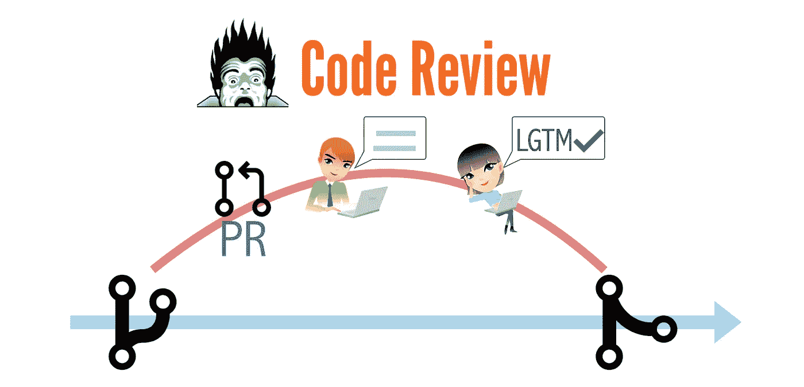

# 用“LGTM”进行伪代码审查

> 原文：<https://medium.com/geekculture/fake-code-review-with-lgtm-cb3fd217e908?source=collection_archive---------15----------------------->

## 盲目接受带有无意义注释的拉请求不是代码审查。随便做代码审查(老派)，但是用真正的自动化 E2E 回归测试来备份，以防止错误的检入。

*本文是“* [警惕假冒测试自动化/DevOps 工程师](https://zhiminzhan.medium.com/my-article-series-5f1a551d8796#93ba) *”系列之一。*